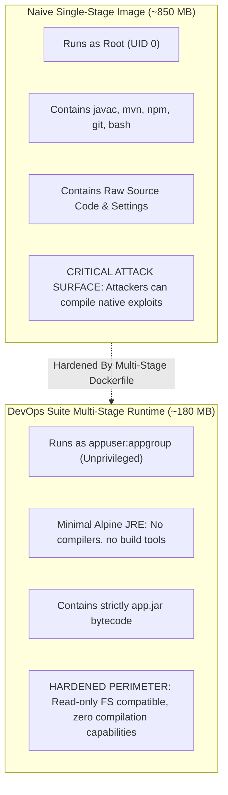
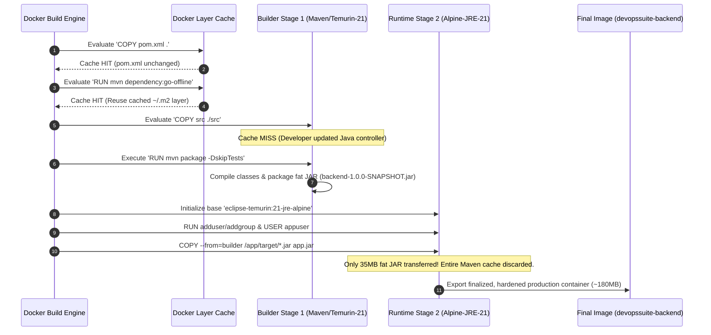

# Multi-Stage Docker Builds Architecture & Optimization Deep Dive

## Introduction

In modern production systems, container images represent the atomic unit of deployment. A naive container build strategy bundles build toolchains, SDKs, package managers, temporary build caches, and test suites directly into runtime images. This creates bloated artifacts (often exceeding 1 GB), slow pull times during autoscaling events, elevated cloud storage and networking costs, and critically, an expanded security attack surface loaded with Common Vulnerabilities and Exposures (CVEs).

**DevOps Suite** employs rigorous **Multi-Stage Docker Builds** across both its Java 21 / Spring Boot 3 monolith backend and its React 18 / Vite frontend. By strictly isolating the compilation/build environment from the minimal runtime execution layer, DevOps Suite achieves:

1. **Extreme Size Reduction**: Compresses the backend artifact from **~850MB (full JDK build environment) down to ~180MB (minimal Alpine JRE)**, and the frontend artifact from **~600MB (Node.js/npm tooling) down to ~25MB (Nginx Alpine static web server)**.
2. **Deterministic Layer Caching**: Structuring layer invalidation around manifest files (`pom.xml` and `package.json` / `package-lock.json`) rather than source trees, slashing clean build times from minutes down to seconds when source code changes.
3. **Container Hardening & Attack Surface Minimization**: Complete elimination of compilers (`javac`, `gcc`), build systems (`mvn`, `npm`), Git metadata, and development headers from runtime artifacts, coupled with dedicated **non-root user execution (`appuser:appgroup`)** and read-only filesystem compatibility.

```
====================================================================================================
                             MULTI-STAGE BUILD ARCHITECTURAL PIPELINE
====================================================================================================

+--------------------------------------------------------------------------------------------------+
| BACKEND MULTI-STAGE PIPELINE                                                                    |
+--------------------------------------------------------------------------------------------------+
  [STAGE 1: BUILDER] maven:3.9-eclipse-temurin-21 (~850 MB)
     ├── COPY pom.xml .
     ├── RUN mvn dependency:go-offline -q  ──────> [CACHED DOCKER LAYER: 400MB dependencies]
     ├── COPY src ./src                    ──────> [INVALIDATED ONLY ON JAVA CODE EDIT]
     └── RUN mvn package -DskipTests -q    ──────> Generates /app/target/backend-1.0.0-SNAPSHOT.jar
                                                             │
                                 Artifact Transfer (Only)   │ (COPY --from=builder ... app.jar)
                                                             v
  [STAGE 2: RUNTIME] eclipse-temurin:21-jre-alpine (~145 MB base)
     ├── RUN addgroup -S appgroup && adduser -S appuser -G appgroup (Security: Non-root UID)
     ├── RUN mkdir -p /tmp/devopssuite-sandbox && chown appuser:appgroup
     ├── USER appuser (Dropped Root Privileges)
     ├── COPY --from=builder /app/target/backend-1.0.0-SNAPSHOT.jar app.jar
     └── ENTRYPOINT ["java", "-jar", "app.jar"]  ───> Final Production Image: ~180 MB!

----------------------------------------------------------------------------------------------------

+--------------------------------------------------------------------------------------------------+
| FRONTEND MULTI-STAGE PIPELINE                                                                   |
+--------------------------------------------------------------------------------------------------+
  [STAGE 1: BUILDER] node:24-alpine (~550 MB with dependencies)
     ├── COPY package.json package-lock.json ./
     ├── RUN CYPRESS_INSTALL_BINARY=0 npm install --legacy-peer-deps ──> [CACHED LAYER: node_modules]
     ├── COPY . .                                                   ──> [INVALIDATED ON REACT CODE EDIT]
     └── RUN VITE_API_URL="" VITE_WS_URL="" npm run build          ──> Bundles HTML/JS/CSS to /app/dist
                                                                            │
                                 Artifact Transfer (Only)                  │ (COPY --from=builder /app/dist)
                                                                            v
  [STAGE 2: RUNTIME] nginx:alpine (~23 MB base)
     ├── COPY --from=builder /app/dist /usr/share/nginx/html
     ├── COPY nginx.conf /etc/nginx/conf.d/default.conf (SPA routing fallback + reverse proxy)
     ├── EXPOSE 80
     └── CMD ["nginx", "-g", "daemon off;"]      ───> Final Production Image: ~25 MB!
====================================================================================================
```

---

## 1. Multi-Stage Build Fundamentals & Benefits

### Why Traditional Single-Stage Builds Fail in Production

Before multi-stage builds (introduced in Docker 17.05), packaging compiled languages like Java or bundled single-page applications like React required either:
- **Single-stage Dockerfile with all build tools included**: The resulting container image contained the full Java Development Kit (JDK), Maven/Gradle, Git, source code, build cache directories (`~/.m2`), package managers, and compilers. 
- **The "Builder Pattern" with external scripts**: Orchestrating builds using two Dockerfiles (`Dockerfile.build` and `Dockerfile`), running a container to build artifacts, copying artifacts out of the container to the host machine via `docker cp`, and then building a runtime container. This was fragile, error-prone in CI/CD pipelines, and required external shell scripting.

### Key Architectural Advantages in DevOps Suite

| Dimension | Single-Stage Naive Build | Multi-Stage Build (DevOps Suite) | Impact & Value |
| :--- | :--- | :--- | :--- |
| **Backend Image Size** | ~850 MB – 1.1 GB | **~180 MB** | 78% reduction in image payload, reducing registry transfer times and container launch latency. |
| **Frontend Image Size** | ~550 MB – 700 MB | **~25 MB** | 95% reduction; Node.js engine and 100+ MB `node_modules` completely discarded. |
| **Attack Surface** | Massive: contains `javac`, `mvn`, `npm`, shell scripting tools, Git. | Minimal: JRE only or static Nginx binaries. | Eliminates remote compilation vulnerabilities; exploits cannot download or compile native payloads. |
| **Secret Leakage Risk** | High: build-time tokens or `.npmrc` / `.m2/settings.xml` persist in intermediate layers. | Zero: build tokens exist exclusively in the temporary `builder` stage, never copied to runtime. | Complete protection against leaked build credentials in production image registries. |
| **Layer Cache Hit Rate** | Low: editing a single Java/React file re-downloads all dependencies if ordered poorly. | High: explicit isolation of `pom.xml` and `package.json` guarantees 100% dependency cache hits on code edits. | Sub-minute iterative builds during local development and automated CI runs. |

---

## 2. Backend Multi-Stage Dockerfile Architecture

The backend of DevOps Suite is a high-throughput Java 21 / Spring Boot 3 monolith interfacing with PostgreSQL, Redis, Elasticsearch, and the host Docker daemon. Its build and packaging process is governed by [`backend/Dockerfile`](file:///d:/Projects/DevOps%20Suite/backend/Dockerfile).

```dockerfile
# ─── Stage 1: Build ────────────────────────────────────────────────────────────
FROM maven:3.9-eclipse-temurin-21 AS builder

WORKDIR /app

# Copy pom first and download dependencies separately for layer caching.
# This layer is only invalidated when pom.xml changes, not on every source change.
COPY pom.xml .
RUN mvn dependency:go-offline -q

# Copy source and build the fat jar (skip tests — run them in CI separately)
COPY src ./src
RUN mvn package -DskipTests -q

# ─── Stage 2: Runtime ──────────────────────────────────────────────────────────
FROM eclipse-temurin:21-jre-alpine

WORKDIR /app

# Non-root user for security
RUN addgroup -S appgroup && adduser -S appuser -G appgroup

# Create sandbox temp directory and give appuser write access
RUN mkdir -p /tmp/devopssuite-sandbox && chown appuser:appgroup /tmp/devopssuite-sandbox

USER appuser

# Copy only the fat jar from the builder stage
COPY --from=builder /app/target/backend-1.0.0-SNAPSHOT.jar app.jar

EXPOSE 8081

ENTRYPOINT ["java", "-jar", "app.jar"]
```

### Deep Dive into Stage 1: The Builder Stage

1. **Base Image Selection (`maven:3.9-eclipse-temurin-21`)**:
   - Bundles Maven 3.9 along with the full Eclipse Temurin OpenJDK 21 distribution.
   - Provides all necessary tooling (`javac`, `jar`, Maven plugins, resource filtering).
   - Tagged as `AS builder` to establish a named build stage that downstream stages can reference via `COPY --from=builder`.

2. **Dependency Layer Caching via `mvn dependency:go-offline`**:
   - `COPY pom.xml .` is performed before copying any Java source files.
   - `RUN mvn dependency:go-offline -q` parses the Maven Project Object Model, resolves the dependency graph (Spring Boot starters, Flyway, JJWT, Docker Java client, Elasticsearch client, Micrometer, etc.), and downloads all JAR artifacts into the local container repository (`/root/.m2/repository`).
   - **Docker Cache Mechanics**: Docker calculates an SHA-256 checksum for `pom.xml`. If no dependencies or plugins have been modified, Docker completely skips the execution of `mvn dependency:go-offline` during subsequent builds, reusing the cached layer.

3. **Source Compilation & Packaging**:
   - `COPY src ./src` brings in the project codebase.
   - `RUN mvn package -DskipTests -q` compiles Java sources, runs annotation processors, processes Spring resources, and invokes the `spring-boot-maven-plugin` to assemble the executable fat JAR at `/app/target/backend-1.0.0-SNAPSHOT.jar`.
   - **Why `-DskipTests` in Dockerfile?** Unit and integration tests (especially those requiring Testcontainers or mock contexts) are executed earlier in the CI workflow (`.github/workflows/deploy.yml` or local verification). Running tests inside the Docker build unnecessarily slows down image builds and bloats build layer storage.

### Deep Dive into Stage 2: The Runtime Stage

1. **Base Image Selection (`eclipse-temurin:21-jre-alpine`)**:
   - Employs an ultra-lean Alpine Linux base (~5MB) equipped strictly with the Eclipse Temurin Java Runtime Environment (JRE 21).
   - Omits the compiler (`javac`), header files, documentation, debugging symbols, and Maven.
   - Cuts base layer footprint from ~850MB to ~145MB.

2. **Principle of Least Privilege (Non-Root Execution)**:
   - By default, Docker containers execute processes as `root` (UID 0). In production, a container breakout vulnerability combined with root UID allows an attacker who escapes container namespaces to hold root access on the host Linux kernel.
   - `RUN addgroup -S appgroup && adduser -S appuser -G appgroup` creates a dedicated system group and unprivileged user.
   - `RUN mkdir -p /tmp/devopssuite-sandbox && chown appuser:appgroup /tmp/devopssuite-sandbox` pre-allocates the host/container volume mount point for temporary code execution scripts, ensuring correct POSIX permissions.
   - `USER appuser` permanently switches the execution context away from root. All subsequent instructions (`COPY`, `ENTRYPOINT`) execute under unprivileged UID/GID.

3. **Selective Artifact Extraction**:
   - `COPY --from=builder /app/target/backend-1.0.0-SNAPSHOT.jar app.jar` extracts strictly the single packaged Spring Boot executable JAR file.
   - Entire Maven local repository (`~/.m2`), build plugins, intermediate `.class` files, build logs, and source `.java` files are discarded and never present in the runtime image layers.

4. **Entrypoint Definition**:
   - `ENTRYPOINT ["java", "-jar", "app.jar"]` utilizes the JSON exec-form (avoiding a wrapper `/bin/sh -c` shell). This ensures that the JVM process runs as PID 1 inside the container namespace, allowing it to directly receive Linux signals like `SIGTERM` and `SIGINT` for graceful Spring Boot shutdown (`@PreDestroy`, closing database connection pools, unregistering WebSocket sessions).

---

## 3. Frontend Multi-Stage Dockerfile Architecture

The frontend of DevOps Suite is a high-performance React 18 Single Page Application featuring Vite, Tailwind CSS, Monaco Editor, and StompJS/SockJS. Its build and deployment are governed by [`frontend/Dockerfile`](file:///d:/Projects/DevOps%20Suite/frontend/Dockerfile).

```dockerfile
# ─── Stage 1: Build ────────────────────────────────────────────────────────────
FROM node:24-alpine AS builder

WORKDIR /app

# Copy package files and install dependencies
COPY package.json package-lock.json ./
RUN CYPRESS_INSTALL_BINARY=0 npm install --legacy-peer-deps

# Copy source and build static assets
# Pass empty API URLs so the built bundle uses relative paths (/api, /ws).
# The nginx reverse-proxy in this same image forwards /api/ and /ws/ to the
# backend container, so no absolute localhost URL is ever baked in.
COPY . .
RUN VITE_API_URL="" VITE_WS_URL="" npm run build

# ─── Stage 2: Runtime ──────────────────────────────────────────────────────────
FROM nginx:alpine

# Copy compiled static assets from builder stage
COPY --from=builder /app/dist /usr/share/nginx/html

# Copy our custom Nginx config for routing and proxying
COPY nginx.conf /etc/nginx/conf.d/default.conf

EXPOSE 80

CMD ["nginx", "-g", "daemon off;"]
```

### Deep Dive into Stage 1: Vite & Node.js Compilation

1. **Base Image Selection (`node:24-alpine`)**:
   - Lightweight Alpine Linux image providing Node.js 24 runtime, V8 JavaScript engine, and `npm`.
   - Used exclusively as a compilation engine to turn JSX, ESModules, and Tailwind CSS rules into minified, bundle-split HTML, JavaScript, and CSS assets.

2. **Package Manifest Caching**:
   - `COPY package.json package-lock.json ./` isolates dependency declarations.
   - `RUN CYPRESS_INSTALL_BINARY=0 npm install --legacy-peer-deps` installs all dependencies declared in `package.json`.
   - **Optimization Flags**:
     - `CYPRESS_INSTALL_BINARY=0`: Prevents Cypress from downloading its ~200MB test execution binary during Docker container compilation, saving bandwidth and build time.
     - `--legacy-peer-deps`: Resolves peer dependency conflicts cleanly across React 18 UI component packages and editor tooling.
   - Because `node_modules/` is generated immediately after copying lockfiles, modifying any `.jsx`, `.css`, or `.ts` file does not invalidate this layer.

3. **Build-Time Environment Injection & Vite Bundling**:
   - `COPY . .` transfers the frontend source tree.
   - `RUN VITE_API_URL="" VITE_WS_URL="" npm run build`: Vite replaces `import.meta.env.VITE_API_URL` and `import.meta.env.VITE_WS_URL` with empty strings during Rollup tree-shaking and minification.
   - **Architectural Reason**: In production, baked-in absolute URLs (such as `http://localhost:8081`) break deployments across varying domain names or cloud IPs. Setting them to empty strings forces the Axios HTTP client and SockJS client to issue relative requests (`/api/...` and `/ws/...`), which are transparently caught and proxied by the local Nginx web server.
   - Produces static, optimized production bundles in `/app/dist`.

### Deep Dive into Stage 2: Nginx Static Server & Reverse Proxy

1. **Base Image Selection (`nginx:alpine`)**:
   - An ultra-minimal production web server image based on Alpine Linux (~23MB).
   - Entire Node.js engine, npm caches, and node_modules directory (~500MB+) are discarded.

2. **Asset Transfer & Routing Configuration**:
   - `COPY --from=builder /app/dist /usr/share/nginx/html` places static production assets into Nginx's default document root.
   - `COPY nginx.conf /etc/nginx/conf.d/default.conf` injects the production reverse-proxy and routing configuration ([`frontend/nginx.conf`](file:///d:/Projects/DevOps%20Suite/frontend/nginx.conf)):
     - **SPA Fallback**: `try_files $uri $uri/ /index.html;` ensures React Router handles deep links (e.g., `/kanban`, `/ide`, `/settings`) without throwing HTTP 404 errors on browser page reloads.
     - **Reverse Proxy**: Proxies `/api/` to `http://backend:8081/api/` and `/ws/` to `http://backend:8081/ws/` with WebSocket upgrade headers (`Upgrade: $http_upgrade`, `Connection: "upgrade"`).
     - **Gzip & Security Headers**: Injects gzip compression for JSON, CSS, and JS, along with `X-Frame-Options: SAMEORIGIN`, `X-Content-Type-Options: nosniff`, and `X-XSS-Protection`.

---

## 4. Docker Layer Caching Mechanics & Optimization

Docker constructs images using an **Union File System (UnionFS)** (such as OverlayFS2), where each line in a Dockerfile represents a read-only filesystem diff (layer). Understanding how Docker invalidates its build cache is essential for high-velocity software engineering.

```
       POORLY ORDERED DOCKERFILE                      OPTIMIZED DOCKERFILE (DevOps Suite)
   -----------------------------------           ---------------------------------------------
   COPY . .                                      COPY pom.xml .
   RUN mvn package                               RUN mvn dependency:go-offline -q
   (Every code edit invalidates layer 1,         (pom.xml doesn't change on code edits!
    forcing ALL 400MB dependencies to be          Layer is CACHED. Reused in 0.1 seconds!)
    re-downloaded every single build!)           COPY src ./src
                                                 RUN mvn package -DskipTests -q
                                                 (Only source compilation runs!)
```

### Invalidation Rules & Best Practices

1. **File Checksumming (`COPY` and `ADD`)**:
   - When Docker evaluates `COPY`, it calculates a cryptographic hash of each file being copied.
   - If the hashes match the previous build, Docker uses the cached layer.
   - **Crucial Rule**: As soon as a single layer's cache is invalidated, **every subsequent layer in that build stage is forced to re-execute**, regardless of whether its command changed.

2. **Command String Matching (`RUN`)**:
   - For `RUN` instructions, Docker does not inspect filesystem changes outside the container; it simply checks if the command string itself has changed.
   - If the parent layer is cached and the command string is identical, the `RUN` result is read from cache.

### Layer Comparison Matrix: DevOps Suite Backend

| Layer Instruction | Cache Key Determinant | Invalidation Frequency | Re-execution Cost if Missed |
| :--- | :--- | :--- | :--- |
| `FROM maven:3.9-eclipse-temurin-21` | Base image manifest hash | Infrequent (base image upgrade) | Pull ~850MB base image (~30s) |
| `WORKDIR /app` | Static instruction string | Never | 0s |
| `COPY pom.xml .` | SHA-256 of `pom.xml` | Rare (dependency additions) | 0.05s |
| `RUN mvn dependency:go-offline -q` | Instruction string + parent layer | Rare (tied to `pom.xml`) | Re-download ~400MB dependencies (~60–120s) |
| `COPY src ./src` | SHA-256 of all files under `src/` | Very Frequent (every code change) | 0.2s |
| `RUN mvn package -DskipTests -q` | Instruction string + parent layer | Frequent (tied to `src/`) | Compile & package fat JAR (~8–15s) |

> [!TIP]
> By placing `COPY pom.xml .` and `RUN mvn dependency:go-offline` before `COPY src ./src`, 95% of daily developer builds skip the lengthy network download step entirely. Build times drop from over 2 minutes to less than 15 seconds.

---

## 5. Security Hardening & Attack Surface Minimization

Production container security relies on reducing the attacker's blast radius. Multi-stage builds are a foundational container hardening mechanism.

### Eliminating Attack Tools from Production

If an attacker identifies a Remote Code Execution (RCE) vulnerability (e.g., deserialization, path traversal, command injection) in an application running in a single-stage container:
- The container contains `gcc`, `javac`, `mvn`, `npm`, and shell utilities.
- The attacker can download raw C or Java exploit source code via `curl`/`wget` and compile local root privilege-escalation exploits directly on the victim system.
- In DevOps Suite's multi-stage runtime containers:
  - **No Compilers**: There is no `javac` or `gcc`.
  - **No Package Managers**: `mvn` and `npm` do not exist.
  - **No Source Code**: Only bytecode (`app.jar`) or bundled static JS exists.
  - **No Build Secrets**: Git tokens, private repository keys, or deployment passwords injected during stage 1 are wiped with the builder stage.

### Non-Root User Hardening

Running as UID 0 inside a container poses substantial danger:
- If the Linux kernel has an unpatched namespace breakout vulnerability (e.g., Dirty COW, Dirty Pipe), root in the container can compromise root on the host.
- In `backend/Dockerfile`:
  ```dockerfile
  RUN addgroup -S appgroup && adduser -S appuser -G appgroup
  USER appuser
  ```
- This forces the JVM to execute with unprivileged UID/GID, blocking write operations to root system directories (`/etc`, `/bin`, `/lib`, `/usr`).



---

## 6. End-to-End Build Pipeline Architecture



---

## 7. In-Depth Technical Interview Questions & Answers

### 🟢 Basic Concepts

#### Q1: What is a multi-stage Docker build, and what core problem does it solve?
**Answer:**
A multi-stage Docker build is a Dockerfile pattern introduced in Docker 17.05 that allows multiple `FROM` instructions within a single build definition. Each `FROM` instruction starts a new stage with a completely independent base image. 

It solves the **bloated container and toolchain pollution problem**. In traditional single-stage builds, compiling code required installing compilers (JDK, GCC, Node.js), build automation tools (Maven, npm), build caches, and test frameworks directly into the image. This resulted in production containers exceeding 1 GB with extensive security vulnerabilities. Multi-stage builds permit developers to selectively copy only compiled deployment artifacts (such as a Spring Boot fat JAR or minified JavaScript assets) from an intermediate "builder" stage into a stripped-down runtime environment (such as an Alpine JRE or Nginx), keeping production images tiny, performant, and secure.

---

#### Q2: In `backend/Dockerfile`, why is `pom.xml` copied and resolved before `COPY src ./src`?
**Answer:**
This is an explicit optimization for **Docker layer caching**. 
Docker builds layers sequentially. When executing a `COPY` instruction, Docker calculates an SHA-256 checksum of the target files on the host. If the checksum has not changed since the previous build, Docker reuses the existing cached layer and all intermediate states.

In Java development, application source code (`src/`) changes continuously with every commit or test run, whereas external library dependencies in `pom.xml` change infrequently. By isolating `COPY pom.xml .` followed by `RUN mvn dependency:go-offline -q` into its own layer before copying the source code, Docker caches the entire 400MB+ dependency download. When a developer modifies a Java class, Docker hits the cache for all dependency layers and only invalidates the layers from `COPY src ./src` downward. This reduces recompilation cycles from over 2 minutes down to under 15 seconds.

---

#### Q3: What is the purpose of the `USER appuser` instruction in the runtime container?
**Answer:**
The `USER appuser` instruction enforces the **Principle of Least Privilege** by dropping root privileges before the containerized application launches. 
By default, Docker executes processes inside containers as `root` (UID 0). While container namespaces isolate processes from the host, any container breakout vulnerability (e.g., kernel privilege escalation, shared volume manipulation, or runc exploit) would provide the attacker with root privileges on the underlying host machine. 

In DevOps Suite's `backend/Dockerfile`:
```dockerfile
RUN addgroup -S appgroup && adduser -S appuser -G appgroup
RUN mkdir -p /tmp/devopssuite-sandbox && chown appuser:appgroup /tmp/devopssuite-sandbox
USER appuser
```
The non-root `appuser` has write permissions restricted strictly to designated operational directories (`/tmp/devopssuite-sandbox`), preventing unauthorized modifications to OS binaries, shared libraries, or container root filesystems.

---

### 🟡 Intermediate Implementations

#### Q4: How does the frontend Dockerfile handle dynamic backend URLs without baking `localhost:8081` into the production JavaScript bundle?
**Answer:**
In client-side single-page applications (React), code runs inside the end user's browser, not within the container network. If an absolute URL like `http://localhost:8081` is hardcoded during build time, the application will fail when accessed from remote client machines, staging domains, or production reverse proxies.

DevOps Suite solves this inside `frontend/Dockerfile` by passing empty API and WebSocket environment variables to the Vite build step:
```dockerfile
RUN VITE_API_URL="" VITE_WS_URL="" npm run build
```
Vite replaces all occurrences of `import.meta.env.VITE_API_URL` and `import.meta.env.VITE_WS_URL` with empty strings in the compiled bundle. Consequently, Axios API calls and SockJS WebSocket handshakes issue **relative paths** (e.g., `/api/auth/login` and `/ws/info`). 

In the Stage 2 runtime image, Nginx listens on port 80 and serves static React assets. When a browser requests `/api/...` or `/ws/...`, Nginx's reverse proxy directives catch these paths and route them internally across Docker's `app` bridge network to `http://backend:8081`:
```nginx
location /api/ {
    proxy_pass http://backend:8081/api/;
}
location /ws/ {
    proxy_pass http://backend:8081/ws/;
    proxy_http_version 1.1;
    proxy_set_header Upgrade $http_upgrade;
    proxy_set_header Connection "upgrade";
}
```
This architecture makes the containerized frontend completely agnostic of host domain names, ports, or SSL terminations.

---

#### Q5: What is the difference between `mvn dependency:go-offline` and `mvn dependency:resolve` in Docker layer caching?
**Answer:**
While both Maven goals download dependencies, their behavior regarding build plugins and transitive resources differs significantly:
- `mvn dependency:resolve`: Downloads only the direct and transitive compile/runtime dependencies declared in the `<dependencies>` section of the `pom.xml`. It does **not** download build plugins (such as `maven-compiler-plugin`, `spring-boot-maven-plugin`, or `maven-resources-plugin`) required during execution phases. Consequently, when `mvn package` runs later in the Dockerfile, Maven is forced to reach out across the network to download missing plugins, partially defeating the caching layer.
- `mvn dependency:go-offline`: Resolves and downloads both runtime dependencies and build plugins declared in `<build><plugins>`, preparing the Maven project to build entirely without network connectivity. 

> [!NOTE]
> In some complex multi-module POMs, `dependency:go-offline` may fail to discover dynamic plugin dependencies. In such scenarios, engineers often use `mvn dependency:resolve-plugins dependency:resolve` or pass explicit goals (e.g., `mvn compile dependency:go-offline -B`) to ensure complete offline determinism.

---

#### Q6: Why does `frontend/Dockerfile` specify `CYPRESS_INSTALL_BINARY=0` during `npm install`?
**Answer:**
Cypress is an end-to-end integration testing framework listed under development dependencies in many React UI applications. When `npm install` runs, Cypress executes a `postinstall` shell hook that connects to Cypress's CDN and downloads a pre-compiled headless browser testing binary (~150MB to ~250MB depending on OS architecture).

Because the Docker builder stage is solely compiling the production static assets via `npm run build` (and will discard all node tooling immediately after), downloading this test binary wastes bandwidth, bloats the intermediate layer, and adds 30–60 seconds of latency to the build. Setting `CYPRESS_INSTALL_BINARY=0` instructs Cypress's install script to skip binary acquisition completely, optimizing build execution.

---

### 🔴 Advanced Architecture & Security

#### Q7: In the backend container, we run as `USER appuser`, yet `docker-compose.yml` mounts the host Docker socket (`/var/run/docker.sock`) and sets `user: root`. Explain the tension between container security and Docker-outside-of-Docker (DooD), and how you would architect a hardened alternative.
**Answer:**
This highlights a classic container architecture trade-off encountered in systems with code execution sandboxes:

1. **The Conflict**:
   - `backend/Dockerfile` establishes an unprivileged `USER appuser` to prevent arbitrary code execution vulnerabilities from compromising the container root filesystem.
   - However, in [`docker-compose.yml`](file:///d:/Projects/DevOps%20Suite/docker-compose.yml), the backend service mounts `/var/run/docker.sock` to enable the code execution sandbox (`DockerSandbox.java`), which provisions isolated ephemeral containers for student code execution.
   - On the host, `/var/run/docker.sock` is owned by `root:docker` with `0660` permissions. For an unprivileged container user to write to that socket, it must either belong to the host's `docker` GID or run as `root`. Because the numeric GID of the `docker` group varies across host Linux distros, `docker-compose.yml` temporarily overrides the container user with `user: root`.

2. **The Security Risk**:
   - Granting root access to the Docker socket effectively confers root privileges on the entire host machine. Any process inside the backend container that can communicate with `/var/run/docker.sock` can spawn a privileged container mounting the host root filesystem (`-v /:/host`).

3. **Production Hardened Architectures**:
   - **Socket Proxy with API Filtering**: Introduce an intermediate reverse proxy (such as `tecnativa/docker-socket-proxy`) between the backend and `/var/run/docker.sock`. Configure HAProxy/Nginx to grant POST access strictly to `/containers/create`, `/containers/{id}/start`, and `/containers/{id}/wait`, while explicitly denying dangerous endpoints like `/volumes`, `/swarm`, `/nodes`, or privileged execution flags.
   - **Dedicated Microservice Extraction**: Extract the code execution engine out of the main Spring Boot monolith into an isolated worker service running on a separate, hardened sandbox node (or Kubernetes cluster utilizing gVisor/Kata sandboxed runtimes). The monolith communicates with this worker via mTLS or message queue without touching the Docker socket directly.
   - **Docker Group Matching**: Match the container's `appuser` GID to the host's `docker` group GID dynamically at build or container initialization time, avoiding root execution.

---

#### Q8: Analyze the trade-offs of using Alpine Linux (`eclipse-temurin:21-jre-alpine`) vs. Debian-slim vs. Google Distroless for the Java runtime stage.
**Answer:**

| Base Image Choice | Typical Size | C Standard Library | Shell Included? | Vulnerability Frequency (CVEs) | Production Suitability |
| :--- | :--- | :--- | :--- | :--- | :--- |
| **Alpine Linux** (`eclipse-temurin:21-jre-alpine`) | ~145 MB | `musl libc` | Yes (`/bin/sh`) | Very Low | Excellent for small size, but potential edge-case DNS or performance issues under high-throughput thread concurrency due to `musl`. |
| **Debian Slim** (`eclipse-temurin:21-jre-jammy` / `slim`) | ~280 MB | `glibc` | Yes (`/bin/bash`, `/bin/sh`) | Moderate | Industry standard compatibility. Flawless compatibility with native JNI libraries (Netty epoll, RocksDB), but 100MB larger. |
| **Distroless** (`gcr.io/distroless/java21-debian12`) | ~190 MB | `glibc` | **NO** | Lowest | Maximum hardening. Contains strictly the JVM and its runtime dependencies. No shell, package manager, or standard UNIX utilities. |

**Architectural Rationale for DevOps Suite**:
- **Why Alpine was chosen**: Delivers the smallest footprint (~180MB total with application JAR) while retaining basic shell utility (`/bin/sh`) required for Docker container healthchecks, POSIX volume permission provisioning (`chown`), and debugging during local/staging orchestration.
- **Why Distroless is ideal for mature production**: In enterprise production, stripping the shell completely prevents an attacker from executing interactive shells (`/bin/sh`) even if an RCE vulnerability exists. However, debugging Distroless requires ephemeral debug containers (`kubectl debug`), and entrypoints must use strict exec notation.

---

#### Q9: How does the Spring Boot 3 layered JAR (`layertools`) feature compare to copying a single fat JAR in a multi-stage Dockerfile?
**Answer:**
In `backend/Dockerfile`, line 29 copies the entire fat JAR:
```dockerfile
COPY --from=builder /app/target/backend-1.0.0-SNAPSHOT.jar app.jar
```
While simple, this means every single application source code change invalidates the entire ~35MB JAR layer in the runtime image, forcing Docker to push/pull the full 35MB layer to container registries.

**Spring Boot Layered JAR Optimization**:
Spring Boot provides built-in layer extraction via `layertools`. A Spring Boot fat JAR is partitioned into 4 distinct layers:
1. `dependencies`: External third-party libraries (infrequently modified).
2. `spring-boot-loader`: Spring Boot launcher classes (rarely modified).
3. `snapshot-dependencies`: Internal snapshot libraries.
4. `application`: Custom application bytecode, classes, and configuration (frequently modified).

**Optimized Multi-Stage Implementation**:
```dockerfile
# Builder Stage
FROM maven:3.9-eclipse-temurin-21 AS builder
WORKDIR /app
COPY pom.xml .
RUN mvn dependency:go-offline -q
COPY src ./src
RUN mvn package -DskipTests -q
RUN java -Djarmode=layertools -jar target/*.jar extract

# Runtime Stage
FROM eclipse-temurin:21-jre-alpine
WORKDIR /app
USER appuser
COPY --from=builder /app/dependencies/ ./
COPY --from=builder /app/spring-boot-loader/ ./
COPY --from=builder /app/snapshot-dependencies/ ./
COPY --from=builder /app/application/ ./
ENTRYPOINT ["java", "org.springframework.boot.loader.launch.JarLauncher"]
```
**Benefits**:
When an engineer updates a single REST controller, only the `application/` layer (~500 KB) is invalidated and transferred over the network during CI/CD push/pull operations. The 34MB `dependencies/` layer remains cached across production nodes!

---

### ⚫ Expert & Principal System Architect

#### Q10: How would you implement reproducible, zero-trust container builds using BuildKit cache mounts and secret mounts without leaving credentials in image layers?
**Answer:**
In enterprise CI/CD environments, traditional multi-stage builds still have two potential liabilities:
1. Downloading dependencies via `mvn dependency:go-offline` stores artifacts in intermediate build layers that consume Docker build cache storage.
2. Ingesting private registry credentials (e.g., GitHub Packages, private Maven Artifactory, private npm registry tokens) via `ARG` or `ENV` bakes those credentials into layer metadata, exposing them via `docker history`.

To achieve an enterprise-grade, zero-trust build pipeline, we leverage **Docker BuildKit** advanced mount directives:

```dockerfile
# syntax=docker/dockerfile:1.4
FROM maven:3.9-eclipse-temurin-21 AS builder
WORKDIR /app

# 1. Secret Mount: Access private Artifactory credentials in-memory without persisting
RUN --mount=type=secret,id=maven_settings,target=/root/.m2/settings.xml \
    --mount=type=cache,target=/root/.m2/repository \
    COPY pom.xml . && \
    mvn dependency:go-offline -s /root/.m2/settings.xml -q

COPY src ./src

# 2. Cache Mount: Persist Maven repository cache across builds on the host machine
RUN --mount=type=cache,target=/root/.m2/repository \
    mvn package -DskipTests -q

FROM eclipse-temurin:21-jre-alpine AS runtime
WORKDIR /app
COPY --from=builder /app/target/*.jar app.jar
USER appuser
ENTRYPOINT ["java", "-jar", "app.jar"]
```

**Key Architectural Invariants**:
1. **`--mount=type=cache`**: Mounts an isolated directory from the host build cache into `/root/.m2/repository`. Dependencies are cached between builds on the CI runner host *without creating intermediate Docker filesystem layers*. Even if `pom.xml` changes, previously downloaded dependencies don't need re-downloading.
2. **`--mount=type=secret`**: Exposes build credentials as a temporary in-memory tmpfs filesystem during the execution of that specific `RUN` command. The secret file never touches disk inside the container layers and is completely absent from `docker history`.
3. **Reproducible Builds**: Combining BuildKit with pinned parent image digests (`eclipse-temurin:21-jre-alpine@sha256:...`) and reproducible timestamps (`SOURCE_DATE_EPOCH`) guarantees bit-for-bit identical binary output across distinct CI/CD workers.

---

#### Q11: In a high-traffic Kubernetes deployment, how does multi-stage image optimization directly affect MTTR (Mean Time to Resolution) and Horizontal Pod Autoscaling (HPA)?
**Answer:**
Engineers often view container image size purely as a storage metric. For a Principal Architect, image size directly impacts **operational reliability, autoscaling elasticity, and disaster recovery SLA**:

```
Autoscale Event Triggered (CPU > 80%)
       │
       ▼
[Kubelet Node Scheduling] ──> [Image Pull Latency] ──> [Container Runtime Launch] ──> [JVM Startup & Readiness]
                                      │
                 Naive 850MB Image: Pull Takes 25–45s
                 Hardened 180MB Image: Pull Takes 3–5s (8x Faster!)
```

1. **Cold-Start Pod Latency**:
   - When Kubernetes HPA detects a sudden traffic spike and schedules pods on freshly provisioned cluster worker nodes, the container image must be pulled over the network from the container registry (e.g., AWS ECR, GCP GAR).
   - An 850MB unoptimized image on a 1 Gbps interface requires ~15–30 seconds just to download and decompress the tarball before the JVM can even begin initialization.
   - DevOps Suite's 180MB backend image pulls in ~2–4 seconds, reducing node cold-start latency by over 80%.

2. **Node Eviction & Rolling Deployments**:
   - During rolling updates or spot-instance node drains, thousands of pods may be rescheduled simultaneously. Large images saturate the internal container registry network throughput and exhaustion thresholds, causing cascading `ImagePullBackOff` timeouts.
   - Lightweight images minimize registry bandwidth contention.

3. **Disk Pressure & Node Stability**:
   - Kubernetes kubelet enforces image garbage collection when the root filesystem hits `imageGCHighThresholdPercent` (typically 85%).
   - Storing 1GB containers across 10 revisions exhausts node disk quickly, triggering aggressive garbage collection cycles that degrade disk I/O performance. Running compact images maintains high node density and stability.

---

## 8. Quick Reference Summary Table

| Architectural Concern | Backend Strategy (`backend/Dockerfile`) | Frontend Strategy (`frontend/Dockerfile`) | Production Value |
| :--- | :--- | :--- | :--- |
| **Builder Base Image** | `maven:3.9-eclipse-temurin-21` | `node:24-alpine` | Complete compiler, build toolchain, and dependency resolvers. |
| **Runtime Base Image** | `eclipse-temurin:21-jre-alpine` | `nginx:alpine` | Minimal execution environment; zero compilers or development packages. |
| **Original Size** | ~850 MB | ~550 MB | Baseline size if single-stage packaging were used. |
| **Final Image Size** | **~180 MB** (78% reduction) | **~25 MB** (95% reduction) | Accelerated CI pulls, reduced cloud storage costs, high node density. |
| **Layer Cache Boundary** | `pom.xml` copied before `src/` | `package.json` copied before source | Re-downloads dependencies ONLY when library declarations change. |
| **Build Optimization** | `mvn dependency:go-offline -q` & `-DskipTests` | `CYPRESS_INSTALL_BINARY=0` & relative API URLs | Fast, self-contained builds without external test suite bloat. |
| **User Execution** | `USER appuser` (Non-root UID/GID) | `nginx` worker process unprivileged | Blocks container breakout privilege escalation to host root. |
| **Attacker Deterrence** | No `javac`, `mvn`, `git`, or source code | No `node`, `npm`, or `node_modules` | Eliminates native compiler tools and secret leaks from production images. |
| **Entrypoint Protocol** | Exec form: `["java", "-jar", "app.jar"]` | Exec form: `["nginx", "-g", "daemon off;"]` | Binds process to PID 1, ensuring graceful POSIX `SIGTERM` signal handling. |
