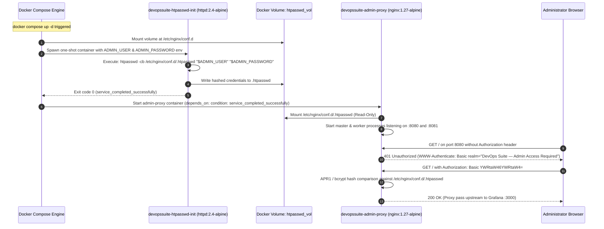
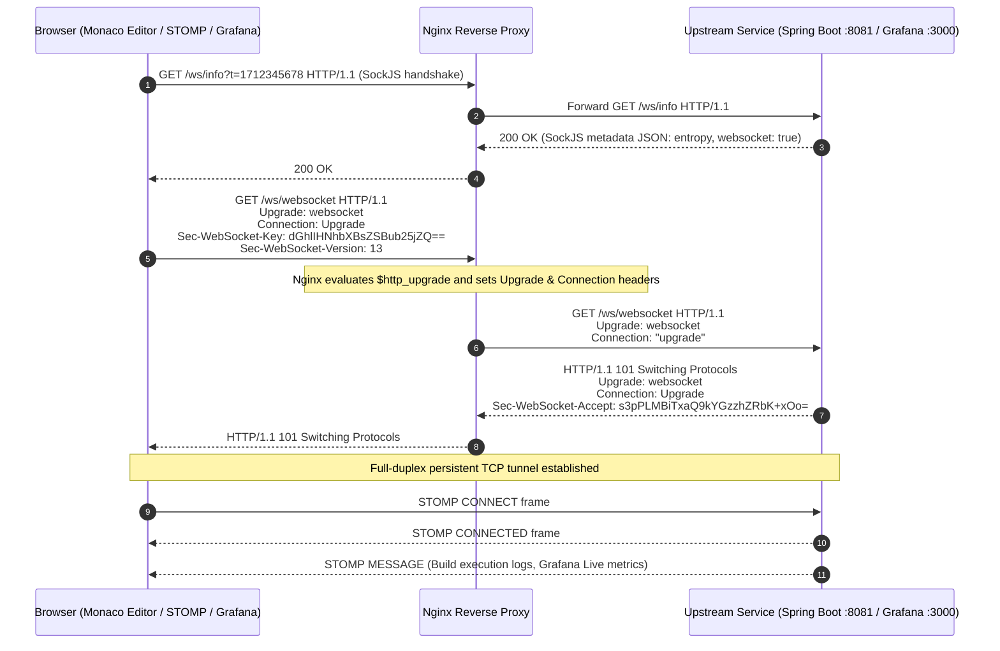

# DevOps Suite: Nginx Reverse Proxy Architecture & Security Deep Dive

## 1. Architectural Overview & Context

In **DevOps Suite**, Nginx serves two critical architectural functions across the containerized landscape:

1. **Edge Web Server & Application Proxy (`devopssuite-frontend`)**: Serves the compiled React 18 Single-Page Application (SPA) on port `80`, handling client-side routing fallbacks (`try_files $uri $uri/ /index.html`), proxying REST API calls (`/api/` -> `backend:8081`), and establishing bidirectional STOMP/SockJS WebSocket connections (`/ws/` -> `backend:8081`).
2. **Dedicated Observability & Administration Gateway (`devopssuite-admin-proxy`)**: A hardened, isolated Nginx reverse proxy running on the internal `observability` Docker bridge network. It binds to host ports `8080` (routing to Grafana on internal port `3000`) and `8083` (routing to Kibana on internal port `5601`, translated from proxy listening port `8081`).

The admin proxy forms a perimeter security boundary. Under zero-trust architecture, sensitive administrative and telemetry systems like Grafana, Kibana, Prometheus, and Elasticsearch are never directly exposed to the host machine or public internet.

```
                    Internet / Corporate Network / Browser
                                      │
            ┌─────────────────────────┴─────────────────────────┐
            │                                                   │
     HTTP Port 80                                    HTTP Ports 8080, 8083
            ▼                                                   ▼
┌───────────────────────┐                           ┌───────────────────────┐
│ devopssuite-frontend  │                           │ devopssuite-admin-    │
│     (Nginx 1.27)      │                           │        proxy          │
│                       │                           │     (Nginx 1.27)      │
└───────────┬───────────┘                           └───────────┬───────────┘
            │                                                   │ HTTP Basic Auth
            │                                                   │ (/etc/nginx/conf.d/.htpasswd)
            │                                                   │ Dynamic init container
            ▼                                                   ▼
┌───────────────────────┐                    ┌──────────────────┴──────────────────┐
│ devopssuite-backend   │                    │                                     │
│  (Spring Boot :8081)  │                    ▼                                     ▼
└───────────────────────┘          ┌───────────────────┐                 ┌───────────────────┐
                                   │ devopssuite-      │                 │ devopssuite-      │
                                   │ grafana (:3000)   │                 │ kibana (:5601)    │
                                   └─────────┬─────────┘                 └─────────┬─────────┘
                                             │                                     │
                                             ▼                                     ▼
                                   ┌───────────────────┐                 ┌───────────────────┐
                                   │ devopssuite-      │                 │ devopssuite-      │
                                   │ prometheus (:9090)│                 │ elasticsearch     │
                                   │ (Isolated Bridge) │                 │ (:9200, Isolated) │
                                   └───────────────────┘                 └───────────────────┘
```

---

## 2. Admin Proxy Architecture & Routing Topology

### 2.1 Why an Admin Proxy is Mandatory

Exposing Grafana and Kibana directly to host interfaces or public endpoints introduces critical security, governance, and operational vulnerabilities:

* **Elimination of Direct Attack Surfaces**: Neither Elasticsearch (`9200`), Prometheus (`9090`), Grafana (`3000`), nor Kibana (`5601`) bind host ports in [docker-compose.yml](file:///d:/Projects/DevOps%20Suite/docker-compose.yml). They use Docker's `expose` directive, making them reachable strictly via internal Docker DNS over the `observability` bridge network (`172.x.x.x`).
* **Unified Administrative Authentication**: While Grafana supports built-in auth, Kibana in open distributions (with `xpack.security.enabled=false` used for local/monolithic simplicity) provides zero native authentication or RBAC without Gold/Platinum licensing or complex Shield/Search Guard plugins. Placing both behind Nginx HTTP Basic Auth standardizes access governance under a single authentication gate before any HTTP handshake reaches application runtimes.
* **Header Sanitization & Spoof Prevention**: Upstream telemetry engines frequently read remote headers (`X-Forwarded-For`, `X-Real-IP`, `Host`) to enforce session binding or audit trails. Direct access allows bad actors to inject forged IP addresses or poisoned host headers.
* **Unified Security Policies & Clickjacking Mitigation**: DevOps Suite embeds administrative Grafana dashboards and Kibana visualizations inside React SPA iframe views. Upstream applications emit default headers (such as `X-Frame-Options: deny` or restrictive CSP headers) that break nested iframe rendering. The reverse proxy provides a centralized layer to strip conflicting headers and inject targeted Content Security Policies (`frame-ancestors 'self' http://localhost http://localhost:80 http://localhost:5173`).
* **Connection Multiplexing & DoS Protection**: Nginx absorbs slow-loris attacks, malformed HTTP payloads, and burst traffic via kernel-level event loops (`epoll`/`kqueue`), insulating resource-intensive Node.js (Kibana) and Go (Grafana) runtimes from unbuffered network streams.

---

### 2.2 Network & Routing Mappings

| Ingress Host Endpoint | Container Service | Target Container & Port | Upstream Protocol | Protection Layer |
| :--- | :--- | :--- | :--- | :--- |
| `http://host:80` | `devopssuite-frontend` | Static React Files / `backend:8081` | HTTP 1.1 / WS | Nginx SPA fallback + API proxy |
| `http://host:8080` | `devopssuite-admin-proxy` | `http://grafana:3000` | HTTP 1.1 + WebSocket | HTTP Basic Auth + CSP `frame-ancestors` |
| `http://host:8083` | `devopssuite-admin-proxy` | `http://kibana:5601` (via listen `8081`) | HTTP 1.1 + WebSocket | HTTP Basic Auth + `kbn-xsrf` bypass + CSP |
| *Unexposed* | `devopssuite-prometheus` | Internal port `9090` only | HTTP 1.1 | Isolated internal bridge network |
| *Unexposed* | `devopssuite-elasticsearch`| Internal port `9200` only | HTTP 1.1 | Isolated internal bridge network |

---

## 3. Dynamic HTTP Basic Auth via `htpasswd-init`

### 3.1 The Dynamic Initialization Workflow

Hardcoding `.htpasswd` files into Git repositories or baking credentials into static Docker images violates Twelve-Factor App principles and leaks secrets. DevOps Suite solves this using a decoupled init container pattern (`htpasswd-init`) paired with a shared Docker volume (`htpasswd_vol`).



### 3.2 Docker Compose Orchestration Specification

From [docker-compose.yml](file:///d:/Projects/DevOps%20Suite/docker-compose.yml):

```yaml
  # ── Admin proxy: nginx with HTTP Basic Auth ───────────────────────────────────
  admin-proxy:
    image: nginx:1.27-alpine
    container_name: devopssuite-admin-proxy
    depends_on:
      htpasswd-init:
        condition: service_completed_successfully
      grafana:
        condition: service_started
      kibana:
        condition: service_started
    ports:
      - "8080:8080"   # Grafana (admin)
      - "8083:8081"   # Kibana  (admin) — host port 8083 maps to container port 8081
    volumes:
      - ./config/nginx/nginx-admin.conf:/etc/nginx/nginx.conf:ro
      - htpasswd_vol:/etc/nginx/conf.d:ro
    networks:
      - observability
    restart: unless-stopped

  # ── htpasswd init: writes .htpasswd to the shared volume ─────────────────────
  htpasswd-init:
    image: httpd:2.4-alpine
    container_name: devopssuite-htpasswd-init
    environment:
      ADMIN_USER: ${ADMIN_USER:-admin}
      ADMIN_PASSWORD: ${ADMIN_PASSWORD:-admin}
    volumes:
      - htpasswd_vol:/etc/nginx/conf.d
    entrypoint: ["/bin/sh", "-c", "htpasswd -cb /etc/nginx/conf.d/.htpasswd \"$$ADMIN_USER\" \"$$ADMIN_PASSWORD\" && echo '[htpasswd-init] .htpasswd written for user '\"$$ADMIN_USER\""]
    restart: "no"
```

### 3.3 Hashing Internals & Security Details

* **`htpasswd -cb` command breakdown**:
  * `-c`: Creates the password file specified by the path (`/etc/nginx/conf.d/.htpasswd`). If the file already exists, it is overwritten.
  * `-b`: Batch mode. Reads the password directly from command-line arguments rather than prompting interactively on `stdin`.
  * **Default Algorithm**: `apache2-utils` / `httpd` on Alpine defaults to MD5-based APR1 algorithm (`$apr1$`) or DES if legacy flags are provided. In production, `-B` can be supplied to force **bcrypt** (`$2y$`), providing high-entropy resistance against offline brute-force attacks.
* **Failure Modes & Startup Ordering**:
  * If `htpasswd-init` fails (e.g., disk full, invalid character in environment variables), the container exits with a non-zero code.
  * Because `admin-proxy` specifies `condition: service_completed_successfully`, Nginx will **never start** in an unauthenticated or corrupt state, preventing credential-less leakage.

---

## 4. Deep Dive: Nginx Admin Proxy Configuration

Below is the verified production configuration from [config/nginx/nginx-admin.conf](file:///d:/Projects/DevOps%20Suite/config/nginx/nginx-admin.conf):

```nginx
events {
    worker_connections 512;
}

http {
    # ── Grafana ───────────────────────────────────────────────────────────────
    server {
        listen 8080;
        server_name _;

        location / {
            auth_basic           "DevOps Suite — Admin Access Required";
            auth_basic_user_file /etc/nginx/conf.d/.htpasswd;

            proxy_pass         http://grafana:3000;
            proxy_http_version 1.1;

            # WebSocket support (Grafana Live)
            proxy_set_header Upgrade    $http_upgrade;
            proxy_set_header Connection "upgrade";

            proxy_set_header Host              $host;
            proxy_set_header X-Real-IP         $remote_addr;
            proxy_set_header X-Forwarded-For   $proxy_add_x_forwarded_for;
            proxy_set_header X-Forwarded-Proto $scheme;

            # Remove X-Frame-Options from upstream so our iframe works
            proxy_hide_header X-Frame-Options;

            # Allow framing from localhost (React dev + Docker)
            add_header Content-Security-Policy "frame-ancestors 'self' http://localhost http://localhost:80 http://localhost:5173" always;

            proxy_read_timeout 90s;
        }
    }

    # ── Kibana ────────────────────────────────────────────────────────────────
    server {
        listen 8081;
        server_name _;

        location / {
            auth_basic           "DevOps Suite — Admin Access Required";
            auth_basic_user_file /etc/nginx/conf.d/.htpasswd;

            proxy_pass         http://kibana:5601;
            proxy_http_version 1.1;

            # WebSocket support (Kibana real-time features)
            proxy_set_header Upgrade    $http_upgrade;
            proxy_set_header Connection "upgrade";

            proxy_set_header Host              $host;
            proxy_set_header X-Real-IP         $remote_addr;
            proxy_set_header X-Forwarded-For   $proxy_add_x_forwarded_for;
            proxy_set_header X-Forwarded-Proto $scheme;

            # Kibana needs kbn-xsrf passthrough
            proxy_set_header kbn-xsrf "";

            # Remove X-Frame-Options from upstream so our iframe works
            proxy_hide_header X-Frame-Options;

            # Allow framing from localhost
            add_header Content-Security-Policy "frame-ancestors 'self' http://localhost http://localhost:80 http://localhost:5173" always;

            proxy_read_timeout 90s;
        }
    }
}
```

---

## 5. Security Hardening & Header Manipulation

### 5.1 Client IP Preservation & Header Injection

When traffic passes through a reverse proxy, the upstream server sees the TCP socket connection originating from the proxy's IP address (`172.x.x.x`), masking the real user. The following headers reconstruct client context:

```nginx
proxy_set_header Host              $host;
proxy_set_header X-Real-IP         $remote_addr;
proxy_set_header X-Forwarded-For   $proxy_add_x_forwarded_for;
proxy_set_header X-Forwarded-Proto $scheme;
```

#### Detailed Header Mechanics

* **`Host $host`**: Preserves the original `Host` requested by the client browser. Critical for Grafana's `GF_SERVER_ROOT_URL` validation and Kibana routing redirects.
* **`X-Real-IP $remote_addr`**: Contains the immediate client IP address directly establishing the TCP socket with Nginx.
* **`X-Forwarded-For $proxy_add_x_forwarded_for`**: Appends the client IP (`$remote_addr`) to any existing incoming `X-Forwarded-For` header. If the incoming request had `X-Forwarded-For: 203.0.113.195` and connected from proxy hop `198.51.100.1`, the resulting header sent upstream becomes `203.0.113.195, 198.51.100.1`.
* **`X-Forwarded-Proto $scheme`**: Forwards the transport protocol (`http` or `https`). Informs upstream engines whether the original user connection was TLS-encrypted, allowing them to emit correct absolute redirect URLs and set `Secure` flags on cookies.

---

### 5.2 Clickjacking Defense: `X-Frame-Options` vs. CSP `frame-ancestors`

Clickjacking occurs when an attacker renders a legitimate application inside an invisible `<iframe>` overlaying a malicious site, tricking authenticated users into clicking buttons or triggering actions.

#### The Legacy Problem: `X-Frame-Options`
* `X-Frame-Options: DENY`: Prevents all framing globally.
* `X-Frame-Options: SAMEORIGIN`: Allows framing only if the parent window shares the exact same Origin (protocol, hostname, and port).
* Both Grafana and Kibana ship with default headers enforcing framing restrictions. If Grafana runs on port `8080` and the React SPA runs on `http://localhost:5173` or `http://localhost:80`, `SAMEORIGIN` evaluates to **false** due to port mismatch, resulting in browser frame blocking.

#### The Modern Solution: Header Stripping and CSP Injection

1. **`proxy_hide_header X-Frame-Options;`**:
   Nginx intercepts the HTTP response from upstream (Grafana/Kibana) and strips out the upstream `X-Frame-Options` header before it reaches the client browser.
2. **`add_header Content-Security-Policy "frame-ancestors 'self' http://localhost http://localhost:80 http://localhost:5173" always;`**:
   Injects the W3C standard `Content-Security-Policy` directive `frame-ancestors`. This explicitly whitelists the authorized parent application origins:
   * `'self'`: The origin of the proxy itself.
   * `http://localhost`: Production Nginx default host.
   * `http://localhost:80`: Docker frontend mapped port.
   * `http://localhost:5173`: Vite React development server.
3. **The `always` directive**:
   Guarantees that Nginx attaches the CSP header even on error response status codes (e.g., `401 Unauthorized`, `403 Forbidden`, `500 Internal Server Error`), preventing security policy drops during upstream failures.

---

### 5.3 Kibana Cross-Site Request Forgery (`kbn-xsrf`) Handling

Kibana enforces strict CSRF protection on all API endpoints. By default, Kibana rejects non-GET HTTP requests (POST, PUT, DELETE) that lack either a custom `kbn-xsrf` header or an `application/json` Content-Type.

In `nginx-admin.conf`:
```nginx
proxy_set_header kbn-xsrf "";
```
When automated requests, embedded widgets, or proxy health-checks hit Kibana, setting `proxy_set_header kbn-xsrf ""` ensures a non-null header presence or bypasses header collision depending on upstream versioning, eliminating arbitrary 400 Bad Request / 403 Forbidden CSRF rejections.

---

### 5.4 Rate Limiting Connections at the Nginx Level

While the Spring Boot backend in DevOps Suite implements sliding-window rate limiting via Redis (`RedisRateLimiterService`), applying rate limiting at the Nginx edge stops Layer 7 volumetric floods before connections consume JVM threads or backend memory.

#### Production Nginx Rate Limiting Implementation

```nginx
http {
    # 1. Define memory zones for tracking client IPs
    # $binary_remote_addr uses 4 bytes per IPv4 (or 16 bytes for IPv6) instead of ~15 bytes for text.
    # 10m zone can hold ~160,000 active concurrent IP addresses.
    limit_req_zone $binary_remote_addr zone=admin_login_limit:10m rate=5r/s;
    limit_req_zone $binary_remote_addr zone=telemetry_api_limit:10m rate=60r/s;
    limit_conn_zone $binary_remote_addr zone=addr_conn_limit:10m;

    server {
        listen 8080;
        server_name _;

        # Restrict concurrent TCP connections per IP
        limit_conn addr_conn_limit 20;

        location / {
            auth_basic           "DevOps Suite — Admin Access Required";
            auth_basic_user_file /etc/nginx/conf.d/.htpasswd;

            # Leaky bucket rate limiting
            # burst=10 allows brief spikes; nodelay processes burst immediately without artificial delay
            limit_req zone=admin_login_limit burst=10 nodelay;
            limit_req_status 429;

            proxy_pass http://grafana:3000;
            # ... proxy headers ...
        }
    }
}
```

* **Leaky Bucket Algorithm**: Enforces the steady-state rate `5r/s`.
* **`burst=10 nodelay`**: Accommodates bursts (such as Grafana loading dashboard tiles in parallel) up to 10 requests without dropping, returning `429 Too Many Requests` only when the burst ceiling is breached.
* **`limit_req_status 429`**: Replaces the default `503 Service Unavailable` with HTTP 429, complying with RFC 6585.

---

## 6. Real-Time Streaming & WebSocket Upgrades

Both Grafana (Grafana Live telemetry streams) and Kibana (real-time log streaming and alerting) rely on WebSocket connections. Furthermore, the frontend Nginx reverse proxy routes the Spring Boot STOMP/SockJS broker (`/ws/`).

### 6.1 The HTTP-to-WebSocket Handshake Lifecycle



### 6.2 Nginx WebSocket Directives Explained

Standard HTTP reverse proxies close connections after serving a single response or idle timeout. Supporting full-duplex WebSockets requires explicit header configuration:

```nginx
proxy_http_version 1.1;
proxy_set_header   Upgrade    $http_upgrade;
proxy_set_header   Connection "upgrade";
proxy_read_timeout 86400s; # Or 90s for admin proxy
```

1. **`proxy_http_version 1.1;`**:
   HTTP/1.0 does not support persistent connections or the `Upgrade` hop-by-hop header. Upgrading requires HTTP/1.1.
2. **`proxy_set_header Upgrade $http_upgrade;`**:
   The `Upgrade` header is a hop-by-hop header (stripped by proxies per RFC 2616). Nginx captures the client's `Upgrade` request header via variable `$http_upgrade` and explicitly passes it upstream.
3. **`proxy_set_header Connection "upgrade";`**:
   The `Connection` header must explicitly declare `"upgrade"` to notify the upstream server that the transport layer is switching to WebSockets.
4. **Dynamic Connection Mapping via `map` (Production Standard)**:
   In multi-purpose location blocks serving both standard HTTP and WebSockets, hardcoding `Connection "upgrade"` breaks HTTP keep-alive. The industry standard pattern uses the `map` module:

```nginx
map $http_upgrade $connection_upgrade {
    default upgrade;
    ''      close;
}

server {
    location /ws/ {
        proxy_pass http://backend:8081/ws/;
        proxy_http_version 1.1;
        proxy_set_header Upgrade $http_upgrade;
        proxy_set_header Connection $connection_upgrade;
        proxy_read_timeout 86400s;
    }
}
```
If `$http_upgrade` is empty (standard HTTP request), `Connection` is set to `close` (or left to standard keep-alive). If `$http_upgrade` is present, it dynamically sets `Connection: upgrade`.

---

## 7. Comprehensive Interview Q&A (🟢 Basic to ⚫ Expert)

### 🟢 Basic Concepts

#### Q1: What is the primary difference between a forward proxy and a reverse proxy, and why is Nginx categorized as a reverse proxy in DevOps Suite?
**Answer**:
* **Forward Proxy**: Sits in front of client devices (e.g., corporate office egress proxy). It intercepts outgoing client requests, hides client identities from external web servers, and enforces outbound content filtering or caching. The client is explicitly aware of the proxy.
* **Reverse Proxy**: Sits in front of origin backend servers (e.g., Spring Boot, Grafana, Kibana). It intercepts incoming public traffic on behalf of upstream servers, hiding backend network topologies, terminating TLS, enforcing authentication, and load-balancing traffic. The client believes it is communicating directly with the origin server.
* In DevOps Suite, `devopssuite-admin-proxy` and `devopssuite-frontend` accept client traffic on ports `80`, `8080`, and `8083` and proxy requests to internal containers (`backend:8081`, `grafana:3000`, `kibana:5601`) unreachable from the public network.

#### Q2: How does HTTP Basic Authentication operate over HTTP/HTTPS, and what are its inherent security risks?
**Answer**:
* **Handshake Protocol**:
  1. Client sends an unauthenticated request (`GET /`).
  2. Server responds with `401 Unauthorized` and includes header `WWW-Authenticate: Basic realm="DevOps Suite — Admin Access Required"`.
  3. Browser displays a native credential prompt, concatenates credentials as `username:password`, encodes the string with Base64 (`admin:admin` becomes `YWRtaW46YWRtaW4=`), and re-sends the request with header: `Authorization: Basic YWRtaW46YWRtaW4=`.
  4. Server validates credentials and returns `200 OK`.
* **Security Risks**:
  * **No Encryption**: Base64 is an encoding format, not encryption. Anyone intercepting the TCP stream can trivially decode the plaintext credentials via `base64 -d`.
  * **No Logout Mechanism**: Browsers cache HTTP Basic Auth credentials indefinitely until the browser session terminates or tab cache is cleared.
  * **Mitigation**: HTTP Basic Auth must **always** be wrapped in TLS/HTTPS. In DevOps Suite, administrative endpoints must terminate SSL/TLS at production ingress load balancers.

---

### 🟡 Intermediate Architectural Questions

#### Q3: Why does Nginx strip `X-Frame-Options` and inject `Content-Security-Policy: frame-ancestors` in `nginx-admin.conf`?
**Answer**:
* DevOps Suite features a unified React administration dashboard running on `http://localhost:5173` (dev) or `http://localhost` / `http://localhost:80` (prod) that embeds Grafana telemetry and Kibana log search inside React `<iframe>` elements.
* Upstream Grafana and Kibana instances emit `X-Frame-Options: SAMEORIGIN` or `DENY` by default. Under RFC 7034, `SAMEORIGIN` compares the iframe host against the parent window. Because the parent (`localhost:5173` or `localhost:80`) and iframe (`localhost:8080`) differ in port, the browser treats them as distinct cross-origin domains and blocks rendering.
* Furthermore, `X-Frame-Options` does not support multiple whitelisted domains or granular port whitelisting.
* By specifying `proxy_hide_header X-Frame-Options;`, Nginx strips the restrictive upstream header.
* By adding `add_header Content-Security-Policy "frame-ancestors 'self' http://localhost http://localhost:80 http://localhost:5173" always;`, Nginx enforces modern W3C CSP Level 2/3 framing rules, explicitly allowing DevOps Suite frontends to embed the dashboards while preventing third-party malicious origins from framing them.

#### Q4: What is the purpose of `proxy_read_timeout 90s;` and `proxy_read_timeout 86400s;` across our proxy configurations?
**Answer**:
* `proxy_read_timeout` defines the maximum time window Nginx waits for an upstream server to return response chunks after a connection has been established. If the upstream does not transmit data within this window, Nginx terminates the connection with a `504 Gateway Timeout`.
* In `nginx-admin.conf`, `proxy_read_timeout 90s;` allows heavy analytical queries (e.g., Elasticsearch Lucene aggregations across millions of log records or Prometheus metric range queries across 15 days) sufficient processing time without timing out prematurely.
* In `frontend/nginx.conf` under `location /ws/`, `proxy_read_timeout` is set to `86400s` (24 hours). STOMP/SockJS WebSockets maintain persistent, idle-tolerant TCP connections for real-time sandbox execution logs. Setting this to 24 hours prevents Nginx from severing long-lived WebSocket tunnels when log activity is temporarily quiet between compilation phases.

---

### 🔴 Advanced Operational & Systems Questions

#### Q5: Walk through the exact TLS termination workflow in Nginx. How does TLS termination impact proxy header configuration?
**Answer**:
* **TLS Termination Workflow**:
  1. **TCP Handshake**: Client initiates TCP SYN to port `443`.
  2. **TLS Handshake**: Client sends `ClientHello` with SNI (Server Name Indication). Nginx selects the corresponding certificate (`ssl_certificate /etc/nginx/certs/fullchain.pem`) and private key (`ssl_certificate_key /etc/nginx/certs/privkey.pem`).
  3. **Key Exchange**: Ephemeral Diffie-Hellman (ECDHE) exchange establishes symmetric session keys. Nginx handles encryption/decryption offloading.
  4. **Plaintext Internal Routing**: Nginx decrypts incoming HTTP payloads and forwards them over internal Docker bridge networks (`observability`, `app`) as standard HTTP to upstream services.
* **Impact on Headers**:
  * Because the upstream service (e.g., Spring Boot, Grafana) receives an unencrypted HTTP request over internal network interfaces, it cannot detect whether the end user connected via HTTPS.
  * If the upstream issues an HTTP 302 Redirect, it might generate an insecure URL (`http://devopssuite.com/login` instead of `https://devopssuite.com/login`), causing mixed-content errors or browser security warnings.
  * Therefore, Nginx must explicitly inject:
    ```nginx
    proxy_set_header X-Forwarded-Proto https;
    ```
  * In Spring Boot, enabling `server.forward-headers-strategy=native` or `framework` causes Spring to read `X-Forwarded-Proto`, ensuring OAuth2 redirect URIs and secure cookie flags (`SameSite=None; Secure`) are generated correctly.

#### Q6: Explain the difference between `$remote_addr`, `$proxy_add_x_forwarded_for`, and `$http_x_forwarded_for`. What security issue arises if an upstream trusts `$http_x_forwarded_for` blindly?
**Answer**:
* **Variable Differences**:
  * `$remote_addr`: The immediate Layer 4 client IP address obtained directly from the TCP socket connection established with Nginx. It cannot be spoofed across the TCP connection unless IP spoofing is feasible at the routing layer.
  * `$http_x_forwarded_for`: The raw, unparsed value of the incoming `X-Forwarded-For` HTTP header sent by the client.
  * `$proxy_add_x_forwarded_for`: Automatically takes the incoming `$http_x_forwarded_for` header and appends `, $remote_addr` to the end.
* **Security Vulnerability (IP Spoofing / Rate Limit Bypass)**:
  * An attacker can send an HTTP request with a forged header: `X-Forwarded-For: 127.0.0.1`.
  * If the proxy or upstream reads the first IP in `$http_x_forwarded_for` to determine client identity for IP-based rate limiting or security whitelisting, the attacker can spoof trusted internal IPs or bypass Redis sliding-window rate limiters by rotating random fake IPs.
  * **Remediation**: Nginx should use the `real_ip` module (`set_real_ip_from <trusted_cloud_lb_cidr>; real_ip_header X-Forwarded-For; real_ip_recursive on;`) to discard untrusted upstream hops and extract the true client IP reliably.

---

### ⚫ Expert & Architectural Scenarios

#### Q7: In `nginx-admin.conf`, the directive `proxy_set_header Connection "upgrade";` is hardcoded inside `location /`. Why is this problematic in general reverse proxy configurations, and how would you redesign it for production?
**Answer**:
* **The Problem**:
  * The `Connection` header in HTTP/1.1 governs connection persistence (`keep-alive`) versus hop-by-hop transitions (`upgrade`, `close`).
  * If `proxy_set_header Connection "upgrade";` is applied globally across a location block that handles both regular HTTP requests and WebSocket connections, every regular HTTP request forwarded to the upstream server will contain `Connection: upgrade` even when the client sent no `Upgrade` header.
  * Upstream HTTP servers or web frameworks (such as certain versions of Tomcat, Jetty, or Go's `net/http`) may reject standard GET/POST requests with `400 Bad Request` or disable HTTP keep-alive connection reuse, degrading connection pool efficiency and forcing constant TCP re-handshakes.
* **Production Redesign**:
  * Use the Nginx `map` directive outside the server block to evaluate `$http_upgrade` conditionally:

```nginx
http {
    # Dynamically map the Connection header
    map $http_upgrade $connection_upgrade {
        default upgrade;
        ''      close;
    }

    server {
        listen 8080;
        server_name _;

        location / {
            proxy_pass         http://grafana:3000;
            proxy_http_version 1.1;

            # Only sends Upgrade/upgrade if client sent an Upgrade header
            proxy_set_header Upgrade    $http_upgrade;
            proxy_set_header Connection $connection_upgrade;

            proxy_set_header Host $host;
            # ...
        }
    }
}
```
* When a standard HTTP request arrives (`Upgrade` is empty), `$connection_upgrade` resolves to `close` (or can be configured to preserve keep-alive), ensuring protocol compliance across heterogeneous endpoints.

#### Q8: Analyze how Nginx handles buffering (`proxy_buffering on` vs `off`) during real-time compilation log streaming from the C++ Docker Sandbox to the React Monaco Editor. What happens if buffering is misconfigured?
**Answer**:
* **Mechanism**:
  * **`proxy_buffering on` (Default)**: Nginx reads responses from upstream backend workers as fast as possible, storing chunks in memory buffers (`proxy_buffer_size`, `proxy_buffers`) and spilling to temporary disk files if payloads exceed memory limits. The client receives the response only as buffers fill or when upstream completes the response.
  * **`proxy_buffering off`**: Nginx synchronously forwards data chunks directly to the client as soon as they arrive from upstream, bypassing internal intermediate buffers.
* **Failure Modes in Log Streaming**:
  * If Server-Sent Events (SSE) or chunked HTTP streaming is used to pipe real-time stdout/stderr from a C++ compilation process running in the Docker sandbox, `proxy_buffering on` causes the client to experience complete silence until the 4KB/8KB Nginx buffer fills or the 30-second execution container exits.
  * The Monaco Editor UI appears frozen, defeating the real-time interactive developer experience.
* **Remediation**:
  * For streaming endpoints, disable buffering explicitly or pass the upstream header `X-Accel-Buffering: no`:
    ```nginx
    location /api/submissions/stream {
        proxy_pass http://backend:8081;
        proxy_buffering off;
        proxy_cache off;
        chunked_transfer_encoding on;
    }
    ```
  * For WebSockets (`/ws/`), Nginx operates in full-duplex tunnel mode once the `101 Switching Protocols` handshake succeeds; Nginx does not buffer WebSocket frames regardless of `proxy_buffering` settings.

---

## 8. Complete Architectural Comparison: Frontend vs. Admin Proxy

| Architectural Dimension | Frontend Nginx (`devopssuite-frontend`) | Admin Nginx Proxy (`devopssuite-admin-proxy`) |
| :--- | :--- | :--- |
| **Container Image** | Custom built from `frontend/Dockerfile` (`nginx:alpine`) | `nginx:1.27-alpine` off-the-shelf |
| **Configuration Path** | [frontend/nginx.conf](file:///d:/Projects/DevOps%20Suite/frontend/nginx.conf) | [config/nginx/nginx-admin.conf](file:///d:/Projects/DevOps%20Suite/config/nginx/nginx-admin.conf) |
| **Bound Host Ports** | `80:80` | `8080:8080` (Grafana), `8083:8081` (Kibana) |
| **Primary Target Upstream** | Static web root `/usr/share/nginx/html`, `backend:8081` | `grafana:3000`, `kibana:5601` |
| **Authentication Barrier** | JWT stateless auth handled by Spring Boot API | HTTP Basic Auth (`.htpasswd`) enforced at proxy boundary |
| **Credential Generation** | Database user records (BCrypt via PostgreSQL) | Dynamic init container (`htpasswd-init`) writing to Docker volume |
| **Framing Security Policy** | `X-Frame-Options: SAMEORIGIN` | Strips `X-Frame-Options`, injects CSP `frame-ancestors` |
| **Docker Networks** | `app` | `observability` |
| **WebSocket Endpoints** | `/ws/` (SockJS/STOMP backend broker) | Root `/` (Grafana Live metrics, Kibana live streaming) |
| **SPA Fallback Routing** | `try_files $uri $uri/ /index.html;` | N/A (Direct upstream proxying) |
| **Compression** | Active (`gzip on`, `gzip_types ...`) | Disabled (avoiding compression overhead on telemetry payloads) |

---

## 9. Quick Reference Summary Table

| Directive / Parameter | Location / Context | Functional Purpose in DevOps Suite |
| :--- | :--- | :--- |
| `auth_basic` | `nginx-admin.conf` (Server `:8080`, `:8081`) | Prompts browser for HTTP Basic Auth realm string |
| `auth_basic_user_file` | `/etc/nginx/conf.d/.htpasswd` | Path to hashed credential database initialized by `htpasswd-init` |
| `proxy_pass` | `location /` | Points reverse proxy to upstream Docker DNS (`grafana:3000`, `kibana:5601`) |
| `proxy_http_version 1.1` | Upstream blocks | Mandated for HTTP keep-alive reuse and WebSocket upgrade handshakes |
| `proxy_set_header Upgrade $http_upgrade` | WebSocket locations | Forwards client protocol upgrade token to upstream service |
| `proxy_set_header Connection "upgrade"` | WebSocket locations | Transitions hop-by-hop transport from HTTP to full-duplex TCP tunnel |
| `proxy_hide_header X-Frame-Options` | Admin Proxy locations | Strips upstream framing blocks so React admin UI can iframe dashboards |
| `Content-Security-Policy` | `frame-ancestors 'self' http://localhost ...` | Whitelists DevOps Suite frontends as legitimate iframe embedding parents |
| `proxy_set_header kbn-xsrf ""` | Admin Proxy `:8081` (Kibana) | Satisfies Kibana anti-CSRF check on incoming proxied requests |
| `proxy_read_timeout 90s` | Admin Proxy locations | Accommodates long-running Elasticsearch aggregations and PromQL range scans |
| `proxy_read_timeout 86400s` | Frontend `/ws/` | Prevents termination of idle STOMP WebSocket sessions during code execution |
| `try_files $uri $uri/ /index.html` | Frontend SPA root | Hands unmapped client URLs to React Router rather than returning Nginx 404 |
| `htpasswd -cb` | `htpasswd-init` entrypoint | Writes hashed admin credentials without interactive prompts |
| `service_completed_successfully` | Docker Compose `depends_on` | Ensures `admin-proxy` starts only after credentials exist on the volume |
