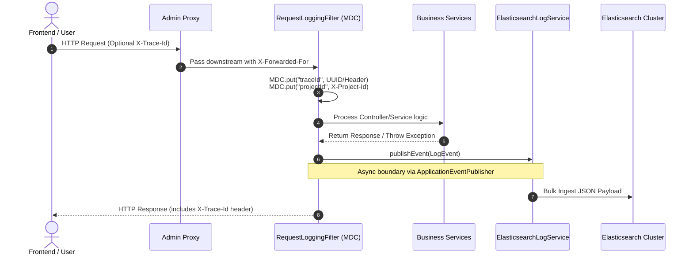

# Elasticsearch & Kibana — Centralized Log Management

> **Category:** Observability | **Difficulty Range:** 🟢 Basic → ⚫ Expert

---

## Introduction

DevOps Suite ships a full ELK-adjacent stack for structured log aggregation and search. The Spring Boot backend emits JSON-structured logs asynchronously into **Elasticsearch** using daily rolling indices. **Kibana** provides dashboards and search for operators. An **Index Lifecycle Management (ILM)** policy enforces a 180-day retention cap. All provisioning is automated — no manual Kibana clicks needed.

---

## Section 1: Architecture

```mermaid
flowchart LR
    subgraph App["Spring Boot Backend"]
        RF["RequestLoggingFilter"]
        ELS["ElasticsearchLogService\n(@Async @EventListener)"]
        RF -->|publishEvent(LogEvent)| ELS
    end

    subgraph ES["Elasticsearch :9200"]
        IDX["devopssuite-logs-yyyy.MM.dd"]
        ILM["ILM Policy\n180-day delete"]
        IDX --> ILM
    end

    subgraph Kibana["Kibana :5601"]
        DV["Data View: devopssuite-logs-*"]
        D1["Dashboard: Observability"]
        D2["Dashboard: Security"]
        D3["Dashboard: Analytics"]
    end

    subgraph Init["kibana-init container"]
        SH["init-kibana.sh\n(one-shot bootstrap)"]
    end

    ELS -->|Bulk index| IDX
    Init -->|Saved Objects API| Kibana
    Init -->|ILM + Index Template API| ES
    Kibana --> AdminProxy[":8083 Nginx Basic Auth"]
```

---

## Section 2: Index Naming & Structure

### Daily Rolling Indices

Elasticsearch indices follow the pattern `devopssuite-logs-yyyy.MM.dd`:

```
devopssuite-logs-2026.10.08    ← today (active write target)
devopssuite-logs-2026.10.07    ← yesterday (read-only)
devopssuite-logs-2026.09.01    ← 37 days ago (still hot)
...
devopssuite-logs-2026.04.12    ← 180 days ago → deleted by ILM
```

**Why daily indices?**
- Easy to delete old data (drop entire index, not slow UPDATE/DELETE)
- Easy to spot data gaps (missing index date = missing logs)
- Kibana data views can match all with `devopssuite-logs-*`

### Log Document Structure

Each Elasticsearch document corresponds to one HTTP request or domain event:

```json
{
  "@timestamp": "2026-10-08T15:30:00.123Z",
  "level": "INFO",
  "traceId": "abc123def456",
  "method": "POST",
  "uri": "/api/v1/projects/uuid/tasks",
  "status": 201,
  "durationMs": 45,
  "userId": "user-uuid",
  "projectId": "project-uuid",
  "clientIp": "192.168.1.10",
  "userAgent": "Mozilla/5.0 ...",
  "service": "devopssuite",
  "environment": "production",
  "errorMessage": null,
  "language": null,
  "exitCode": null,
  "timedOut": false,
  "oomKilled": false
}
```

**Execution-specific enrichment (for code runs):**
```json
{
  "uri": "/api/code-execution/run",
  "language": "PYTHON",
  "exitCode": 0,
  "durationMs": 1240,
  "timedOut": false,
  "oomKilled": false
}
```

---

## Section 3: ILM Policy & Index Template

### ILM (Index Lifecycle Management) Policy

The `devopssuite_logs_retention_policy` enforces automatic cleanup:

```json
PUT _ilm/policy/devopssuite_logs_retention_policy
{
  "policy": {
    "phases": {
      "hot": {
        "actions": {
          "rollover": {
            "max_age": "1d",
            "max_size": "5gb"
          },
          "set_priority": { "priority": 100 }
        }
      },
      "warm": {
        "min_age": "7d",
        "actions": {
          "readonly": {},
          "set_priority": { "priority": 50 }
        }
      },
      "delete": {
        "min_age": "180d",
        "actions": {
          "delete": {}
        }
      }
    }
  }
}
```

**Phase transitions:**
- **Hot (0–7 days):** Full read/write, highest priority. Active ingestion.
- **Warm (7–180 days):** Read-only, lower priority. Reduced heap usage.
- **Delete (180+ days):** Entire index dropped automatically.

### Index Template

An index template auto-applies the ILM policy and field mappings to all new daily indices:

```json
PUT _index_template/devopssuite_logs_template
{
  "index_patterns": ["devopssuite-logs-*"],
  "template": {
    "settings": {
      "index.lifecycle.name": "devopssuite_logs_retention_policy",
      "number_of_shards": 1,
      "number_of_replicas": 0
    },
    "mappings": {
      "properties": {
        "@timestamp": { "type": "date" },
        "level":      { "type": "keyword" },
        "traceId":    { "type": "keyword" },
        "method":     { "type": "keyword" },
        "uri":        { "type": "keyword" },
        "status":     { "type": "integer" },
        "durationMs": { "type": "long" },
        "userId":     { "type": "keyword" },
        "projectId":  { "type": "keyword" },
        "clientIp":   { "type": "ip" },
        "errorMessage": { "type": "text" }
      }
    }
  }
}
```

---

## Section 4: Kibana Auto-Provisioning via `init-kibana.sh`

### Why One-Shot Initialization?

Kibana has no built-in "infrastructure as code" provisioning like Grafana. DevOps Suite solves this with a `kibana-init` Docker container that runs `init-kibana.sh` once at startup and then exits (`restart: on-failure`).

### `init-kibana.sh` Script Logic

```bash
#!/bin/bash
set -e

KIBANA_URL="http://kibana:5601"
ES_URL="http://elasticsearch:9200"

# 1. Wait for Kibana to be ready
until curl -sf "$KIBANA_URL/api/status" | grep -q '"level":"available"'; do
  echo "Waiting for Kibana..."
  sleep 5
done

# 2. Create ILM policy in Elasticsearch
curl -X PUT "$ES_URL/_ilm/policy/devopssuite_logs_retention_policy" \
  -H 'Content-Type: application/json' \
  -d @/scripts/ilm-policy.json

# 3. Create Index Template
curl -X PUT "$ES_URL/_index_template/devopssuite_logs_template" \
  -H 'Content-Type: application/json' \
  -d @/scripts/index-template.json

# 4. Create Kibana Data View (index pattern)
curl -X POST "$KIBANA_URL/api/data_views/data_view" \
  -H 'Content-Type: application/json' \
  -H 'kbn-xsrf: true' \
  -d '{
    "data_view": {
      "title": "devopssuite-logs-*",
      "timeFieldName": "@timestamp",
      "name": "DevOps Suite Logs"
    }
  }'

# 5. Import saved objects (dashboards)
curl -X POST "$KIBANA_URL/api/saved_objects/_import?overwrite=true" \
  -H 'kbn-xsrf: true' \
  -F file=@/scripts/kibana-dashboards.ndjson

echo "Kibana provisioning complete."
```

### Three Auto-Provisioned Dashboards

| Dashboard | Purpose | Key Visualizations |
|---|---|---|
| **Observability** | API health overview | Request rate, error rate, top slow URIs, latency heatmap |
| **Security** | Auth & abuse monitoring | Failed logins, rate-limited IPs, blocked endpoints, RBAC rejections |
| **Analytics** | Usage & business metrics | Most executed languages, active users over time, project creation trend |

---

## Section 5: Log Search API

DevOps Suite exposes a log search REST endpoint so the frontend can query Elasticsearch directly:

```
GET /api/logs/search?projectId={uuid}&query={text}&level={INFO|WARN|ERROR}&from={date}&to={date}
```

**Backend implementation (`LogSearchController` → `ElasticsearchLogService`):**
```java
SearchResponse<LogDocument> response = esClient.search(s -> s
    .index("devopssuite-logs-*")
    .query(q -> q.bool(b -> b
        .must(m -> m.term(t -> t.field("projectId").value(projectId.toString())))
        .filter(f -> f.term(t -> t.field("level").value(level)))
        .must(m -> m.range(r -> r
            .field("@timestamp")
            .gte(JsonData.of(from))
            .lte(JsonData.of(to))
        ))
        .should(sh -> sh.match(mt -> mt.field("errorMessage").query(query)))
    ))
    .sort(so -> so.field(f -> f.field("@timestamp").order(SortOrder.Desc)))
    .size(100),
    LogDocument.class
);
```

---

## Section 6: Interview Q&A

### 🟢 Basic

**Q: What is Elasticsearch and what problem does it solve that PostgreSQL can't?**

**A:** Elasticsearch is a distributed search and analytics engine built on Apache Lucene. It solves several problems that PostgreSQL handles poorly at scale:

| Capability | PostgreSQL | Elasticsearch |
|---|---|---|
| Full-text search | `ILIKE '%query%'` — sequential scan | Inverted index — millisecond lookup |
| Log aggregation | No native log format | JSON documents with auto-mapping |
| Time-series retention | Manual partitioning | ILM auto-deletion |
| Faceted analytics | Complex GROUP BY | Aggregations framework |
| Horizontal scaling | Single primary | Multi-shard, multi-node native |

DevOps Suite stores all HTTP request logs in Elasticsearch to enable fast text search (`errorMessage` full-text), time-range filtering, and Kibana visualizations — none of which would be efficient in PostgreSQL at log scale.

---

**Q: What is an Elasticsearch index? How is it different from a PostgreSQL table?**

**A:**

| Concept | PostgreSQL | Elasticsearch |
|---|---|---|
| Storage unit | Table (rows & columns) | Index (documents in JSON) |
| Schema | Rigid, declared upfront | Dynamic (fields auto-mapped) |
| Uniqueness | Primary key constraints | `_id` field (auto-generated or custom) |
| Querying | SQL | Query DSL (JSON) / Lucene |
| Partitioning | Manual table partitioning | Multiple indices (daily rolling) |

An Elasticsearch **index** is a collection of JSON documents sharing a mapping (schema). DevOps Suite creates one index per day (`devopssuite-logs-2026.10.08`), so old indices can be dropped entirely for retention without expensive row-level deletes.

---

### 🟡 Intermediate

**Q: How does ILM (Index Lifecycle Management) work in Elasticsearch?**

**A:** ILM automates the lifecycle of Elasticsearch indices through configurable phases:

1. **Hot:** Active write phase. New logs indexed here. High-resource allocation.
2. **Warm:** Read-only. Indices moved here after 7 days. Reduced allocation.
3. **Cold:** (Optional) Cheaper storage, rarely queried.
4. **Delete:** Index dropped. Triggered at 180 days in DevOps Suite.

ILM checks policy conditions on a configurable interval (`indices.lifecycle.poll_interval`, default 10 minutes). When `min_age` thresholds are crossed, it automatically transitions and eventually deletes the index.

**Why ILM matters:**
Without it, the `devopssuite-logs-*` indices accumulate indefinitely, consuming disk space until Elasticsearch hits watermark limits and starts rejecting new writes. This was a real bug encountered during development — resolved by adding the ILM policy and index template.

---

**Q: How do you provision Kibana dashboards without clicking through the UI every time?**

**A:** Kibana exposes a **Saved Objects API** (`/api/saved_objects/_import`) that accepts `.ndjson` files containing exported dashboards, visualizations, data views, and saved searches.

DevOps Suite uses the `kibana-init` Docker container (runs `init-kibana.sh` as a one-shot job) to:
1. Wait until Kibana's API reports `available` status
2. Push the ILM policy and index template to Elasticsearch
3. Create the data view via Kibana's Data Views API
4. Import dashboards via `_import?overwrite=true`

This makes the entire observability stack fully reproducible — `docker-compose up` gives you working dashboards with zero manual setup.

---

### 🔴 Advanced

**Q: How does Elasticsearch's inverted index differ from a B-tree index in PostgreSQL?**

**A:**

**PostgreSQL B-tree index (for `LIKE` queries):**
- Stores sorted values → allows binary search
- `LIKE '%error in Docker%'` still requires sequential scan (no prefix match)
- `LIKE 'Docker%'` can use B-tree (left-anchored prefix)

**Elasticsearch inverted index (for full-text search):**
- During indexing, text is **analyzed**: tokenized, lowercased, stemmed
  - `"Error in Docker container"` → `["error", "docker", "container"]`
- Inverted index maps each **token** → list of document IDs containing it
- Query `"docker container"` → intersect posting lists → O(1) lookup per token

```
Token      → Document IDs
"error"    → [doc1, doc5, doc12, doc45]
"docker"   → [doc1, doc5, doc8, doc23]
"container"→ [doc1, doc5, doc8]
Intersection "docker" ∩ "container" → [doc1, doc5, doc8]
```

This is why Elasticsearch finds `"docker container"` in millions of documents in milliseconds, while PostgreSQL `ILIKE '%docker container%'` would scan every row.

---

### ⚫ Expert

**Q: How would you scale the logging pipeline when log volume spikes to 10,000 requests/second?**

**A:** Several bottlenecks emerge under extreme write load:

**Current architecture limitations:**
1. `ElasticsearchLogService` is async but still processes per-event — no batching
2. Single Elasticsearch node — limited write throughput
3. No backpressure mechanism — if ES is slow, event queue can grow unboundedly

**Production-grade improvements:**

**1. Bulk Indexing (immediate win):**
```java
// Instead of indexing one document per event, buffer and bulk-index
@Scheduled(fixedDelay = 500)  // every 500ms
public void flushLogBuffer() {
    List<LogDocument> batch = logBuffer.drainTo(new ArrayList<>(), 1000);
    if (!batch.isEmpty()) {
        BulkRequest request = new BulkRequest();
        batch.forEach(doc -> request.add(new IndexRequest("devopssuite-logs-" + today())
            .id(UUID.randomUUID().toString())
            .source(objectMapper.convertValue(doc, Map.class))));
        esClient.bulk(request);
    }
}
```

**2. Decouple via Kafka:**
Replace synchronous ES writes with Kafka producer. Dedicated consumer service handles batched Elasticsearch writes at its own pace. Provides durable buffering during ES maintenance.

**3. Elasticsearch Cluster:**
- Multiple data nodes for write parallelism
- Dedicated ingest nodes for log enrichment pipelines
- Hot-warm-cold node tiers matching ILM phases
- Increase primary shards for write-heavy indices

**4. Logstash / OpenTelemetry Collector:**
Use a battle-tested log pipeline agent (Logstash, Fluentd, OTel Collector) between the application and Elasticsearch for buffering, retry, and enrichment — rather than writing from the application directly.

---

## Quick Reference

| Item | Value |
|---|---|
| Index pattern | `devopssuite-logs-yyyy.MM.dd` |
| ILM policy name | `devopssuite_logs_retention_policy` |
| Retention period | 180 days (delete phase) |
| Index template name | `devopssuite_logs_template` |
| Auto-provisioning script | `config/kibana/init-kibana.sh` |
| Init container | `kibana-init` (one-shot, `restart: on-failure`) |
| Kibana host access | `:8083` via Nginx Basic Auth |
| Elasticsearch internal port | 9200 |
| Dashboards provisioned | 3 (Observability, Security, Analytics) |
| Log search API | `GET /api/logs/search` |
| Key log fields | `traceId`, `userId`, `projectId`, `durationMs`, `level` |


---

## Section 7: Advanced Log Enrichment & Correlation

### Distributed Tracing & W3C Trace Context

DevOps Suite enriches logs via MDC (Mapped Diagnostic Context) through `RequestLoggingFilter.java`.



### MDC Context Propagation in Asynchronous Pipelines

In Spring Boot, asynchronous listener execution (`@Async`) operates on separate worker thread pools (`ThreadPoolTaskExecutor`). Standard thread-local storage drops across context switches. DevOps Suite resolves context propagation via a custom `TaskDecorator`:

```java
@Configuration
@EnableAsync
public class AsyncConfig implements AsyncConfigurer {

    @Override
    public Executor getAsyncExecutor() {
        ThreadPoolTaskExecutor executor = new ThreadPoolTaskExecutor();
        executor.setCorePoolSize(5);
        executor.setMaxPoolSize(20);
        executor.setQueueCapacity(100);
        executor.setThreadNamePrefix("AsyncWorker-");
        executor.setTaskDecorator(new MdcContextDecorator());
        executor.initialize();
        return executor;
    }

    public static class MdcContextDecorator implements TaskDecorator {
        @Override
        public Runnable decorate(Runnable runnable) {
            Map<String, String> contextMap = MDC.getCopyOfContextMap();
            return () -> {
                try {
                    if (contextMap != null) {
                        MDC.setContextMap(contextMap);
                    }
                    runnable.run();
                } finally {
                    MDC.clear();
                }
            };
        }
    }
}
```

---

## Section 8: In-Depth Incident Triage Scenarios

### Scenario A: Out of Memory Spike in Elasticsearch

- **Trigger:** Heavy aggregation query across unindexed string fields or broad wildcard searches (`*foo*`) across 180 indices.
- **Triage Checklist:**
  1. Inspect heap pressure via `GET _cat/nodes?v&h=name,heap.percent,ram.percent`.
  2. Inspect running expensive tasks: `GET _tasks?detailed=true&actions=*search*`.
  3. Cancel offending query task: `POST _tasks/{taskId}/_cancel`.
  4. Ensure field mappings designate non-analyzed search fields as `keyword` rather than `text` with `fielddata=true`.

### Scenario B: Disk Watermark Reached (Indices Marked Read-Only)

- **Trigger:** Uncontrolled log growth surpassing 85% (low watermark) and 90% (high watermark).
- **Resolution:**
  1. Verify watermark errors: `GET _cluster/allocation/explain`.
  2. Temporarily raise watermark threshold or purge old indices: `DELETE devopssuite-logs-2026.04.*`.
  3. Reset index read-only block:
     ```json
     PUT devopssuite-logs-*/_settings
     {
       "index.blocks.read_only_allow_delete": null
     }
     ```
  4. Verify the ILM policy `devopssuite_logs_retention_policy` is active and healthy: `GET devopssuite-logs-*/_ilm/explain`.

---

## Section 9: Advanced Interview Q&A

### 🔴 Advanced: Shard Sizing & Performance Impact

**Q: How do you choose the number of primary shards and replicas for daily rolling log indices?**

**A:**
- **Primary Shards:** The golden rule in Elasticsearch is to keep primary shard sizes between **10 GB and 50 GB**. For DevOps Suite's single-node/low-throughput development and internal deployment, configuring `number_of_shards: 1` avoids the "oversharding" anti-pattern (which wastes JVM heap on cluster metadata and Lucene segment overhead).
- **Replicas:** Configured to `0` in single-node Docker Compose. In high-availability multi-node deployments, set to `1` so each primary has a replica on another node, enabling uninterrupted searches and failover during node crashes.

### ⚫ Expert: Log Sanitization & PII Masking

**Q: How do you ensure sensitive data (passwords, tokens, credit card numbers) does not leak into Elasticsearch?**

**A:**
1. **Never Log Request Bodies Unfiltered:** `RequestLoggingFilter` only captures URI parameters, headers (excluding `Authorization`), and execution metadata.
2. **Regex Masking in Logback:** Configure Logback patterns with regex replacement rules to redact sensitive fields:
   ```xml
   <pattern>%d{yyyy-MM-dd HH:mm:ss} %replace(%msg){'password=([^&amp;\s]+)','password=***'}%n</pattern>
   ```
3. **Elasticsearch Ingest Pipelines:** An ingest pipeline configured with `gsub` processors strips sensitive values at ingest time if an upstream service inadvertently emits them.
