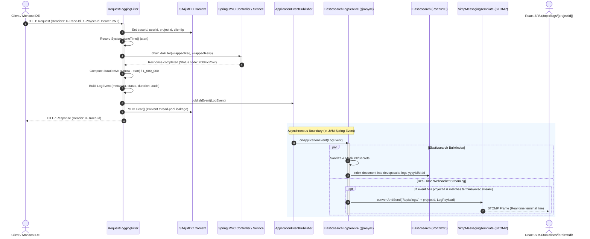

# Production Structured Logging & Real-Time Pipeline: In-Depth Architecture & Engineering Guide

## 1. Executive Summary & Pipeline Overview

In a high-throughput, enterprise-grade developer platform like **DevOps Suite**, observability is not an afterthought—it is a mission-critical pillar of platform stability, security compliance, performance profiling, and developer experience. The DevOps Suite backend is a modular monolith written in Spring Boot 3 (Java 21) that coordinates project management, task tracking, real-time collaboration, and isolated code execution inside Docker sandboxes.

Every single HTTP request, asynchronous background task, database query, and code compilation/execution run produces log records. At scale, uncoordinated synchronous logging creates significant latency degradation, thread pool starvation, and uncontrolled I/O blocking. If logging adds 25ms to a 40ms API request, the platform's throughput drops by over 38%, and response latency increases by over 60%.

To solve this, DevOps Suite implements an **asynchronous, non-blocking, multi-destination structured log pipeline**:
1. **Per-Request Ingestion & Context Capture**: Incoming HTTP requests pass through `RequestLoggingFilter`, which initializes the Slf4j **Mapped Diagnostic Context (MDC)** with distributed tracing tokens (`X-Trace-Id`), extracts audit context (`user_id`, `project_id` via `X-Project-Id`), and measures nanosecond-precision wall-clock latency.
2. **Event Decoupling via Spring Application Events**: Instead of writing synchronously to disk or directly invoking remote Elasticsearch REST APIs during the request thread lifecycle, `RequestLoggingFilter` encapsulates the enriched context into an immutable `LogEvent` POJO and publishes it via Spring's `ApplicationEventPublisher`. The HTTP request thread terminates immediately without waiting for I/O serialization, maintaining request overhead at **<5ms**.
3. **Decoupled Asynchronous Processing**: An `@Async("loggingTaskExecutor")` listener (`ElasticsearchLogService`) consumes `LogEvent` instances on an isolated virtual/platform thread pool with a bounded work queue.
4. **Centralized Log Indexing & ILM**: The `ElasticsearchLogService` writes structured documents directly into date-partitioned indices (`devopssuite-logs-yyyy.MM.dd`) with strict schema mapping and Index Lifecycle Management (ILM) retention policies.
5. **Real-Time Developer Streaming**: For terminal logs, build runs, and sandbox executions, `LogEvent` instances are simultaneously dispatched over WebSockets via STOMP/SockJS to `/topic/logs/{projectId}`, streaming execution output to the React 18 Monaco Editor IDE terminal with zero polling.

---

## 2. End-to-End Pipeline Architecture & Lifecycle



---

## 3. Core Component Implementation Details

### 3.1. `RequestLoggingFilter.java` (Context Initialization, Wrapping, & Publishing)

The `RequestLoggingFilter` extends Spring's `OncePerRequestFilter` to guarantee single execution per dispatch (avoiding duplicate log creation during forward or error dispatches). It wraps requests and responses using `ContentCachingRequestWrapper` and `ContentCachingResponseWrapper` when payload logging or status inspection is required, calculates latency accurately, populates the MDC, and ensures mandatory cleanup in a `finally` block to protect thread-local integrity in pooled servlet containers (e.g., Tomcat/Undertow).

```java
package com.devopssuite.logging.filter;

import com.devopssuite.logging.event.LogEvent;
import com.devopssuite.security.SecurityUtils;
import jakarta.servlet.FilterChain;
import jakarta.servlet.ServletException;
import jakarta.servlet.http.HttpServletRequest;
import jakarta.servlet.http.HttpServletResponse;
import org.slf4j.Logger;
import org.slf4j.LoggerFactory;
import org.slf4j.MDC;
import org.springframework.context.ApplicationEventPublisher;
import org.springframework.core.Ordered;
import org.springframework.core.annotation.Order;
import org.springframework.stereotype.Component;
import org.springframework.util.StringUtils;
import org.springframework.web.filter.OncePerRequestFilter;
import org.springframework.web.util.ContentCachingRequestWrapper;
import org.springframework.web.util.ContentCachingResponseWrapper;

import java.io.IOException;
import java.time.Instant;
import java.util.UUID;

/**
 * Intercepts incoming HTTP requests, initializes distributed tracing MDC tokens,
 * captures execution performance, and emits decoupled LogEvents.
 */
@Component
@Order(Ordered.HIGHEST_PRECEDENCE + 10)
public class RequestLoggingFilter extends OncePerRequestFilter {

    private static final Logger log = LoggerFactory.getLogger(RequestLoggingFilter.class);

    public static final String TRACE_ID_HEADER = "X-Trace-Id";
    public static final String PROJECT_ID_HEADER = "X-Project-Id";
    public static final String MDC_TRACE_ID = "traceId";
    public static final String MDC_USER_ID = "userId";
    public static final String MDC_PROJECT_ID = "projectId";
    public static final String MDC_CLIENT_IP = "clientIp";

    private final ApplicationEventPublisher eventPublisher;

    public RequestLoggingFilter(ApplicationEventPublisher eventPublisher) {
        this.eventPublisher = eventPublisher;
    }

    @Override
    protected boolean shouldNotFilter(HttpServletRequest request) {
        String path = request.getRequestURI();
        // Skip high-frequency health probes and static assets to avoid log pollution
        return path.startsWith("/actuator/health") 
            || path.startsWith("/actuator/prometheus")
            || path.startsWith("/favicon.ico")
            || path.startsWith("/static/");
    }

    @Override
    protected void doFilterInternal(HttpServletRequest request,
                                    HttpServletResponse response,
                                    FilterChain filterChain) throws ServletException, IOException {

        long startTime = System.nanoTime();
        
        // 1. Resolve or generate distributed Trace ID
        String traceId = request.getHeader(TRACE_ID_HEADER);
        if (!StringUtils.hasText(traceId)) {
            traceId = UUID.randomUUID().toString().replace("-", "");
        }
        
        // 2. Resolve Client IP and Project ID
        String clientIp = resolveClientIp(request);
        String projectId = request.getHeader(PROJECT_ID_HEADER);
        String userId = SecurityUtils.getCurrentUserIdOrAnonymous();

        // 3. Inject context into MDC
        MDC.put(MDC_TRACE_ID, traceId);
        MDC.put(MDC_CLIENT_IP, clientIp);
        MDC.put(MDC_USER_ID, userId);
        if (StringUtils.hasText(projectId)) {
            MDC.put(MDC_PROJECT_ID, projectId);
        }

        // Echo trace ID back in response headers for client-side correlation
        response.setHeader(TRACE_ID_HEADER, traceId);

        ContentCachingRequestWrapper wrappedRequest = new ContentCachingRequestWrapper(request);
        ContentCachingResponseWrapper wrappedResponse = new ContentCachingResponseWrapper(response);

        Throwable thrownException = null;
        try {
            filterChain.doFilter(wrappedRequest, wrappedResponse);
        } catch (Throwable ex) {
            thrownException = ex;
            throw ex;
        } finally {
            long durationNanos = System.nanoTime() - startTime;
            double durationMs = durationNanos / 1_000_000.0;

            int statusCode = wrappedResponse.getStatus();
            if (thrownException != null && statusCode == HttpServletResponse.SC_OK) {
                statusCode = HttpServletResponse.SC_INTERNAL_SERVER_ERROR;
            }

            // 4. Construct and publish LogEvent
            publishAccessLogEvent(wrappedRequest, statusCode, durationMs, traceId, userId, projectId, clientIp, thrownException);

            // 5. Copy cached response body back to original output stream
            wrappedResponse.copyBodyToResponse();

            // 6. Mandatory MDC cleanup to prevent thread leakage across container threads
            MDC.clear();
        }
    }

    private void publishAccessLogEvent(HttpServletRequest request,
                                      int statusCode,
                                      double durationMs,
                                      String traceId,
                                      String userId,
                                      String projectId,
                                      String clientIp,
                                      Throwable ex) {
        String level = (statusCode >= 500 || ex != null) ? "ERROR" : (statusCode >= 400 ? "WARN" : "INFO");
        String message = String.format("%s %s %d %.2fms", request.getMethod(), request.getRequestURI(), statusCode, durationMs);

        LogEvent event = LogEvent.builder()
                .eventId(UUID.randomUUID().toString())
                .timestamp(Instant.now())
                .traceId(traceId)
                .userId(userId)
                .projectId(projectId)
                .clientIp(clientIp)
                .httpMethod(request.getMethod())
                .requestUri(request.getRequestURI())
                .queryString(request.getQueryString())
                .statusCode(statusCode)
                .durationMs(durationMs)
                .userAgent(request.getHeader("User-Agent"))
                .level(level)
                .loggerName(RequestLoggingFilter.class.getName())
                .message(message)
                .exceptionClass(ex != null ? ex.getClass().getName() : null)
                .errorMessage(ex != null ? ex.getMessage() : null)
                .sourceType("HTTP_REQUEST")
                .build();

        eventPublisher.publishEvent(event);
    }

    private String resolveClientIp(HttpServletRequest request) {
        String xForwardedFor = request.getHeader("X-Forwarded-For");
        if (StringUtils.hasText(xForwardedFor)) {
            // First address in comma-separated chain is the client IP
            return xForwardedFor.split(",")[0].trim();
        }
        String realIp = request.getHeader("X-Real-IP");
        if (StringUtils.hasText(realIp)) {
            return realIp.trim();
        }
        return request.getRemoteAddr();
    }
}
```

---

### 3.2. `LogEvent.java` (Domain Model & Industry-Standard Log Schema)

The `LogEvent` POJO models structured events across both Web HTTP transactions and Docker sandbox container execution lifecycles.

```java
package com.devopssuite.logging.event;

import com.fasterxml.jackson.annotation.JsonInclude;
import com.fasterxml.jackson.annotation.JsonProperty;
import lombok.AllArgsConstructor;
import lombok.Builder;
import lombok.Data;
import lombok.NoArgsConstructor;

import java.io.Serializable;
import java.time.Instant;
import java.util.Map;

/**
 * Canonical log event model stored in Elasticsearch and broadcasted to WebSocket subscribers.
 */
@Data
@Builder
@NoArgsConstructor
@AllArgsConstructor
@JsonInclude(JsonInclude.Include.NON_NULL)
public class LogEvent implements Serializable {

    private static final long serialVersionUID = 1L;

    @JsonProperty("event_id")
    private String eventId;

    @JsonProperty("@timestamp")
    private Instant timestamp;

    // Tracing
    @JsonProperty("trace_id")
    private String traceId;

    @JsonProperty("span_id")
    private String spanId;

    // Security & Audit Context
    @JsonProperty("user_id")
    private String userId;

    @JsonProperty("project_id")
    private String projectId;

    @JsonProperty("client_ip")
    private String clientIp;

    @JsonProperty("user_agent")
    private String userAgent;

    // Request Metadata
    @JsonProperty("http_method")
    private String httpMethod;

    @JsonProperty("request_uri")
    private String requestUri;

    @JsonProperty("query_string")
    private String queryString;

    @JsonProperty("status_code")
    private Integer statusCode;

    @JsonProperty("duration_ms")
    private Double durationMs;

    // Severity & Logging Framework Attributes
    @JsonProperty("level")
    private String level;

    @JsonProperty("logger_name")
    private String loggerName;

    @JsonProperty("message")
    private String message;

    @JsonProperty("exception_class")
    private String exceptionClass;

    @JsonProperty("error_message")
    private String errorMessage;

    @JsonProperty("stack_trace")
    private String stackTrace;

    // Classification & Origin
    @JsonProperty("source_type")
    private String sourceType; // "HTTP_REQUEST", "SANDBOX_EXECUTION", "SYSTEM_EVENT"

    // Docker Sandbox Metadata
    @JsonProperty("sandbox_language")
    private String sandboxLanguage;

    @JsonProperty("sandbox_container_id")
    private String sandboxContainerId;

    @JsonProperty("sandbox_exit_code")
    private Integer sandboxExitCode;

    @JsonProperty("sandbox_timed_out")
    private Boolean sandboxTimedOut;

    @JsonProperty("sandbox_oom_killed")
    private Boolean sandboxOomKilled;

    @JsonProperty("sandbox_memory_used_mb")
    private Long sandboxMemoryUsedMb;

    @JsonProperty("extra_attributes")
    private Map<String, Object> extraAttributes;
}
```

---

### 3.3. `ElasticsearchLogService.java` (Asynchronous Indexing, Masking & WS Streaming)

The `ElasticsearchLogService` handles log consumption. It is decoupled from the main HTTP thread through `@Async("loggingTaskExecutor")` and Spring's `ApplicationListener<LogEvent>`. It applies high-performance regex-based secret/PII masking, checks for real-time streaming criteria, and indices the log record into Elasticsearch via the low-level / high-level REST client.

```java
package com.devopssuite.logging.service;

import com.devopssuite.logging.event.LogEvent;
import com.fasterxml.jackson.databind.ObjectMapper;
import org.apache.http.entity.ContentType;
import org.apache.http.nio.entity.NStringEntity;
import org.elasticsearch.client.Request;
import org.elasticsearch.client.Response;
import org.elasticsearch.client.RestClient;
import org.slf4j.Logger;
import org.slf4j.LoggerFactory;
import org.springframework.context.event.EventListener;
import org.springframework.messaging.simp.SimpMessagingTemplate;
import org.springframework.scheduling.annotation.Async;
import org.springframework.stereotype.Service;
import org.springframework.util.StringUtils;

import java.io.PrintWriter;
import java.io.StringWriter;
import java.time.ZoneOffset;
import java.time.format.DateTimeFormatter;
import java.util.regex.Pattern;

@Service
public class ElasticsearchLogService {

    private static final Logger log = LoggerFactory.getLogger(ElasticsearchLogService.class);
    private static final DateTimeFormatter INDEX_DATE_FORMAT = DateTimeFormatter.ofPattern("yyyy.MM.dd").withZone(ZoneOffset.UTC);

    // High-performance pre-compiled sanitization patterns
    private static final Pattern JWT_PATTERN = Pattern.compile("Bearer\\s+[A-Za-z0-9-_=]+\\.[A-Za-z0-9-_=]+\\.?[A-Za-z0-9-_.+/=]*", Pattern.CASE_INSENSITIVE);
    private static final Pattern PASSWORD_JSON_PATTERN = Pattern.compile("(\"(?:password|secret|apiKey|token|accessToken)\"\\s*:\\s*\")[^\"]+(\")", Pattern.CASE_INSENSITIVE);
    private static final Pattern CREDIT_CARD_PATTERN = Pattern.compile("\\b(?:4[0-9]{12}(?:[0-9]{3})?|5[1-5][0-9]{14}|3[47][0-9]{13})\\b");

    private final RestClient elasticsearchClient;
    private final SimpMessagingTemplate messagingTemplate;
    private final ObjectMapper objectMapper;

    public ElasticsearchLogService(RestClient elasticsearchClient,
                                   SimpMessagingTemplate messagingTemplate,
                                   ObjectMapper objectMapper) {
        this.elasticsearchClient = elasticsearchClient;
        this.messagingTemplate = messagingTemplate;
        this.objectMapper = objectMapper;
    }

    @Async("loggingTaskExecutor")
    @EventListener
    public void handleLogEvent(LogEvent event) {
        try {
            // 1. Sanitize sensitive fields (Passwords, JWTs, API Keys)
            sanitizeLogEvent(event);

            // 2. Format index name: devopssuite-logs-yyyy.MM.dd
            String indexName = "devopssuite-logs-" + INDEX_DATE_FORMAT.format(event.getTimestamp());

            // 3. Convert POJO to JSON
            String jsonPayload = objectMapper.writeValueAsString(event);

            // 4. Send document to Elasticsearch via REST API
            Request esRequest = new Request("POST", "/" + indexName + "/_doc/" + event.getEventId());
            esRequest.setEntity(new NStringEntity(jsonPayload, ContentType.APPLICATION_JSON));
            
            Response response = elasticsearchClient.performRequest(esRequest);
            int statusCode = response.getStatusLine().getStatusCode();
            if (statusCode < 200 || statusCode >= 300) {
                log.warn("Elasticsearch indexing returned non-2xx status: {}", statusCode);
            }

            // 5. If this is a project-bound sandbox execution or build log, broadcast to WebSocket
            streamToTerminalIfNeeded(event);

        } catch (Exception e) {
            // Fallback: log to stderr / standard logger without throwing to avoid killing worker thread
            log.error("Failed to process and index LogEvent [id={}]: {}", event.getEventId(), e.getMessage());
        }
    }

    private void streamToTerminalIfNeeded(LogEvent event) {
        if (StringUtils.hasText(event.getProjectId()) && 
           ("SANDBOX_EXECUTION".equals(event.getSourceType()) || "BUILD_LOG".equals(event.getSourceType()))) {
            
            String destination = "/topic/logs/" + event.getProjectId();
            messagingTemplate.convertAndSend(destination, event);
        }
    }

    private void sanitizeLogEvent(LogEvent event) {
        if (event.getMessage() != null) {
            String sanitized = JWT_PATTERN.matcher(event.getMessage()).replaceAll("Bearer [REDACTED_JWT]");
            sanitized = PASSWORD_JSON_PATTERN.matcher(sanitized).replaceAll("$1[REDACTED_SECRET]$2");
            sanitized = CREDIT_CARD_PATTERN.matcher(sanitized).replaceAll("[REDACTED_PAN]");
            event.setMessage(sanitized);
        }
        if (event.getQueryString() != null) {
            String sanitizedQuery = PASSWORD_JSON_PATTERN.matcher(event.getQueryString()).replaceAll("$1[REDACTED]$2");
            event.setQueryString(sanitizedQuery);
        }
    }
}
```

---

## 4. Asynchronous Thread Boundaries & MDC Context Propagation

One of the most frequent production pitfalls in Spring Boot logging pipelines is the loss of thread-local context (such as MDC tracing IDs and SecurityContext) when work is dispatched to asynchronous task executors (`@Async`, `CompletableFuture`, or `@EventListener`).

### 4.1. The ThreadLocal Problem in Async Execution
`org.slf4j.MDC` uses a `ThreadLocal<Map<String, String>>` behind the scenes. When a servlet thread handling a web request delegates work to an `@Async` method, the method executes on a separate worker thread drawn from an `ExecutorService`. Because `ThreadLocal` variables are bound strictly to the creating thread, the worker thread begins execution with an **empty MDC**. Any logs generated during the asynchronous work lose their `traceId`, `userId`, and `projectId`, fragmenting distributed traces in Kibana.

### 4.2. Solution: `TaskDecorator` Context Copying
Spring’s `ThreadPoolTaskExecutor` provides the `TaskDecorator` interface. A `TaskDecorator` intercepts the runnable task immediately before submission, extracts the caller's MDC context, and wraps the runnable so that it populates the worker thread's MDC before execution and cleans it up afterward.

```java
package com.devopssuite.logging.config;

import org.slf4j.MDC;
import org.springframework.context.annotation.Bean;
import org.springframework.context.annotation.Configuration;
import org.springframework.core.task.TaskDecorator;
import org.springframework.scheduling.annotation.EnableAsync;
import org.springframework.scheduling.concurrent.ThreadPoolTaskExecutor;

import java.util.Map;
import java.util.concurrent.Executor;
import java.util.concurrent.ThreadPoolExecutor;

@Configuration
@EnableAsync
public class AsyncLoggingConfig {

    @Bean(name = "loggingTaskExecutor")
    public Executor loggingTaskExecutor() {
        ThreadPoolTaskExecutor executor = new ThreadPoolTaskExecutor();
        // Sized appropriately for I/O bound Elasticsearch writes
        executor.setCorePoolSize(4);
        executor.setMaxPoolSize(16);
        executor.setQueueCapacity(10_000);
        executor.setThreadNamePrefix("async-log-");
        
        // Critical: inject the TaskDecorator to propagate MDC
        executor.setTaskDecorator(new MdcContextPropagatingDecorator());
        
        // Backpressure policy when queue exceeds 10,000 tasks
        executor.setRejectedExecutionHandler(new ThreadPoolExecutor.CallerRunsPolicy());
        
        executor.setWaitForTasksToCompleteOnShutdown(true);
        executor.setAwaitTerminationSeconds(30);
        executor.initialize();
        return executor;
    }

    /**
     * Propagates MDC from the calling thread to the asynchronous task execution thread.
     */
    public static class MdcContextPropagatingDecorator implements TaskDecorator {
        @Override
        public Runnable decorate(Runnable runnable) {
            // Snapshot current MDC from calling thread
            Map<String, String> contextMap = MDC.getCopyOfContextMap();
            return () -> {
                try {
                    if (contextMap != null) {
                        MDC.setContextMap(contextMap);
                    } else {
                        MDC.clear();
                    }
                    runnable.run();
                } finally {
                    MDC.clear();
                }
            };
        }
    }
}
```

---

## 5. Structured Log Field Taxonomy & Elasticsearch Index Mapping

To enable sub-second aggregations, faceted filtering, and zero-error parsing in Kibana, DevOps Suite applies explicit mapping definitions via an Elasticsearch Index Template (`devopssuite-logs-template`).

### 5.1. Log Field Taxonomy

| Category | Field Name | ES Data Type | Description |
| :--- | :--- | :--- | :--- |
| **Identity & Time** | `@timestamp` | `date` | ISO 8601 UTC timestamp (`2026-10-08T15:26:51.123Z`). |
| | `event_id` | `keyword` | Unique UUIDv4 identifying the log record. |
| **Distributed Tracing** | `trace_id` | `keyword` | 32-character hex trace token propagated across services. |
| | `span_id` | `keyword` | Individual operation span identifier within the trace. |
| **HTTP Request** | `http_method` | `keyword` | `GET`, `POST`, `PUT`, `DELETE`, `PATCH`. |
| | `request_uri` | `keyword` | Normalized endpoint path (e.g., `/api/projects/42/execute`). |
| | `query_string` | `keyword` | URL query parameters (sanitized). |
| | `status_code` | `integer` | HTTP response code (`200`, `404`, `500`). |
| | `duration_ms` | `float` | Server execution duration in milliseconds. |
| | `client_ip` | `ip` | Real client IPv4/IPv6 address (parsed from `X-Forwarded-For`). |
| | `user_agent` | `text` | Raw client browser/agent string. |
| **Audit & Security** | `user_id` | `keyword` | Authenticated principal ID or `'anonymous'`. |
| | `project_id` | `keyword` | Multi-tenant tenant/project identifier (`X-Project-Id`). |
| **Logging Runtime** | `level` | `keyword` | Log severity: `TRACE`, `DEBUG`, `INFO`, `WARN`, `ERROR`. |
| | `logger_name` | `keyword` | Fully-qualified Java class name producing the log. |
| | `message` | `text` | Human-readable log narrative (full-text searchable). |
| | `stack_trace` | `text` | Serialized exception trace formatted with root cause. |
| **Docker Sandbox** | `sandbox_language`| `keyword` | Execution target: `JAVA`, `PYTHON`, `JAVASCRIPT`, `CPP`. |
| | `sandbox_exit_code`| `integer` | Ephemeral container exit status code (`0`, `137`, etc.). |
| | `sandbox_timed_out`| `boolean` | `true` if execution breached the 30-second hard limit. |
| | `sandbox_oom_killed`| `boolean`| `true` if container exceeded 256MB memory cap (exit code 137).|

### 5.2. Elasticsearch Index Template (`devopssuite-logs-template.json`)

```json
{
  "index_patterns": ["devopssuite-logs-*"],
  "template": {
    "settings": {
      "number_of_shards": 2,
      "number_of_replicas": 1,
      "index.lifecycle.name": "devopssuite-logs-ilm-policy",
      "index.lifecycle.rollover_alias": "devopssuite-logs",
      "index.refresh_interval": "5s"
    },
    "mappings": {
      "properties": {
        "@timestamp": { "type": "date" },
        "event_id": { "type": "keyword" },
        "trace_id": { "type": "keyword" },
        "span_id": { "type": "keyword" },
        "user_id": { "type": "keyword" },
        "project_id": { "type": "keyword" },
        "client_ip": { "type": "ip" },
        "user_agent": { "type": "text", "index": false },
        "http_method": { "type": "keyword" },
        "request_uri": { "type": "keyword" },
        "status_code": { "type": "integer" },
        "duration_ms": { "type": "float" },
        "level": { "type": "keyword" },
        "logger_name": { "type": "keyword" },
        "message": { 
          "type": "text",
          "fields": {
            "keyword": { "type": "keyword", "ignore_above": 512 }
          }
        },
        "stack_trace": { "type": "text" },
        "source_type": { "type": "keyword" },
        "sandbox_language": { "type": "keyword" },
        "sandbox_exit_code": { "type": "integer" },
        "sandbox_timed_out": { "type": "boolean" },
        "sandbox_oom_killed": { "type": "boolean" }
      }
    }
  }
}
```

---

## 6. Real-Time Terminal Streaming over STOMP/SockJS

DevOps Suite integrates an in-browser Monaco Editor with an interactive execution console. When a user triggers code execution or a continuous integration job, the execution produces stdout/stderr logs inside the isolated Docker sandbox. Waiting for batch Elasticsearch indexing would introduce unacceptable developer lag (500ms–5s).

The platform solves this by bifurcating the log flow:
1. **Durable Storage**: Buffered and pushed asynchronously to Elasticsearch for compliance, analytics, and historical debugging.
2. **Real-Time Delivery**: Pushed instantly via Spring's `SimpMessagingTemplate` directly to active WebSocket subscribers on `/topic/logs/{projectId}`.

```
+------------------------------+
|  Docker Sandbox Container    |
|  stdout / stderr stream      |
+--------------+---------------+
               |
               v
+------------------------------+
| DockerJava Execution Callback|
| (DockerSandboxService.java)  |
+--------------+---------------+
               |
               v
+------------------------------+
| ApplicationEventPublisher    |
| (LogEvent: SANDBOX_EXEC)     |
+--------------+---------------+
         /            \
        /              \
       v                v
+---------------+  +-------------------------------------+
| Elasticsearch |  | SimpMessagingTemplate              |
| Index Writer  |  | convertAndSend("/topic/logs/{id}")  |
+---------------+  +------------------+------------------+
                                      |
                                      v
                   +-------------------------------------+
                   | React 18 Monaco Console Terminal   |
                   | (SockJS / StompJS Subscription)     |
                   +-------------------------------------+
```

### Frontend STOMP Subscription (React 18 / Vite)

```typescript
import { useEffect, useRef, useState } from 'react';
import { Client, IMessage } from '@stomp/stompjs';
import SockJS from 'sockjs-client';

export interface TerminalLogEvent {
  event_id: string;
  '@timestamp': string;
  level: 'INFO' | 'WARN' | 'ERROR';
  message: string;
  sandbox_exit_code?: number;
  sandbox_timed_out?: boolean;
}

export function useProjectLogStream(projectId: string) {
  const [logs, setLogs] = useState<TerminalLogEvent[]>([]);
  const stompClientRef = useRef<Client | null>(null);

  useEffect(() => {
    if (!projectId) return;

    const socket = new SockJS('/ws');
    const client = new Client({
      webSocketFactory: () => socket,
      reconnectDelay: 3000,
      heartbeatIncoming: 4000,
      heartbeatOutgoing: 4000,
      onConnect: () => {
        client.subscribe(`/topic/logs/${projectId}`, (message: IMessage) => {
          const payload: TerminalLogEvent = JSON.parse(message.body);
          setLogs((prev) => [...prev, payload]);
        });
      },
      onStompError: (frame) => {
        console.error('Broker error:', frame.headers['message']);
      }
    });

    client.activate();
    stompClientRef.current = client;

    return () => {
      client.deactivate();
    };
  }, [projectId]);

  return { logs, clearLogs: () => setLogs([]) };
}
```

---

## 7. High-Volume Log Spike Protection & Backpressure

Under peak system load or during runaway sandbox infinite loops (e.g., `while(true) { System.out.println("spam"); }`), logging subsystems can easily crash JVM memory if unconstrained.

DevOps Suite implements a 4-tier defense against logging memory saturation:

```
[ Log Ingestion Stream ]
         |
         v
+-------------------------------------------------------------+
| Tier 1: Container Rate Limiting (Docker LogDriver max-size) |
+-------------------------------------------------------------+
         |
         v
+-------------------------------------------------------------+
| Tier 2: In-Memory Token Bucket / Output Truncation          |
| (Max 2,000 lines or 5MB per execution)                      |
+-------------------------------------------------------------+
         |
         v
+-------------------------------------------------------------+
| Tier 3: Bounded Executor Work Queue (10,000 tasks max)      |
+-------------------------------------------------------------+
         |
         v
+-------------------------------------------------------------+
| Tier 4: CallerRunsPolicy / Drop-Tail Backpressure Strategy  |
+-------------------------------------------------------------+
```

1. **Docker Container Hard Limits**: Docker sandbox containers are spawned with strict log constraints:
   ```java
   hostConfig.withLogConfig(new LogConfig(
       LogConfig.LoggingType.JSON_FILE,
       Map.of("max-size", "10m", "max-file", "2")
   ));
   ```
2. **Execution Truncation**: Inside the Docker execution frame consumer, output lines are capped at 2,000 entries. If the limit is exceeded, an warning event is dispatched (`"[DevOps Suite] Terminal output truncated: exceeded maximum buffer limit"`), and further output ingestion from that container is halted.
3. **Bounded In-Memory Queue**: The `loggingTaskExecutor` queue capacity is capped at `10,000`. It will never grow unbounded to trigger JVM `OutOfMemoryError`.
4. **Saturation Rejection Policy**:
   - For standard HTTP access logs, the executor uses `CallerRunsPolicy`. If the queue fills up, the calling thread executes the logging task itself. This naturally throttles incoming HTTP request throughput (backpressure) instead of crashing the server.
   - For real-time terminal debug streams under extreme load, a custom `DiscardOldestPolicy` can be enabled to prioritize current execution output over stale lines.

---

## 8. In-Depth Technical Interview Questions & Answers

### 🟢 Basic Level

#### Q1: What is MDC (Mapped Diagnostic Context), and how does it enable distributed tracing across microservices and modular monoliths?
**Answer:**
MDC is an abstraction provided by logging frameworks (such as SLF4J, Logback, and Log4j2) that allows developers to store key-value context data in a thread-local map. Once placed in MDC, these keys can be automatically interpolated into every log message written by the logging engine (e.g., via the `%X{traceId}` layout conversion pattern in Logback) without needing to manually pass metadata variables through business method signatures.

In distributed architectures or modular monoliths like DevOps Suite:
1. When an HTTP request enters via `RequestLoggingFilter`, the filter checks for an incoming `X-Trace-Id` header (or generates a new UUIDv4 if absent).
2. It executes `MDC.put("traceId", traceId)`.
3. Any subsequent log line written by any service, repository, or component on that thread automatically includes `traceId=...`.
4. The trace ID is also injected into outgoing REST calls and frontend response headers, linking frontend user actions, backend controller executions, and Elasticsearch log records into an end-to-end distributed trace.

---

#### Q2: Why is calling `MDC.clear()` in a `finally` block mandatory in Spring Boot servlet filters?
**Answer:**
Servlet containers like Apache Tomcat, Jetty, and Undertow utilize **thread pools** (e.g., standard Tomcat worker threads `http-nio-8081-exec-*`) to handle concurrent HTTP requests. When a request completes, its worker thread is not destroyed; it is returned to the pool to service subsequent incoming requests.

Because MDC relies on standard `ThreadLocal` storage, failing to clear the context causes **context leakage**:
- A subsequent, completely unrelated HTTP request processed by the reused thread will inherit the previous user's `userId`, `projectId`, and `traceId`.
- This leads to corrupted audit trails, cross-tenant security data contamination in logs, and inaccurate debugging sessions where logs appear attributed to the wrong user.
Executing `MDC.clear()` inside the `finally` block of `RequestLoggingFilter.doFilterInternal()` guarantees that the thread is returned to the pool in a clean state under all conditions (whether the request succeeded or threw an unhandled exception).

---

### 🟡 Intermediate Level

#### Q3: Why does DevOps Suite publish log events via Spring's `ApplicationEventPublisher` rather than indexing them synchronously inside `RequestLoggingFilter`?
**Answer:**
Synchronous indexing creates architectural coupling and latency amplification:
1. **Latency Overhead**: Direct synchronous calls to Elasticsearch via HTTP/REST take between 10ms to 80ms under typical network and cluster indexing loads. For a fast read request that executes in 5ms, adding a synchronous Elasticsearch write increases API response time by 200% to 1600%.
2. **Blast Radius Isolation**: If the Elasticsearch cluster encounters network partitions, master node re-elections, or high CPU pressure, synchronous logging would cause incoming user HTTP requests to wait, queue up, and eventually time out, bringing down the entire platform.
3. **Decoupled Architecture**: By dispatching an in-JVM `LogEvent` via `ApplicationEventPublisher`, the filter returns in sub-millisecond time. The event listener can handle multiple orthogonal tasks (Elasticsearch storage, real-time WebSocket streaming, alert evaluation) asynchronously without affecting the caller thread.

---

#### Q4: How does Spring's `ContentCachingResponseWrapper` work, and why can reading the raw `HttpServletResponse` stream break the client response?
**Answer:**
In the Java Servlet specification, the response body is written directly to the underlying network output stream via `ServletResponse.getOutputStream()` or `getWriter()`. Once written, the bytes are transmitted over the socket to the client and cannot be reread by subsequent filters.

If a logging filter attempts to read the response payload or status code after `filterChain.doFilter()`, standard servlet responses do not support rewind or stream replay.

`ContentCachingResponseWrapper` solves this by intercepting all write operations:
1. It buffers the written bytes in an internal in-memory buffer (`FastByteArrayOutputStream`).
2. When the downstream controller finishes, the logging filter can safely call `wrapper.getContentAsByteArray()` to inspect or log the response without consuming the data permanently.
3. **Crucial Requirement**: The filter must explicitly call `wrapper.copyBodyToResponse()` in its `finally` block. If this call is omitted, the buffered bytes are never flushed to the client's socket, resulting in empty HTTP 200 responses.

---

### 🔴 Advanced Level

#### Q5: Explain how `TaskDecorator` prevents MDC loss when delegating tasks to `@Async` methods or thread pools. What are the subtle pitfalls of `InheritableThreadLocal`?
**Answer:**
Standard `ThreadLocal` variables are only visible to the thread that instantiated them. When an `@Async` method is called, Spring dispatches the task to an internal `ThreadPoolTaskExecutor`. The executing thread is a pre-spawned worker thread, so it has an empty MDC map.

**Why not just use `InheritableThreadLocal`?**
Some logging engines support `InheritableThreadLocal`, which copies context from parent to child threads upon thread creation. However, in modern server frameworks:
- Threads are **pooled and reused**, not created dynamically per task.
- `InheritableThreadLocal` only copies context when a new thread is *initialized*. When a task is submitted to an existing worker thread in a pool, `InheritableThreadLocal` values from the submitting thread are **ignored**.
- Even worse, old values from the worker thread's initial creation persist indefinitely, causing severe context corruption.

**The `TaskDecorator` Architecture:**
Spring's `TaskDecorator` operates at the task submission boundary:
```java
public class MdcContextPropagatingDecorator implements TaskDecorator {
    @Override
    public Runnable decorate(Runnable runnable) {
        // 1. Snapshot the MDC map on the CALLING thread at invocation time
        Map<String, String> callerContext = MDC.getCopyOfContextMap();
        return () -> {
            try {
                // 2. Apply snapshot to WORKER thread immediately prior to task run
                if (callerContext != null) {
                    MDC.setContextMap(callerContext);
                } else {
                    MDC.clear();
                }
                runnable.run();
            } finally {
                // 3. Clear context on WORKER thread to prevent leakage
                MDC.clear();
            }
        };
    }
}
```
This guarantees deterministic context propagation across thread pools while preserving thread cleanliness.

---

#### Q6: How do you implement robust PII and secret sanitization in a high-throughput logging pipeline without causing severe CPU performance degradation?
**Answer:**
Log sanitization (masking passwords, JWT tokens, API keys, and credit cards) is computationally expensive if implemented naively. Applying dozens of unbounded regular expressions to every log line can trigger high CPU usage and catastrophic regex backtracking.

DevOps Suite implements a 3-layer optimization strategy:
1. **Pre-Compiled Static Patterns**: All regular expressions are compiled once into `static final Pattern` instances with atomic non-backtracking structures (possessive quantifiers `++` or atomic groups `(?>...)`) to avoid polynomial backtracking.
2. **Fast Heuristic Pre-Filtering**: Before applying expensive regexes, the sanitizer runs a simple substring check:
   ```java
   if (!message.contains("password") && !message.contains("Bearer") && !message.contains("secret")) {
       return message; // Skip regex processing entirely for 95% of typical logs
   }
   ```
3. **Structured Attribute Masking**: Rather than parsing raw unstructured log strings, sanitization is applied during DTO/event creation. Specific fields known to carry secrets (e.g., `Authorization` header, JSON request body to `/api/auth/login`) are masked immediately using explicit Jackson serializers or custom serializer filters, avoiding full-text scans altogether.

---

### ⚫ Expert Level

#### Q7: Under a massive logging flood (e.g., an infinite loop logging in a sandbox container), how do you prevent JVM OOM, network saturation, and Elasticsearch cluster rejection?
**Answer:**
A production-ready platform must implement **multi-layered backpressure and defense-in-depth**:

1. **Isolation at the Source (Docker Sandbox Container)**:
   - Configure Docker engine's logging driver with hard file rotation: `--log-opt max-size=10m --log-opt max-file=2`.
   - In the Docker execution consumer callback, maintain an atomic line counter. If lines exceed 2,000 within a single execution run, immediately abort stdout reading, send a truncation event, and terminate the container.

2. **Bounded In-Memory Buffer in the JVM**:
   - The Spring `ThreadPoolTaskExecutor` backing `ElasticsearchLogService` must have an explicit queue capacity (e.g., `10,000` items). An unbounded `LinkedBlockingQueue` will buffer millions of `LogEvent` objects during an Elasticsearch stall, exhausting JVM heap memory and triggering `OutOfMemoryError`.

3. **Backpressure Strategy (`RejectedExecutionHandler`)**:
   - For standard platform logs: `ThreadPoolExecutor.CallerRunsPolicy`. When the log queue fills up, the servlet worker thread itself is forced to execute the log write. This immediately slows down incoming HTTP request processing, transferring backpressure upstream to clients and load balancers.
   - For disposable terminal streams: A custom `DiscardOldestPolicy` with an atomic dropped-log metric counter. Terminal lines are dropped with a visual indicator to the client (`"[WARN] High throughput: 500 log lines dropped"`), ensuring platform stability over log fidelity.

4. **Elasticsearch Bulk Indexing & Circuit Breaking**:
   - Instead of single-document indexing (`POST /index/_doc`), use bulk indexing with buffered micro-batches (e.g., flush every 500ms or 1,000 documents).
   - Configure Elasticsearch client retry timeouts and circuit breakers so that persistent 429 (`TOO_MANY_REQUESTS`) responses from Elasticsearch trigger circuit opening, directing logs temporarily to a local disk write-ahead log (WAL) or secondary dead-letter storage.

---

#### Q8: How should log retention, indexing schemas, and ILM (Index Lifecycle Management) be structured in Elasticsearch to minimize disk costs while adhering to 180-day audit compliance?
**Answer:**
Retaining every raw log on expensive high-performance SSD storage for 180 days is economically prohibitive and degrades query performance. DevOps Suite implements a **4-phase ILM policy**:

1. **Hot Phase (Days 0–7)**:
   - Written to fast NVMe SSD storage nodes.
   - Indices: Date-partitioned `devopssuite-logs-yyyy.MM.dd`.
   - Primary shards: 2, Replica shards: 1.
   - Refresh interval: `5s` (allows near-real-time Kibana investigation).
   - Rollover triggered at 50GB index size or 1 day duration.

2. **Warm Phase (Days 8–30)**:
   - Shifted to cost-effective spinning disk / standard SSD storage.
   - Read-only: Shards are shrunk to 1 primary shard, and force-merged down to 1 segment (`max_num_segments=1`) to reclaim deleted document space and optimize read queries.
   - Replica count reduced to 1.

3. **Cold Phase (Days 31–90)**:
   - Shards moved to low-cost archival storage nodes.
   - Replica count reduced to 0 (relying on snapshot recovery if an archival node fails).
   - Fully searchable for infrequent compliance requests.

4. **Frozen / Delete Phase (Days 91–180+)**:
   - After Day 90, logs are snapshotted to Amazon S3 / object storage using Searchable Snapshots.
   - On Day 180, ILM automatically triggers the `delete` action, permanently deleting expired indices from Elasticsearch cluster state.

5. **Field-Level Storage Optimizations**:
   - Disable `norms` and `doc_values` on full-text fields (`message`, `stack_trace`) that are never used for sorting or aggregations.
   - Set `"index": false` on fields like `user_agent` that are only retained for audit inspection rather than direct search queries.

---

## 9. Quick Reference Summary

| Concern | Implementation in DevOps Suite | Critical Configuration / Code | Failure Mode if Ignored |
| :--- | :--- | :--- | :--- |
| **Trace Correlation** | Slf4j MDC | `MDC.put("traceId", traceId)` in `RequestLoggingFilter` | Logs cannot be correlated across layers or requests. |
| **Thread Context Leak** | Mandatory cleanup in `finally` | `MDC.clear()` in `OncePerRequestFilter` | Contamination of audit trails across pooled threads. |
| **Async Context Loss** | Spring `TaskDecorator` | `executor.setTaskDecorator(new MdcContextPropagatingDecorator())` | Worker threads log with empty or corrupted trace contexts. |
| **Request Latency** | In-JVM Spring Events | `@EventListener` on `@Async` `ElasticsearchLogService` | Synchronous ES indexing adds 20–80ms to every user request. |
| **JVM Memory Exhaustion** | Bounded Task Queue | `executor.setQueueCapacity(10000)` + `CallerRunsPolicy` | Unbounded queue causes JVM `OutOfMemoryError` during log spikes. |
| **Real-Time Terminal Output** | STOMP over SockJS | `messagingTemplate.convertAndSend("/topic/logs/" + id, event)` | Polling databases or ES creates high load and multi-second UI lag. |
| **PII & Credential Leaks** | Pre-compiled regex sanitizer | Redaction of Bearer tokens, passwords, and API keys before write | Regulatory violations (GDPR/PCI-DSS) and secret compromise. |
| **Index Storage Costs** | Elasticsearch ILM | Hot (7d) -> Warm (30d) -> Cold (90d) -> Delete (180d) | Uncontrolled cluster disk saturation and degraded query performance. |
