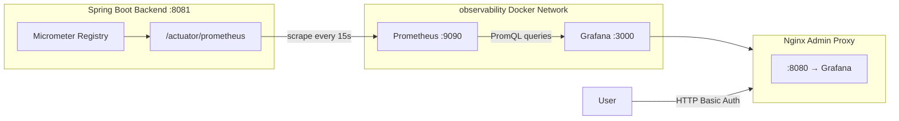

# Prometheus & Grafana — Metrics & Dashboards

> **Category:** Observability | **Difficulty Range:** 🟢 Basic → ⚫ Expert

---

## Introduction

DevOps Suite uses a self-hosted **Prometheus + Grafana** observability stack to provide full visibility into application performance, JVM health, and business-level metrics. Prometheus scrapes metrics from the Spring Boot backend every 15 seconds. Grafana visualizes them across two auto-provisioned dashboards. Both are protected behind the Nginx admin proxy with HTTP Basic Auth.

---

## Section 1: Architecture Overview



### Component Responsibilities

| Component | Role | Port | Host Exposed? |
|---|---|---|---|
| Spring Actuator `/actuator/prometheus` | Metrics endpoint (Micrometer) | 8081 | No (internal) |
| Prometheus | Pull-based metrics scraper & TSDB | 9090 | No (internal) |
| Grafana | Visualization, dashboards, alerting | 3000 | No (via proxy) |
| Nginx Admin Proxy | HTTP Basic Auth gateway | 8080 | ✅ Yes |

---

## Section 2: Prometheus Configuration

### `config/prometheus/prometheus.yml`

```yaml
global:
  scrape_interval: 15s          # How often to scrape targets
  evaluation_interval: 15s      # How often to evaluate alerting rules
  scrape_timeout: 10s           # Per-scrape timeout

scrape_configs:
  - job_name: 'devopssuite-backend'
    metrics_path: '/actuator/prometheus'
    scrape_interval: 15s
    static_configs:
      - targets: ['backend:8081']    # Service name on Docker observability network
        labels:
          environment: 'production'
          service: 'devopssuite'
```

### Prometheus Data Model

Every metric has:
- **Metric name:** e.g. `http_server_requests_seconds_count`
- **Labels (dimensions):** key-value pairs e.g. `{uri="/api/v1/projects", method="GET", status="200"}`
- **Value:** a float64 number
- **Timestamp:** millisecond epoch

**Prometheus data types:**

| Type | Description | Example |
|---|---|---|
| Counter | Monotonically increasing | `devopssuite_code_executions_total` |
| Gauge | Can go up or down | `devopssuite_active_users` |
| Histogram | Distribution of values with buckets | `http_server_requests_seconds` |
| Summary | Client-side computed quantiles | (rarely used in Spring) |

---

## Section 3: Spring Boot Actuator & Micrometer Integration

### 🟢 Basic: How Metrics Flow

**Q: How does Spring Boot expose Prometheus metrics?**

**A:** The flow is:
1. **Micrometer** — Spring Boot's metrics facade, similar to SLF4J for logging
2. **Prometheus Micrometer registry** — Micrometer implementation that formats metrics in Prometheus text format
3. **Spring Actuator** — Exposes the registry via `/actuator/prometheus` endpoint

```yaml
# application.yml
management:
  endpoints:
    web:
      exposure:
        include: "health,prometheus"
  metrics:
    export:
      prometheus:
        enabled: true
    tags:
      application: devopssuite   # Added to all metrics as a label
```

**Dependencies (pom.xml):**
```xml
<dependency>
    <groupId>org.springframework.boot</groupId>
    <artifactId>spring-boot-starter-actuator</artifactId>
</dependency>
<dependency>
    <groupId>io.micrometer</groupId>
    <artifactId>micrometer-registry-prometheus</artifactId>
</dependency>
```

---

### 🟡 Intermediate: Auto-Collected JVM Metrics

Spring Boot auto-configures dozens of JVM metrics out of the box:

| Metric | Description | Alert Rule |
|---|---|---|
| `jvm_memory_used_bytes{area="heap"}` | Heap memory usage | > 80% of max |
| `jvm_gc_pause_seconds` | GC pause duration histogram | p99 > 500ms |
| `jvm_threads_live_threads` | Active thread count | > 500 threads |
| `system_cpu_usage` | Process CPU % (0.0–1.0) | > 0.8 sustained |
| `hikaricp_connections_active` | DB connections in use | > 90% of pool |
| `process_uptime_seconds` | Time since JVM start | Sudden drop = restart |
| `http_server_requests_seconds` | HTTP request histogram | p99 > 1s, error rate > 1% |

---

## Section 4: Grafana Dashboards

### Auto-Provisioning via Filesystem

Grafana dashboards and datasources are provisioned automatically at container startup from files in `config/grafana/provisioning/`:

```
config/grafana/provisioning/
├── datasources/
│   └── prometheus.yml        # Configures Prometheus as default datasource
└── dashboards/
    ├── dashboards.yml        # Tells Grafana to scan /etc/grafana/dashboards/
    ├── devopssuite-overview.json
    └── devopssuite-jvm.json
```

**`datasources/prometheus.yml`:**
```yaml
apiVersion: 1
datasources:
  - name: Prometheus
    type: prometheus
    url: http://prometheus:9090    # Internal Docker network name
    access: proxy
    isDefault: true
```

**`dashboards/dashboards.yml`:**
```yaml
apiVersion: 1
providers:
  - name: 'DevOps Suite Dashboards'
    folder: 'DevOps Suite'
    type: file
    options:
      path: /etc/grafana/dashboards
      foldersFromFilesStructure: true
```

### Dashboard 1: Application Overview (uid: `devopssuite-overview`)

**Panels and their PromQL:**

```promql
# HTTP Request Rate (requests/second)
rate(http_server_requests_seconds_count{application="devopssuite"}[1m])

# HTTP Error Rate (4xx+5xx %)
sum(rate(http_server_requests_seconds_count{status=~"4..|5.."}[1m]))
/
sum(rate(http_server_requests_seconds_count[1m])) * 100

# p95 Latency
histogram_quantile(0.95,
  sum by (le) (rate(http_server_requests_seconds_bucket[5m]))
)

# Active Users (custom metric)
devopssuite_active_users

# Code Executions per minute by language
rate(devopssuite_code_executions_total[1m])

# Rate limit blocks per minute
rate(devopssuite_rate_limit_blocked_total[1m])
```

### Dashboard 2: JVM & System (uid: `devopssuite-jvm`)

```promql
# Heap memory usage %
jvm_memory_used_bytes{area="heap"} / jvm_memory_max_bytes{area="heap"} * 100

# GC pause time rate
rate(jvm_gc_pause_seconds_sum[1m])

# HikariCP active connections
hikaricp_connections_active{pool="HikariPool-1"}

# Thread count trend
jvm_threads_live_threads

# CPU usage
system_cpu_usage * 100
```

---

## Section 5: Interview Q&A

### 🟢 Basic

**Q: What is the difference between Prometheus and Grafana?**

**A:** 
- **Prometheus** is a time-series database (TSDB) and scraping engine. It actively pulls (`scrapes`) metrics from target endpoints at fixed intervals, stores them, and provides PromQL for querying.
- **Grafana** is a visualization layer. It connects to Prometheus (and other datasources) and renders metrics as dashboards, graphs, and alerts. Grafana does not store data.

They're complementary: Prometheus collects and stores, Grafana displays and alerts.

---

**Q: How does Prometheus know which endpoints to scrape?**

**A:** Prometheus reads its `prometheus.yml` config file at startup. The `scrape_configs` section defines `targets` (host:port pairs) and the `metrics_path` (defaults to `/metrics`, overridden to `/actuator/prometheus` for Spring Boot). In Docker Compose, services resolve by container name (`backend:8081`).

---

### 🟡 Intermediate

**Q: What is PromQL and how do you calculate request error rate?**

**A:** PromQL (Prometheus Query Language) is a functional query language for time-series data. Key functions:

- `rate(counter[5m])` — per-second average increase rate over 5 minutes
- `sum by (label)` — aggregate across label dimensions
- `histogram_quantile(0.95, ...)` — compute p95 from histogram buckets

**Error rate calculation:**
```promql
# Error rate as percentage
(
  sum(rate(http_server_requests_seconds_count{status=~"5.."}[5m]))
  /
  sum(rate(http_server_requests_seconds_count[5m]))
) * 100
```

---

**Q: Why is Prometheus a "pull" model instead of "push"? What are the trade-offs?**

**A:**

| Aspect | Pull (Prometheus) | Push (StatsD, Graphite, Datadog) |
|---|---|---|
| Service discovery | Prometheus controls scrape schedule | Services must know where to push |
| Firewall friendly | Prometheus needs to reach services | Services push outward (easier) |
| Metrics freshness | Fixed scrape interval (15s) | Sub-second metrics possible |
| Overload protection | Scrape rate controlled centrally | Push storms can flood receiver |
| Short-lived jobs | Need `pushgateway` bridge | Native support |

**Prometheus pull model advantages:**
- Centralized control of scrape rate prevents thundering-herd metric storms
- Service doesn't need to know its monitoring endpoint
- Easier to detect service death (missing scrapes)

**Prometheus pull disadvantages:**
- Short-lived jobs (batch executions) must use `PushGateway` or be long-running

---

### 🔴 Advanced

**Q: How do you set up alerting in Prometheus and Grafana?**

**A:** Two-layer alerting approach:

**Layer 1 — Prometheus Alerting Rules (`alert.rules.yml`):**
```yaml
groups:
  - name: devopssuite.rules
    rules:
      - alert: HighErrorRate
        expr: |
          (sum(rate(http_server_requests_seconds_count{status=~"5.."}[5m]))
          / sum(rate(http_server_requests_seconds_count[5m]))) > 0.05
        for: 2m
        labels:
          severity: critical
        annotations:
          summary: "High HTTP error rate: {{ $value | humanizePercentage }}"
          description: "Error rate > 5% for 2+ minutes"

      - alert: HikariPoolSaturation
        expr: hikaricp_connections_active / hikaricp_connections_max > 0.9
        for: 1m
        labels:
          severity: warning
        annotations:
          summary: "HikariCP connection pool > 90% full"
```

**Layer 2 — Grafana Alert Rules (contact points → Slack/PagerDuty):**
Grafana's unified alerting can evaluate PromQL directly and notify via webhooks, Slack channels, or email using configured **Contact Points**.

---

### ⚫ Expert

**Q: What is metric cardinality and how can high cardinality break Prometheus?**

**A:** **Cardinality** = the total number of unique time series = unique combinations of all label values.

**Problem:** If you add a high-cardinality label like `user_id` or `request_id` to a metric, Prometheus must store and index a separate time series per unique value:

```java
// ❌ DANGEROUS - cardinality explosion (millions of user_ids)
counter.tags("user_id", userId.toString()).increment();

// ✅ SAFE - bounded cardinality (only 4 languages)
counter.tags("language", language.name()).increment();
```

**In DevOps Suite's AppMetrics:**
- `devopssuite_code_executions_total{language, status}` — ✅ bounded (4 × 5 = 20 series max)
- `devopssuite_cache_hits_total{cache}` — ✅ bounded (small number of cache names)
- `devopssuite_rate_limit_blocked_total{endpoint}` — ✅ bounded (known endpoints)

**Warning signs of cardinality explosion:**
- Prometheus memory usage grows unboundedly
- `prometheus_tsdb_head_series` metric exceeds millions
- Queries become progressively slower

**Defense:** Use `metric_relabel_configs` in Prometheus scrape config to drop high-cardinality labels before storage.

---

## Quick Reference

| Item | Value |
|---|---|
| Scrape interval | 15 seconds |
| Metrics endpoint | `GET /actuator/prometheus` |
| Prometheus internal port | 9090 |
| Grafana internal port | 3000 |
| Grafana host access | `:8080` via Nginx Basic Auth |
| Dashboard 1 | DevOps Suite — Application Overview (`devopssuite-overview`) |
| Dashboard 2 | DevOps Suite — JVM & System (`devopssuite-jvm`) |
| Provisioning path | `config/grafana/provisioning/` |
| Key PromQL for error rate | `rate(...{status=~"5.."}[5m])` |
| Custom metrics class | `AppMetrics.java` (6 metrics) |


---

## Section 6: Alerting & SLOs

### Defining SLOs (Service Level Objectives)

DevOps Suite targets these SLOs for production readiness:

| SLO | Target | Measurement |
|---|---|---|
| API Availability | 99.9% (8.7 hrs downtime/year) | `1 - (error_rate)` over 30-day window |
| API p99 Latency | < 1 second | `histogram_quantile(0.99, ...)` |
| Code Execution Success Rate | > 95% | `completed / total` executions |
| DB Connection Pool | < 80% saturation | `hikaricp_connections_active / max` |

**Alert rule for availability SLO breach:**
```yaml
- alert: AvailabilitySLOBreach
  expr: |
    (
      1 - (
        sum(rate(http_server_requests_seconds_count{status=~"5.."}[5m]))
        / sum(rate(http_server_requests_seconds_count[5m]))
      )
    ) < 0.999
  for: 5m
  labels:
    severity: critical
  annotations:
    summary: "Availability SLO breached — below 99.9%"
```

---

## Section 7: Pull-Based Scraping Deep Dive

### 🟡 Why Prometheus Uses Pull Instead of Push

Most monitoring systems (Datadog agent, StatsD, Graphite) use a **push** model — the application sends metrics to a central collector. Prometheus is unusual in using a **pull** (scrape) model.

**Pull model advantages in DevOps Suite's context:**

1. **Centralized control:** Prometheus decides when and how often to scrape. If the backend is flooded, you can lower the scrape rate without changing the application.
2. **Health detection:** If a scrape times out, Prometheus immediately knows the target is unhealthy — this isn't possible with push (silence could mean "working fine" or "crashed").
3. **No application-side batching needed:** The application just exposes a `/metrics` endpoint. Prometheus handles the polling.
4. **Simpler security:** Only Prometheus needs network access to `backend:8081/actuator/prometheus`, not the reverse.

**Pull model disadvantages:**
- Short-lived jobs (a 5-second batch process) may finish before Prometheus scrapes them. Solution: `PushGateway` — the job pushes to a gateway, Prometheus scrapes the gateway.
- Requires Prometheus to be able to reach all targets (can be tricky in multi-cloud or heavily firewalled environments).

---

## Section 8: Grafana Variables & Templating

### Dynamic Dashboard Variables

The DevOps Suite Application Overview dashboard uses Grafana template variables to allow filtering by time range and environment:

```
Variable: $interval     → Values: 1m, 5m, 15m, 1h
Variable: $environment  → Query: label_values(devopssuite_active_users, environment)
```

**Variable usage in panels:**
```promql
# Uses $interval variable for dynamic time range
rate(devopssuite_code_executions_total[$interval])

# Uses $environment variable for multi-environment filtering
devopssuite_active_users{environment="$environment"}
```

This allows a single dashboard JSON file to work across `development`, `staging`, and `production` environments without duplication.

---

## Section 9: Troubleshooting Common Issues

### 🟡 Prometheus Scrape Fails

**Symptoms:** `Up` metric = 0 for `devopssuite-backend` target in Prometheus Targets UI.

**Debugging steps:**
```bash
# 1. Check if backend actuator endpoint is accessible from Prometheus container
docker exec prometheus wget -qO- http://backend:8081/actuator/prometheus | head -20

# 2. Check Prometheus config syntax
docker exec prometheus promtool check config /etc/prometheus/prometheus.yml

# 3. Check Prometheus logs
docker logs prometheus --tail 50

# 4. Check backend is healthy first
curl http://localhost:8082/actuator/health
```

**Common causes:**
- Backend container not healthy yet (Prometheus scrapes before Spring Boot is ready)
- Network misconfiguration (`backend` not on `observability` Docker network)
- Actuator endpoint not exposed (`management.endpoints.web.exposure.include` missing `prometheus`)

### 🔴 Grafana Dashboard Shows "No Data"

**Steps:**
1. Verify Prometheus datasource is configured and reachable (`Configuration → Data Sources → Test`)
2. Check the time range (Grafana default is "Last 6 hours" — if the app just started, use "Last 5 minutes")
3. Run the PromQL directly in Prometheus UI (`localhost:9090/graph`) to confirm data exists
4. Verify metric names match — Micrometer converts dots to underscores in Prometheus format (`devopssuite.active.users` → `devopssuite_active_users`)

---

## Extended Q&A

### 🔴 Advanced

**Q: What is the difference between `rate()` and `irate()` in PromQL?**

**A:**
- `rate(counter[5m])` — per-second rate averaged over the entire 5-minute window. Smoother, less sensitive to spikes. Recommended for dashboards.
- `irate(counter[5m])` — per-second rate of the last two data points in the window. Very sensitive to spikes. Recommended for alerting rules where you want to catch sudden surges.

```promql
# Dashboard panel — smooth trend
rate(devopssuite_code_executions_total[5m])

# Alert rule — catch sudden spikes
irate(devopssuite_code_executions_total[1m]) > 10
```

**Q: How do you avoid alert fatigue from flapping alerts?**

**A:** Use the `for` clause in alert rules — Prometheus only fires the alert after the condition has been true for the specified duration:

```yaml
- alert: HighCPU
  expr: system_cpu_usage > 0.8
  for: 5m      # Must be > 80% for 5 continuous minutes before firing
```

Without `for`, a brief CPU spike from a GC pause would trigger and immediately resolve — generating noise. The `for` clause ensures only sustained problems alert.

### ⚫ Expert

**Q: How would you implement multi-tenant metrics isolation if DevOps Suite were a SaaS platform serving many organizations?**

**A:** Several approaches in increasing isolation:

1. **Label-based isolation:** Add `org_id` label to all metrics. Grafana users query with `{org_id="org-abc"}`. Problem: high cardinality if thousands of orgs.

2. **Prometheus federation:** Each org has its own Prometheus instance, a central "global" Prometheus federates aggregate metrics via `/federate` endpoint.

3. **Separate Prometheus per tenant:** Strongest isolation, highest operational cost.

4. **Thanos / Cortex / VictoriaMetrics:** Multi-tenant Prometheus-compatible backends designed for this use case. Thanos adds global query view, long-term storage in S3, and tenant isolation via label enforcement rules.

For DevOps Suite's current portfolio scope, single-tenant Prometheus is correct. SaaS multi-tenancy would be a V2 consideration requiring Thanos or Cortex.
