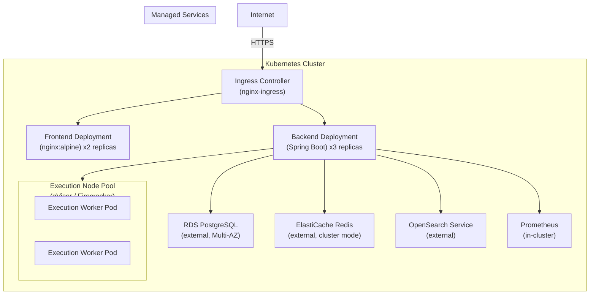

# Cloud Deployment & Kubernetes Production Architecture

> **Category:** Scalability | **Difficulty Range:** 🟢 Basic → ⚫ Expert

---

## Introduction

DevOps Suite currently runs on Docker Compose on a single server. This is suitable for development and small teams. Moving to production at scale requires cloud-native infrastructure: managed Kubernetes (GKE, EKS, or AKS), managed databases, auto-scaling, and hardened secrets management. This document maps every DevOps Suite component to its cloud equivalent and covers deployment architecture, Kubernetes manifests, and production hardening.

---

## Section 1: Component → Cloud Mapping

| DevOps Suite Component | Docker Compose | Cloud (AWS) | Cloud (GCP) |
|---|---|---|---|
| Frontend SPA | `frontend` container (Nginx) | S3 + CloudFront CDN | Cloud Storage + Cloud CDN |
| Backend Spring Boot | `backend` container | EKS (Fargate) or ECS | GKE Autopilot / Cloud Run |
| PostgreSQL | `postgres` container | RDS PostgreSQL (Multi-AZ) | Cloud SQL (HA) |
| Redis | `redis` container | ElastiCache Redis (Cluster) | Memorystore Redis |
| Elasticsearch | `elasticsearch` container | OpenSearch Service | Elastic Cloud on GCP |
| Prometheus | `prometheus` container | Amazon Managed Prometheus | GCP Managed Prometheus |
| Grafana | `grafana` container | Amazon Managed Grafana | Grafana Cloud |
| Kibana | `kibana` container | OpenSearch Dashboards | Elastic Cloud Kibana |
| Code Execution Engine | Backend Docker-in-Docker | Dedicated EKS node pool | GKE gVisor node pool |
| Secrets | `.env` file | AWS Secrets Manager + SSM | GCP Secret Manager |
| CI/CD | GitHub Actions | GitHub Actions + ECR | GitHub Actions + Artifact Registry |

---

## Section 2: Kubernetes Architecture



### Node Pool Strategy

| Node Pool | Instance Type | Purpose |
|---|---|---|
| `system` | n2-standard-2 | Ingress, CoreDNS, cluster ops |
| `application` | n2-standard-4 | Frontend + Backend pods |
| `execution` | n2-standard-8 with gVisor | Code execution workers (isolated) |

The execution pool runs **gVisor** (`runsc` runtime) providing OS-level syscall interception — stronger isolation than standard Docker namespaces. This separates untrusted user code from the main application tier.

---

## Section 3: Kubernetes Manifests

### Backend Deployment

```yaml
apiVersion: apps/v1
kind: Deployment
metadata:
  name: devopssuite-backend
  namespace: devopssuite
spec:
  replicas: 3
  selector:
    matchLabels:
      app: backend
  template:
    metadata:
      labels:
        app: backend
      annotations:
        prometheus.io/scrape: "true"
        prometheus.io/port: "8081"
        prometheus.io/path: "/actuator/prometheus"
    spec:
      terminationGracePeriodSeconds: 60   # Allow Spring graceful shutdown
      containers:
        - name: backend
          image: ghcr.io/your-org/devopssuite-backend:sha-abc123
          ports:
            - containerPort: 8081
          env:
            - name: DB_URL
              valueFrom:
                secretKeyRef:
                  name: devopssuite-secrets
                  key: db-url
            - name: JWT_SECRET
              valueFrom:
                secretKeyRef:
                  name: devopssuite-secrets
                  key: jwt-secret
            - name: REDIS_HOST
              valueFrom:
                configMapKeyRef:
                  name: devopssuite-config
                  key: redis-host
          resources:
            requests:
              cpu: "500m"
              memory: "512Mi"
            limits:
              cpu: "2000m"
              memory: "1Gi"
          livenessProbe:
            httpGet:
              path: /actuator/health/liveness
              port: 8081
            initialDelaySeconds: 30
            periodSeconds: 10
          readinessProbe:
            httpGet:
              path: /actuator/health/readiness
              port: 8081
            initialDelaySeconds: 20
            periodSeconds: 5
```

### Horizontal Pod Autoscaler (HPA)

```yaml
apiVersion: autoscaling/v2
kind: HorizontalPodAutoscaler
metadata:
  name: backend-hpa
  namespace: devopssuite
spec:
  scaleTargetRef:
    apiVersion: apps/v1
    kind: Deployment
    name: devopssuite-backend
  minReplicas: 2
  maxReplicas: 10
  metrics:
    - type: Resource
      resource:
        name: cpu
        target:
          type: Utilization
          averageUtilization: 70   # Scale when avg CPU > 70%
    - type: Resource
      resource:
        name: memory
        target:
          type: Utilization
          averageUtilization: 80
```

### Ingress

```yaml
apiVersion: networking.k8s.io/v1
kind: Ingress
metadata:
  name: devopssuite-ingress
  annotations:
    nginx.ingress.kubernetes.io/proxy-read-timeout: "3600"     # WebSocket keepalive
    nginx.ingress.kubernetes.io/proxy-send-timeout: "3600"
    nginx.ingress.kubernetes.io/proxy-set-headers: "devopssuite/ws-headers"
    cert-manager.io/cluster-issuer: "letsencrypt-prod"
spec:
  tls:
    - hosts: ["app.devopssuite.com"]
      secretName: devopssuite-tls
  rules:
    - host: app.devopssuite.com
      http:
        paths:
          - path: /api
            pathType: Prefix
            backend:
              service:
                name: devopssuite-backend
                port:
                  number: 8081
          - path: /ws
            pathType: Prefix
            backend:
              service:
                name: devopssuite-backend
                port:
                  number: 8081
          - path: /
            pathType: Prefix
            backend:
              service:
                name: devopssuite-frontend
                port:
                  number: 80
```

---

## Section 4: Secrets Management

### Why `.env` Files Don't Work in Production

`.env` files in a git repository → credentials exposed. In Docker Compose, secrets are passed as environment variables but appear in `docker inspect`. In Kubernetes, secrets are stored in etcd (should be encrypted at rest).

### AWS Secrets Manager Pattern

```yaml
# Backend fetches secrets at startup via AWS Secrets Manager
- name: DB_PASSWORD
  valueFrom:
    secretKeyRef:
      name: devopssuite-secrets    # k8s Secret, synced from AWS Secrets Manager
      key: db-password
```

**External Secrets Operator** syncs AWS Secrets Manager → Kubernetes Secrets:
```yaml
apiVersion: external-secrets.io/v1beta1
kind: ExternalSecret
metadata:
  name: devopssuite-secrets
spec:
  refreshInterval: 1h
  secretStoreRef:
    kind: ClusterSecretStore
    name: aws-secrets-manager
  target:
    name: devopssuite-secrets
  data:
    - secretKey: jwt-secret
      remoteRef:
        key: devopssuite/prod
        property: jwt_secret
    - secretKey: db-url
      remoteRef:
        key: devopssuite/prod
        property: db_url
```

---

## Section 5: Interview Q&A

### 🟢 Basic

**Q: What is Kubernetes and why would DevOps Suite need it?**

**A:** Kubernetes (K8s) is a container orchestration platform that automates deployment, scaling, and management of containerized applications. DevOps Suite would need it when:

1. **Traffic grows** beyond what one server can handle — K8s auto-scales pods horizontally
2. **High availability** is required — K8s reschedules failed pods automatically
3. **Zero-downtime deployments** — rolling updates replace pods one-by-one
4. **Resource isolation** — code execution workloads can run on dedicated node pools
5. **Multi-region** — K8s clusters in multiple zones/regions for disaster recovery

Docker Compose is single-host and has no built-in auto-scaling, self-healing, or rolling updates.

---

**Q: What is a Kubernetes Deployment vs a Pod?**

**A:**
- A **Pod** is the smallest deployable unit — one or more containers sharing a network namespace and storage
- A **Deployment** manages a set of identical Pods, ensuring a desired `replicas` count is maintained. If a Pod crashes, the Deployment creates a replacement.

In DevOps Suite, the backend `Deployment` with `replicas: 3` means Kubernetes keeps exactly 3 backend pods running at all times. If one pod dies, K8s automatically starts a new one.

---

### 🟡 Intermediate

**Q: How does HPA (Horizontal Pod Autoscaler) work and how do you tune it for DevOps Suite?**

**A:** HPA watches resource metrics (CPU, memory) via the Metrics Server and adjusts `replicas` count:

```
scale_up when:  currentMetricValue / targetMetricValue > 1.1
scale_down when: currentMetricValue / targetMetricValue < 0.9
```

**Tuning for DevOps Suite:**

- **CPU target 70%:** At 70% CPU average across pods, scale out. This leaves headroom for traffic spikes before new pods are fully ready.
- **Min replicas 2:** Always maintain 2 pods for basic availability (one can fail during updates)
- **Max replicas 10:** Cost cap; at 10 pods the bottleneck will move to the DB connection pool
- **Scale-down stabilization:** `scaleDown.stabilizationWindowSeconds: 300` prevents flapping during bursty traffic

**HPA limitation:** CPU is a lagging indicator for the code execution service. A custom metric (queue depth via Redis) would be a better scale trigger:
```yaml
metrics:
  - type: External
    external:
      metric:
        name: execution_queue_depth
      target:
        type: AverageValue
        averageValue: "5"    # Scale out when avg >5 executions queued per pod
```

---

### 🔴 Advanced

**Q: How do you handle WebSocket connections in Kubernetes with multiple backend replicas?**

**A:** This is a critical consideration for DevOps Suite's real-time features. The challenge:

1. A user's browser opens a STOMP WebSocket connection to `backend-pod-1`
2. Kubernetes routes the next request to `backend-pod-2`
3. `backend-pod-2` doesn't have the WebSocket connection — it can't send the notification

**Solutions:**

**Option 1 — Session Affinity (Sticky Sessions):**
```yaml
apiVersion: v1
kind: Service
spec:
  sessionAffinity: ClientIP
  sessionAffinityConfig:
    clientIP:
      timeoutSeconds: 10800    # 3 hours
```
Routes the same client IP to the same pod. Simple but loses affinity on pod restart.

**Option 2 — External STOMP Broker (Recommended for scale):**
Replace Spring's in-memory `SimpleBroker` with a **RabbitMQ STOMP broker relay**:
```java
// WebSocketConfig.java
@Override
public void configureMessageBroker(MessageBrokerRegistry config) {
    config.enableStompBrokerRelay("/topic", "/queue")
        .setRelayHost(rabbitmqHost)
        .setRelayPort(61613)
        .setClientLogin("user")
        .setClientPasscode("password");
}
```
Now `SimpMessagingTemplate.convertAndSend()` on `backend-pod-1` is received by `backend-pod-2`'s connected WebSocket clients via RabbitMQ routing.

---

### ⚫ Expert

**Q: How would you implement zero-downtime database schema migrations with Flyway when rolling-updating Kubernetes pods?**

**A:** Rolling updates create a window where **old pods (v1) and new pods (v2) run simultaneously**, both connecting to the same database. If V2's Flyway migration changes schema in a breaking way, V1 pods crash.

**Solution: Expand-Contract Pattern (Multi-Phase Migration)**

**Phase 1 — Expand (add, don't remove):**
```sql
-- V17__add_execution_priority.sql (deployed with v2)
ALTER TABLE execution_requests ADD COLUMN priority INTEGER DEFAULT 0;
-- V1 pods work fine — they ignore the new column
-- V2 pods use it
```

**Phase 2 — Contract (remove old, now safe):**
```sql
-- V18__remove_old_execution_column.sql (deployed with v3, weeks later)
ALTER TABLE execution_requests DROP COLUMN old_column;
-- By now, all v1 pods are gone
```

**Implementation steps:**
1. V2 code must handle both `priority=NULL` (old rows) and `priority=0` (new rows)
2. K8s rolling update: replaces pods one at a time, waiting for readiness probe
3. Monitor error rates in Grafana during the rollout
4. If migration fails, `flyway repair` cleans the `flyway_schema_history` checksum

**Additional safeguards:**
- Run Flyway migrations as a **Kubernetes Job** before the Deployment rollout begins
- Use `flyway.validateOnMigrate=true` in all pods to catch checksum mismatches early
- Set `terminationGracePeriodSeconds: 60` so pods drain in-flight requests before shutdown

---

## Quick Reference

| Item | Value |
|---|---|
| Recommended cloud platform | AWS EKS / GCP GKE |
| Min backend replicas | 2 (HA) |
| Max backend replicas (HPA) | 10 |
| HPA scale-up trigger | CPU > 70% average |
| Frontend deployment | S3 + CloudFront (static assets) |
| Database | RDS PostgreSQL Multi-AZ |
| Cache | ElastiCache Redis Cluster mode |
| Secrets management | AWS Secrets Manager + External Secrets Operator |
| Code execution isolation | gVisor node pool (stronger than standard Docker) |
| WebSocket scaling | RabbitMQ STOMP broker relay |
| Zero-downtime migrations | Expand-Contract pattern + Flyway Job |
| TLS | cert-manager + Let's Encrypt |


---

## Section 6: GitOps & Infrastructure as Code (IaC)

### Terraform Blueprint for AWS Architecture

Production deployments of DevOps Suite leverage Terraform modules for reproducible environment provisioning:

```hcl
module "vpc" {
  source  = "terraform-aws-modules/vpc/aws"
  version = "5.0.0"

  name = "devopssuite-vpc"
  cidr = "10.0.0.0/16"

  azs             = ["us-east-1a", "us-east-1b"]
  private_subnets = ["10.0.1.0/24", "10.0.2.0/24"]
  public_subnets  = ["10.0.101.0/24", "10.0.102.0/24"]

  enable_nat_gateway = true
  single_nat_gateway = true
}

module "eks" {
  source  = "terraform-aws-modules/eks/aws"
  version = "20.0.0"

  cluster_name    = "devopssuite-eks"
  cluster_version = "1.30"

  vpc_id     = module.vpc.vpc_id
  subnet_ids = module.vpc.private_subnets

  eks_managed_node_groups = {
    app_nodes = {
      min_size     = 2
      max_size     = 10
      desired_size = 3
      instance_types = ["t3.xlarge"]
    }
  }
}
```

### GitOps with ArgoCD

ArgoCD continuously monitors the git repository (`/k8s/manifests/`) and synchronizes cluster state, ensuring zero configuration drift between code and production infrastructure.
