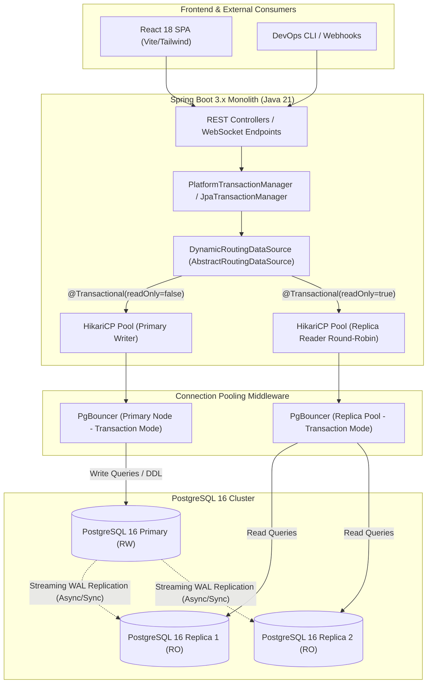
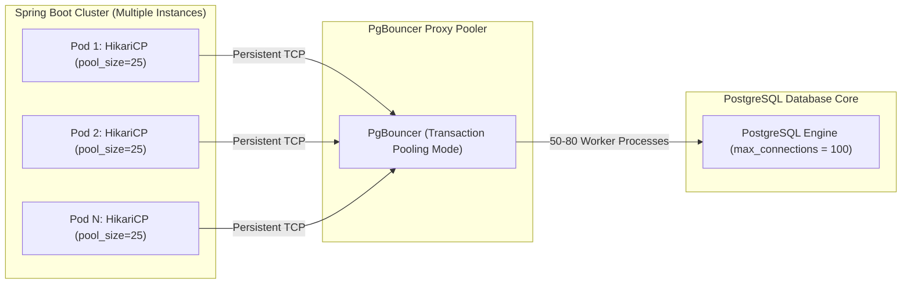
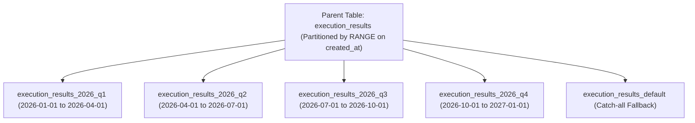
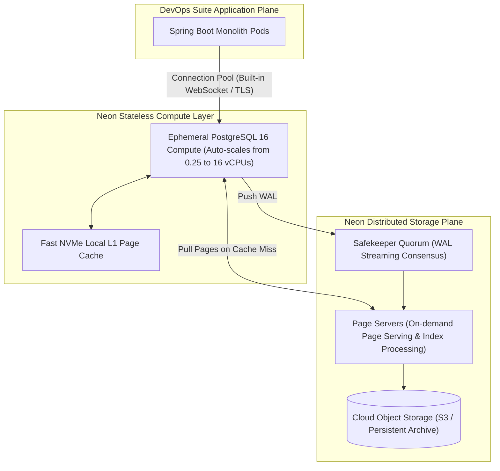
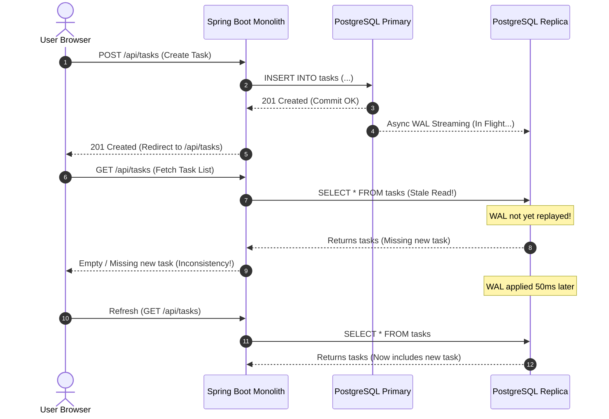
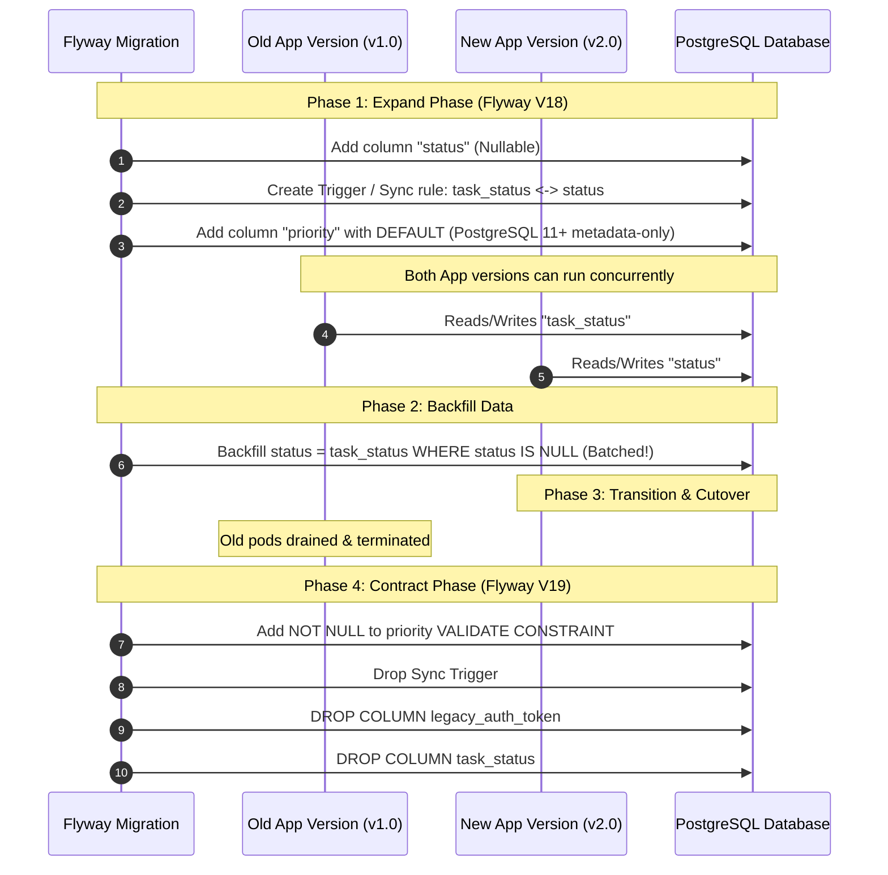
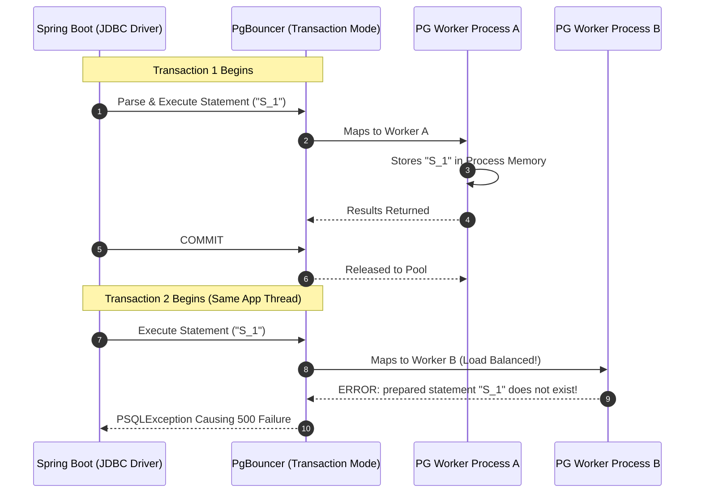
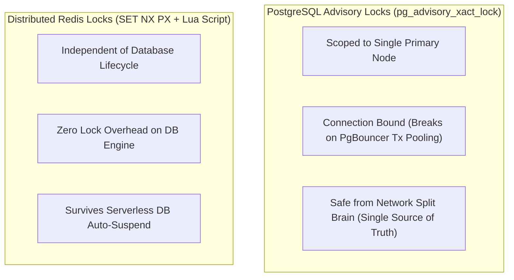

# Database Scaling Architecture & Strategies: PostgreSQL, Routing & High-Traffic Patterns

## 1. Executive Architectural Overview

In **DevOps Suite**, the backend persistence layer relies on PostgreSQL 16 (with Flyway database migrations V1 through V16). As a high-concurrency DevOps orchestrator handling continuous integration triggers, code execution runs, real-time telemetry, and enterprise task auditing, the relational database layer experiences severe asymmetric load profiles:
- **Read-to-Write Ratio**: Ranging from **10:1** to **50:1** during business hours, driven by dashboard monitoring, metrics aggregation, project listings, and live log polling over WebSockets.
- **Write Bursts**: Spikes during batch execution, multi-stage task automation, and execution result logging (thousands of telemetry checkpoints per minute).
- **Historical Accumulation**: Tables such as `task_audit_history` and `execution_results` accumulate tens of millions of rows per quarter, threatening query performance, index bloat, and `VACUUM` overhead.

To support high throughput, low latency, and 99.99% availability without prematurely fracturing the monolithic Spring Boot 3 architecture into distributed microservice databases, DevOps Suite adopts a multi-tiered database scalability roadmap:

```
+------------------------------------------------------------------------------------+
|                                 DevOps Suite Scaling                               |
+------------------------------------------------------------------------------------+
|  Tier 1: Read-Replica Topology + Dynamic Routing via AbstractRoutingDataSource     |
|  Tier 2: Dual Connection Pooling Topology (HikariCP App-Side + PgBouncer Server)    |
|  Tier 3: Declarative Range Partitioning on High-Churn Tables (Audit / Exec Logs)   |
|  Tier 4: Serverless PostgreSQL Architecture (Neon Compute/Storage Decoupling)       |
+------------------------------------------------------------------------------------+
```

---

## 2. PostgreSQL Primary-Replica Topology & Dynamic Routing

### 2.1 Read/Write Splitting Architecture

By offloading pure read workloads (e.g., project dashboards, system metrics queries, user privilege verification) to read replicas, the primary database instance dedicates its write-ahead log (WAL) engine, CPU, and disk I/O exclusively to transactional mutations (`INSERT`, `UPDATE`, `DELETE`, table locks).



---

### 2.2 Dynamic Routing via Spring Boot `AbstractRoutingDataSource`

Spring framework provides `org.springframework.jdbc.datasource.lookup.AbstractRoutingDataSource`, which resolves a target `DataSource` at runtime based on a lookup key bound to a `ThreadLocal` context.

#### 2.2.1 Routing Context & Target Keys

```java
package com.devopssuite.core.datasource;

public enum DataSourceType {
    PRIMARY,
    REPLICA
}
```

```java
package com.devopssuite.core.datasource;

public final class DataSourceContextHolder {

    private static final ThreadLocal<DataSourceType> CONTEXT = new ThreadLocal<>();

    private DataSourceContextHolder() {}

    public static void setDataSourceType(DataSourceType dataSourceType) {
        if (dataSourceType == null) {
            throw new IllegalArgumentException("DataSourceType cannot be null");
        }
        CONTEXT.set(dataSourceType);
    }

    public static DataSourceType getDataSourceType() {
        return CONTEXT.get();
    }

    public static void clear() {
        CONTEXT.remove();
    }
}
```

#### 2.2.2 Routing Data Source Implementation

```java
package com.devopssuite.core.datasource;

import org.springframework.jdbc.datasource.lookup.AbstractRoutingDataSource;

public class TransactionRoutingDataSource extends AbstractRoutingDataSource {

    @Override
    protected Object determineCurrentLookupKey() {
        DataSourceType dataSourceType = DataSourceContextHolder.getDataSourceType();
        // Fallback to PRIMARY if not explicitly set
        return dataSourceType != null ? dataSourceType : DataSourceType.PRIMARY;
    }
}
```

#### 2.2.3 Transaction-Aware Routing Interceptor

To eliminate manual routing code, Spring's `@Transactional(readOnly = true)` status is intercepted. When a transaction is marked `readOnly = true`, the context routes queries to the `REPLICA` data source; otherwise, it directs calls to `PRIMARY`.

> [!IMPORTANT]
> In Spring Data JPA with Hibernate, the physical JDBC connection is fetched at the **start** of the transaction boundary. Therefore, switching the lookup key inside the method body has no effect. The routing decision must occur prior to opening the connection.

```java
package com.devopssuite.core.datasource;

import org.aspectj.lang.ProceedingJoinPoint;
import org.aspectj.lang.annotation.Around;
import org.aspectj.lang.annotation.Aspect;
import org.springframework.core.Ordered;
import org.springframework.core.annotation.Order;
import org.springframework.stereotype.Component;
import org.springframework.transaction.annotation.Transactional;

@Aspect
@Component
@Order(Ordered.HIGHEST_PRECEDENCE) // Must execute before @Transactional opens the connection
public class ReadOnlyRouteAspect {

    @Around("@annotation(transactional)")
    public Object routeDataSource(ProceedingJoinPoint joinPoint, Transactional transactional) throws Throwable {
        boolean isReadOnly = transactional.readOnly();
        try {
            if (isReadOnly) {
                DataSourceContextHolder.setDataSourceType(DataSourceType.REPLICA);
            } else {
                DataSourceContextHolder.setDataSourceType(DataSourceType.PRIMARY);
            }
            return joinPoint.proceed();
        } finally {
            DataSourceContextHolder.clear();
        }
    }
}
```

#### 2.2.4 DataSource Configuration with LazyConnectionDataSourceProxy

To ensure that Spring defers obtaining a physical database connection until the first SQL statement is actually executed, the `TransactionRoutingDataSource` must be wrapped in `LazyConnectionDataSourceProxy`. Without this proxy, Spring's `JpaTransactionManager` eagerly acquires a connection before the transaction aspect executes, causing read-only routing to default prematurely to the primary data source.

```java
package com.devopssuite.core.datasource;

import com.zaxxer.hikari.HikariConfig;
import com.zaxxer.hikari.HikariDataSource;
import org.springframework.beans.factory.annotation.Qualifier;
import org.springframework.boot.context.properties.ConfigurationProperties;
import org.springframework.context.annotation.Bean;
import org.springframework.context.annotation.Configuration;
import org.springframework.context.annotation.Primary;
import org.springframework.jdbc.datasource.LazyConnectionDataSourceProxy;

import javax.sql.DataSource;
import java.util.HashMap;
import java.util.Map;

@Configuration
public class DataSourceConfiguration {

    @Bean
    @ConfigurationProperties("spring.datasource.primary.hikari")
    public HikariConfig primaryHikariConfig() {
        return new HikariConfig();
    }

    @Bean
    @ConfigurationProperties("spring.datasource.replica.hikari")
    public HikariConfig replicaHikariConfig() {
        return new HikariConfig();
    }

    @Bean(name = "primaryDataSource")
    public DataSource primaryDataSource() {
        return new HikariDataSource(primaryHikariConfig());
    }

    @Bean(name = "replicaDataSource")
    public DataSource replicaDataSource() {
        return new HikariDataSource(replicaHikariConfig());
    }

    @Bean(name = "routingDataSource")
    public DataSource routingDataSource(
            @Qualifier("primaryDataSource") DataSource primaryDataSource,
            @Qualifier("replicaDataSource") DataSource replicaDataSource) {

        TransactionRoutingDataSource routingDataSource = new TransactionRoutingDataSource();
        Map<Object, Object> dataSourceMap = new HashMap<>();
        dataSourceMap.put(DataSourceType.PRIMARY, primaryDataSource);
        dataSourceMap.put(DataSourceType.REPLICA, replicaDataSource);

        routingDataSource.setTargetDataSources(dataSourceMap);
        routingDataSource.setDefaultTargetDataSource(primaryDataSource);
        routingDataSource.afterPropertiesSet();

        return routingDataSource;
    }

    @Primary
    @Bean(name = "dataSource")
    public DataSource dataSource(@Qualifier("routingDataSource") DataSource routingDataSource) {
        // Essential: Lazy fetch ensures the aspect resolves the lookup key BEFORE physical connection acquisition
        return new LazyConnectionDataSourceProxy(routingDataSource);
    }
}
```

---

## 3. High-Scale Connection Pooling: PgBouncer vs. HikariCP

In high-concurrency environments, application-level connection pooling alone is insufficient for PostgreSQL due to its process-per-connection architecture.

### 3.1 PostgreSQL Process-Per-Connection Cost

Unlike MySQL or Microsoft SQL Server (which allocate a lightweight thread per connection), PostgreSQL spawns a separate Unix process (`fork()`) for every incoming client connection.
- Each backend worker process consumes between **5 MB and 20 MB** of system RAM (shared memory handles, cache buffers, catalog caches).
- Managing 2,000 idle connections consumes **10 GB to 40 GB** of RAM purely for connection maintenance.
- Context switching between thousands of operating system processes leads to CPU starvation, L1/L2 cache invalidation, and severe lock contention on PostgreSQL internal spinlocks.

### 3.2 Dual-Tier Pooling: HikariCP + PgBouncer

To solve this, DevOps Suite utilizes a dual-tier connection pooling model:
1. **Tier 1 (Application Pool - HikariCP)**: Runs within the Spring Boot JVM. Maintains an ultra-fast, local pool of pre-warmed TCP sockets (e.g., 20 to 50 connections per instance) with near-zero latency, thread-level caching, and connection leak detection.
2. **Tier 2 (Database Proxy Pool - PgBouncer)**: Sits directly in front of the PostgreSQL server. Consolidates thousands of incoming application connections into a small pool (e.g., 50 to 100) of true PostgreSQL backend processes.



### 3.3 PgBouncer Pooling Modes & Hibernate Pitfalls

| Feature / Metric | Session Pooling | Transaction Pooling (DevOps Suite Standard) | Statement Pooling |
| :--- | :--- | :--- | :--- |
| **Server Connection Reassignment** | When client disconnects completely | As soon as transaction finishes (`COMMIT` / `ROLLBACK`) | After every single SQL statement |
| **Connection Multiplexing Ratio** | 1:1 (Limited scaling benefit) | **10:1 to 50:1** (Maximum efficiency) | 100:1 (Breaks multi-statement logic) |
| **`SET` / Variable Assignments** | Supported (persists for session) | Reset required via `DISCARD ALL` or `DISCARD TEMP` | Broken |
| **Named Prepared Statements** | Supported natively | Breaks unless `server_reset_query` or PgBouncer 1.21+ prepared statements enabled | Completely broken |
| **Hibernate Advisory Locks / L2 Cache** | Supported | Requires caution with session-scoped state | Incompatible |
| **Spring Compatibility** | 100% compatible | **Compatible with proper JDBC flags** | Incompatible with Spring transactions |

#### Critical Spring Boot / PostgreSQL JDBC Driver Configuration for Transaction Pooling:

When utilizing PgBouncer in **Transaction Pooling** mode, client sessions do not hold the same backend PostgreSQL connection between queries. Named prepared statements will trigger errors like `prepared statement "S_1" does not exist`.

The application's `application.yml` configures the PostgreSQL JDBC driver to disable named server-side prepared statements or use unnamed statements:

```yaml
spring:
  datasource:
    primary:
      hikari:
        jdbc-url: jdbc:postgresql://pgbouncer-primary:6432/devopssuitedb?prepareThreshold=0&preparedStatementCacheQueries=0
        username: devops_app
        password: ${DB_PRIMARY_PASSWORD}
        maximum-pool-size: 30
        minimum-idle: 10
        idle-timeout: 300000
        max-lifetime: 1800000
        connection-timeout: 20000
        pool-name: DevOpsPrimaryHikariPool
    replica:
      hikari:
        jdbc-url: jdbc:postgresql://pgbouncer-replica:6432/devopssuitedb?prepareThreshold=0&preparedStatementCacheQueries=0
        username: devops_ro
        password: ${DB_REPLICA_PASSWORD}
        maximum-pool-size: 50
        minimum-idle: 20
        idle-timeout: 300000
        max-lifetime: 1800000
        connection-timeout: 10000
        pool-name: DevOpsReplicaHikariPool
```

> [!TIP]
> Setting `prepareThreshold=0` instructs the PostgreSQL JDBC driver to use the unnamed protocol statement (`""`), which executes cleanly across transaction-pooling proxies without session state bleed.

---

## 4. Declarative Range Partitioning Strategy

In DevOps Suite, audit tracking and automated execution results experience monotonically increasing, append-heavy data volume.
- `task_audit_history`: Records state transitions, payload diffs, actor IDs, and timestamps.
- `execution_results`: Records code sandbox stdout, stderr, exit codes, and resource metrics.

Without partitioning:
1. Indexes (`idx_audit_created_at`, `idx_exec_task_id`) exceed available RAM (exceeding `shared_buffers`).
2. Autovacuum processes consume massive disk I/O scanning multi-gigabyte heap files to clear dead tuples.
3. Cold data retention purges (`DELETE FROM execution_results WHERE created_at < NOW() - INTERVAL '180 days'`) trigger table locks, generate huge WAL volumes, and fragment table storage.

### 4.1 Native PostgreSQL 16 Range Partitioning

PostgreSQL 16 provides native declarative partitioning with partition pruning during query planning and execution.



### 4.2 Flyway DDL Implementation: V17__partition_audit_and_execution_tables.sql

```sql
-- Migration: V17__partition_audit_and_execution_tables.sql
-- Description: Convert execution_results to Declarative Range Partitioning by created_at

-- Step 1: Create new partitioned master table
CREATE TABLE execution_results_partitioned (
    id UUID NOT NULL,
    task_id UUID NOT NULL,
    project_id UUID NOT NULL,
    exit_code INT NOT NULL,
    stdout TEXT,
    stderr TEXT,
    execution_time_ms BIGINT NOT NULL,
    memory_peak_bytes BIGINT,
    cpu_usage_pct NUMERIC(5,2),
    status VARCHAR(32) NOT NULL,
    created_at TIMESTAMPTZ NOT NULL,
    CONSTRAINT pk_execution_results PRIMARY KEY (id, created_at)
) PARTITION BY RANGE (created_at);

-- Notice: In PostgreSQL partitioned tables, any unique constraint or PRIMARY KEY
-- must include all columns in the partition key.

-- Step 2: Create Quarterly Range Partitions for 2026
CREATE TABLE execution_results_y2026m01_m03 PARTITION OF execution_results_partitioned
    FOR VALUES FROM ('2026-01-01 00:00:00+00') TO ('2026-04-01 00:00:00+00');

CREATE TABLE execution_results_y2026m04_m06 PARTITION OF execution_results_partitioned
    FOR VALUES FROM ('2026-04-01 00:00:00+00') TO ('2026-07-01 00:00:00+00');

CREATE TABLE execution_results_y2026m07_m09 PARTITION OF execution_results_partitioned
    FOR VALUES FROM ('2026-07-01 00:00:00+00') TO ('2026-10-01 00:00:00+00');

CREATE TABLE execution_results_y2026m10_m12 PARTITION OF execution_results_partitioned
    FOR VALUES FROM ('2026-10-01 00:00:00+00') TO ('2027-01-01 00:00:00+00');

-- Catch-all Default Partition
CREATE TABLE execution_results_default PARTITION OF execution_results_partitioned DEFAULT;

-- Step 3: Local Indexes on each partition
CREATE INDEX idx_exec_results_task_date ON execution_results_partitioned (task_id, created_at DESC);
CREATE INDEX idx_exec_results_project_date ON execution_results_partitioned (project_id, created_at DESC);

-- Step 4: Swap tables atomically
ALTER TABLE execution_results RENAME TO execution_results_old;
ALTER TABLE execution_results_partitioned RENAME TO execution_results;
```

### 4.3 Retention Management: Instant Purging via `DROP TABLE`

Instead of running long, transactionally destructive `DELETE` queries that cause index bloat and autovacuum lag:

```sql
-- SLOW, DESTRUCTIVE PURGE (DO NOT USE AT SCALE):
-- DELETE FROM execution_results WHERE created_at < '2025-01-01'; -- Generates huge WAL, locks rows, fragments disk

-- FAST ZERO-DOWNTIME METADATA-ONLY PURGE (PARTITIONING):
ALTER TABLE execution_results DETACH PARTITION execution_results_y2025m01_m03 CONCURRENTLY;
DROP TABLE execution_results_y2025m01_m03; -- Executes in milliseconds, instantly releases disk blocks to OS
```

---

## 5. Serverless PostgreSQL Transition: Architecture & Benefits (Neon)

As DevOps Suite transitions to cloud-native managed infrastructure, migrating traditional monolithic PostgreSQL deployments (Amazon RDS or self-hosted EC2 nodes) to a serverless architecture like **Neon** introduces significant architectural advantages.

### 5.1 Architecture: Compute and Storage Separation

Neon separates PostgreSQL's compute tier from its storage engine:
1. **Stateless Compute (Custom PostgreSQL Server)**: Runs in lightweight containers. Executes SQL queries, optimizes query plans, manages local memory cache (`shared_buffers`).
2. **Page Server & Safekeeper (Storage Engine)**: Distributed storage layer. Replaces the standard Unix filesystem with an object-backed storage architecture (similar to AWS Aurora / Google AlloyDB). 
3. **Log-Structured WAL**: Write-Ahead Logs are immediately offloaded to Safekeeper nodes that achieve distributed consensus before writing to S3-compatible cloud storage.



### 5.2 Key Technical Advantages for DevOps Suite

1. **Auto-Suspend and Instant Wake-Up (Scale to Zero)**:
   - Development, staging, and preview environments automatically spin down to 0 vCPUs after 5 minutes of inactivity, reducing cloud infrastructure spend.
   - Incoming traffic triggers compute warm-up within **500 to 1,500 milliseconds**.
2. **Instant Copy-on-Write Database Branching**:
   - In DevOps Suite CI/CD pipelines, engineers run end-to-end integration test suites against realistic production-sized datasets.
   - Neon branches the entire multi-gigabyte production database in **under 2 seconds** via metadata copy-on-write pointers without duplicating underlying physical data blocks.
   - Tests execute against isolated branches and are destroyed immediately upon pipeline completion.
3. **Built-in Serverless Connection Pooling**:
   - Neon provides a managed PgBouncer layer accessible via connection string suffixes (`-pooler`), reducing infrastructure maintenance overhead for the platform engineering team.

---

## 6. Comprehensive Interview Q&A (🟢 to ⚫)

### Question 1: Replication Lag and Read-After-Write Consistency
**Difficulty**: 🟢 Basic to 🟡 Intermediate  
**Category**: Data Consistency & Distributed Persistence

#### The Interview Scenario
> *"You deploy a PostgreSQL primary node with two asynchronous read replicas. A user creates a new task in DevOps Suite and clicks 'Submit'. The browser triggers an `HTTP POST /api/tasks`, which inserts the task on the primary node and redirects to the task list view (`HTTP GET /api/tasks`). The user complains that the newly created task does not appear on the screen, but when they refresh the browser three seconds later, it appears. What is the root cause, and how do you fix it?"*

#### Architectural Answer
- **Root Cause**: **Replication Lag (Async WAL Delay)**. The `POST` request issues an `INSERT` against the `PRIMARY` database node. The write succeeds and commits. The immediate subsequent `GET` request is routed via `@Transactional(readOnly = true)` to a `REPLICA` node. Because PostgreSQL streaming replication is asynchronous by default, the replica has not yet applied the corresponding WAL record. The replica executes the `SELECT` query against a stale snapshot of the table.



#### Remediation Strategies
1. **Sticky Routing / Read-Your-Own-Writes Window via Redis or Session Cookie**:
   - When a user performs a write operation, record a timestamp or sequence flag in their session or in a fast Redis cache key: `user_write_lock:{userId} = System.currentTimeMillis()`.
   - In the `ReadOnlyRouteAspect`, if `user_write_lock:{userId}` was updated within the last **2 seconds**, force the connection routing to `PRIMARY`, bypassing the replica pool until the replication lag window has passed.
2. **PostgreSQL LSN (Log Sequence Number) Tracking**:
   - Capture the current commit LSN on the primary: `SELECT pg_current_wal_lsn();`.
   - Store this LSN in the user's thread context or HTTP header (`X-Database-LSN`).
   - Prior to replica query execution, verify that `pg_last_wal_replay_lsn() >= target_lsn`. If lagging, failover to primary or wait up to 50ms.
3. **Frontend Optimistic UI Update**:
   - The React 18 client optimistically inserts the created task into its local state (TanStack Query / Zustand cache), preventing an immediate round-trip read from hitting a stale replica.

---

### Question 2: Database Partitioning vs. Database Sharding
**Difficulty**: 🟡 Intermediate to 🔴 Advanced  
**Category**: Data Partitioning & Scale Strategy

#### The Interview Scenario
> *"At what point does table partitioning in PostgreSQL fail to scale, requiring the application to transition to horizontal database sharding? Compare their architectures, operational trade-offs, and explain how each affects cross-entity foreign keys and distributed transactions."*

#### Architectural Comparison

| Dimension | Declarative Partitioning (Vertical / In-Engine) | Horizontal Sharding (Application or Citus / Cockroach) |
| :--- | :--- | :--- |
| **Physical Topology** | Single database instance (or single primary node with shared storage/disk). Partitions exist as separate physical tables under the same engine. | Multiple autonomous database instances/nodes across different servers/clusters. |
| **Scaling Vector** | Scales **vertically** (optimizes I/O, cache utilization, index size, and maintenance operations like VACUUM). | Scales **horizontally** (scales write throughput, aggregate compute, and RAM across independent servers). |
| **Query Routing** | Executed transparently by the PostgreSQL query planner via **Partition Pruning**. | Handled by application routing logic or a distributed SQL coordinator (e.g., Citus coordinator node). |
| **Foreign Keys** | PostgreSQL 12+ supports foreign keys referencing partitioned tables, with constraints (foreign keys must reference partition keys). | Cross-shard foreign keys cannot be enforced by the database engine without costly distributed validation. |
| **Transaction ACID** | Native single-node ACID guarantees with standard WAL logging. Zero two-phase commit overhead. | Requires Distributed 2PC (Two-Phase Commit, Paxos, or Raft consensus), introducing latency and lock overhead. |
| **Bottleneck Point** | Single node primary CPU, write-ahead log write throughput, and single-disk write bandwidth. | Shard rebalancing, distributed query joins, distributed deadlocks, and cross-shard aggregations. |

#### Architectural Assessment
Partitioning is the preferred solution for **index bloat and data lifecycle retention** (e.g., archiving logs, trimming audit tables). Sharding is reserved for instances where write operations exceed the I/O capacity or hardware limits of the largest available enterprise primary node (e.g., exceeding 100,000 sustained write IOPS).

---

### Question 3: Zero-Downtime Database Migrations with Flyway
**Difficulty**: 🔴 Advanced  
**Category**: Continuous Delivery & Database Operations

#### The Interview Scenario
> *"DevOps Suite has 50 active container replicas running in production. You must rename the column `task_status` to `status` in the `tasks` table, drop an obsolete column `legacy_auth_token`, and add a `NOT NULL` constraint with a default value to `priority`. How do you execute this migration using Flyway without causing query failures, table locks, or deployment downtime?"*

#### Architectural Answer: The Expand-Contract (Parallel Run) Pattern
Executing destructive SQL alterations (`ALTER TABLE tasks RENAME COLUMN...` or `ALTER TABLE tasks ALTER COLUMN priority SET NOT NULL`) acquires an **`ACCESS EXCLUSIVE` lock** on the table. This lock blocks all concurrent `SELECT`, `INSERT`, `UPDATE`, and `DELETE` queries, causing cascading connection timeouts in the Spring Boot connection pool. Furthermore, old application instances will crash if they query a renamed column.

Zero-downtime database evolution requires a multi-phase **Expand-Contract Pattern**:



#### Step-by-Step Implementation

1. **Step 1: Adding a NOT NULL column with default value (PostgreSQL 11+)**:
   - In modern PostgreSQL (11+), adding a column with a constant default value (`ALTER TABLE tasks ADD COLUMN priority VARCHAR(16) DEFAULT 'MEDIUM' NOT NULL;`) does not rewrite the table. It updates metadata in `pg_attribute` in milliseconds without a prolonged table lock.

2. **Step 2: Safe Column Rename via Expand & Trigger**:
   - Instead of renaming directly, add the new column `status`:
     ```sql
     ALTER TABLE tasks ADD COLUMN status VARCHAR(32);
     ```
   - Deploy a PostgreSQL trigger to synchronize writes between `task_status` and `status` during the rollout window:
     ```sql
     CREATE OR REPLACE FUNCTION sync_task_status_col() RETURNS TRIGGER AS $$
     BEGIN
         IF NEW.status IS NULL THEN
             NEW.status := NEW.task_status;
         END IF;
         IF NEW.task_status IS NULL THEN
             NEW.task_status := NEW.status;
         END IF;
         RETURN NEW;
     END;
     $$ LANGUAGE plpgsql;

     CREATE TRIGGER trg_sync_task_status
     BEFORE INSERT OR UPDATE ON tasks
     FOR EACH ROW EXECUTE FUNCTION sync_task_status_col();
     ```

3. **Step 3: Background Batched Backfill**:
   - Backfill existing rows in manageable batches (e.g., 5,000 rows per transaction) to prevent long-held row locks and WAL bloat:
     ```sql
     UPDATE tasks SET status = task_status WHERE status IS NULL AND id IN (
         SELECT id FROM tasks WHERE status IS NULL LIMIT 5000
     );
     ```

4. **Step 4: Application Deployment**:
   - Deploy new Spring Boot pods configured to read and write to the new `status` column.
   - Drain and terminate old application pods.

5. **Step 5: Contract Phase (Cleanup Migration)**:
   - Once all application instances run the new code, deploy a final Flyway migration to drop the trigger and the legacy columns:
     ```sql
     DROP TRIGGER trg_sync_task_status ON tasks;
     DROP FUNCTION sync_task_status_col();
     ALTER TABLE tasks DROP COLUMN task_status;
     ALTER TABLE tasks DROP COLUMN legacy_auth_token;
     ```

---

### Question 4: PgBouncer Prepared Statement Invalidation & Transaction Pooling
**Difficulty**: ⚫ Expert  
**Category**: Low-Level Protocol, Proxy Multiplexing & Connection Pooling

#### The Interview Scenario
> *"You place PgBouncer in transaction pooling mode in front of a Spring Boot application using Hibernate 6 and the PostgreSQL JDBC driver. Under high load, your application logs flood with `org.postgresql.util.PSQLException: ERROR: prepared statement "S_3" does not exist` or `ERROR: prepared statement "S_1" already exists`. Explain the low-level PostgreSQL wire protocol interaction that causes this error, and provide the exact architectural configuration needed to resolve it without switching back to session pooling."*

#### Low-Level Protocol Breakdown
1. **How PostgreSQL Prepared Statements Work**:
   - When a client executes a prepared statement using the Extended Query Protocol:
     - The client sends a `Parse` message (`PREPARE S_1 AS SELECT ...`).
     - The backend PostgreSQL process compiles the SQL, derives the query execution plan, and stores the prepared statement metadata in the **process memory (PGA) of that specific OS worker process**.
     - Later, the client sends `Bind` and `Execute` messages referencing the identifier `S_1`.
2. **What Happens Under Transaction Pooling**:
   - Under transaction pooling mode, PgBouncer assigns PostgreSQL connection `Backend-Worker-A` to the client for the duration of Transaction 1.
   - In Transaction 1, the JDBC driver parses and registers prepared statement `S_1` inside `Backend-Worker-A`.
   - Transaction 1 completes (`COMMIT`). PgBouncer reclaims `Backend-Worker-A` and returns it to the free proxy pool.
   - The application begins Transaction 2 on the same client connection. PgBouncer maps Transaction 2 to a different backend process: `Backend-Worker-B`.
   - The application's JDBC driver believes the connection still holds prepared statement `S_1` and issues an `Execute(S_1)` command.
   - `Backend-Worker-B` checks its local process memory, finds no record of `S_1`, and throws:
     ```
     ERROR: prepared statement "S_1" does not exist
     ```
   - Conversely, if `Backend-Worker-A` is later assigned to a different application thread that attempts to prepare a different query under the identical name `S_1`, PostgreSQL throws:
     ```
     ERROR: prepared statement "S_1" already exists
     ```



#### Production Fixes in DevOps Suite

1. **Solution A: Disable Server-Side Named Prepared Statements via JDBC URL**:
   Set `prepareThreshold=0` in the JDBC connection string. This tells the driver to use the unnamed statement (`""`) for every execution. The unnamed statement is parsed, planned, and executed in place without storing a named reference in process memory, eliminating cross-connection statement collisions:
   ```properties
   jdbc:postgresql://pgbouncer:6432/devopssuitedb?prepareThreshold=0
   ```

2. **Solution B: Enable Named Prepared Statement Tracking in PgBouncer 1.21+**:
   Modern releases of PgBouncer (v1.21.0+) include support for prepared statements in transaction pooling mode:
   - Configure PgBouncer:
     ```ini
     [pgbouncer]
     max_prepared_statements = 1000
     ```
   - In this mode, PgBouncer intercepts the client's `Parse` message, transparently tracks the query hash, and synthesizes prepared statement state across backend worker processes.

---

### Question 5: Database Distributed Locks vs. Redis Locks during DB Scaling
**Difficulty**: 🔴 Advanced  
**Category**: Concurrency Control & High Availability

#### The Interview Scenario
> *"DevOps Suite currently uses PostgreSQL advisory locks (`pg_advisory_xact_lock`) for task scheduling coordination. As we transition to a multi-node read-replica pool and prepare for serverless auto-scaling (Neon), what limitations arise with PostgreSQL advisory locks, and how does a distributed Redis redlock/single-instance atomic lock compare?"*

#### Deep Dive Comparison



1. **The PgBouncer Transaction Pooling Conflict**:
   - Session-level advisory locks (`pg_advisory_lock(key)`) depend on keeping the underlying database connection open until `pg_advisory_unlock(key)` is called.
   - In PgBouncer transaction pooling mode, a single HTTP request might run multiple transactions, meaning the session connection is released between transactions. If an application acquires a session lock and the transaction closes, the lock remains tied to the underlying PostgreSQL backend process—not the client. This leads to orphaned locks that block other queries.
   - Transaction-scoped advisory locks (`pg_advisory_xact_lock(key)`) mitigate this by automatically releasing at transaction boundary (`COMMIT`/`ROLLBACK`), but they cannot span multiple HTTP requests or asynchronous jobs.

2. **Serverless Auto-Scaling and Compute Suspension (Neon)**:
   - If the database computes auto-scale to zero during idle periods, maintaining long-lived database locks keeps the database active, preventing auto-suspend and increasing compute costs.

3. **DevOps Suite Production Decision**:
   - **Database Mutations**: Rely on PostgreSQL row-level locks (`SELECT ... FOR UPDATE`) strictly inside short-lived transactional boundaries on the primary node.
   - **Distributed Task Scheduling & Job Coordination**: Offload distributed locks entirely to Redis using atomic `SET key value NX PX 30000` with unique tokens and release via Lua scripts:
     ```lua
     if redis.call("get", KEYS[1]) == ARGV[1] then
         return redis.call("del", KEYS[1])
     else
         return 0
     end
     ```

---

## 7. Quick Reference Summary Table

| Scalability Mechanism | Problem Addressed | Production Technology / Pattern | Key Configuration / Method | Trade-off / Consideration |
| :--- | :--- | :--- | :--- | :--- |
| **Read-Replica Dynamic Routing** | Primary database CPU/IOPS starvation from read queries | `AbstractRoutingDataSource` + `LazyConnectionDataSourceProxy` | `@Transactional(readOnly = true)` | Replication lag causes temporary read-after-write inconsistency; requires sticky routing or optimistic UI |
| **Application Connection Pooling** | Thread allocation, low-latency pre-warmed sockets | **HikariCP** | `maximum-pool-size: 30`, `connection-timeout: 20000` | Eager connection allocation can exhaust PostgreSQL process memory without an intermediate proxy |
| **Database Server Connection Pooling** | PostgreSQL fork-per-connection RAM overhead (5-20MB/proc) | **PgBouncer** (Transaction Mode) | Port 6432, `pool_mode = transaction` | Named prepared statements break without `prepareThreshold=0` or PgBouncer 1.21+ tracking |
| **Declarative Range Partitioning** | Multi-million row table bloat, slow VACUUM, heavy DELETEs | PostgreSQL 16 `PARTITION BY RANGE (created_at)` | `execution_results`, `task_audit_history` | Foreign keys must contain partition key; DDL migrations require table restructuring |
| **Metadata-Only Data Retention** | Disk space recovery without WAL overhead or row locking | Partition Drop / Detach | `ALTER TABLE ... DETACH PARTITION ... CONCURRENTLY` | Requires careful scheduling to ensure future quarterly partitions exist before new data arrives |
| **Serverless PostgreSQL Engine** | Compute cost during idle times, slow staging DB clones | **Neon** | Compute/Storage separation, Copy-on-Write branching | First query cold-start latency (~500ms-1.5s); requires connection pooling proxy |
| **Zero-Downtime Schema Migrations** | `ACCESS EXCLUSIVE` locks blocking application queries | **Flyway** Expand-Contract Pattern | Multi-phase migrations: Add -> Dual Write -> Backfill -> Drop | Requires dual-write triggers, backwards-compatible code releases, and multiple deployments |
| **Distributed Task Coordination** | Cross-request process synchronization without DB connection locking | **Redis 7** Redlock / Atomic Lease | `SET resource_id token NX PX 10000` + Lua verify-and-del | Does not replace DB transactional isolation; requires lease renewal heartbeats for long tasks |

---

## 8. Architectural Checklist for Production Readiness

- [x] Primary and Replica connection pools configured with independent credentials and monitoring.
- [x] `LazyConnectionDataSourceProxy` wraps the routing data source to ensure late connection binding.
- [x] Spring transaction routing aspect set to `Ordered.HIGHEST_PRECEDENCE`.
- [x] JDBC URL includes `prepareThreshold=0` when operating with transaction-mode PgBouncer proxies.
- [x] High-churn tables (`execution_results`, `task_audit_history`) partitioned quarterly by `created_at`.
- [x] Default partition created to prevent runtime failures for future or out-of-range timestamps.
- [x] Partition drop automation scheduled to safely discard historical partitions past the retention window.
- [x] Flyway migrations follow the Expand-Contract pattern for all column modifications and constraint additions.
- [x] Read-your-own-writes consistency logic routes recently active writers to the primary node for a minimum 2-second window.
