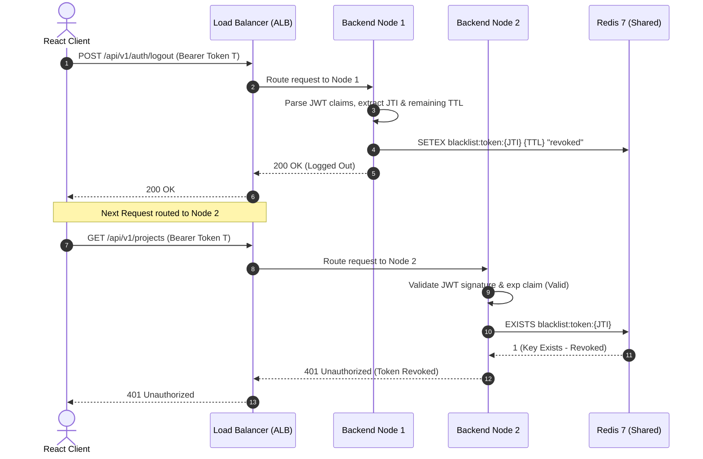
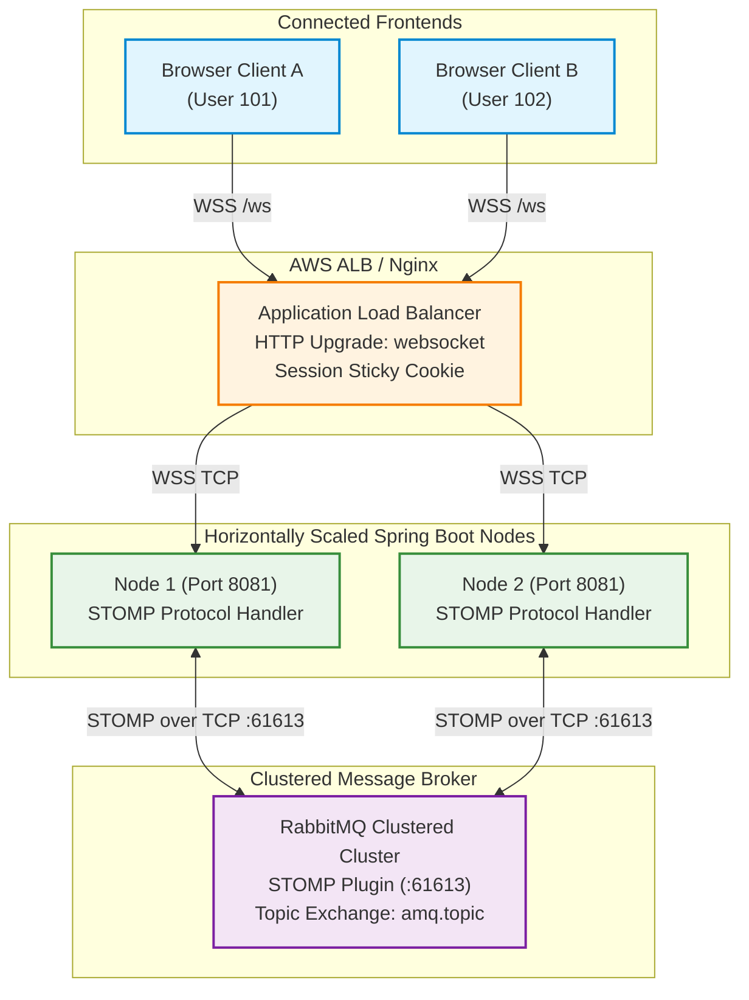
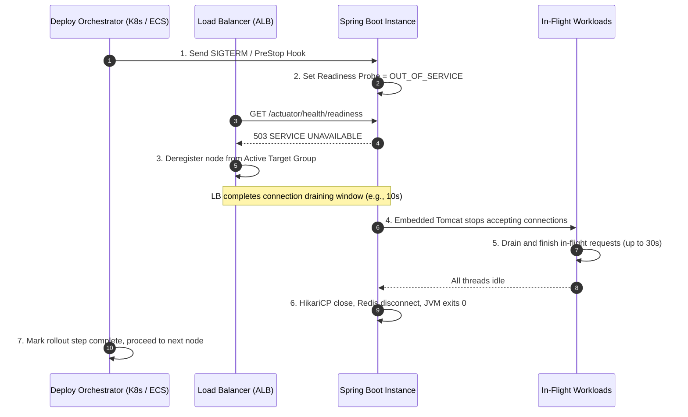
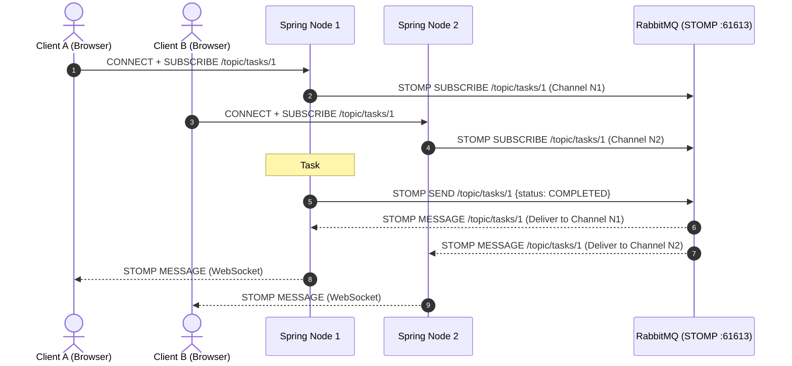
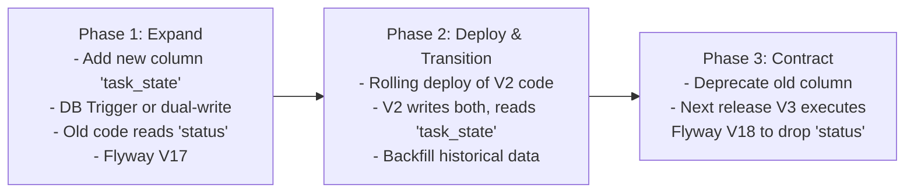

# DevOps Suite — Horizontal Scaling & Multi-Instance Architecture Guide

## 1. Architectural Evolution: Monolith to Multi-Instance Scaled Tier

In its default standalone deployment, the **DevOps Suite** backend runs as a single modular monolith instance (`com.devopssuite`, Spring Boot 3 / Java 21) exposing REST APIs on port `8081` (Docker host `8082`), managing WebSocket STOMP connections via Spring's in-memory `SimpleBroker`, and decoupling synchronous business flows using Spring's in-JVM `ApplicationEventPublisher`.

While a single monolithic node simplifies deployment and eliminates distributed systems latency, it introduces three fundamental scaling bottlenecks:
1. **CPU & Memory Ceiling**: Heavy workloads (e.g., intensive static code parsing, container execution orchestration, bulk metrics ingestion from Prometheus) exhaust the JVM heap and host vCPUs.
2. **Single Point of Failure (SPOF)**: Maintenance restarts, JVM crashes, or container eviction result in complete service unavailability.
3. **In-JVM Concurrency & Event Isolation**: When multiple instances run, in-memory state (Spring's `SimpleBroker` message subscriptions, in-JVM event handlers, local memory caches) diverges, causing split-brain symptoms where events produced on Node A are never observed by subscribers connected to Node B.

Horizontal scaling addresses these bottlenecks by deploying $N$ identical, stateless Spring Boot application replicas behind an **Application Load Balancer (ALB / Nginx)**, backed by shared distributed state stores (PostgreSQL 16, Redis 7 clusters) and an external message fabric.

```
       ┌─────────────────────────────────────────────────────────────┐
       │                        Clients                              │
       │     (React 18 SPA / Vite, Monaco Editor, Mobile, CLI)       │
       └──────────────────────────────┬──────────────────────────────┘
                                      │
                   HTTPS / WSS        │ Anycast DNS / CloudFront
                                      ▼
       ┌─────────────────────────────────────────────────────────────┐
       │             Layer 7 Application Load Balancer               │
       │                 (AWS ALB / Nginx Reverse Proxy)             │
       │    - SSL/TLS Termination (:443 -> :8081)                    │
       │    - Least Connections / Round-Robin Routing                │
       │    - Actuator Liveness/Readiness Health Probes (/actuator)  │
       │    - WebSocket Upgrade & Session Affinity (Cookie-based)    │
       └──────┬───────────────────────┼───────────────────────┬──────┘
              │                       │                       │
     HTTP/WSS │              HTTP/WSS │              HTTP/WSS │
              ▼                       ▼                       ▼
    ┌──────────────────┐    ┌──────────────────┐    ┌──────────────────┐
    │  Spring Boot     │    │  Spring Boot     │    │  Spring Boot     │
    │  Instance #1     │    │  Instance #2     │    │  Instance #N     │
    │  (Port 8081)     │    │  (Port 8081)     │    │  (Port 8081)     │
    │  ┌────────────┐  │    │  ┌────────────┐  │    │  ┌────────────┐  │
    │  │JWT Filter  │  │    │  │JWT Filter  │  │    │  │JWT Filter  │  │
    │  │(Stateless) │  │    │  │(Stateless) │  │    │  │(Stateless) │  │
    │  └────────────┘  │    │  └────────────┘  │    │  └────────────┘  │
    │  ┌────────────┐  │    │  ┌────────────┐  │    │  ┌────────────┐  │
    │  │STOMP Relay │  │    │  │STOMP Relay │  │    │  │STOMP Relay │  │
    │  │TCP Client  │  │    │  │TCP Client  │  │    │  │TCP Client  │  │
    │  └────────────┘  │    │  └────────────┘  │    │  └────────────┘  │
    │  ┌────────────┐  │    │  ┌────────────┐  │    │  ┌────────────┐  │
    │  │Docker Java │  │    │  │Docker Java │  │    │  │Docker Java │  │
    │  │Client (DooD│  │    │  │Client (DooD│  │    │  │Client (DooD│  │
    │  └────────────┘  │    │  └────────────┘  │    │  └────────────┘  │
    └────┬───────┬─────┘    └────┬───────┬─────┘    └────┬───────┬─────┘
         │       │               │       │               │       │
         │       │               │       │               │       │
         │       └──────────┐    │       └──────────┐    │       │
         │                  │    │                  │    │       │
         ▼                  ▼    ▼                  ▼    ▼       │
   ┌───────────┐         ┌───────────────────────────┐           │
   │  Docker   │         │  Shared Distributed State │           │
   │  Daemon   │         │       (Redis 7 Cluster)   │           │
   │  Socket   │         │ - Sliding-Window Rate Lim │           │
   │ (/var/run/│         │ - JWT Blacklist (O(1))    │           │
   │  docker.  │         │ - Cache-Aside Queries     │           │
   │   sock)   │         │ - Redis Pub/Sub Event Bus │           │
   └───────────┘         └───────────────────────────┘           │
                                                                 │
         ┌───────────────────────────────────────────────────────┘
         │
         ├───► ┌─────────────────────────────────────────────┐
         │     │         External STOMP Broker Relay         │
         │     │            (RabbitMQ / ActiveMQ)            │
         │     │ - RabbitMQ STOMP Plugin (:61613)            │
         │     │ - Fanout & Topic Exchanges (/topic/...)     │
         │     │ - Cross-node real-time broadcast            │
         │     └─────────────────────────────────────────────┘
         │
         └───► ┌─────────────────────────────────────────────┐
               │         PostgreSQL 16 High-Availability     │
               │            (Primary + Hot Standby)          │
               │ - HikariCP Connection Pools (N * poolSize)  │
               │ - Flyway V1-V16 Schema Management           │
               └─────────────────────────────────────────────┘
```

---

## 2. Statelessness Strategy: JWT Authentication & Shared Redis Blacklist

### 2.1 The Statelessness Guarantee
In a multi-node horizontal topology, any incoming HTTP request must be capable of being handled by any arbitrary backend node without requiring session state replication across JVM memory.

DevOps Suite achieves strict statutory statelessness through:
1. **Self-Contained Signed JWT Claims**: Tokens issued by `JwtTokenProvider` carry user identity, roles (`ROLE_DEVELOPER`, `ROLE_ADMIN`, `ROLE_VIEWER`), tenant context, and expiration timestamps (`exp`). Each node verifies the cryptographic signature (HMAC-SHA256 or RSA-256) locally using a shared environment secret (`jwt.secret`), avoiding database round-trips for token decoding.
2. **Zero `HttpSession` Dependency**: Spring Security is configured with `SessionCreationPolicy.STATELESS`:
   ```java
   @Bean
   public SecurityFilterChain securityFilterChain(HttpSecurity http) throws Exception {
       http
           .csrf(AbstractHttpConfigurer::disable)
           .sessionManagement(session -> 
               session.sessionCreationPolicy(SessionCreationPolicy.STATELESS)
           )
           // Filters and authorizers...
           .addFilterBefore(jwtAuthenticationFilter, UsernamePasswordAuthenticationFilter.class);
       return http.build();
   }
   ```

### 2.2 The Distributed Invalidation Problem & Redis Blacklist
Stateless JWTs suffer from an inherent security trade-off: once issued, a token remains cryptographically valid until its `exp` claim expires. If a user logs out, rotates passwords, or has their permissions revoked on Node 1, Node 2 would still honor that token unless a globally coordinated invalidation mechanism exists.

DevOps Suite solves this using **Redis-backed token blacklisting**:



### 2.3 Production Filter Implementation
```java
package com.devopssuite.security;

import jakarta.servlet.FilterChain;
import jakarta.servlet.ServletException;
import jakarta.servlet.http.HttpServletRequest;
import jakarta.servlet.http.HttpServletResponse;
import lombok.RequiredArgsConstructor;
import lombok.extern.slf4j.Slf4j;
import org.springframework.data.redis.core.StringRedisTemplate;
import org.springframework.security.authentication.UsernamePasswordAuthenticationToken;
import org.springframework.security.core.context.SecurityContextHolder;
import org.springframework.stereotype.Component;
import org.springframework.util.StringUtils;
import org.springframework.web.filter.OncePerRequestFilter;

import java.io.IOException;

@Slf4j
@Component
@RequiredArgsConstructor
public class DistributedJwtAuthenticationFilter extends OncePerRequestFilter {

    private final JwtTokenProvider tokenProvider;
    private final StringRedisTemplate redisTemplate;

    private static final String BLACKLIST_PREFIX = "blacklist:token:";

    @Override
    protected void doFilterInternal(HttpServletRequest request,
                                    HttpServletResponse response,
                                    FilterChain filterChain) throws ServletException, IOException {
        String token = resolveToken(request);

        if (StringUtils.hasText(token) && tokenProvider.validateToken(token)) {
            String tokenId = tokenProvider.getTokenId(token); // JWT 'jti' claim
            
            // Distributed O(1) Check across all instances
            Boolean isBlacklisted = redisTemplate.hasKey(BLACKLIST_PREFIX + tokenId);
            if (Boolean.TRUE.equals(isBlacklisted)) {
                log.warn("Access attempt with blacklisted token ID: {}", tokenId);
                response.sendError(HttpServletResponse.SC_UNAUTHORIZED, "Token has been revoked");
                return;
            }

            var authentication = tokenProvider.getAuthentication(token);
            SecurityContextHolder.getContext().setAuthentication(authentication);
        }

        filterChain.doFilter(request, response);
    }

    private String resolveToken(HttpServletRequest request) {
        String bearerToken = request.getHeader("Authorization");
        if (StringUtils.hasText(bearerToken) && bearerToken.startsWith("Bearer ")) {
            return bearerToken.substring(7);
        }
        return null;
    }
}
```

---

## 3. Solving WebSocket & STOMP Scaling Across Multi-Instance Clusters

### 3.1 The In-Memory `SimpleBroker` Failure Mode
In a standalone Spring Boot application, WebSocket configurations commonly use:
```java
config.enableSimpleBroker("/topic", "/queue");
```
`SimpleBroker` is an in-memory, thread-safe message broker living entirely inside that specific JVM heap. In a horizontally scaled cluster:
- **Client A** (User 101) establishes a WebSocket connection routed to **Node 1**, subscribing to `/topic/tasks/project-42`.
- **Client B** (User 102) connects to **Node 2**, subscribing to `/topic/tasks/project-42`.
- A developer triggers task execution on **Node 1**. Node 1's `SimpMessagingTemplate` sends a payload to `/topic/tasks/project-42`.
- **Node 1** delivers the message to Client A.
- **Node 2** knows nothing about this message; **Client B never receives the update**.

```
    [Client A] (WebSocket) ───► [Node 1] (SimpleBroker) ───► Notifies Client A
                                   │
                                   X (No communication bridge)
                                   │
    [Client B] (WebSocket) ───► [Node 2] (SimpleBroker) ───► SILENCE (Missed Event!)
```

### 3.2 Solution: External STOMP Broker Relay (RabbitMQ / ActiveMQ)
To scale WebSocket STOMP messaging horizontally across arbitrary nodes, Spring Boot replaces `SimpleBroker` with `enableStompBrokerRelay`. The application nodes act solely as WebSocket terminators and STOMP protocol translators, forwarding subscriptions and publications to a dedicated external messaging cluster (RabbitMQ with `rabbitmq_stomp` plugin enabled on port `61613`).



### 3.3 Spring Boot External Broker Relay Configuration
```java
package com.devopssuite.config;

import org.springframework.beans.factory.annotation.Value;
import org.springframework.context.annotation.Configuration;
import org.springframework.messaging.simp.config.MessageBrokerRegistry;
import org.springframework.web.socket.config.annotation.EnableWebSocketMessageBroker;
import org.springframework.web.socket.config.annotation.StompEndpointRegistry;
import org.springframework.web.socket.config.annotation.WebSocketMessageBrokerConfigurer;

@Configuration
@EnableWebSocketMessageBroker
public class DistributedWebSocketConfig implements WebSocketMessageBrokerConfigurer {

    @Value("${spring.rabbitmq.host:rabbitmq}")
    private String rabbitHost;

    @Value("${spring.rabbitmq.stomp-port:61613}")
    private int stompPort;

    @Value("${spring.rabbitmq.username:guest}")
    private String rabbitUser;

    @Value("${spring.rabbitmq.password:guest}")
    private String rabbitPassword;

    @Override
    public void configureMessageBroker(MessageBrokerRegistry registry) {
        // Application destinations routed to @MessageMapping controller methods
        registry.setApplicationDestinationPrefixes("/app");

        // Forward /topic and /queue to RabbitMQ STOMP broker relay
        registry.enableStompBrokerRelay("/topic", "/queue")
                .setRelayHost(rabbitHost)
                .setRelayPort(stompPort)
                .setClientLogin(rabbitUser)
                .setClientPasscode(rabbitPassword)
                .setSystemLogin(rabbitUser)
                .setSystemPasscode(rabbitPassword)
                .setSystemHeartbeatSendInterval(10000)
                .setSystemHeartbeatReceiveInterval(10000);
    }

    @Override
    public void registerStompEndpoints(StompEndpointRegistry registry) {
        registry.addEndpoint("/ws")
                .setAllowedOriginPatterns("*")
                .withSockJS()
                .setHeartbeatTime(25000)
                .setDisconnectDelay(5000);
    }
}
```

### 3.4 SockJS Fallbacks and Session Stickiness
WebSocket connections start with an HTTP Upgrade handshake (`GET /ws/info?t=...`, followed by `Upgrade: websocket`). When clients reside behind corporate firewalls or proxies that do not support HTTP/1.1 Upgrade or HTTP/2 WebSocket multiplexing, **SockJS falls back to HTTP-based emulation transports**:
- **XHR Streaming** (`/ws/{server}/{session}/xhr_streaming`)
- **XHR Polling** (`/ws/{server}/{session}/xhr`)

#### The Session Splitting Vulnerability
In pure round-robin load balancing without stickiness:
1. SockJS handshake `POST /ws/123/abc/xhr_send` hits **Node 1**.
2. SockJS long-poll `POST /ws/123/abc/xhr` hits **Node 2**.
3. **Node 2** rejects the polling request with `404 Not Found` or session expiration because SockJS session state `abc` is stored in Node 1's memory.

#### Solution: Cookie-Based Session Stickiness at ALB
To guarantee SockJS transport integrity, the ALB must be configured for session affinity using an injection cookie (e.g., `AWSALB` or `route` cookie in Nginx), pinned exclusively to WebSocket/SockJS URL paths:

```nginx
# Nginx Configuration for DevOps Suite
upstream devops_backend {
    ip_hash; # Or cookie-based sticky session
    server 10.0.1.10:8081 max_fails=3 fail_timeout=10s;
    server 10.0.1.11:8081 max_fails=3 fail_timeout=10s;
    server 10.0.1.12:8081 max_fails=3 fail_timeout=10s;
    keepalive 64;
}

server {
    listen 443 ssl http2;
    server_name api.devopssuite.internal;

    # Standard REST API: Pure Stateless Round-Robin / Least Connections
    location /api/ {
        proxy_pass http://devops_backend;
        proxy_set_header Host $host;
        proxy_set_header X-Real-IP $remote_addr;
        proxy_set_header X-Forwarded-For $proxy_add_x_forwarded_for;
        proxy_set_header X-Forwarded-Proto $scheme;
    }

    # SockJS / WebSocket Endpoint: Requires Upgrade Headers & Persistence
    location /ws/ {
        proxy_pass http://devops_backend;
        proxy_http_version 1.1;
        proxy_set_header Upgrade $http_upgrade;
        proxy_set_header Connection "upgrade";
        proxy_set_header Host $host;
        proxy_set_header X-Real-IP $remote_addr;
        proxy_set_header X-Forwarded-For $proxy_add_x_forwarded_for;
        
        # Extended timeouts for long-lived STOMP connections
        proxy_read_timeout 86400s;
        proxy_send_timeout 86400s;
    }
}
```

---

## 4. Solving Asynchronous Events: Replacing In-JVM `ApplicationEventPublisher`

### 4.1 The In-JVM Event Limitation
In the monolith, decoupled domain events use Spring's native event mechanism:
```java
// Inside ProjectService.java
eventPublisher.publishEvent(new TaskExecutionEvent(taskId, TaskStatus.RUNNING));

// Inside NotificationService.java
@TransactionalEventListener
public void onTaskExecution(TaskExecutionEvent event) {
    // Send browser push notification via STOMP...
}
```
In a horizontally scaled environment:
- When Node 1 executes `publishEvent(...)`, Spring's `ApplicationEventMulticaster` dispatches the event **only to `@EventListener` methods running inside Node 1's JVM**.
- Node 2, Node 3, and Node $N$ never receive the event. Asynchronous listeners handling cross-node notifications, cache eviction, or audit logs fail to trigger.

### 4.2 Distributed Event Architecture: Redis Pub/Sub vs. Kafka
When choosing an event-driven mechanism to bridge Spring instances, architecture teams evaluate **Redis Pub/Sub** against **Apache Kafka**:

| Evaluation Criterion | Redis Pub/Sub | Apache Kafka | Selected for DevOps Suite |
| :--- | :--- | :--- | :--- |
| **Delivery Guarantee** | At-most-once (Fire & Forget) | At-least-once (Log persistence) | **Redis Pub/Sub** for ephemeral notifications; **Kafka** for audit logs |
| **Persistence / Replay** | No (lost if no consumer online) | Yes (configurable retention days) | Redis requires zero storage footprint |
| **Latency** | Sub-millisecond ($< 1\text{ ms}$) | Low ($2 - 15\text{ ms}$) | Redis delivers instant real-time telemetry |
| **Operational Overhead** | Zero extra infrastructure (Redis already in stack) | High (requires ZooKeeper / KRaft, brokers, partitions) | Avoids operational footprint of standalone Kafka cluster |
| **Ordering** | Per-publisher FIFO | Strict per-partition key ordering | Task status transitions sequenced by timestamp |

### 4.3 Redis Pub/Sub Event Multi-Caster Implementation
To transparently broadcast events across all nodes without rewriting hundreds of domain service calls, DevOps Suite introduces a distributed event publisher:

```java
package com.devopssuite.events;

import com.fasterxml.jackson.databind.ObjectMapper;
import lombok.RequiredArgsConstructor;
import lombok.extern.slf4j.Slf4j;
import org.springframework.context.ApplicationEventPublisher;
import org.springframework.data.redis.connection.Message;
import org.springframework.data.redis.connection.MessageListener;
import org.springframework.data.redis.core.StringRedisTemplate;
import org.springframework.stereotype.Component;

import java.io.IOException;

@Slf4j
@Component
@RequiredArgsConstructor
public class DistributedEventBridge implements MessageListener {

    private final StringRedisTemplate redisTemplate;
    private final ObjectMapper objectMapper;
    private final ApplicationEventPublisher localPublisher;

    public static final String DISTRIBUTED_CHANNEL = "devops:suite:events";

    /**
     * Publishes a domain event across all cluster nodes via Redis Pub/Sub.
     */
    public void publishDistributed(DomainEvent event) {
        try {
            String payload = objectMapper.writeValueAsString(event);
            redisTemplate.convertAndSend(DISTRIBUTED_CHANNEL, payload);
        } catch (Exception e) {
            log.error("Failed to publish distributed event to Redis: {}", event, e);
            // Fallback to local dispatch to avoid dropping critical local handling
            localPublisher.publishEvent(event);
        }
    }

    /**
     * Listens to Redis broadcast and re-publishes locally in the current JVM.
     */
    @Override
    public void onMessage(Message message, byte[] pattern) {
        try {
            DomainEvent event = objectMapper.readValue(message.getBody(), DomainEvent.class);
            // Re-broadcast into the local Spring ApplicationContext
            localPublisher.publishEvent(event);
        } catch (IOException e) {
            log.error("Failed to deserialize distributed event from channel", e);
        }
    }
}
```

```java
package com.devopssuite.config;

import com.devopssuite.events.DistributedEventBridge;
import org.springframework.context.annotation.Bean;
import org.springframework.context.annotation.Configuration;
import org.springframework.data.redis.connection.RedisConnectionFactory;
import org.springframework.data.redis.listener.ChannelTopic;
import org.springframework.data.redis.listener.RedisMessageListenerContainer;

@Configuration
public class RedisPubSubConfig {

    @Bean
    public RedisMessageListenerContainer redisContainer(
            RedisConnectionFactory connectionFactory,
            DistributedEventBridge bridge) {
        RedisMessageListenerContainer container = new RedisMessageListenerContainer();
        container.setConnectionFactory(connectionFactory);
        container.addMessageListener(bridge, new ChannelTopic(DistributedEventBridge.DISTRIBUTED_CHANNEL));
        return container;
    }
}
```

---

## 5. End-to-End Multi-Instance Horizontally Scaled Architecture

The following diagram illustrates how user requests, REST APIs, WebSocket connections, container execution triggers, and cache layers flow across an horizontally scaled DevOps Suite cluster:

```mermaid
graph TB
    subgraph ClientLayer["Edge & Client Layer"]
        SPA["React 18 SPA (Vite / Monaco Editor)"]
        PROBE["Prometheus Scraper"]
    end

    subgraph IngressLayer["Ingress & Load Balancing Tier"]
        ALB["Application Load Balancer (AWS ALB / Nginx)<br/>TLS Termination | Health Check Evaluation"]
    end

    subgraph ServiceCluster["Spring Boot 3 Stateless Micro-Fleet (Java 21)"]
        subgraph Node1["Backend Instance 1 (:8081)"]
            F1["DistributedJwtFilter"]
            C1["HikariCP Pool (30)"]
            S1["STOMP TCP Adapter"]
            D1["Docker Client (/var/run/docker.sock)"]
        end
        subgraph Node2["Backend Instance 2 (:8081)"]
            F2["DistributedJwtFilter"]
            C2["HikariCP Pool (30)"]
            S2["STOMP TCP Adapter"]
            D2["Docker Client (/var/run/docker.sock)"]
        end
        subgraph NodeN["Backend Instance N (:8081)"]
            FN["DistributedJwtFilter"]
            CN["HikariCP Pool (30)"]
            SN["STOMP TCP Adapter"]
            DN["Docker Client (/var/run/docker.sock)"]
        end
    end

    subgraph DataBrokerTier["Shared Distributed State Tier"]
        REDIS[("Redis 7 Cluster<br/>- Rate Limiting (Sliding Window)<br/>- JWT Blacklist (O(1))<br/>- Pub/Sub Channel: devops:suite:events<br/>- Cache-Aside (Projects, Builds)")]
        RABBIT[("RabbitMQ Cluster (:61613)<br/>- STOMP Protocol Relay<br/>- Topic Exchange (/topic/*)")]
        PG[("PostgreSQL 16 HA<br/>- Flyway V1-V16 Schema<br/>- Master / Standby Replication<br/>- Max Connections: 300")]
    end

    subgraph SandboxFleet["Execution Sandbox Tier"]
        DOCKER1["Ephemeral Docker Containers (Node 1 Host)"]
        DOCKER2["Ephemeral Docker Containers (Node 2 Host)"]
    end

    SPA -->|HTTPS /api/*| ALB
    SPA -->|WSS /ws| ALB
    PROBE -->|GET /actuator/prometheus| ALB

    ALB -->|Round-Robin / Least Conn| F1
    ALB -->|Round-Robin / Least Conn| F2
    ALB -->|Round-Robin / Least Conn| FN

    F1 & F2 & FN <-->|O(1) Token Check & Events| REDIS
    S1 & S2 & SN <-->|STOMP Relay TCP| RABBIT
    C1 & C2 & CN <-->|JDBC (Hikari)| PG

    D1 --> DOCKER1
    D2 --> DOCKER2

    classDef edge fill:#e3f2fd,stroke:#1565c0,stroke-width:2px;
    classDef ingress fill:#fff8e1,stroke:#f57f17,stroke-width:2px;
    classDef node fill:#e8f5e9,stroke:#2e7d32,stroke-width:2px;
    classDef data fill:#fce4ec,stroke:#c2185b,stroke-width:2px;
    classDef sandbox fill:#f3e5f5,stroke:#6a1b9a,stroke-width:2px;

    class SPA,PROBE edge;
    class ALB ingress;
    class Node1,Node2,NodeN node;
    class REDIS,RABBIT,PG data;
    class DOCKER1,DOCKER2 sandbox;
```

---

## 6. Zero-Downtime Deployment & Graceful Shutdown in Spring Boot 3

### 6.1 The Abrupt Termination Risk
When deploying updates to a multi-instance cluster, stopping a running JVM abruptly (`SIGKILL` or default `SIGTERM` without graceful termination) causes:
1. **In-Flight HTTP Ingestion Interruption**: Active REST calls (such as code compilation submissions or file uploads) fail with `502 Bad Gateway` or `ECONNRESET`.
2. **Broken Database Transactions**: Partial transactions roll back abruptly, or lingering lock handles cause connection timeouts.
3. **Corrupted Container Cleanups**: Ephemeral Docker sandbox containers launched by `DockerClient` might leak on host disks without reaching their `finally { docker.removeContainer() }` block.

### 6.2 Graceful Shutdown Mechanics (`server.shutdown=graceful`)
Spring Boot 3 natively supports graceful shutdown across embedded web servers (Tomcat, Jetty, Undertow). When a `SIGTERM` is intercepted by the JVM:
1. The embedded Tomcat connector **stops accepting new network connections**.
2. Active worker threads are permitted a configurable grace period (`spring.lifecycle.timeout-per-shutdown-phase`) to complete pending work.
3. Once in-flight requests finish, Spring tears down beans in dependency order, invoking `@PreDestroy` hooks (closing HikariCP pools, releasing Redis connections, cleaning Docker sandbox handles).

```yaml
# application-prod.yml
server:
  port: 8081
  shutdown: graceful  # Prevents accepting new requests upon SIGTERM

spring:
  lifecycle:
    timeout-per-shutdown-phase: 30s  # Max duration to wait for in-flight requests

management:
  endpoints:
    web:
      exposure:
        include: health, prometheus, info
  endpoint:
    health:
      probes:
        enabled: true  # Activates /actuator/health/liveness and /actuator/health/readiness
      show-details: when_authorized
```

### 6.3 Kubernetes / ALB Readiness Lifecycle Synchronization
A common pitfall occurs when the load balancer continues directing traffic to a node after it has entered its graceful shutdown phase. To achieve true **Zero-Downtime Rolling Updates**, shutdown phases must be sequenced:



---

## 7. Deep-Dive Interview Questions & Answers

### 🟢 Basic Concepts

#### Q1: What is the primary difference between horizontal scaling (scaling out) and vertical scaling (scaling up) in the context of the DevOps Suite backend?
**Answer:**
- **Vertical Scaling (Scale Up)**: Involves provisioning a larger single host or container with more CPU cores, RAM, and disk I/O for the monolithic Spring Boot process. While trivial to configure (no code changes, no distributed consensus), it suffers from hard hardware and hypervisor ceilings, prohibitive cost curves at high tiers, and remains a Single Point of Failure (SPOF) during deployments or hardware crashes.
- **Horizontal Scaling (Scale Out)**: Involves running $N$ identical application instances of the DevOps Suite backend behind a Load Balancer (ALB/Nginx). It provides fault tolerance (if 1 of 5 instances crashes, 80% capacity remains), near-linear scaling economics, and enables zero-downtime rolling upgrades. However, it requires making the application strictly stateless, managing distributed caches (Redis), replacing in-JVM brokers with external relays (RabbitMQ), and orchestrating shared database connection pools.

#### Q2: Why is the DevOps Suite REST API considered stateless, and how does this facilitate horizontal scaling?
**Answer:**
DevOps Suite REST APIs are stateless because the Spring Boot application server does not create or maintain an `HttpSession` in its JVM memory (`SessionCreationPolicy.STATELESS`).
- Every incoming HTTP request must include all necessary authentication and context data in its `Authorization: Bearer <JWT>` header.
- Because any node can cryptographically verify the JWT signature and extract user authorizations independently using a pre-shared secret or public key, no session synchronization or server affinity is required.
- The Load Balancer can freely distribute individual REST requests across any available node in the target group using simple round-robin or least-connections algorithms.

---

### 🟡 Intermediate Concepts

#### Q3: Contrast the three major load balancing algorithms: Round-Robin, Least Connections, and IP Hash. Which are suitable for DevOps Suite?
**Answer:**
1. **Round-Robin**:
   - *Mechanism*: Sequentially cycles incoming requests across the list of healthy backend nodes ($1 \rightarrow 2 \rightarrow 3 \rightarrow 1$).
   - *Pros/Cons*: Extremely lightweight with zero memory overhead, but assumes all requests consume identical execution time.
   - *Fit for DevOps Suite*: Excellent for stateless, lightweight REST read operations (`GET /api/v1/projects`).
2. **Least Connections**:
   - *Mechanism*: Tracks active open TCP/HTTP connections to each backend instance and routes the next request to the instance with the fewest active connections.
   - *Pros/Cons*: Highly dynamic; prevents overloading a node currently processing heavy computational requests.
   - *Fit for DevOps Suite*: **Optimal choice for general DevOps Suite traffic**, particularly because long-running tasks (e.g., streaming build logs or processing large ZIP code submissions) vary wildly in execution duration compared to simple metadata lookups.
3. **IP Hash**:
   - *Mechanism*: Calculates a hash of the client's IPv4/IPv6 address to deterministically map that client IP to a specific backend server.
   - *Pros/Cons*: Guarantees that requests from the same client IP hit the same node without cookies. However, clients behind corporate proxy gateways or NAT networks (sharing a public IP) will all hash to the same single node, causing severe traffic skew.
   - *Fit for DevOps Suite*: Not recommended for standard REST APIs; can be used as a fallback for sticky WebSocket handshakes when cookie injection is disallowed.

#### Q4: How does Spring Boot 3's Graceful Shutdown (`server.shutdown=graceful`) work, and what happens if a request exceeds `timeout-per-shutdown-phase`?
**Answer:**
When an operating system sends `SIGTERM` to a Spring Boot process configured with `server.shutdown=graceful`:
1. The embedded Tomcat/Jetty web server stops accepting new connections on its listen port (port 8081).
2. Existing, active requests currently being processed by Tomcat's worker threads are permitted to continue.
3. Spring's `GracefulShutdown` manager monitors active request counters until they drop to zero or the timeout specified by `spring.lifecycle.timeout-per-shutdown-phase` (e.g., `30s`) elapses.
4. **Timeout Behavior**: If an active request (such as a large file download or slow database query) does not finish within 30 seconds, Spring Boot forcefully terminates the embedded server worker threads, cancels pending operations, and proceeds immediately with context shutdown (`@PreDestroy`, database pool teardown). The client receives an abrupt connection termination (`ECONNRESET` or `504 Gateway Timeout`).

---

### 🔴 Advanced Architecture

#### Q5: Explain the technical failure mode of using Spring's default `SimpleBroker` for STOMP WebSockets in a multi-instance deployment. How does an external STOMP broker relay solve this?
**Answer:**
- **The Failure Mode**:
  Spring's `SimpleBroker` stores STOMP destination subscriptions (e.g., `/topic/logs/build-101`) in an in-memory `DefaultSubscriptionRegistry` within that specific JVM heap. When User A connects via WebSocket to Node 1, Node 1 records User A's `SimpSessionId`. When User B connects to Node 2, Node 2 records User B.
  If a background Docker container build finishes and triggers an event on Node 2:
  ```java
  messagingTemplate.convertAndSend("/topic/logs/build-101", buildLogDto);
  ```
  Node 2's `SimpleBroker` inspects its local memory registry. It finds User B, so User B receives the log line. However, Node 2 cannot notify Node 1. Consequently, User A on Node 1 never receives the real-time build log.
- **The Solution (STOMP Broker Relay)**:
  By enabling `registry.enableStompBrokerRelay("/topic", "/queue")` pointing to RabbitMQ with the STOMP plugin enabled:
  1. Node 1 and Node 2 open dedicated TCP control channels to RabbitMQ port `61613`.
  2. When User A subscribes to `/topic/logs/build-101` on Node 1, Node 1 forwards a STOMP `SUBSCRIBE` frame to RabbitMQ.
  3. When User B subscribes on Node 2, Node 2 forwards a STOMP `SUBSCRIBE` frame to RabbitMQ.
  4. When Node 2 broadcasts a message to `/topic/logs/build-101`, it pushes a `SEND` frame to RabbitMQ.
  5. RabbitMQ publishes the payload to its internal `amq.topic` exchange, routing copies to both Node 1's and Node 2's TCP connections.
  6. Both nodes receive the frame and relay it downstream to their respective locally connected WebSocket browser clients.



#### Q6: How must HikariCP connection pooling and PostgreSQL maximum connections (`max_connections`) be tuned when scaling the application tier from 1 to 10 instances?
**Answer:**
When scaling horizontally, database connection pool exhaustion is one of the most critical risks.
- In a single-instance architecture, HikariCP might be configured with:
  $$\text{maximum-pool-size} = 30$$
  This consumes at most 30 connections against PostgreSQL's default `max_connections = 100`.
- When scaling to $N = 10$ instances:
  $$\text{Total Potential Connections} = N \times \text{maximum-pool-size} = 10 \times 30 = 300\text{ connections}$$
  If PostgreSQL's `max_connections` is configured for 150, the database will exhaust available file descriptors and connection processes, throwing:
  `FATAL: sorry, too many clients already`.
- **Architectural Solution & Formula**:
  1. Tune PostgreSQL's `max_connections` according to server hardware:
     $$\text{PostgreSQL max\_connections} \ge (N \times \text{HikariCP Pool Size}) + \text{Superuser Reserved (typically 10)}$$
  2. Optimize HikariCP per node using the standard sizing formula:
     $$\text{Pool Size} = \text{Tn} \times (\text{Cm} - 1) + 1 \approx (\text{CPU Cores} \times 2) + \text{Disk Spindle Count}$$
     For a modern SSD-backed 4-core container, a pool size of 10–15 connections per node is usually more performant than 30–50 due to reduced CPU context switching on Postgres backend processes.
  3. Deploy **PgBouncer** or AWS RDS Proxy between the Spring Boot cluster and PostgreSQL to pool and multiplex hundreds of application connections into a small pool of database server connections using transaction pooling.

---

### ⚫ Expert Scenarios & System Design

#### Q7: Describe a scenario where a rolling deployment causes database migration failure with Flyway, and design the backward-compatible schema migration strategy for horizontal scaling.
**Answer:**
- **The Failure Scenario**:
  Instance 1 is updated to Release V2. During startup, its embedded Flyway runner executes migration `V17__drop_column_legacy_status.sql`, which drops column `status` from table `tasks` and adds `task_state_enum`.
  Simultaneously, Instances 2, 3, and 4 are still running Release V1 code. The moment Node 1 executes `ALTER TABLE tasks DROP COLUMN status`, active REST transactions on Nodes 2, 3, and 4 attempting `SELECT status FROM tasks` or `INSERT INTO tasks (status) ...` immediately fail with:
  `org.postgresql.util.PSQLException: ERROR: column "status" does not exist`.
  This causes widespread production outage during what was supposed to be a zero-downtime deployment.

- **The Solution: Expand-Contract (Parallel Run) Migration Pattern**:
  Schema modifications in horizontally scaled systems must always be backward and forward compatible across two consecutive software releases:



1. **Phase 1 (Expand)**:
   - Deploy Migration `V17__add_task_state_column.sql`. The database now contains both `status` and `task_state`.
   - The application code is updated to write to both columns, but continue reading from `status`.
2. **Phase 2 (Migrate & Cutover)**:
   - Run a background data backfill script to populate `task_state` from existing `status` values.
   - Deploy Release V2 across all nodes. Release V2 reads exclusively from `task_state`.
3. **Phase 3 (Contract)**:
   - After Release V2 has successfully completed its rollout across all $N$ nodes, deploy a subsequent migration `V18__drop_legacy_status_column.sql` to safely remove the unused column.

#### Q8: How should Docker sandbox execution be managed in a horizontally scaled DevOps Suite cluster? What are the tradeoffs between running local Docker daemons per node vs. a centralized remote execution cluster?
**Answer:**
In DevOps Suite, code compilation and testing execute in isolated, ephemeral Docker containers (`--network=none`, `--memory=256m`, `--cpus=1`, `--read-only`, `tmpfs /tmp`).
When scaling out the backend Spring Boot instances, two primary execution topologies exist:

```
Option A: Local Docker Daemon per Node (DooD)
[Node 1] ──► /var/run/docker.sock ──► [Host 1 Docker Engine] ──► Containers on Host 1
[Node 2] ──► /var/run/docker.sock ──► [Host 2 Docker Engine] ──► Containers on Host 2

Option B: Centralized Execution Pool (Remote Docker API or Kubernetes Jobs)
[Node 1] ──┐
[Node 2] ──┼──► [gRPC / REST API] ──► [Remote Worker Fleet / Nomad / K8s Ephemeral Pods]
[Node N] ──┘
```

- **Option A: Local Docker-out-of-Docker (DooD) via `/var/run/docker.sock`**:
  - *Tradeoffs*:
    - **Pros**: Zero network overhead for container creation; file payloads can be mounted via local temp volumes; simpler deployment model.
    - **Cons**: Each host VM must have Docker Engine installed and running. If a rogue container consumes 100% host disk I/O, it directly degrades the Spring Boot JVM running on that same host VM. Container capacity is tied directly to backend node scaling.
- **Option B: Centralized Remote Execution Fleet (Kubernetes Jobs / Docker Swarm)**:
  - *Tradeoffs*:
    - **Pros**: Complete physical isolation between the Spring Boot control plane and untrusted code execution. Resource exhaustion in execution sandboxes cannot crash backend API nodes. Sandboxes can scale independently from API traffic.
    - **Cons**: Requires uploading user source code archives over the internal network to the remote worker; introduces minor orchestration latency (100–300 ms per job launch).
- **Architectural Recommendation for DevOps Suite**:
  For low-to-medium scale, utilize **Local DooD with strict cgroups** (`--memory=256m`, `--pids-limit=50`, `--cpus=1`). For hyperscale enterprise production, decouple execution into dedicated worker nodes using Redis-backed job queues or Kubernetes Ephemeral Jobs.

---

## 8. Quick Reference Summary

| Architectural Component | Single-Instance Monolith Default | Horizontally Scaled Multi-Instance Target | Production Benefit / Justification |
| :--- | :--- | :--- | :--- |
| **Ingress & Routing** | Direct port exposure (:8081 / :8082) | Layer 7 ALB / Nginx with Least-Connections | High availability, TLS termination, dynamic traffic balancing |
| **Authentication State** | Stateless JWT verified locally | Stateless JWT + Shared Redis Token Blacklist | Immediate, cluster-wide token revocation on logout/ban |
| **WebSocket Broker** | In-memory `SimpleBroker` | External STOMP Relay (RabbitMQ `:61613`) | Cross-node STOMP topic synchronization for all browsers |
| **SockJS Fallback** | Default in-memory session | Cookie-Based Sticky Sessions (`AWSALB` / IP Hash) | Prevents broken long-polling connections across split nodes |
| **Domain Event Bus** | In-JVM `ApplicationEventPublisher` | Redis Pub/Sub (`convertAndSend`) or Kafka | Decoupled cross-instance event propagation without Kafka overhead |
| **Database Connections** | Single HikariCP pool (e.g., 30) | Scaled HikariCP pools ($N \times \text{size}$) + PgBouncer | Prevents PostgreSQL `max_connections` exhaustion |
| **Deployment Lifecycles**| Hard container restart | `server.shutdown=graceful` + Readiness Probes | Zero-downtime rolling upgrades, no dropped HTTP connections |
| **Health Check Probes** | Basic `/actuator/health` | Dual probes: `/actuator/health/liveness` & `/readiness` | Fast pod recreation on deadlock; graceful ALB deregistration |
