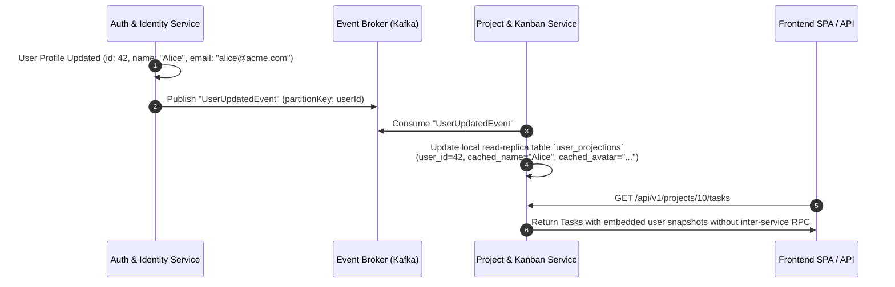
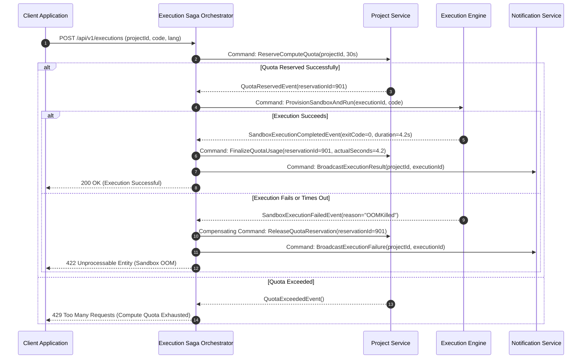
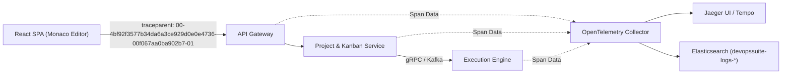
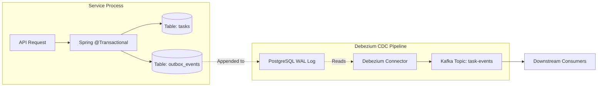

# DevOps Suite: Architectural Evolution & Microservices Migration Guide

> **Target State**: Microservices Architecture at 100k+ Active Users  
> **Source Baseline**: Spring Boot 3 Monolith (`com.devopssuite`), PostgreSQL 16, Redis 7, Ephemeral Docker Sandboxes  
> **Target Scale**: 100,000+ Concurrent Active Users, 50,000 Sandbox Executions/Day, Multi-Region Deployment  

---

## 1. Executive Summary & Strategic Context

DevOps Suite was deliberately designed and implemented as a **modular monolith** in Spring Boot 3 (Java 21). This architecture prioritized high transactional integrity via ACID database semantics, zero network latency between internal domain events, low infrastructure operational overhead, and simplified developer workflows.

However, as workloads increase towards **100,000+ active users**, distinct failure modes, divergent scaling dimensions, and blast-radius concerns emerge:

1. **Compute Asymmetry**: Untrusted code execution (Docker/gVisor sandboxes) generates severe CPU, memory, and kernel namespace pressure. When collocated on monolith nodes, execution bursts risk starving API worker threads, exhausting Linux cgroups, or destabilizing the JVM garbage collector.
2. **Connection Starvation**: Persistent real-time connections (WebSocket/STOMP over SockJS) consume persistent memory and TCP file descriptors, interfering with high-throughput, short-lived REST API connections.
3. **Release & Blast Radius Friction**: A bug in the telemetry parsing pipeline or notification dispatch should not degrade core authentication or Kanban task mutations.
4. **Data Hotspots & Storage Decoupling**: Large volumes of execution logs and audit entries exhaust PostgreSQL buffer pools, evicting frequently read project and user rows.

This document details the engineering blueprint for decomposing DevOps Suite into an enterprise-grade distributed microservices ecosystem using the **Strangler Fig Pattern**, **Database-per-Service**, **Asynchronous Event-Driven Synchronization**, and **Saga Orchestration**.

---

## 2. Domain Decomposition & Bounded Contexts

Using Domain-Driven Design (DDD) principles, we analyze ubiquitous language, transaction boundaries, and change velocity to define five autonomous bounded contexts.

```
+----------------------------------------------------------------------------------------------------+
|                                      API GATEWAY (ENVOY / SPRING CLOUD)                            |
+------------------------------------+----------------------------------+----------------------------+
                                     |                                  |
            +------------------------+-------------------+              |
            |                                            |              |
+-----------v------------+                   +-----------v----------+   |   +------------------------+
|  Auth & Identity Svc   |                   |  Project & Kanban    |   |   | Code Execution Engine  |
|  - Users, Roles, RBAC  |                   |  - Projects, Boards  |   +---> Worker Cluster         |
|  - JWT / OAuth2 Issuance|                  |  - Columns, Tasks    |   |   | Docker / gVisor Pool   |
|  - DB: PostgreSQL      |                   |  - DB: PostgreSQL    |   |   | Ephemeral Sandboxes    |
+-----------+------------+                   +-----------+----------+   |   +-----------+------------+
            |                                            |              |               |
            | Domain Events                              | Domain Events|               | Status Events
            | (UserCreated, etc.)                        | (TaskMoved)  |               | (ExecCompleted)
            +--------------------+  +--------------------+              |               |
                                 |  |                                   |               |
                                 v  v                                   |               |
               +-----------------------------------+                    |               |
               |     APACHE KAFKA / REDIS STREAMS  |<-------------------+---------------+
               +-----------------+-----------------+
                                 |
            +--------------------+--------------------+
            |                                         |
+-----------v------------+               +------------v-----------+
| Real-Time & Notify Svc |               | Telemetry & Audit Svc  |
| - SockJS / STOMP Hub   |               | - Structured Ingestion |
| - Email / Webhook Push |               | - OpenSearch / ES      |
| - Redis Pub/Sub Backplane              | - ILM Retention Mgmt   |
+------------------------+               +------------------------+
```

### 2.1 Service Breakdown

| Service Name | Core Responsibilities | Data Store | Key Tech Stack | Scaling Trigger |
| :--- | :--- | :--- | :--- | :--- |
| **Auth & Identity Service** | User registration, authentication, RBAC, OAuth2 providers, JWT issuance, token revocation. | PostgreSQL (dedicated schema/DB) + Redis (Revocation blacklist) | Spring Boot 3, Spring Security 6, Redis | Authentication bursts (morning shift starts, CI/CD token validation). |
| **Project & Kanban Service** | Workspaces, Projects, Boards, Columns, Tasks, Audit records, Assignment management. | PostgreSQL (dedicated DB) | Spring Boot 3, Spring Data JPA, Flyway | High read/write throughput, frequent Kanban drag-and-drop mutations. |
| **Code Execution Engine** | Job intake queue, Docker/gVisor sandboxing, resource capping (cgroups v2, seccomp), execution timeouts. | Ephemeral scratch storage, Redis/Kafka for task queue | Go or Spring Boot worker daemon, Docker Engine API, containerd, gVisor | Execution backlog size, CPU/Memory utilization of worker nodes. |
| **Notification & Real-Time Service** | STOMP/SockJS WebSocket management, real-time fan-out, email dispatch, webhooks. | Redis (Pub/Sub & session state) | Spring Boot WebSocket / Netty, STOMP, Redis Pub/Sub | Concurrent persistent TCP WebSocket connections, event fanout volume. |
| **Observability & Telemetry Gateway** | Centralized audit trail, execution log aggregation, metrics aggregation, search querying. | Elasticsearch / OpenSearch + PostgreSQL (cold metadata) | OpenTelemetry Collector, Vector/Logstash, Elasticsearch | Ingestion volume (MB/s), query latency for complex multi-project audit logs. |

---

## 3. Database-per-Service & Distributed Data Integrity

In the monolith, relational integrity is guaranteed by PostgreSQL foreign keys:
```sql
-- Monolith Foreign Key Constraints
ALTER TABLE tasks ADD CONSTRAINT fk_tasks_project FOREIGN KEY (project_id) REFERENCES projects(id);
ALTER TABLE tasks ADD CONSTRAINT fk_tasks_assignee FOREIGN KEY (assignee_id) REFERENCES users(id);
```

In a decoupled microservices architecture, cross-service foreign keys are **strictly prohibited**. Services must own their schemas exclusively.

### 3.1 Foreign Key Decoupling & Read Projections

To eliminate hard database joins across service boundaries, we employ **Domain Event Synchronization** and **Read Projections (CQRS pattern)**:



#### Denormalized Projection Schema in Project & Kanban Service:
```sql
-- Maintained locally in Project & Kanban DB
CREATE TABLE user_projections (
    user_id BIGINT PRIMARY KEY,
    username VARCHAR(100) NOT NULL,
    display_name VARCHAR(255) NOT NULL,
    avatar_url VARCHAR(500),
    is_active BOOLEAN NOT NULL DEFAULT TRUE,
    last_synced_at TIMESTAMP WITH TIME ZONE NOT NULL
);

-- Tasks now reference the local projection or store an immutable snapshot
ALTER TABLE tasks ADD CONSTRAINT fk_tasks_user_projection 
    FOREIGN KEY (assignee_id) REFERENCES user_projections(user_id);
```

### 3.2 Distributed Transactions: Saga Pattern

When a business process spans multiple services, traditional two-phase commit (2PC) is rejected due to blocking coordinators, locking latency, and single points of failure. Instead, we use the **Saga Pattern**.

#### Choreography vs Orchestration Analysis:
* **Choreography (Event-Driven)**: Best for simple 2-step workflows (e.g., Task Created $\rightarrow$ Send Notification). No central coordinator; services react to events.
* **Orchestration (Command-Driven)**: Critical for complex workflows requiring state tracking, timeouts, retries, and explicit compensating transactions (e.g., "Execute Code and Deduct Compute Quota").

#### Scenario: Code Execution & Billing/Quota Saga (Orchestrated)



---

## 4. Migration Strategy: Strangler Fig Pattern

Migrating an enterprise monolith via a "Big Bang" rewrite is catastrophic. The **Strangler Fig Pattern** gradually replaces monolith capabilities with microservices until the monolith disappears or becomes a lightweight shell.

```mermaid
flowchart TD
    subgraph Phase 1: Inception
        C1[Client Traffic] --> GW1[API Gateway / Reverse Proxy]
        GW1 -- "100% Traffic" --> M1[Spring Boot Monolith]
    end

    subgraph Phase 2: Decouple Execution & Real-Time
        C2[Client Traffic] --> GW2[API Gateway / Reverse Proxy]
        GW2 -- "/api/v1/execute/*" --> MS_EXEC[Code Execution Cluster]
        GW2 -- "/ws/* (STOMP)" --> MS_RT[Real-Time & Notify Svc]
        GW2 -- "All Other Routes" --> M2[Monolith Core]
    end

    subgraph Phase 3: Decouple Projects & Kanban
        C3[Client Traffic] --> GW3[API Gateway]
        GW3 -- "/api/v1/execute/*" --> MS_EXEC
        GW3 -- "/ws/*" --> MS_RT
        GW3 -- "/api/v1/projects/*" --> MS_KB[Project & Kanban Svc]
        GW3 -- "/api/v1/auth/*" --> M3[Monolith (Auth Only)]
    end

    subgraph Phase 4: Final State
        C4[Client Traffic] --> GW4[Envoy / Spring Cloud Gateway]
        GW4 --> MS_AUTH[Auth & Identity Svc]
        GW4 --> MS_KB2[Project & Kanban Svc]
        GW4 --> MS_EXEC2[Code Execution Engine]
        GW4 --> MS_RT2[Notification Svc]
        GW4 --> MS_OBS[Telemetry Svc]
    end
```

### 4.1 Step-by-Step Strangler Roadmap

#### Step 1: Deploy API Gateway & Establish Observability Baseline
* Place **Spring Cloud Gateway** or **Envoy** in front of the monolith.
* Route all requests (`/*`) to the monolith initially.
* Implement OpenTelemetry distributed tracing (`traceparent` header injection via W3C TraceContext standard) across gateway and monolith.

#### Step 2: Carve Out Code Execution Engine (Highest Risk & Resource Isolation)
* **Rationale**: Code execution uses heavy Docker/gVisor sandboxes and native OS resources. Offloading it immediately protects monolith stability.
* Implement a standalone Go or Spring Boot worker cluster.
* Gateway routes `/api/v1/execute/**` to the Execution Service.
* Monolith delegates sandbox runs via gRPC or Kafka messages instead of running local Docker client commands.

#### Step 3: Extract Notification & Real-Time Service
* **Rationale**: WebSocket connections hold open file descriptors and keep thread memory reserved.
* Migrate SockJS/STOMP broker from Spring Boot monolith to a dedicated WebSocket gateway cluster backed by Redis Pub/Sub.
* Monolith sends Spring `ApplicationEventPublisher` events over a Redis Stream or Kafka topic, which the Notification Service pushes to connected browsers.

#### Step 4: Extract Project & Kanban Service (Database Separation)
* Use **Change Data Capture (CDC)** via **Debezium** reading PostgreSQL write-ahead logs (WAL) to replicate `projects`, `boards`, `columns`, and `tasks` to the new Project Service DB in real time.
* Perform dual-writes or shadow routing to verify consistency.
* Cut over read and write traffic at the Gateway. Decommission old monolith tables.

#### Step 5: Extract Auth & Identity Service (Retire Monolith)
* Move user credentials, JWT signing keys, and session blacklists to the final Auth Service.
* The original monolith container is safely decommissioned.

---

## 5. API Gateway Architecture & Request Routing

The API Gateway acts as the single ingress point, abstracting backend service topology from the React SPA frontend.

### 5.1 Spring Cloud Gateway Route Definition

```yaml
spring:
  cloud:
    gateway:
      routes:
        # Route 1: Auth & User Management
        - id: auth-service
          uri: lb://auth-identity-service
          predicates:
            - Path=/api/v1/auth/**, /api/v1/users/**
          filters:
            - StripPrefix=0
            - name: RequestRateLimiter
              args:
                redis-rate-limiter.replenishRate: 50
                redis-rate-limiter.burstCapacity: 100

        # Route 2: Project & Kanban Workspaces
        - id: kanban-service
          uri: lb://project-kanban-service
          predicates:
            - Path=/api/v1/projects/**, /api/v1/tasks/**, /api/v1/boards/**
          filters:
            - name: JwtAuthenticationFilter
            - name: CircuitBreaker
              args:
                name: kanbanCircuitBreaker
                fallbackUri: forward:/fallback/kanban

        # Route 3: Isolated Code Execution Sandbox
        - id: execution-engine
          uri: lb://execution-engine-service
          predicates:
            - Path=/api/v1/execute/**
          filters:
            - name: JwtAuthenticationFilter
            - name: RequestRateLimiter
              args:
                redis-rate-limiter.replenishRate: 5
                redis-rate-limiter.burstCapacity: 10

        # Route 4: Real-Time WebSocket Connections
        - id: websocket-realtime
          uri: lb:ws://notification-service
          predicates:
            - Path=/ws/**
```

---

## 6. Distributed Tracing & Telemetry Architecture

When monolithic in-memory calls transform into distributed network hops, diagnosing latency spikes and transient errors requires end-to-end distributed tracing.



### 6.1 Trace Context Propagation via W3C TraceContext
Every request entering the API Gateway is stamped with a standard W3C `traceparent` header:
$$\text{version (00)} - \text{trace\_id (32 hex)} - \text{parent\_span\_id (16 hex)} - \text{trace\_flags (01)}$$

In Spring Boot 3 microservices, **Micrometer Tracing** with the OpenTelemetry bridge automatically propagates context through `RestTemplate`, `RestClient`, `WebClient`, and Kafka headers:

```java
// Automatic Context Propagation across Kafka message publishing
@Bean
public ProducerFactory<String, Object> producerFactory(KafkaProperties properties, Tracer tracer) {
    Map<String, Object> props = properties.buildProducerProperties();
    DefaultKafkaProducerFactory<String, Object> factory = new DefaultKafkaProducerFactory<>(props);
    factory.addPostProcessor(producer -> {
        // Automatically injects current traceId and spanId into Kafka RecordHeaders
        return new TracingProducer<>(producer, tracer);
    });
    return factory;
}
```

---

## 7. Deep-Dive Interview Questions & Answers

### 🟢 Basic Concepts

#### Q1: What are the primary signs that a Spring Boot monolith has outgrown its architecture and needs decomposition?
**Answer:**
A monolith should not be decomposed simply for stylistic reasons. Genuine architectural triggers include:
1. **Asymmetric Resource Contention**: Different modules require radically conflicting hardware profiles. In DevOps Suite, the Code Execution sandbox demands intense CPU, Linux kernel cgroups, and temporary disk I/O, whereas the Kanban Board needs low-latency database queries. When collocated, an infinite loop in submitted user code can starve API thread pools.
2. **Organizational & Deployment Velocity**: Multiple engineering squads modifying the same codebase experience merge conflicts, long CI/CD test suites (e.g., 45-minute monolith builds), and deployment serialization where a small bug in auditing delays critical bugfixes in payments or authentication.
3. **Divergent Availability Requirements**: If real-time notifications fail, users can still manage tasks. In a monolith, an uncaught OutOfMemoryError in notification handling crashes the JVM, taking down the entire platform.

---

#### Q2: What is the Strangler Fig pattern and why is it preferred over a complete rewrite?
**Answer:**
The Strangler Fig pattern incrementally replaces specific functional boundaries of an existing legacy system with new microservices behind an intermediary routing layer (e.g., API Gateway).
* **Mitigates Big Bang Risk**: Rewriting a system from scratch typically results in budget overruns, missed deadlines, scope creep, and unexpected regressions because undocumented business logic in the monolith is easily overlooked.
* **Continuous Value Delivery**: Each extracted microservice delivers immediate production benefits (e.g., isolated scaling for code execution) while the rest of the application runs undisturbed.
* **Instant Rollback**: If the new microservice fails under production load, traffic can immediately be diverted back to the monolith route at the gateway level.

---

### 🟡 Intermediate Scenarios

#### Q3: When you split PostgreSQL into database-per-service, how do you handle cross-table joins like joining `tasks` with `users`?
**Answer:**
In a database-per-service model, direct cross-database SQL joins (`tasks JOIN users ON tasks.assignee_id = users.id`) are architecturally invalid because they violate service autonomy and couple schemas at the storage layer.

Four solutions exist, depending on read patterns:
1. **Read-Side Projections (Eventual Consistency / CQRS)**:
   * The Project & Kanban service maintains a local denormalized `user_projections` table containing only `(user_id, display_name, email, avatar_url)`.
   * When user details change in the Auth Service, it publishes a `UserUpdatedEvent` to Kafka. The Project Service consumes this event and updates its local projection.
   * Queries for tasks join directly against the local `user_projections` table with zero inter-service network latency.
2. **API Composition at the Gateway / BFF**:
   * The gateway or client fetches the task details from the Project Service, extracts unique `assignee_id`s, queries the Auth Service for those IDs, and stitches the response. (Best for low-volume administrative views).
3. **Immutable Snapshotting**:
   * For historical audit records (e.g., "User X completed execution Y at time Z"), copy the user's name and role directly into the execution record at creation time. Historical audits should not change even if the user updates their username later.

---

#### Q4: How do you maintain distributed data integrity without 2-Phase Commit (2PC)? Compare Orchestrated vs Choreographed Sagas.
**Answer:**
Two-Phase Commit (2PC) relies on a central coordinator locking database records across nodes until all nodes vote to commit. Under cloud distributed environments, 2PC creates catastrophic latency, holds locks across network partitions, and reduces availability (violating the CAP theorem).

Instead, the **Saga Pattern** breaks a distributed transaction into a sequence of local transactions. Each transaction updates data within a single service and publishes an event/message. If a step fails, the saga executes **compensating transactions** that semantically reverse previous actions.

| Attribute | Choreography-Based Saga | Orchestration-Based Saga |
| :--- | :--- | :--- |
| **Control Flow** | Decentralized; services react to partner events. | Centralized; a dedicated Saga Orchestrator directs steps. |
| **Coupling** | Looser runtime coupling; services only know events. | Services are invoked via commands from the orchestrator. |
| **Complexity** | Becomes incomprehensible ("event spaghetti") at $>4$ steps. | Centralized workflow definition makes state easily inspectable. |
| **Compensating Logic** | Difficult to coordinate complex rollbacks across branches. | Simple; the orchestrator catches errors and triggers rollback commands. |
| **Best Used For** | Simple 2–3 step workflows (e.g., User Registered $\rightarrow$ Send Welcome Email). | Complex, mission-critical business flows (e.g., Code Execution Billing & Quota Reservation). |

---

### 🔴 Advanced Architecture

#### Q5: How do you solve the "Dual-Write Problem" when updating a local database and publishing a Kafka domain event?
**Answer:**
The Dual-Write problem occurs when a service must execute two distributed operations without a distributed transaction:
1. Write to PostgreSQL: `UPDATE tasks SET status = 'DONE' WHERE id = 100;`
2. Publish message to Kafka: `kafkaTemplate.send("task-events", new TaskDoneEvent(100));`

If the database commit succeeds but the network to Kafka drops or the JVM crashes before sending, downstream services miss the event permanently. If you publish to Kafka first and the database transaction rolls back, downstream services act on phantom data.

**The Solution: The Transactional Outbox Pattern with CDC (Debezium)**



1. **Atomic Local Transaction**:
   Within the same ACID database transaction, the application writes the business change to `tasks` and writes an event payload to an `outbox_events` table:
   ```sql
   INSERT INTO outbox_events (id, aggregate_type, aggregate_id, event_type, payload, created_at)
   VALUES (gen_random_uuid(), 'Task', '100', 'TaskCompleted', '{"taskId":100}', NOW());
   ```
2. **Log-Based Change Data Capture (CDC)**:
   A Debezium connector streams database changes directly from PostgreSQL's Write-Ahead Log (WAL) using logical decoding (`pgoutput`).
3. **Guaranteed Delivery**:
   Debezium forwards the event to Kafka with **at-least-once delivery** semantics. Even if the service crashes, the WAL retains the unread events. Downstream consumers use idempotent processing (`idempotency_key` or unique event UUID) to filter duplicates.

---

#### Q6: How do you migrate real-time WebSocket/STOMP traffic from a monolithic architecture without dropping connected users?
**Answer:**
WebSocket connections are stateful TCP connections. In the DevOps Suite monolith, client browsers connect directly to `/ws` on port 8081 using SockJS/STOMP, and messages are published in-memory via `SimpMessagingTemplate`.

To extract this into an independent Real-Time Notification microservice:
1. **Deploy Dedicated WebSocket Cluster**:
   * Build an independent WebSocket gateway cluster using Spring WebSocket or Netty.
   * Connect all WebSocket nodes to a shared **Redis Pub/Sub** or **Redis Streams** backbone.
2. **Client-Side Graceful Reconnect (Canary Ingress)**:
   * Modern frontend code built on StompJS handles connection drops natively with automatic exponential backoff.
   * Update the frontend configuration to accept a dynamic WebSocket URL or route `/ws` through the API Gateway.
3. **Gateway Blue/Green Weighted Routing**:
   * The API Gateway routes 10% of new WebSocket handshake HTTP upgrade requests to the new Notification Service, monitoring connection stability, ping/pong heartbeats, and frame delivery latency.
   * Monolith events are forwarded to Redis Pub/Sub:
     ```java
     // Monolith adapter during migration
     redisTemplate.convertAndSend("ws:events:" + projectId, taskEventPayload);
     ```
   * Once validated, increment the Gateway route weight to 100%. Old connections on the monolith naturally drain during standard user session lifecycles or scheduled rolling restarts.

---

### ⚫ Expert & System Failure Scenarios

#### Q7: In a decomposed system, network latency between microservices can degrade performance significantly compared to in-memory method calls. How do you quantify, mitigate, and architect against this latency tax?
**Answer:**
In a monolithic Spring Boot application, an internal call like `userService.getUser(id)` executes as an in-memory L1/L2/L3 CPU cache and RAM operation ($< 50 \text{ nanoseconds}$). Moving this to an HTTP/1.1 REST network call across containers incurs TCP handshakes, TLS termination, serialization/deserialization, and OS network stack traversing, taking $5 - 25 \text{ milliseconds}$—a **$100,000\times$ latency penalty**.

**Engineering Mitigations:**

1. **Protocol Optimization (gRPC over HTTP/2 with Keep-Alive)**:
   * Replace JSON-over-HTTP/1.1 with Protocol Buffers over gRPC for synchronous inter-service communication.
   * HTTP/2 provides connection multiplexing over persistent single TCP connections, avoiding connection negotiation latency.
   * Binary protobuf serialization is $5\times$ to $10\times$ faster and significantly smaller in payload size than JSON Jackson processing.

2. **Cache-Aside with Redis & Local Near-Cache (Caffeine)**:
   * Implement a two-tiered caching strategy (L1 Caffeine in-memory, L2 Redis clustered).
   * For frequently read immutable or low-velocity data (e.g., user profiles, project permissions), query local JVM memory first ($0.1 \text{ ms}$), falling back to Redis ($1 - 2 \text{ ms}$), completely bypassing inter-service RPC.

3. **Asynchronous Query Aggregation & Data Denormalization**:
   * Eliminating synchronous fan-out RPCs entirely. Instead of Service A calling Services B, C, and D synchronously to assemble an aggregate, Service A asynchronously subscribes to Kafka streams from B, C, and D to maintain a materialized read view in its own datastore.

4. **Batching and Deferred Flush**:
   * For the Code Execution and Telemetry engines, buffer log lines and status events in memory and flush in chunks (e.g., every 250ms or 500 records) rather than emitting an individual HTTP/TCP packet per log line.

---

#### Q8: When is it a catastrophic architectural mistake to decompose DevOps Suite into microservices? Provide concrete disqualifiers.
**Answer:**
Decomposing into microservices is an anti-pattern under the following conditions:

1. **Team Size & Operational Topology (< 15–20 Engineers)**:
   * A small team cannot maintain multiple CI/CD pipelines, Kubernetes Helm charts, OpenTelemetry collectors, Kafka clusters, Schema Registries, and distributed on-call rotations. The cognitive load shifts from writing business value to managing distributed systems glue.
2. **Premature Boundary Definition**:
   * If the domain model is still evolving, service boundaries will be drawn incorrectly. Moving a boundary across microservices requires coordinated cross-repo PRs, schema migrations, API versioning, and distributed data migrations. Refactoring inside a monolith is a single IDE refactor operation (`Shift + F6`).
3. **Low Concurrency & Predictable Workloads (< 10,000 DAU)**:
   * A single optimized PostgreSQL 16 instance with 64GB RAM and 16 vCPUs can handle 15,000+ reads/writes per second with proper indexing and connection pooling (HikariCP). If the database is not bottlenecked and monolith CPU utilization remains under 40%, microservices introduce massive latency and failure points without performance gains.
4. **Lack of Distributed Observability Culture**:
   * Without centralized logging (Elasticsearch/Loki), distributed tracing (OpenTelemetry/Jaeger), and automated synthetic testing, tracking down a cascading timeout or silent message drop across 5 services can paralyze engineering operations for days.

---

## 8. Quick Reference Architecture Summary

| Architectural Concern | DevOps Suite Monolith (Current) | Microservices Target (100k+ Scale) | Migration / Transition Tooling |
| :--- | :--- | :--- | :--- |
| **Ingress & Routing** | Direct Docker Host port mapping (`8081:8082`) | API Gateway (Envoy / Spring Cloud Gateway) | Strangler Fig routing rules with canary traffic splitting |
| **Communication** | In-JVM Spring `ApplicationEventPublisher` | Async Events (Apache Kafka) + Sync RPC (gRPC / Protobuf) | Redis Streams as intermediate message broker |
| **Data Integrity** | ACID transactions, PostgreSQL Foreign Keys | Saga Orchestrator, Eventual Consistency, CQRS | Transactional Outbox Pattern + Debezium CDC |
| **Code Sandboxes** | Ephemeral Docker containers on monolith host | Isolated Worker Pool (containerd / gVisor) on dedicated nodes | gRPC execution submission with job queues |
| **Real-Time Push** | SockJS/STOMP inside monolith JVM | Dedicated WebSocket Cluster backed by Redis Pub/Sub | Sticky sessions via API Gateway, StompJS auto-reconnect |
| **Audit & Logs** | Local database records + Elasticsearch sink | Distributed OpenTelemetry Collector $\rightarrow$ OpenSearch / ES | Logstash / FluentBit daemonsets on worker nodes |
| **Data Synchronization**| Direct SQL Joins (`tasks JOIN users`) | Read Projections (`user_projections` local replica) | Kafka Consumer maintaining CQRS projections |
| **Failure Handling** | Local JVM Try-Catch & Transaction Rollback | Circuit Breakers (Resilience4j), Compensating Sagas | Dead Letter Queues (DLQ) & Distributed Retry Topics |
