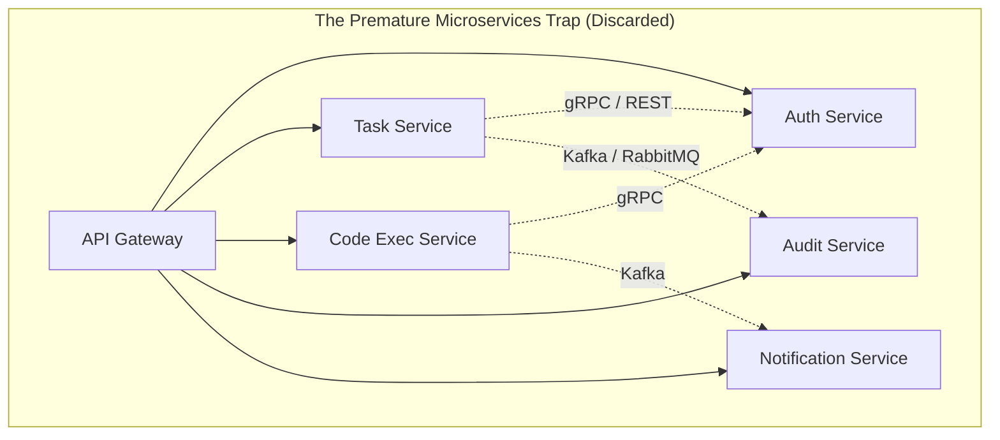
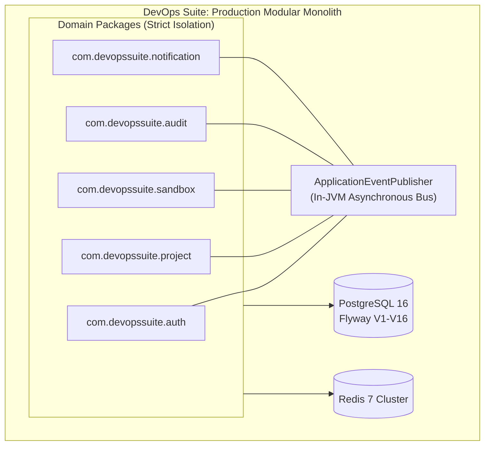
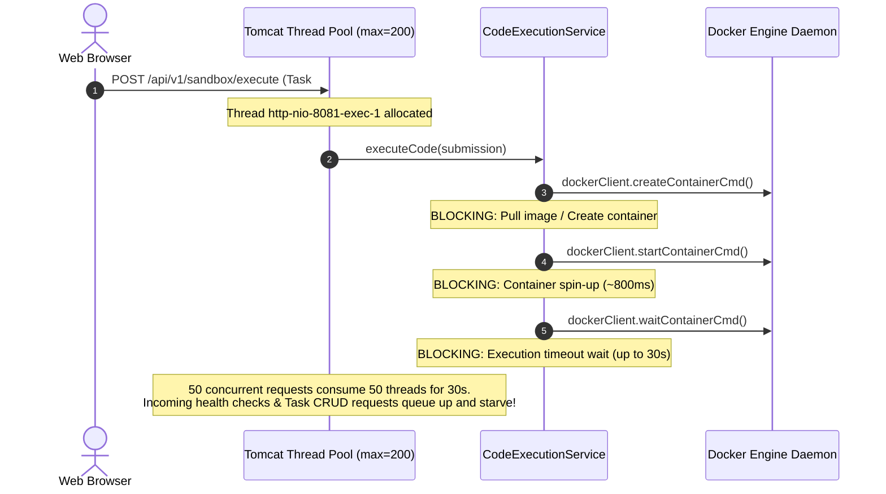
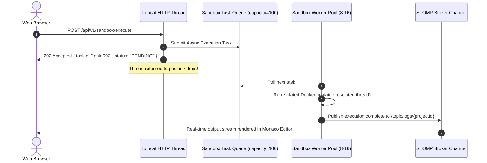
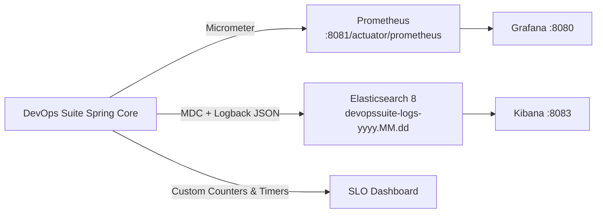
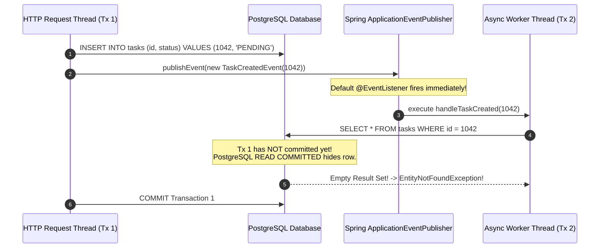

# DevOps Suite Engineering Retrospective & What I Learned

## 1. Executive Summary & Engineering Philosophy

Building **DevOps Suite**—a unified developer platform integrating task management, real-time metrics, audit logging, and an isolated multi-language code execution sandbox—was an intensive trial in systems design, distributed primitives, operational hygiene, and production software engineering.

When architects reflect on software projects, post-mortems often fixate on the tools: *"We used Spring Boot 3, Java 21, React 18, PostgreSQL 16, Redis 7, Docker Engine API, Elasticsearch, and Grafana."* However, the true value of constructing a non-trivial platform lies not in the catalog of frameworks, but in the **architectural scar tissue** accumulated when theory collides with real-world constraints.

```
       ┌─────────────────────────────────────────────────────────────┐
       │             THE MATURATION OF AN ARCHITECT                  │
       └─────────────────────────────────────────────────────────────┘
               Early Assumptions                Production Reality
               ─────────────────                ──────────────────
  Architecture: Microservices everywhere    ──►  Modular Monolith with strict
                                                 bounded contexts & domain events
   Concurrency: Thread pools & @Async       ──►  Backpressure, ring buffers,
                everywhere                       and thread-affinity awareness
     Contracts: "Typescript will catch it"  ──►  Rigid schema validation &
                                                 cross-boundary contract tests
      Security: "Docker is secure isolation"──►  Seccomp, tmpfs noexec traps,
                                                 cgroups, and PID exhaustion
 Observability: Bolt on Prometheus later    ──►  Zero-blind-spot Day-1 metrics,
                                                 MDC tracing, and audit logs
```

This retrospective details the technical epiphanies, subtle traps, operational failures, and deliberate refactorings that shaped DevOps Suite. It serves as both an architectural record and an interview reference for Staff/Principal-level systems questions.

---

## 2. Core Retrospectives & Technical Epiphanies

### 2.1 Lessons in Architecture: The Premature Microservice Trap vs. Pragmatic Modular Monolith

#### The Initial Anti-Pattern
Early in the conception phase, the standard enterprise reflex was to decompose DevOps Suite into 5 independent microservices:
1. `Auth & Identity Service`
2. `Project & Task Management Service`
3. `Code Execution Sandbox Service`
4. `Audit & Metrics Service`
5. `Real-Time Notification Gateway`



#### The Latent Costs of Distributed Fragmentation
Within weeks, the operational and cognitive overhead of this distributed architecture became staggering:
- **Two-Phase Commits & Distributed Sagas**: Creating a project task that triggered an audit log and checked quota required distributed transactions. Network blips left orphan tasks or unrecorded audit states.
- **Contract Drift & Schema Duplication**: DTOs like `UserPrincipal`, `ProjectContext`, and `ExecutionResult` had to be replicated across repositories or maintained in a shared JAR library, defeating independent deployment.
- **Network Latency & Serialization Overhead**: Every browser interaction incurred multiple internal serialization hops (JSON/Protobuf over TCP), ballooning P99 latency.
- **Developer Friction**: Spinning up local environments required Docker Compose files orchestrating 5 JVM runtimes, consuming 6+ GB of RAM before executing a single line of business logic.

#### The Strategic Pivot: The Modular Monolith
We pivoted to a unified **Spring Boot 3 (Java 21) Modular Monolith** structured along Domain-Driven Design (DDD) bounded contexts within the single `com.devopssuite` namespace.



#### Key Architecture Lessons
1. **In-JVM Spring Events Eliminate Distributed Middleware**: Instead of operating an external Kafka or RabbitMQ broker for internal domain decoupling, we utilized Spring's `ApplicationEventPublisher` coupled with `@TransactionalEventListener(phase = TransactionPhase.AFTER_COMMIT)`. Domain operations (e.g., `TaskCompletedEvent`) emit memory-safe in-JVM events.
2. **Compile-Time Boundary Enforcement via Package-Private Scope**: Cross-package dependencies are restricted. Services interact via explicit public interfaces; internal entities and repository interfaces remain package-private.
3. **Database Unification with Schema Partitioning**: A single PostgreSQL 16 instance with 16 Flyway migrations eliminates distributed cross-database joins while preserving transactional atomicity.
4. **Velocity Multiplier**: Refactorings that previously required coordinate PRs across 4 repositories collapsed into single, atomic Git commits tested by unified integration suites in seconds.

---

### 2.2 Lessons in Concurrency & Asynchronous Systems: Request Thread Decoupling

#### The Outage Scenario: The HTTP Worker Starvation
During stress testing, triggering 50 concurrent code execution requests caused the entire HTTP API to become unresponsive. Health checks (`/actuator/health`) timed out, and standard CRUD endpoints for tasks hung indefinitely.

#### Root-Cause Autopsy


The application was executing synchronous Docker API calls and blocking socket streams directly on the **Tomcat HTTP Worker Thread** (`http-nio-8081-exec-*`). When 50 execution jobs ran simultaneously, Docker engine lock contention and 30-second execution timeouts locked up worker threads, exhausting Tomcat's thread pool.

A secondary anti-pattern existed in our notification pipeline: sending SMTP verification emails on the registration thread blocked client HTTP requests for 2.4 seconds while negotiating TLS handshakes with mail relays.

#### The Architectural Remedy
1. **Dedicated, Bounded Thread Pools via ThreadPoolTaskExecutor**:
   We implemented strict bulkhead isolation. HTTP threads must never perform unbounded I/O, OS process invocations, or socket waits.

```java
@Configuration
@EnableAsync
public class AsyncThreadPoolConfig {

    @Bean(name = "sandboxExecutionExecutor")
    public Executor sandboxExecutionExecutor() {
        ThreadPoolTaskExecutor executor = new ThreadPoolTaskExecutor();
        executor.setCorePoolSize(8);
        executor.setMaxPoolSize(16);
        executor.setQueueCapacity(100);
        executor.setThreadNamePrefix("sandbox-exec-");
        executor.setRejectedExecutionHandler(new ThreadPoolExecutor.AbortPolicy());
        executor.initialize();
        return executor;
    }

    @Bean(name = "notificationExecutor")
    public Executor notificationExecutor() {
        ThreadPoolTaskExecutor executor = new ThreadPoolTaskExecutor();
        executor.setCorePoolSize(4);
        executor.setMaxPoolSize(8);
        executor.setQueueCapacity(500);
        executor.setThreadNamePrefix("async-notify-");
        executor.setRejectedExecutionHandler(new ThreadPoolExecutor.CallerRunsPolicy());
        executor.initialize();
        return executor;
    }
}
```

2. **Async Polling / WebSocket Delivery Model**:
   Instead of blocking the HTTP thread, endpoints accept the work, immediately return `202 Accepted` with a `taskId`, dispatch execution to `sandboxExecutionExecutor`, and publish status changes through STOMP over SockJS (`/topic/tasks/{projectId}`).



---

### 2.3 Lessons in Frontend-Backend Contracts: The Silent Failure of Serialization

#### The Bug That Broke Real-Time Telemetry
During an internal release, task progress bars on the React 18 SPA froze permanently at 0%, even though backend logs indicated that execution containers were running and terminating normally.

#### Root-Cause Autopsy
The backend STOMP messaging pipeline emitted a Jackson-serialized payload:
```json
{
  "taskId": "9a4f8c2e-4b71",
  "projectId": 42,
  "executionTimeMs": 1420,
  "statusCode": "COMPLETED"
}
```
Meanwhile, the React frontend STOMP subscription handler in `useTaskSocket.ts` was listening for snake_case properties, following an legacy API contract:
```typescript
interface TaskUpdatePayload {
  task_id: string;
  project_id: number;
  execution_time_ms: number;
  status_code: string;
}

// In the component:
const onMessage = (message: IMessage) => {
  const data: TaskUpdatePayload = JSON.parse(message.body);
  if (data.task_id === currentTaskId) { // undefined === "9a4f8c2e-4b71" -> FALSE!
    updateProgress(data.status_code);
  }
};
```
Because JavaScript evaluates `undefined === "9a4f8c2e-4b71"` as `false`, the message was silently ignored. No exception was thrown. The browser UI remained stuck in a loading state.

#### The Strategic Remedy
1. **Strict Jackson Global Serialization Strategy**: Standardized Spring Boot's `ObjectMapper` via `PropertyNamingStrategies.SNAKE_CASE` or explicit `@JsonProperty` across all DTO boundaries.
2. **Zod Runtime Schema Validation on the Frontend**: Rather than asserting raw types with TypeScript interfaces (which disappear at runtime), all incoming WebSocket and REST frames are validated against Zod schemas.
```typescript
import { z } from 'zod';

export const TaskUpdateSchema = z.object({
  taskId: z.string().uuid(),
  projectId: z.number().int(),
  executionTimeMs: z.number(),
  statusCode: z.enum(['QUEUED', 'RUNNING', 'COMPLETED', 'FAILED'])
});

export type TaskUpdate = z.infer<typeof TaskUpdateSchema>;

// In WebSocket listener:
const parsed = TaskUpdateSchema.safeParse(JSON.parse(message.body));
if (!parsed.success) {
  console.error("Contract violation detected on WebSocket frame!", parsed.error);
  telemetryClient.captureException(parsed.error);
} else {
  handleValidTaskUpdate(parsed.data);
}
```
3. **Contract Integration Tests**: Implemented automated contract tests asserting that JSON serialized by Jackson directly satisfies the frontend client schema fixtures.

---

### 2.4 Lessons in Systems Programming & Security: The C++ Sandbox Compilation Trap

#### The Incident: Exit Code 126 in Read-Only Sandbox
When adding C++ support to the code execution sandbox, Python and JavaScript worked flawlessly, but all C++ compilation attempts crashed with:
```bash
/tmp/compiler_wrapper.sh: line 3: /tmp/solution.out: Permission denied (Exit Code 126)
```

#### Systems Investigation & Security Nuance
To harden the Docker execution environment against malicious user code, we configured defense-in-depth container flags via the Docker Java Client:
- `--network=none` (prevent SSRF and exfiltration)
- `--read-only` (immutable root filesystem to prevent kernel exploits or persistent rootkits)
- `--memory=256m` / `--cpus=1` (cgroup resource limits)
- `--pids-limit=50` (fork bomb mitigation)
- `tmpfs /tmp` (ephemeral scratchpad for compilation artifacts)

```java
// Vulnerable / Defective Configuration
HostConfig hostConfig = HostConfig.newHostConfig()
    .withNetworkMode("none")
    .withReadonlyRootfs(true)
    .withMemory(256 * 1024 * 1024L)
    .withCpuQuota(100000L)
    .withPidsLimit(50L)
    .withTmpfs(Map.of("/tmp", "rw")); // <--- THE FATAL DEFAULT
```

#### The Systems Reality of Linux Mount Flags
When Linux mounts a `tmpfs` volume without explicit flags, many modern container runtimes or kernel profiles append `noexec` by default, or inherit restrictive mount flags when running inside a read-only container root.
When `g++ -O3 /tmp/solution.cpp -o /tmp/solution.out` compiled the binary, writing the ELF binary succeeded because `/tmp` was `rw`. But when the shell attempted `execve("/tmp/solution.out")`, the kernel immediately rejected the system call with `EACCES` (Permission denied) resulting in shell status `126`.

#### The Architectural Solution
Explicitly specify `exec` permissions on the ephemeral `tmpfs` mount while strictly maintaining all other isolation barriers:
```java
// Production-Hardened Configuration
HostConfig hostConfig = HostConfig.newHostConfig()
    .withNetworkMode("none")
    .withReadonlyRootfs(true)
    .withMemory(256 * 1024 * 1024L)
    .withCpuQuota(100000L)
    .withPidsLimit(50L)
    .withCapDrop(Capability.ALL) // Drop all Linux capabilities
    .withSecurityOpts(List.of("no-new-privileges:true"))
    .withTmpfs(Map.of("/tmp", "rw,exec,size=64m")); // <--- Explicit rw,exec with size bound
```

Furthermore, we established a strict **two-step compilation and execution lifecycle**:
1. Phase 1 (Compilation): Ephemeral container compiles `solution.cpp` into binary `/tmp/solution.out` with 512MB RAM and 15s timeout.
2. Phase 2 (Execution): A completely separate, unprivileged container executes `/tmp/solution.out` with stricter 256MB RAM, 1 CPU, 0 network access, and 50 PID limits.

---

### 2.5 Lessons in Observability: Day-1 Instrumentation vs. Retroactive Guessing

#### The Blind Spot
In the first staging deployment, task completions occasionally stalled for 45 seconds without triggering an exception. Searching application logs via grep revealed hundreds of lines like:
```text
2026-04-10 14:22:01.104 INFO  c.d.s.s.CodeExecutionService - Executing task
2026-04-10 14:22:46.198 INFO  c.d.s.s.CodeExecutionService - Task execution complete
```
There was zero visibility into:
- What step took 45 seconds? (Was it Docker image inspection? Disk I/O? Process execution? Stomp broadcast?)
- Which project or user initiated the task?
- What was the database connection pool state at that millisecond?

We had treated observability as a **Day-2 operations feature**—something to wire up before production—rather than a **Day-1 development tool**.

#### The Observability Overhaul
We re-architected the stack with three synchronized telemetry pillars:



1. **Mapped Diagnostic Context (MDC) Tracing Filter**:
   Every HTTP request and WebSocket session is assigned a correlation ID and bound to user context:
```java
public class SecurityMdcFilter extends OncePerRequestFilter {
    @Override
    protected void doFilterInternal(HttpServletRequest request, HttpServletResponse response, FilterChain filterChain)
            throws ServletException, IOException {
        try {
            String traceId = Optional.ofNullable(request.getHeader("X-Request-ID"))
                    .orElseGet(() -> UUID.randomUUID().toString());
            MDC.put("traceId", traceId);
            Authentication auth = SecurityContextHolder.getContext().getAuthentication();
            if (auth != null && auth.isAuthenticated()) {
                MDC.put("userId", auth.getName());
            }
            response.setHeader("X-Request-ID", traceId);
            filterChain.doFilter(request, response);
        } finally {
            MDC.clear();
        }
    }
}
```

2. **Fine-Grained Micrometer Timers**:
   Instrumenting the code execution pipeline revealed the culprit immediately:
```java
Timer.Sample sample = Timer.start(meterRegistry);
try {
    return runDockerContainer(request);
} finally {
    sample.stop(meterRegistry.timer("sandbox.execution.duration", 
        "language", request.getLanguage().name(),
        "status", result.getStatus().name()));
}
```
*The revelation:* The 45-second stall was caused by `dockerClient.inspectImageCmd()` issuing remote registry calls because a local tag had been cleared by Docker garbage collection. Instrumenting Prometheus timers identified the exact 44.8s registry query within 2 minutes of enabling Grafana dashboards.

3. **Elasticsearch Index Lifecycle Management (ILM)**:
   We structured logging to write directly to daily rotating indexes (`devopssuite-logs-yyyy.MM.dd`) with an ILM hot-to-warm policy retaining logs for 180 days before deletion.

---

## 3. Engineering Growth Trajectory & Takeaways

| Dimension | Junior / Early Assumption | Senior / DevOps Suite Implementation | Architect / Production Mindset |
| :--- | :--- | :--- | :--- |
| **System Boundary** | Break every capability into standalone microservices. | High-cohesion, low-coupling **Modular Monolith** in Java 21. | System topology must match organizational size and throughput needs; distribute only when domain scaling demands it. |
| **Concurrency** | Fire-and-forget `@Async` annotations without thread pool limits. | Explicit, isolated `ThreadPoolTaskExecutor` bulkheads with queue capacity and rejection policies. | Understand thread starvation, context-switching overhead, caller-runs backpressure, and JVM garbage collection impact. |
| **API Contracts** | Rely on TypeScript type annotations and manual JSON matching. | Unified Jackson naming strategies + Zod runtime schema validation on clients. | Treat API boundaries as untrusted contracts; enforce runtime type guarantees and bidirectional contract testing. |
| **Execution Sandboxing** | Run `Runtime.getRuntime().exec()` or run plain Docker containers. | Hardened Docker containers with `--read-only`, `tmpfs rw,exec`, cgroups, `cap-drop ALL`, and PID limits. | Defense-in-depth: assume user code is actively attempting host kernel privilege escalation and network escape. |
| **Database Access** | Write ORM queries without inspecting SQL execution plans. | Flyway versioned migrations (V1-V16) + Hibernate `validate` + composite indexing. | Every join is a latency risk; monitor connection pool saturation (`HikariCP`), transaction durations, and query plans (`EXPLAIN ANALYZE`). |
| **Real-Time Web** | Simple HTTP polling every 1000ms. | STOMP over SockJS with user/project topic isolation and fallback transports. | Persistent connections require stateful session handling, heartbeat timeouts, and strict schema serialization guards. |
| **Observability** | Application `System.out.println` or raw unformatted log lines. | MDC correlation IDs, structured JSON logs to Elasticsearch, Micrometer timers to Prometheus & Grafana. | You cannot debug what you cannot observe; telemetry is a core architectural requirement, not an operational afterthought. |

---

## 4. In-Depth Technical Interview Q&A

### 🟢 Basic Level

#### Q1: What was the primary motivation behind keeping DevOps Suite as a modular monolith rather than distributing it into microservices?
**Context**: Evaluates architectural pragmatism, understanding of operational cost, and team velocity trade-offs.

**Answer**:
The decision to build DevOps Suite as a **Modular Monolith** rather than microservices was driven by three primary engineering realities:
1. **Domain Maturity and Evolving Boundaries**: Early in a product's lifecycle, domain boundaries are fluid. In a microservice architecture, refactoring an entity across boundaries requires coordinated database migrations, distributed schema changes, and multi-service deployments. In a modular monolith, boundary adjustments are refactored within a single compile-time codebase.
2. **Elimination of Distributed Transaction Overhead**: DevOps Suite requires strong transactional consistency across task creation, user quota tracking, and audit logging. In microservices, this would necessitate the Saga pattern or two-phase commits with external brokers like Kafka. Within the monolith, we utilized Spring's in-JVM `ApplicationEventPublisher` and `@TransactionalEventListener(phase = TransactionPhase.AFTER_COMMIT)`, ensuring atomicity without distributed rollback complexities.
3. **Operational Simplicity and Resource Efficiency**: DevOps Suite deploys as a single Spring Boot container requiring ~512MB RAM rather than 5 independent JVM runtimes requiring 4+ GB of RAM. This drastically simplifies continuous integration, local development workflows, and container orchestration.

---

#### Q2: What subtle issue occurred with Jackson JSON serialization between the backend and React frontend, and how did you resolve it?
**Context**: Evaluates frontend-backend integration discipline and API contract enforcement.

**Answer**:
During the integration of real-time WebSocket task notifications, our React frontend stopped updating task progress indicators. The root cause was a **naming convention mismatch**:
- The Spring Boot backend serialized DTOs into JSON using camelCase (e.g., `taskId`, `projectId`, `executionTimeMs`).
- The frontend TypeScript interfaces expected snake_case properties (e.g., `task_id`, `project_id`, `execution_time_ms`).

Because JavaScript returns `undefined` for non-existent properties rather than throwing an exception, conditional guards like `if (payload.task_id === activeTaskId)` silently evaluated to `false`.

**Resolution**:
1. We enforced a uniform Jackson property naming strategy across all REST and WebSocket DTOs using `@JsonProperty` annotations and global Jackson configuration.
2. We introduced **Zod runtime schema validation** on the React frontend. Instead of trusting raw TypeScript types (which are stripped during compilation), incoming WebSocket JSON frames pass through `TaskUpdateSchema.safeParse(json)`. If a naming mismatch or unexpected null appears, Zod catches it immediately with descriptive validation errors rather than allowing silent runtime UI failures.

---

### 🟡 Intermediate Level

#### Q3: Why did running user-submitted C++ code in a read-only Docker container fail with Exit Code 126, and how did you engineer the fix?
**Context**: Evaluates systems programming knowledge, Linux filesystem semantics, and container security.

**Answer**:
To protect the host system from untrusted code execution, our Docker sandbox applies aggressive defense-in-depth parameters:
- `--network=none`
- `--read-only` (the root filesystem `/` is completely write-protected)
- `--memory=256m`
- `--cpus=1`
- `tmpfs /tmp` (an in-memory filesystem for temporary files)

When compiling and running C++ code (`g++ /tmp/solution.cpp -o /tmp/solution.out && /tmp/solution.out`), the execution abruptly failed with `Permission denied (Exit Code 126)`.

**Underlying Cause**:
In Linux, when a `tmpfs` volume is mounted in a container that has a read-only rootfs without explicit execution options, the mount defaults to or inherits the `noexec` flag.
- Writing the compiled binary to `/tmp/solution.out` succeeded because `/tmp` was mounted with write (`rw`) permissions.
- However, when the shell invoked `execve()` on `/tmp/solution.out`, the Linux kernel checked the mount table, saw the `noexec` bit on `/tmp`, and rejected the binary execution with `EACCES`.

**Fix**:
We configured the Docker Java client's `HostConfig` to explicitly mount the tmpfs volume with execution rights:
```java
.withTmpfs(Map.of("/tmp", "rw,exec,size=64m"))
```
Additionally, we maintained host security by pairing this with `cap-drop ALL`, `no-new-privileges:true`, and a strict 30-second watchdog execution timer.

---

#### Q4: How did you prevent Tomcat thread pool starvation during long-running code execution requests?
**Context**: Evaluates asynchronous systems design, threading models, and backpressure handling.

**Answer**:
Initially, code execution requests were handled synchronously on the Tomcat HTTP worker thread (`http-nio-8081-exec-*`). Executing code involves Docker container creation, startup, execution wait (up to 30 seconds), log retrieval, and container removal.

When 50 concurrent users submitted code, all 50 Tomcat threads became blocked in socket read calls waiting for the Docker daemon. As a result, incoming requests for standard CRUD operations and `/actuator/health` probes queued up and timed out.

**Resolution**:
We refactored the execution pipeline into an asynchronous, non-blocking architecture:
1. **Decoupled Thread Pools**: Configured an isolated `ThreadPoolTaskExecutor` specifically for sandbox tasks with 8 core threads, 16 max threads, and a bounded queue of 100 tasks.
2. **202 Accepted Async Pattern**: The HTTP controller validates the payload, generates a `taskId`, queues the work, and immediately returns HTTP `202 Accepted` to the client in less than 5 milliseconds, releasing the Tomcat thread.
3. **STOMP Event Broadcast**: The background worker thread executes the container inside the bulkhead pool. As logs and status changes occur, updates are pushed via STOMP over SockJS directly to the client's subscribed topic (`/topic/logs/{projectId}`).

---

### 🔴 Advanced Level

#### Q5: Walk me through a critical concurrency bug you faced with database transactions and asynchronous events in DevOps Suite.
**Context**: Evaluates deep knowledge of Spring transaction management, lifecycle hooks, and race conditions.

**Answer**:
**The Bug**:
When a task was marked completed, an asynchronous notification worker was supposed to fetch the task from the database, compute summary statistics, and broadcast an email and WebSocket alert. Intermittently, the async worker threw `EntityNotFoundException: Task with ID 1042 not found`, even though logs showed the task had just been created!



**Root-Cause Analysis**:
The HTTP service method was annotated with `@Transactional`. It called `taskRepository.save(task)` and immediately invoked `eventPublisher.publishEvent(new TaskCreatedEvent(task.getId()))`.

By default, Spring's `@EventListener` fires **synchronously within the same thread**, or if marked `@Async`, fires **immediately on another thread before the initiating transaction commits**.
Because PostgreSQL operates under `READ COMMITTED` isolation, the asynchronous thread attempted to `SELECT` the task before the HTTP thread's database connection issued `COMMIT`. The row was literally invisible to the worker thread.

**Architectural Fix**:
We replaced the standard listener with Spring's `@TransactionalEventListener`:
```java
@Component
public class TaskEventListener {

    @Async("notificationExecutor")
    @TransactionalEventListener(phase = TransactionPhase.AFTER_COMMIT)
    public void handleTaskCreated(TaskCreatedEvent event) {
        // Guaranteed to execute ONLY after the database transaction has committed!
        Task task = taskRepository.findById(event.getTaskId())
            .orElseThrow(() -> new IllegalStateException("Task must exist post-commit"));
        notificationService.dispatchTaskAlert(task);
    }
}
```
This ensured that the asynchronous task handler only executes when the database changes are durably committed and visible across all database connections.

---

#### Q6: How did you implement real-time log streaming from isolated Docker containers to the React Monaco Editor without memory leaks on the backend?
**Context**: Evaluates streaming protocols, buffer management, Docker Engine API, and WebSocket lifecycle management.

**Answer**:
Streaming execution logs from untrusted user programs poses two distinct hazards:
1. An infinite loop like `while(true) { System.out.println("spam"); }` can generate gigabytes of log output within seconds, causing JVM OutOfMemoryErrors if buffered in memory.
2. Opening unbounded WebSocket frames can overwhelm browser DOM rendering engines.

**Implementation Architecture**:
1. **Docker Frame Callback Stream**:
   We used Docker Java's `ResultCallback.Adapter<Frame>` to attach to the container's stdout/stderr streams.
2. **Sliding Window Chunking and Byte Caps**:
   We enforced a strict per-execution output cap (1MB total log buffer). A custom byte-counting stream accumulator discards output once the cap is exceeded and emits a `[TRUNCATED: Maximum output limit reached]` sentinel.
3. **Throttled Stomp Emission**:
   Instead of emitting a STOMP message for every single line of output (which would trigger thousands of WebSocket frames per second and freeze the browser), we buffered log lines into 50ms batch windows using a lightweight buffer before publishing to `/topic/logs/{projectId}`.
4. **Graceful Disconnect Cleanup**:
   When the client disconnects or navigates away, SockJS disconnect events trigger cancellation tokens that invoke `close()` on the Docker log stream adapter, immediately stopping background frame parsing.

---

### ⚫ Expert Level

#### Q7: Describe how you would redesign DevOps Suite if code execution volume grew from 100 submissions/hour to 100,000 submissions/hour. What fails first, and what is your distributed evolution path?
**Context**: Evaluates Staff/Principal-level system architecture, bottleneck analysis, horizontal scaling strategies, and distributed systems migration.

**Answer**:



```mermaid
flowchart TD
    subgraph Current["DevOps Suite Current (Monolith + Local Docker)"]
        A1[Spring Boot Backend] -->|Docker Java Client via UNIX Socket| D1[Local Docker Daemon]
        D1 --> C1[Containers /tmpfs]
    end

    subgraph Scaled["100,000 Submissions/Hour Distributed Architecture"]
        LB[Load Balancer] --> API1[API Gateway / Monolith Web]
        LB --> API2[API Gateway / Monolith Web]
        
        API1 -->|Enqueues Job| Pulsar[(Apache Kafka / Pulsar Topic)]
        API2 -->|Enqueues Job| Pulsar
        
        Pulsar --> K8sPool[Warm Sandbox Execution Agent Pool]
        
        subgraph K8sPool["Sandbox Kubernetes Cluster (Firecracker / gVisor)"]
            W1[Agent Worker 1] --> Pod1[gVisor Sandbox Pod]
            W2[Agent Worker 2] --> Pod2[gVisor Sandbox Pod]
            W3[Agent Worker 3] --> Pod3[Warm Container Pool]
        end
        
        K8sPool -->|Stream Chunks| RedisPubSub[(Redis Stream / Log Service)]
        RedisPubSub --> WSServer[Dedicated WebSocket Gateway Fleet]
        WSServer --> Client[React SPA Browsers]
    end
```

**1. What Fails First in the Current Architecture?**
- **Docker Engine Daemon Contention**: The Docker daemon communicates over `/var/run/docker.sock`. Managing hundreds of concurrent `containerCreate`, `containerStart`, and `containerWait` calls results in severe Docker daemon lock contention, high kernel CPU context switching, and frequent socket connection timeouts.
- **Local Disk & Inode Exhaustion**: Even with ephemeral containers, Docker layers, container metadata, and log drivers write to `/var/lib/docker/overlay2`, rapidly saturating disk I/O and consuming inodes.
- **Monolith Thread and Memory Starvation**: Managing 10,000 concurrent streaming log adapters within the single backend JVM would trigger GC pauses and exhaust available file descriptors (`ulimit -n`).

**2. The 100k/Hour Distributed Evolution Strategy**:
1. **Decouple Code Execution into a Specialized Agent Pool**:
   - Extract the execution logic from the modular monolith into an independent, stateless **Execution Agent Fleet**.
   - Decouple task submission using a distributed message log (**Apache Kafka** or **AWS SQS**). Submissions are committed to an `execution-requests` topic partitioned by user/priority.
2. **Transition from Docker to MicroVMs (Firecracker / gVisor)**:
   - Docker containers share the host Linux kernel; at 100k executions/hour, zero-day kernel exploits become statistically probable.
   - Replace Docker with **gVisor (`runsc`)** or **AWS Firecracker MicroVMs**. MicroVMs spin up in under 5ms, have an independent minimalist guest kernel, and provide true hardware-assisted hardware virtualization boundaries.
3. **Pre-Warmed Pool Architecture**:
   - Maintain a pool of pre-booted, memory-snapshot MicroVMs ready to accept code payloads via lightweight gRPC, eliminating container cold-start overhead completely.
4. **WebSocket Fleet Separation**:
   - Offload WebSocket STOMP connections to a dedicated gateway fleet (e.g., Node.js or Go-based gateway connected to Redis Pub/Sub), keeping the core business API stateless and shielded from connection saturation.

---

## 5. Architectural Self-Critique: What I Would Do Differently

Reflecting on the architecture of DevOps Suite with the benefit of hindsight, three significant design decisions would be implemented differently from Day 1:

### 1. Unified Outbox Pattern Instead of In-Memory Post-Commit Events
While `@TransactionalEventListener(phase = TransactionPhase.AFTER_COMMIT)` solved transaction visibility issues, it remains vulnerable to **JVM crashes between database commit and event dispatch**. If the server crashes 2 milliseconds after committing a task, the in-memory event is lost forever.
*Better Approach*: Implement the **Transactional Outbox Pattern** using an `outbox_events` table written within the same database transaction, polled by a Debezium CDC (Change Data Capture) connector or a dedicated polling publisher.

### 2. Contract-Driven API Generation (OpenAPI / Orval)
We initially maintained TypeScript types in React and DTOs in Spring manually, resulting in the camelCase vs snake_case synchronization bug.
*Better Approach*: Adopt a single source of truth via **OpenAPI 3.1 specifications**. Using code-generation tools like `openapi-generator` or `Orval`, frontend React Query hooks and Zod schemas would be automatically generated from Spring controller annotations during the CI build pipeline.

### 3. Early Multi-Tenant Resource Isolation in Redis
Early versions stored session tokens, rate-limit buckets, and cached project queries in the same Redis keyspace without explicit tenant prefixes. When a project's real-time task log generation surged, it caused Redis CPU spikes that delayed JWT token validation lookups for unrelated users.
*Better Approach*: Enforce structured keyspace namespacing (e.g., `rate:{userId}:window`, `cache:project:{id}`) and utilize Redis ACLs or separate Redis instances for ephemeral caching vs. mission-critical auth blacklisting.

---

## 6. Quick Reference Summary

```
┌─────────────────────────────────────────────────────────────────────────────┐
│                    DEVOPS SUITE LESSONS LEARNED CHEAT SHEET                 │
├──────────────────────────┬──────────────────────────────────────────────────┤
│ Architectural Style      │ Modular Monolith > Premature Microservices       │
│ Event Bus Strategy       │ Spring in-JVM events with AFTER_COMMIT listeners │
│ Concurrency Model        │ Bulkhead ThreadPoolTaskExecutors + 202 Accepted  │
│ WebSocket Protocol       │ STOMP over SockJS with batch-throttled logs      │
│ Serialization Discipline │ Strict Jackson snake_case + Zod runtime schemas  │
│ Sandbox Security         │ --read-only, tmpfs rw,exec, cap-drop ALL, cgroups│
│ Linux Sandbox Gotcha     │ tmpfs defaults to noexec; causes Exit 126 on ELF │
│ Observability Standard   │ MDC Correlation IDs + Micrometer + Prometheus/ES │
│ Golden Rule              │ "Design for observability and failure on Day 1"  │
└──────────────────────────┴──────────────────────────────────────────────────┘
```
