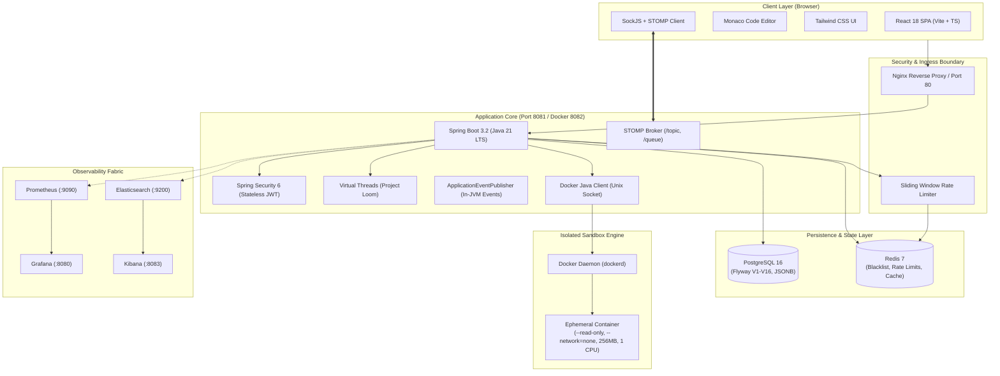
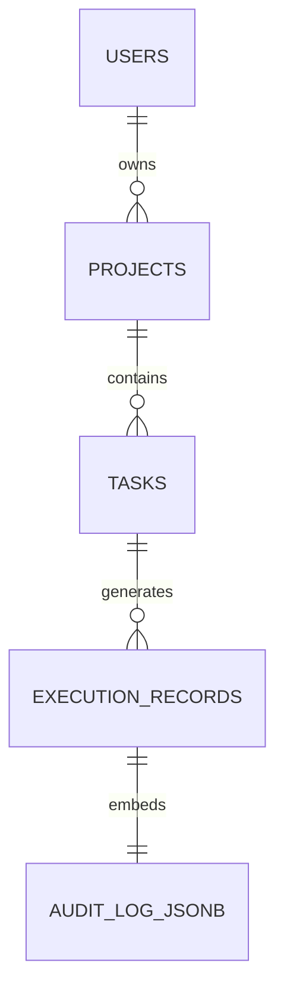
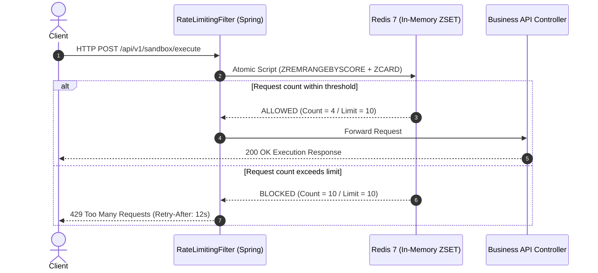
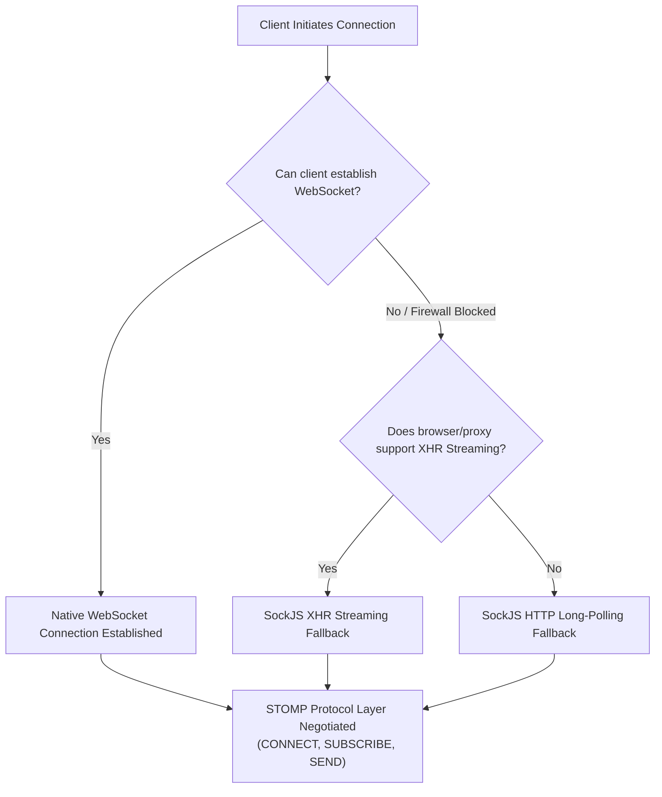
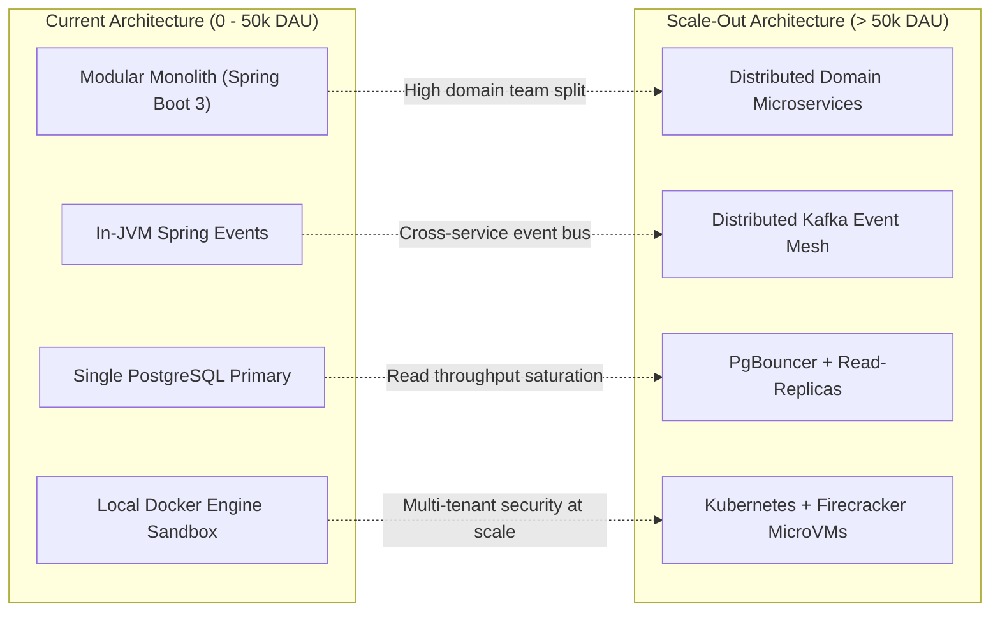

# Technology Stack Rationalization & Architecture Selection Guide

## Executive Overview & Architectural Philosophy

When architecting an enterprise-grade platform such as **DevOps Suite**—a unified developer portal providing project orchestration, multi-language sandbox code execution, CI/CD pipeline monitoring, audit logging, and team collaboration—the choice of technology stack cannot be driven by developer convenience or fleeting industry trends alone. Every architectural choice must balance **security boundaries**, **concurrency performance**, **developer ergonomics**, **operational maintainability**, **long-term ecosystem stability**, and **total cost of ownership (TCO)**.

The DevOps Suite architecture is deliberately realized as a **Modular Monolith** with containerized sidecars and managed infrastructure backing services. The stack comprises:
- **Backend Core**: Java 21 LTS + Spring Boot 3.2.x (Spring Security 6, Spring Data JPA, Virtual Threads Project Loom)
- **Frontend SPA**: React 18 + TypeScript + Vite + Monaco Editor + StompJS/SockJS
- **Design System / Styling**: Tailwind CSS (Utility-First, JIT compiler, Zero-runtime overhead)
- **Relational Persistence**: PostgreSQL 16 (ACID compliance, Row-Level Security readiness, Flyway V1–V16 migrations, JSONB audit logging)
- **In-Memory Caching & Distributed Coordination**: Redis 7 (Sub-millisecond access, Sliding-Window rate limiting, Token blacklisting, Cache-aside pattern)
- **Isolated Code Sandbox**: Docker Java API (`com.github.docker-java`) orchestrating ephemeral rootless containers with kernel-level cgroups and namespace restrictions
- **Full-Duplex Real-Time Engine**: WebSocket via STOMP framing with SockJS graceful degradation fallbacks
- **Unified Observability Fabric**: Dual-pillar telemetry featuring Prometheus + Grafana (metrics) and Elasticsearch + Kibana (structured log aggregation via Logstash Logback encoder with 180-day ILM retention)



---

## 1. Deep Architectural Rationalization by Layer

### 1.1 Backend: Java 21 LTS & Spring Boot 3
The backend engine of DevOps Suite executes mission-critical business logic, user authorization hierarchies, execution job queue management, and transaction demarcation. 

#### Why Java 21 LTS?
1. **Virtual Threads (Project Loom - JEP 444)**: Traditional Java applications relied on platform threads (1:1 mapping with OS kernel threads). Operating systems struggle when handling tens of thousands of concurrent blocking I/O calls (such as waiting for Docker execution completion, database queries, or Redis roundtrips), causing memory starvation (default 1MB stack size per thread) and CPU context-switching overhead. Java 21 Virtual Threads introduce M:N user-mode scheduling onto carrier threads, enabling millions of concurrent requests while retaining synchronous, imperative, easy-to-debug code structures without the cognitive overhead of reactive programming (e.g., Project Reactor/WebFlux).
2. **Modern Language Ergonomics**:
   - **Pattern Matching for Switch & Records (JEP 440/441)**: Drastically reduces boilerplate for Data Transfer Objects (DTOs), immutable event definitions, and complex domain state handlers.
   - **Sequenced Collections (JEP 431)**: Standardizes first/last element access across collections, enhancing algorithmic clarity.
   - **Performance & Garbage Collection**: The Z Garbage Collector (Generational ZGC - JEP 439) delivers sub-millisecond maximum pause times across multi-gigabyte heaps, completely removing GC freeze spikes during execution bursts.

#### Why Spring Boot 3.2+?
1. **Baseline Requirement of Java 17/21 & Jakarta EE 10**: Spring Boot 3 modernizes the core runtime, deprecating legacy `javax.*` packages in favor of `jakarta.*` and enforcing clean modular contracts.
2. **Comprehensive Security Ecosystem (`Spring Security 6`)**: 
   - Non-negotiable security primitives: Built-in defenses against CSRF, clickjacking, and session fixation.
   - Declarative method-level authorization (`@PreAuthorize("hasRole('ADMIN')")`).
   - Clean Filter Chain architecture enabling precise JWT interception, stateless validation, and token blacklisting hooks.
3. **Transaction Demarcation & Data Integrity (`Spring Data JPA`)**: Declarative `@Transactional` orchestration guarantees enterprise consistency across multi-table project and execution states, seamlessly integrating with Hibernate 6.x semantic query analysis.
4. **Production Observability Ready-to-use**: Spring Boot Actuator exposes high-cardinality Micrometer metrics out-of-the-box (`/actuator/prometheus`), health probes for Kubernetes/Docker orchestration, and automated distributed tracing context propagation.

---

### 1.2 Frontend: React 18 & TypeScript with Vite
The DevOps Suite frontend manages highly dynamic state: an interactive code editor, real-time log streaming consoles, nested task trees, interactive execution dashboards, and role-based administrative consoles.

#### Why React 18?
1. **Concurrent Rendering Engine**: Features like `useTransition` and `useDeferredValue` allow the UI to prioritize urgent user interactions (e.g., typing code into the Monaco Editor, clicking execution abort buttons) over non-urgent background UI updates (e.g., streaming batch logs, re-rendering large telemetry tables).
2. **Massive Component Ecosystem**: The developer tool tooling ecosystem (especially Monaco Editor bindings, rich syntax highlighters, AST visualization trees, complex drag-and-drop workflow builders) is overwhelmingly optimized for React.
3. **Strict Type Safety via TypeScript**: Frontend DTOs match backend Java Records 1:1. Compile-time verification catches missing fields, enum mismatches, and nullability issues before code hits production.

#### Why Vite Instead of Create React App (CRA) or Webpack?
1. **Native ESM-Powered Development Server**: Unlike Webpack/CRA, which bundle the entire application into memory before serving, Vite serves source code over native ES Modules (ESM). Only the requested modules are transformed on demand. Server startup drops from 45–90 seconds to under 300 milliseconds.
2. **Instant Hot Module Replacement (HMR)**: HMR speed remains constant regardless of project size because Vite leverages native browser module loading and esbuild for pre-bundling dependencies (10–100x faster than JavaScript-based bundlers).
3. **Production Optimization via Rollup**: Vite uses Rollup for battle-tested, tree-shaken, deterministic production builds with granular chunk-splitting configurations. CRA is officially deprecated by the React team.

---

### 1.3 Styling: Tailwind CSS
DevOps Suite requires a dense, responsive, high-contrast, theme-aware (Dark Mode native) engineering interface.

#### Why Tailwind CSS?
1. **Utility-First Paradigm & Zero CSS Specificity Conflicts**: In traditional BEM or monolithic CSS sheets, specificity wars (`!important` cascades) and dead-code accumulation inevitably degrade maintainability. Tailwind scopes styling directly to the component structure.
2. **Just-In-Time (JIT) Purge Engine & Negligible Bundle Footprint**: Tailwind scans `.tsx` source templates and generates *only* the classes actively utilized. The production CSS file typically compiles down to < 15 KB gzipped, regardless of application complexity.
3. **Design System Standardization**: Enforces strict constraints for typography, border radiuses, z-indices, spacing scales, and hex color palettes (`slate`, `emerald`, `amber`, `rose`), preventing "magic numbers" and visual inconsistencies.
4. **Maintenance Velocity**: Component refactoring is trivial: deleting a component removes its CSS dependencies without leaving orphan style rules.

---

### 1.4 Persistence: PostgreSQL 16 & Flyway Migrations
Data integrity, referential consistency, and auditability are non-negotiable requirements for a platform tracking project assets, execution audits, and enterprise users.

#### Why PostgreSQL 16?
1. **Rock-Solid ACID Compliance**: Uncompromising data durability using Write-Ahead Logging (WAL) and multi-version concurrency control (MVCC).
2. **Hybrid Relational + Document Capabilities (JSONB)**: DevOps Suite stores structured entities (Users, Roles, Projects, Tasks) in normalized relational tables with foreign keys and cascade rules, while execution metadata, compiler flags, and dynamic execution audit logs are stored in indexed `JSONB` columns with GIN index acceleration. This provides the flexibility of a document store without sacrificing transactional integrity.
3. **Flyway Migration Versioning (V1–V16)**: Database schemas are strictly version-controlled within Git. Flyway guarantees deterministic schema evolutions across local development, staging environments, and production clusters with automated checksum validation.

---

### 1.5 Caching, Session Security & Rate Limiting: Redis 7
PostgreSQL handles durable persistence, but high-throughput, low-latency transient data requires an in-memory datastore.

#### Why Redis 7?
1. **Sub-Millisecond Read/Write Latency**: Operating strictly in-memory with asynchronous disk persistence (RDB/AOF), Redis handles tens of thousands of ops/second with sub-millisecond latencies.
2. **Sliding-Window Rate Limiting**: Implemented using Redis Sorted Sets (`ZSET`). The request timestamp serves as both the score and value. By pruning records older than `(currentTime - windowSize)` using `ZREMRANGEBYSCORE` and counting remaining elements via `ZCARD`, the system enforces mathematically precise, non-bursty rate limits across distributed instances.
3. **Stateless JWT Blacklisting**: Stateless JWT tokens cannot be revoked natively until expiration. DevOps Suite implements a blacklist store in Redis: upon logout or permission revocation, the token's JTI (JWT ID) or signature hash is written to Redis with a TTL matching the token's remaining lifespan. The Spring Security filter checks this cache in < 1ms.
4. **Cache-Aside Pattern**: High-frequency queries (e.g., project details, user profile records) are cached with explicit time-to-live (TTL) semantics, mitigating database connection exhaustion.

---

### 1.6 Isolated Code Execution: Docker Java API
DevOps Suite allows users to submit and run arbitrary code in multiple programming languages (Java, Python, C++, Node.js). Executing untrusted code directly on the host JVM or OS is an existential security vulnerability.

#### Why Docker API via Ephemeral Containers?
1. **Complete Linux OS Namespace Isolation**:
   - `PID Namespace`: The executed process cannot view or signal host system processes.
   - `NET Namespace`: Configured with `--network=none` to prevent malicious programs from participating in botnets, exfiltrating secret environment variables, or port-scanning internal company subnets.
   - `MNT Namespace`: Container file system is isolated from the host.
2. **Hard Cgroup Resource Governance**:
   - Memory capped strictly to `256m` (OOM-killer terminates rogue memory allocations immediately).
   - CPU limited to `1.0` cores with strict quota enforcement to prevent CPU starvation attacks (e.g., `while(true)` loops).
   - Process limit (`--pids-limit=50`) prevents fork-bomb denial-of-service exploits.
3. **Hardened File System**:
   - Root filesystem is mounted strictly `--read-only`.
   - Temporary file execution takes place on an in-memory `tmpfs` mounted at `/tmp` (`rw,noexec,nosuid,size=64m`), preventing persistent file system poisoning.
4. **Deterministic Lifecycle**: Managed programmatically through `com.github.docker-java` with an asynchronous watchdog timer enforcing a strict 30-second execution kill switch.

---

### 1.7 Real-Time Communication: WebSocket via STOMP over SockJS
Users demand real-time visibility into test run status, log line emissions, build pipeline steps, and system alerts without polling the server.

#### Why STOMP over SockJS?
1. **STOMP (Simple Text Oriented Messaging Protocol) Framing**: Raw WebSockets are merely bidirectional byte/text streams lacking higher-level protocol semantics. Developers must invent custom serialization envelopes, routing headers, and message-type dispatchers. STOMP introduces standard semantics: `CONNECT`, `SUBSCRIBE`, `SEND`, `MESSAGE`, and `UNSUBSCRIBE`.
2. **Spring Native Broker Messaging**: Spring Boot natively understands STOMP destinations (`@MessageMapping`, `@SubscribeMapping`, `SimpMessagingTemplate`). It provides pub/sub message brokers routing to `/topic/notifications/{userId}`, `/topic/tasks/{projectId}`, and `/topic/logs/{projectId}` out of the box.
3. **SockJS Graceful Fallback**: In corporate networks, enterprise proxies, firewalls, and VPNs frequently terminate or block HTTP `Upgrade: websocket` headers. SockJS transparently negotiates the best available transport: WebSocket -> HTTP Streaming (XHR Streaming) -> HTTP Long Polling, ensuring uninterrupted real-time connectivity.

---

### 1.8 Observability: Prometheus + Grafana & Elasticsearch + Kibana
Enterprise credibility requires verifiable operational health, performance benchmarking, and forensics.

#### Why the Prometheus + Grafana & ELK Stack?
1. **Decoupled Metric & Log Pipelines**:
   - **Metrics (Prometheus)**: Time-series numeric values collected via pull-based scraping (`/actuator/prometheus`) every 15s. Ideal for alerting on memory trends, JVM garbage collection, CPU utilization, HTTP latency percentiles (P95/P99), and active database connection pool counts.
   - **Logs (Elasticsearch)**: High-dimensional text search. Application logs are shipped asynchronously in structured JSON via Logstash Logback encoder, allowing deep query capabilities across request IDs, user IDs, error stack traces, and execution IDs.
2. **Zero Cloud Vendor Lock-In**: Complete data sovereignty. Unlike Datadog, New Relic, or AWS CloudWatch—which impose steep egress and retention costs—the Prometheus and ELK stack runs entirely within self-hosted Docker containers with strict Index Lifecycle Management (ILM) retention policies (180 days).

---

## 2. In-Depth Architectural Decision Matrix

| Dimension | DevOps Suite Choice | Primary Alternatives Considered | Why the DevOps Suite Choice Won | Trade-Off Accepted |
| :--- | :--- | :--- | :--- | :--- |
| **Backend Core** | **Java 21 + Spring Boot 3** | Node.js (NestJS), Go (Gin/Fiber), Python (FastAPI) | Type safety, enterprise transaction management, Spring Security depth, Loom Virtual Threads eliminate I/O scaling limits. | Higher memory baseline footprint compared to Go binaries (~250MB vs ~25MB idle). |
| **Frontend Framework** | **React 18 (Vite)** | Next.js (SSR), Vue 3, Svelte | Client-side dashboard architecture doesn't need SSR SEO; Monaco Editor and rich dev-tool library ecosystem center around React. | Client-side bundle download required upfront; lack of server-side data fetching conventions. |
| **UI Styling** | **Tailwind CSS** | CSS Modules, MUI (Material UI), Styled-Components | Purges unused CSS down to <15KB; eliminates runtime CSS-in-JS performance penalty; guarantees atomic design consistency. | Class name clutter in JSX templates; steep initial utility-class learning curve. |
| **Relational DB** | **PostgreSQL 16** | MongoDB, MySQL 8, MariaDB | Robust ACID compliance; Flyway deterministic migrations; superior JSONB document indexing for dynamic metadata. | Requires explicit schema migrations; horizontal sharding is more complex than MongoDB native sharding. |
| **Caching / Fast State** | **Redis 7** | Memcached, Hazelcast, Local Caffeine Cache | Rich data structures (Sorted Sets for rate limiting, Hashes, String TTLs); distributed across multi-instance backend nodes. | In-memory storage is RAM-expensive; requires independent container maintenance. |
| **Code Sandbox** | **Docker Java Client** | Firecracker MicroVMs, WebAssembly (Wasm), `nsjail` | Wide runtime language support out of the box; battle-tested Linux cgroup/namespace primitives; simple host orchestration. | Heavier process spin-up latency (~400ms container start) compared to microVMs or Wasm (~5ms). |
| **Real-Time Fabric** | **STOMP over SockJS** | Raw WebSockets, Server-Sent Events (SSE), Socket.IO | Structured protocol framing (pub/sub destinations); seamless Spring messaging integration; automatic corporate proxy fallback. | Text framing overhead vs binary WebSocket; SockJS polyfill bundle footprint. |
| **Metrics Telemetry** | **Prometheus + Grafana** | AWS CloudWatch, Datadog | Open-source standard, zero vendor lock-in, rich PromQL querying, native Micrometer actuator scrape integration. | Requires self-managed time-series disk storage and Prometheus scraping configurations. |
| **Log Management** | **Elasticsearch + Kibana** | Loki, CloudWatch Logs, Splunk | Full-text tokenization and inverted index search; lightning-fast stack trace forensics; ILM policy automated lifecycle. | JVM heap overhead for Elasticsearch node; requires log rotation management. |

---

## 3. Comprehensive Interview Questions & Answers

### 🟢 Basic Level

#### Q1: Why did you choose a monolithic architecture with Spring Boot instead of deploying microservices from Day 1?
**Answer:**
We chose a **Modular Monolith** architecture for DevOps Suite deliberately:
1. **Domain Maturity & Boundary Clarity**: DevOps Suite is an integrated platform where Projects, Tasks, Code Execution, and Auditing interact closely. Splitting into microservices prematurely introduces the "distributed monolith" anti-pattern—experiencing all the operational complexities of distributed systems (network latency, distributed transactions, 2-phase commits, eventual consistency bugs, distributed tracing requirements) before domain boundaries have stabilized.
2. **Operational Simplicity**: A single deployable Spring Boot artifact significantly simplifies local development, testing, and continuous deployment pipelines. Small engineering teams can focus on product capabilities instead of maintaining Kubernetes clusters, service meshes (Istio), and API gateways.
3. **Zero Network Serialization Overhead**: In-process module communication occurs via standard Java method invocations or Spring's decoupled `ApplicationEventPublisher`. This provides sub-microsecond latency and compile-time type verification, as opposed to JSON serialization over HTTP/gRPC.
4. **Refactoring Velocity**: Moving domain code between packages inside a single repository takes seconds in modern IDEs. Moving code across microservice boundaries requires API versioning, deprecation periods, and multi-repo orchestration. When scale demands it, cleanly separated modules can easily be extracted into independent microservices.

#### Q2: What advantages does Vite offer over Create React App (CRA) in our frontend build pipeline?
**Answer:**
Create React App (CRA) is fundamentally built on top of Webpack. In Webpack's architecture, before the local development server can serve even a single page, it must parse, resolve, and bundle the entire dependency graph and all source files into JavaScript bundles in memory. As the codebase grows with complex dependencies like Monaco Editor and charting libraries, CRA server startup degrades to 45–90+ seconds, and Hot Module Replacement (HMR) lags noticeably. CRA is also officially unmaintained.

Vite fundamentally reimagines this model:
1. **ESM-Based Dev Server**: It divides code into *dependencies* (pre-bundled once using Go-based `esbuild`, which is 10–100x faster than Webpack) and *source code* (served untransformed over browser-native ES Modules). The browser requests files on demand as they are rendered.
2. **Sub-Second Cold Starts**: Vite starts almost instantaneously (<300ms) regardless of codebase size.
3. **Instantaneous HMR**: When a file is modified, Vite only invalidates and pushes the updated ES module directly to the browser.
4. **Production Build Quality**: Vite uses Rollup for battle-tested tree-shaking, code-splitting, and CSS extraction in production builds.

---

### 🟡 Intermediate Level

#### Q3: Why did you select PostgreSQL over MongoDB for DevOps Suite, especially given that code execution results and audit logs contain variable, dynamic schemas?
**Answer:**
DevOps Suite is fundamentally an enterprise project and user management system where **referential integrity and ACID guarantees are paramount**.



1. **Transactional Integrity**: Creating a project, assigning permissions, updating task states, and recording billing/quota consumptions must happen within atomic, isolated transactions. PostgreSQL provides rock-solid ACID transactions with configurable isolation levels, preventing dirty reads or phantom writes.
2. **The JSONB Hybrid Advantage**: PostgreSQL is not limited to rigid relational tables. Through its native `JSONB` (binary JSON) column type, it provides the best of both worlds:
   - Structured domain entities (Users, Roles, Projects, Tasks) are normalized with strict foreign keys, foreign index constraints, and cascading deletes.
   - Dynamic, polymorphic data (such as compiler output, sandbox execution environment variables, and audit payloads) are stored in `JSONB` columns.
   - PostgreSQL allows GIN (Generalized Inverted Index) indexing on arbitrary JSON keys, enabling sub-millisecond querying inside dynamic document fields (e.g., `WHERE audit_data @> '{"status": "OOM_KILLED"}'`).
3. **Why Not MongoDB?**: MongoDB's document model makes cross-collection referential integrity difficult to enforce. While modern MongoDB supports multi-document transactions, they carry severe performance penalties compared to relational engines and lack robust declarative migration frameworks comparable to Flyway.

#### Q4: Why did you use Tailwind CSS instead of UI component libraries like Material-UI (MUI) or runtime CSS-in-JS like Styled-Components?
**Answer:**
1. **Runtime Performance**: Libraries like Styled-Components and Emotion (used by older versions of MUI) rely on runtime CSS-in-JS. They parse CSS strings, compute dynamic hashes, and inject `<style>` tags into the DOM during React's render phase. In an application like DevOps Suite—where real-time logs stream at 50 messages/sec and Monaco editor coordinates thousands of syntax tokens—runtime CSS-in-JS creates measurable CPU frame drops and garbage collection churn. Tailwind generates plain static CSS at compile time with **zero JavaScript runtime overhead**.
2. **Bundle Size Scalability**: MUI ships hundreds of kilobytes of JavaScript logic for its components. If you only need a fraction of its design system, dead code can still inflate the initial download. In contrast, Tailwind's JIT engine scans the codebase and extracts only the utility classes actually used. The resulting production CSS stylesheet is typically smaller than 15 KB gzipped and stays flat even as the application grows from 10 to 500 components.
3. **Avoiding "Bootstrap Syndrome" & Deep Customization**: Heavy UI libraries like MUI enforce rigid design patterns that require brittle theme overrides (`!important` hacks or complex `sx` prop nests) to fit custom developer-tool aesthetics (such as terminal dark modes, compact tables, and custom split-pane layouts). Tailwind allows atomic, pixel-perfect UI composition natively.

---

### 🔴 Advanced Level

#### Q5: Walk me through the technical justification for using Redis to implement sliding-window rate limiting instead of an in-memory bucket (like Guava RateLimiter) or PostgreSQL.
**Answer:**
Rate limiting is the primary safeguard protecting our API endpoints and container sandbox from denial-of-service (DoS) attacks and brute-force abuse.

1. **Why Not In-Memory (e.g., Guava `RateLimiter` or `Bucket4j` in JVM memory)?**:
   - An in-memory rate limiter stores state inside JVM heap memory. When DevOps Suite scales horizontally to multiple backend instances behind a load balancer, each JVM maintains its own isolated counter. A malicious user could rotate requests across 5 instances and achieve 5x their allocated rate limit.
   - Restarting a container or deploying a new build wipes out all active rate limit histories.
2. **Why Not PostgreSQL?**:
   - High-frequency operations like rate limiting require reading, updating, and expiring timestamps on *every single incoming HTTP request*. Doing this in PostgreSQL incurs transactional row locking, Write-Ahead Log (WAL) disk writes, and connection pool exhaustion, degrading primary database throughput.
3. **The Redis Sliding-Window Solution**:
   - Redis operates purely in-memory with sub-millisecond execution times.
   - We utilize a Redis Sorted Set (`ZSET`) where each request is added with:
     - `Key`: `rate_limit:{userId or IP}:{endpoint}`
     - `Score`: Current Unix timestamp in milliseconds (`currentTimeMillis`)
     - `Value`: Unique request identifier (UUID or timestamp)
   - The entire sliding-window algorithm executes atomically using a Redis transaction (`MULTI`/`EXEC`) or an atomic Lua script:
     ```
     1. ZREMRANGEBYSCORE key 0 (currentTime - windowSizeInMs)   -- Evict stale requests
     2. ZCARD key                                              -- Count remaining requests
     3. If count < limit:
            ZADD key currentTime uniqueId                      -- Record current request
            EXPIRE key (windowSizeInSeconds)                   -- Set TTL on key
            RETURN ALLOWED
        Else:
            RETURN BLOCKED (429 Too Many Requests)
     ```
   - This provides mathematically strict rate limiting that eliminates burst boundary exploits common to fixed-window counter algorithms.



#### Q6: Why did you choose Docker Java API with ephemeral containers instead of WebAssembly (Wasm) or running code via Java's `ProcessBuilder` on the host?
**Answer:**
Running untrusted code submitted by external users is one of the most hazardous operations in software engineering.

1. **Why `ProcessBuilder` Directly on Host is Unacceptable**:
   - Spawning a host process gives the user process direct visibility into the host operating system.
   - A single command (`rm -rf /`, reading `/etc/passwd`, or reading Spring Boot's application properties containing database credentials) would completely compromise the server.
   - Host `ProcessBuilder` provides no native CPU quota caps or memory boundary ceilings, leaving the host vulnerable to memory consumption attacks or fork bombs.
2. **Why Not WebAssembly (Wasm) Yet?**:
   - Wasm runtimes (like Wasmtime or Wasmer) provide fast startup (<5ms) and secure sandboxing.
   - However, WebAssembly does not yet have universal, out-of-the-box language support. Supporting Java compilation, multi-threaded C++ with standard library links, or complex Python packages with native C-extensions (NumPy) inside Wasm is challenging or unsupported.
3. **The Docker Container Isolation Model**:
   - Docker leverages battle-tested Linux kernel primitives:
     - **Namespaces**: Isolates filesystem (`mnt`), process trees (`pid`), and networking (`net`).
     - **Cgroups (Control Groups)**: Enforces hard limits:
       - `--memory=256m` (kernel OOM-killer immediately halts allocations beyond 256MB).
       - `--cpus=1.0` (prevents thread execution from monopolizing host CPU cores).
       - `--pids-limit=50` (prevents fork bombs).
     - **Network Sandboxing**: `--network=none` guarantees the process has no socket interfaces, preventing data exfiltration, port scanning, or malicious network requests.
     - **Filesystem Security**: `--read-only` root filesystem prevents modifying container system binaries. Transient workspace writes occur on an isolated in-memory `tmpfs` at `/tmp`.
   - The Docker Java API (`com.github.docker-java`) allows our Spring Boot service to programmatically manage this entire container lifecycle over the local Unix domain socket (`/var/run/docker.sock`) cleanly.

---

### ⚫ Expert Level

#### Q7: In the real-time layer, why did you choose STOMP over SockJS instead of Server-Sent Events (SSE) or raw WebSocket connections? How does it handle corporate enterprise firewalls?
**Answer:**
When delivering real-time logs, build statuses, and user notifications, architectural requirements include **protocol semantics**, **bidirectional capability**, and **transport fallback resilience**.



1. **Why Not Server-Sent Events (SSE)?**:
   - SSE is strictly unidirectional (server-to-client). While that suffices for log streaming, it cannot handle bidirectional interactions—such as sending real-time interactive input (`stdin`) to a running terminal or code execution session.
   - SSE operates over HTTP/1.1 connections which suffer from the browser connection limit of 6 simultaneous connections per domain unless HTTP/2 is enforced across all proxies.
2. **Why Not Raw WebSockets?**:
   - Raw WebSockets are merely a transport channel; they define how bytes/frames flow, but have no concept of routing, topic subscription, or message intent.
   - With raw WebSockets, the engineering team must invent a proprietary application protocol: defining JSON payloads for `{"action": "subscribe", "channel": "..."}`, error codes, and manual connection lifecycle handlers.
3. **The Architectural Superiority of STOMP over SockJS**:
   - **STOMP as the Protocol Layer**: STOMP standardizes message headers and commands (`CONNECT`, `SUBSCRIBE`, `UNSUBSCRIBE`, `SEND`, `MESSAGE`, `ACK`). Spring Boot natively integrates with STOMP: we annotate Spring methods with `@MessageMapping` and use `SimpMessagingTemplate` to broadcast messages directly to topic destinations (`/topic/logs/{projectId}`). The client simply calls `client.subscribe('/topic/...', callback)`.
   - **SockJS as the Resilient Transport Layer**: In corporate environments, strict corporate firewalls, deep-packet inspection gateways, and legacy proxy servers frequently drop or reject HTTP `101 Switching Protocols` handshake requests.
   - SockJS provides an automated fallback cascade:
     1. Tries native WebSocket transport.
     2. If blocked or terminated, falls back transparently to HTTP Streaming (`xhr_streaming`).
     3. If streaming is blocked, falls back to HTTP Long-Polling (`xhr_polling`).
   - The end user experiences uninterrupted real-time streaming regardless of network infrastructure constraints.

#### Q8: Defend our observability architecture (Prometheus + Grafana and Elasticsearch + Kibana) against a unified cloud-native APM solution like Datadog or AWS CloudWatch.
**Answer:**
While all-in-one SaaS platforms like Datadog or AWS CloudWatch offer quick initial setups, our self-hosted Prometheus + ELK architecture was chosen based on **data sovereignty**, **high-cardinality cost predictability**, and **separation of telemetry concerns**.

1. **Telemetry Segregation: Metrics vs. Logs**:
   - Metrics and Logs serve fundamentally different operational purposes and possess different data characteristics:
     - **Prometheus (Time-Series Metrics)**: Highly structured, numerical, aggregatable data points sampled periodically. Prometheus uses a pull model, scraping Spring Boot's `/actuator/prometheus` endpoint every 15s. It stores metrics in an optimized TSDB format with delta-of-delta timestamp compression, ideal for real-time alerting, SLI/SLO tracking, and Grafana dashboard visualization.
     - **Elasticsearch (Structured Event Logs)**: High-dimensional, unstructured or semi-structured text data generated intermittently. Shipped via the Logstash Logback encoder over TCP/HTTP as structured JSON. It utilizes an inverted index (Lucene) optimized for fast free-text search, regex analysis, and stack trace investigations.
   - Combining both into a single inappropriate engine degrades performance: running full-text search engines for pure numerical time series causes excessive disk utilization, while time-series engines cannot tokenize stack traces.
2. **The Cloud Vendor Lock-In & Cost Trap**:
   - **Predictable TCO**: SaaS platforms like Datadog charge aggressively on custom metrics, indexed log volumes, and host counts. During a production incident or denial-of-service attack, application log volume can surge by 100x. With Datadog or CloudWatch, this leads to unexpected, uncontrolled billing spikes.
   - **Self-Hosted Cost Control**: With Elasticsearch, we enforce strict **Index Lifecycle Management (ILM)**:
     - `Hot Phase` (Days 1–7): Fast SSD writes and queries.
     - `Warm Phase` (Days 8–30): Read-only indices, shrink and force-merge segments.
     - `Cold Phase` (Days 31–180): Compressed indices on cheaper storage.
     - `Delete Phase` (>180 days): Automated deletion, bounding disk usage predictably.
3. **Data Privacy & Security Governance**:
   - In a DevOps platform handling source code, pipeline scripts, and execution outputs, sensitive runtime parameters or proprietary code snippets may accidentally appear in application logs. Storing logs in our private Elasticsearch instance ensures source code never leaves our security perimeter, complying with strict enterprise data governance policies.

---

## 4. Architectural Evolution: When and How to Evolve This Stack

A mature engineering organization recognizes that architectures must evolve as operational scales shift. The table below outlines our planned evolutionary paths when specific threshold triggers are reached:



| Component | Current State | Evolution Trigger (Threshold) | Target Evolution | Rationale |
| :--- | :--- | :--- | :--- | :--- |
| **Event Bus** | In-JVM `ApplicationEventPublisher` | Cross-service consumption or > 5,000 asynchronous events/sec | **Apache Kafka** or **RabbitMQ** | Decouples event producers and consumers across physical network nodes; provides persistent event replay capabilities. |
| **Sandbox Execution** | Local Docker Engine via Unix Socket | > 50 concurrent executions/sec or multi-node cluster requirement | **Firecracker MicroVMs** or **Kubernetes Jobs (Kata Containers)** | MicroVMs boot in < 10ms with minimal memory footprint and hardware-level virtualization isolation (KVM). |
| **Database Scaling** | Single PostgreSQL Primary with HikariCP | Connection exhaustion or Read:Write ratio > 10:1 | **PgBouncer** connection pooler + **Streaming Read Replicas** | Offloads reporting and dashboard read traffic from the primary transactional instance; multiplexes connection pools. |
| **Service Boundaries** | Modular Monolith | Engineering organization expands beyond 30+ engineers across distinct domains | **Microservices Architecture** via Spring Cloud / gRPC | Allows independent deployment cadences and team ownership per bounded context. |

---

## 5. Quick Reference Summary

> [!TIP]
> **Key Architecture Talking Points for System Design & Behavioral Interviews:**
> - **Java 21 Virtual Threads**: Enables high-concurrency blocking I/O (database, Redis, Docker APIs) without the code complexity of reactive streams.
> - **Modular Monolith First**: Balances team velocity and refactoring agility while keeping boundaries clean for future microservice extraction.
> - **Postgres + JSONB Hybrid**: Combines ACID-guaranteed relational data with schemaless flexibility for execution outputs and audit logging.
> - **Redis Sliding-Window Rate Limiting**: Distributed, sub-millisecond, mathematically fair request throttling via atomic Sorted Set operations.
> - **Docker Container Sandboxing**: Hard cgroup memory (256MB) and CPU (1.0) caps, read-only root filesystems, and disconnected networking (`--network=none`) to safely isolate untrusted user code.
> - **STOMP over SockJS**: Provides real-time pub/sub framing with automatic fallback to HTTP streaming or polling behind restrictive corporate firewalls.
> - **Telemetry Decoupling**: Prometheus handles time-series metrics without vendor lock-in; Elasticsearch provides high-cardinality structured log analysis with 180-day automated lifecycle retention.
