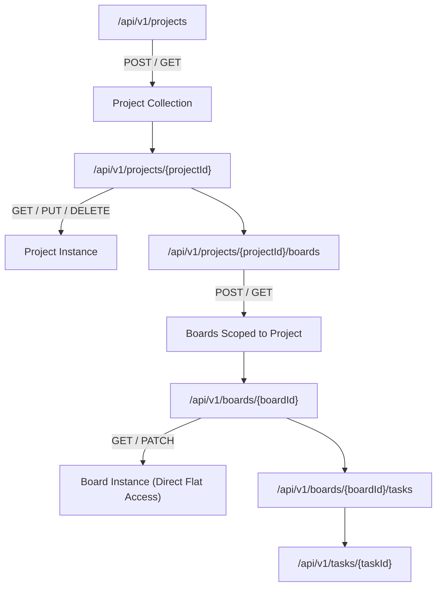
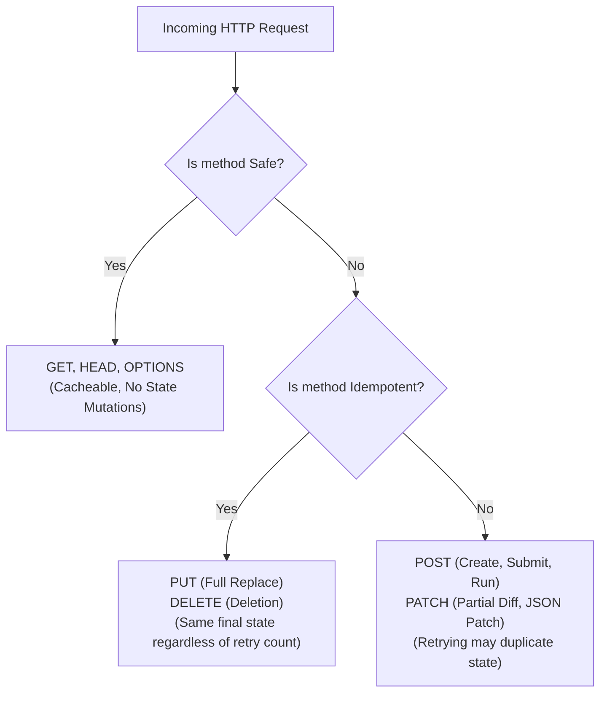
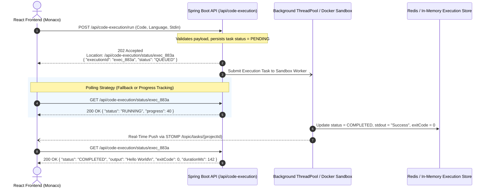
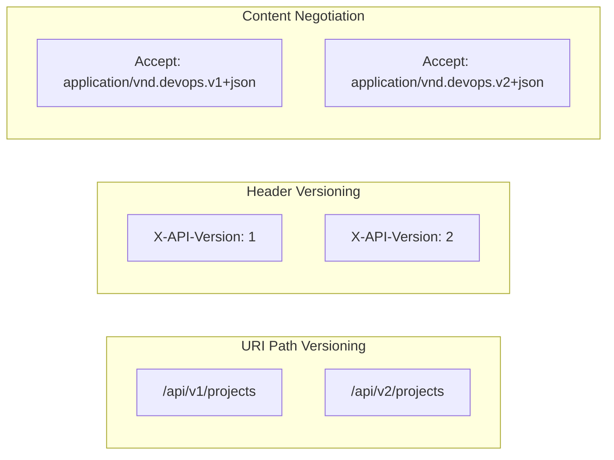
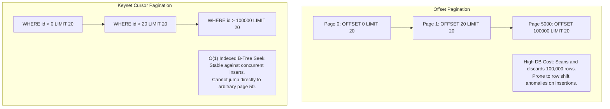
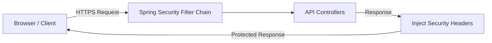
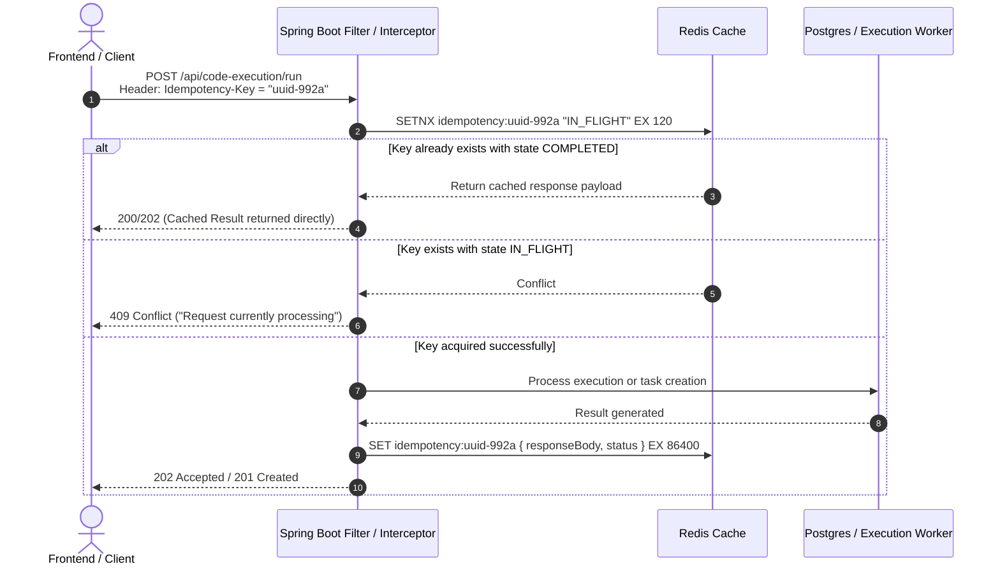
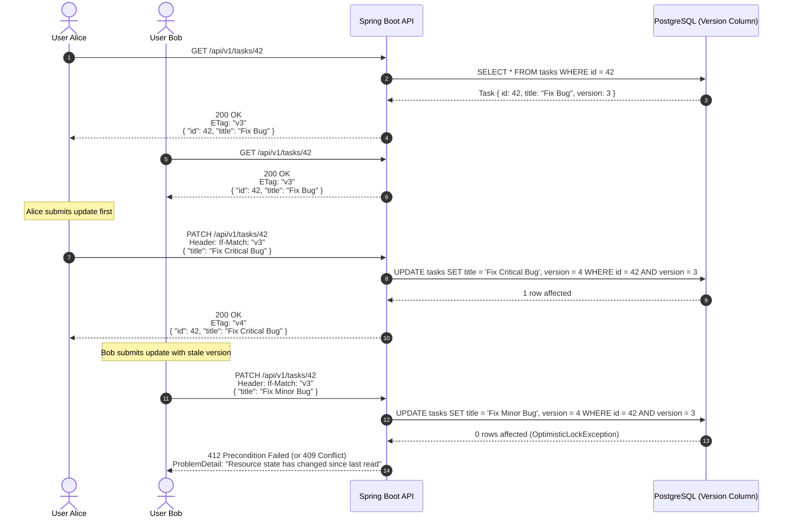

# RESTful API Design & Architectural Standards in DevOps Suite

## Overview & Architectural Philosophy

In enterprise software engineering and cloud-native systems like **DevOps Suite**, the Application Programming Interface (API) represents the foundational contract between clients (the React 18 SPA frontend, external developer CLI tools, automation scripts, and webhook listeners) and backend server-side resources (the Spring Boot 3 monolith).

A poorly designed API leads to tight coupling, leaky domain abstractions, chatty network interactions, unpredictable payload schemas, cascading breaking changes, and operational security vulnerabilities. In DevOps Suite, our RESTful API design adheres to pragmatic, production-grade principles rooted in Roy Fielding’s REST architectural style, modernized with RFC standards (such as **RFC 7807** Problem Details), Spring Data pagination, clear idempotency semantics, and asynchronous polling workflows for long-running computational workloads (like containerized code execution).

```
                      +---------------------------------------+
                      |         React 18 SPA Frontend         |
                      |  (Vite, Axios, Monaco, StompJS/SockJS)|
                      +-------------------+-------------------+
                                          |
                      JSON / REST (HTTP/1.1 & HTTP/2) + WebSocket STOMP
                                          |
                                          v
+-----------------------------------------------------------------------------------+
|                        Spring Boot 3 (Java 21) Monolith                           |
|                                                                                   |
|  +------------------------+  +----------------------+  +-----------------------+  |
|  |     Filter Chain       |  |  Global Controller   |  |   API Versioning      |  |
|  | RateLimit/JWT/Security |  |       Advice         |  |   URI: /api/v1/...    |  |
|  +-----------+------------+  +----------+-----------+  +-----------+-----------+  |
|              |                          |                          |              |
|              +--------------------------+--------------------------+              |
|                                         |                                         |
|                                         v                                         |
|  +-----------------------------------------------------------------------------+  |
|  |                          REST Controllers                                   |  |
|  |   ProjectController | BoardController | TaskController | CodeExecController |  |
|  +--------------------------------------+--------------------------------------+  |
|                                         |                                         |
|               +-------------------------+-------------------------+               |
|               v                                                   v               |
|  +---------------------------+                      +--------------------------+  |
|  |   Synchronous REST CRUD   |                      |    Asynchronous Jobs     |  |
|  | (Pageable, RFC 7807, DTO) |                      | 202 Accepted + Location  |  |
|  +-------------+-------------+                      +-------------+------------+  |
|                |                                                  |               |
+----------------|--------------------------------------------------|---------------+
                 |                                                  |
                 v                                                  v
     +-----------------------+                         +-------------------------+
     |   PostgreSQL 16 DB    |                         |  Docker Execution Host  |
     | (Flyway Schema V1-16) |                         | (Ephemeral / Sandboxed) |
     +-----------------------+                         +-------------------------+
```

---

## 1. Resource-Oriented URL Design

### 1.1 Nouns Over Verbs
REST models system functionality as operations on *resources*, not procedural subroutine calls. Endpoints represent entities or entity collections, with the HTTP method determining the action:
* **Anti-Pattern (RPC style)**:
  * `POST /api/v1/createProject`
  * `GET  /api/v1/getProjectById?id=42`
  * `POST /api/v1/updateProject`
  * `POST /api/v1/deleteProject?id=42`
* **DevOps Suite Standard (RESTful style)**:
  * `POST   /api/v1/projects` (Create project)
  * `GET    /api/v1/projects/42` (Retrieve project)
  * `PUT    /api/v1/projects/42` (Full replacement)
  * `PATCH  /api/v1/projects/42` (Partial attribute update)
  * `DELETE /api/v1/projects/42` (Remove project)

### 1.2 Plural Collection Names
DevOps Suite standardizes on lowercase, hyphenated (kebab-case) plural nouns for collection endpoints:
* `/api/v1/projects` (Collection)
* `/api/v1/projects/{projectId}` (Individual item)
* `/api/v1/code-executions` (Collection of code execution runs)
* `/api/v1/users/{userId}/audit-logs` (Sub-resource collection)

### 1.3 Hierarchical Nesting vs. Flat Endpoint Modeling
A common design trap is over-nesting resources. While domain hierarchies can be deep, nesting URLs deeper than 2 or 3 levels introduces severe drawbacks:
* URL bloat and brittle client routing.
* Complex controller signature mapping.
* Redundant parent identity validation.

#### DevOps Suite Rule of Thumb: Maximum 2 Levels of Nesting
When an entity cannot exist without its parent (strong composition / aggregate root), use scoped nesting. Once an entity possesses a globally unique identifier (UUID or database sequence ID), prefer flat direct access for item operations.



#### Comparison of Nesting Approaches:

| Pattern | Deeply Nested (Anti-Pattern) | DevOps Suite Hybrid Model |
| :--- | :--- | :--- |
| **Create Task** | `POST /api/v1/projects/{pId}/boards/{bId}/columns/{cId}/tasks` | `POST /api/v1/columns/{columnId}/tasks` |
| **Fetch Task** | `GET /api/v1/projects/{pId}/boards/{bId}/columns/{cId}/tasks/{tId}` | `GET /api/v1/tasks/{taskId}` |
| **Move Task** | `PUT /api/v1/projects/{pId}/boards/{bId}/columns/{cId}/tasks/{tId}/move` | `PATCH /api/v1/tasks/{taskId}` with `{ "columnId": 5, "position": 2 }` |

### 1.4 Handling Non-CRUD Business Actions
Certain domain behaviors do not neatly map to generic CRUD mutations (e.g., locking a project, triggering a build, cloning a board, or submitting code). DevOps Suite handles non-CRUD actions using two canonical patterns:

1. **Sub-resource State Transition Controller**:
   Treat the transition or action as an ephemeral or permanent child resource.
   * `POST /api/v1/projects/{projectId}/lock`
   * `POST /api/v1/boards/{boardId}/clones`
2. **Controller Controller Pattern (RPC-style action as noun)**:
   * `POST /api/v1/code-execution/run` (Initiates an execution run resource)
   * `POST /api/v1/auth/logout` (Invalidates session/JWT blacklist)

---

## 2. HTTP Verb Semantics & Status Codes

HTTP defines strict semantic properties for request methods regarding **safety** and **idempotency**:
* **Safe**: Invoking the method produces no side effects on the server state (read-only).
* **Idempotent**: Making multiple identical requests produces the exact same server-side state as making a single request (`f(f(x)) = f(x)`).



### 2.1 HTTP Methods Matrix in DevOps Suite

| Method | Safe | Idempotent | Target URI | Success Status | DevOps Suite Usage Example |
| :--- | :---: | :---: | :--- | :--- | :--- |
| `GET` | **Yes** | **Yes** | `/api/v1/projects/{id}` | `200 OK` | Fetch project details or list paginated tasks. |
| `POST` | **No** | **No** | `/api/v1/projects` | `201 Created` | Create a new entity with auto-generated ID. |
| `POST` | **No** | **No** | `/api/code-execution/run`| `202 Accepted` | Submit asynchronous batch or sandboxed execution job. |
| `PUT` | **No** | **Yes** | `/api/v1/projects/{id}` | `200 OK` / `204 No Content` | Complete entity replacement. Requires full payload. |
| `PATCH`| **No** | **No\*** | `/api/v1/tasks/{id}` | `200 OK` | Partial update of entity fields (e.g., status, title). |
| `DELETE`| **No** | **Yes** | `/api/v1/projects/{id}` | `204 No Content` | Soft or hard deletion of an identified resource. |
| `HEAD` | **Yes** | **Yes** | `/api/v1/projects/{id}` | `200 OK` | Fetch metadata headers (e.g. `Content-Length`, `ETag`). |
| `OPTIONS`|**Yes** | **Yes** | `/api/v1/*` | `204 No Content` | CORS preflight negotiation. |

*\* Note on PATCH idempotency: While RFC 5789 states PATCH is not inherently idempotent (e.g., appending items to a list via JSON Patch), partial field updates sending absolute target values (`{ "status": "IN_PROGRESS" }`) are de facto idempotent in DevOps Suite.*

### 2.2 Standard Success Status Codes

* **`200 OK`**: Standard response for successful synchronous `GET`, `PUT`, or `PATCH`. The response body contains the updated or requested entity representation.
* **`201 Created`**: Returned by `POST` when a resource is synchronously created.
  * **Requirement**: Must include a `Location` header pointing to the URI of the newly created resource (e.g., `Location: /api/v1/projects/987`).
* **`202 Accepted`**: Request validated and accepted for background processing, but execution has not finished. Standard for Docker sandboxed code execution.
* **`204 No Content`**: Request executed successfully, but no response body is sent. Standard for `DELETE` operations and certain `PUT`/`PATCH` endpoints where the client does not require an echo of the state.

### 2.3 Standard Client & Server Error Codes

* **`400 Bad Request`**: Malformed JSON, missing required headers, or validation failures (`MethodArgumentNotValidException`).
* **`401 Unauthorized`**: Authentication credentials are missing, expired, or invalid (e.g., invalid Bearer JWT or blacklisted token).
* **`403 Forbidden`**: Authenticated user lacks RBAC authority for the target resource (e.g., `DEVELOPER` attempting to purge project audit logs).
* **`404 Not Found`**: Target URI does not resolve to an active entity.
* **`405 Method Not Allowed`**: Request method not supported on the target endpoint (e.g., `DELETE /api/v1/auth/login`).
* **`409 Conflict`**: State conflict (e.g., optimistic locking version mismatch, duplicate unique slug/email).
* **`422 Unprocessable Content`**: Syntactically valid JSON failing semantic business rules (e.g., start date is after end date).
* **`429 Too Many Requests`**: Client exceeded rate-limiting thresholds (enforced via Redis sliding window). Includes `Retry-After` header.
* **`500 Internal Server Error`**: Unhandled runtime exceptions or infrastructure faults.
* **`503 Service Unavailable`**: Docker daemon disconnected or database connection pool exhausted.

---

## 3. Uniform Error Responses & RFC 7807 Problem Details

Production REST APIs must never return generic HTML error pages, raw stack traces, or inconsistent error shapes across controllers. DevOps Suite standardizes on **RFC 7807 (Problem Details for HTTP APIs)**, enhanced with project metadata.

### 3.1 RFC 7807 Specification Standard
RFC 7807 defines a standardized JSON structure with the `application/problem+json` media type:
* `type`: A URI reference identifying the error type.
* `title`: A short, human-readable summary of the problem type.
* `status`: The HTTP status code generated by the origin server.
* `detail`: A human-readable explanation specific to this occurrence.
* `instance`: A URI reference that identifies the specific occurrence of the problem.

### 3.2 DevOps Suite Error Contract Implementation

```json
{
  "type": "https://api.devopssuite.io/errors/validation-failed",
  "title": "Bad Request",
  "status": 400,
  "detail": "Input validation failed for 2 fields",
  "instance": "/api/v1/projects/101/tasks",
  "timestamp": "2026-10-08T15:30:00Z",
  "errorCode": "ERR_VALIDATION_FAILURE",
  "errors": [
    {
      "field": "title",
      "rejectedValue": "",
      "message": "Task title cannot be blank"
    },
    {
      "field": "priority",
      "rejectedValue": "SUPER_HIGH",
      "message": "Priority must be one of: LOW, MEDIUM, HIGH, CRITICAL"
    }
  ]
}
```

### 3.3 Spring Boot 3 `ResponseEntityExceptionHandler` Implementation

In Spring Boot 3, Spring natively incorporates `ProblemDetail`. DevOps Suite configures `@RestControllerAdvice` to translate domain and framework exceptions into uniform problem representations:

```java
package com.devopssuite.common.exception;

import org.springframework.http.HttpStatus;
import org.springframework.http.ProblemDetail;
import org.springframework.http.ResponseEntity;
import org.springframework.validation.FieldError;
import org.springframework.web.bind.MethodArgumentNotValidException;
import org.springframework.web.bind.annotation.ExceptionHandler;
import org.springframework.web.bind.annotation.RestControllerAdvice;
import org.springframework.web.context.request.ServletWebRequest;
import org.springframework.web.context.request.WebRequest;

import java.net.URI;
import java.time.Instant;
import java.util.List;
import java.util.Map;
import java.util.stream.Collectors;

@RestControllerAdvice
public class GlobalApiExceptionHandler {

    @ExceptionHandler(MethodArgumentNotValidException.class)
    public ResponseEntity<ProblemDetail> handleValidationException(
            MethodArgumentNotValidException ex, WebRequest request) {

        ProblemDetail problem = ProblemDetail.forStatusAndDetail(
                HttpStatus.BAD_REQUEST, "Input validation failed for one or more fields");

        problem.setType(URI.create("https://api.devopssuite.io/errors/validation-failed"));
        problem.setTitle("Validation Error");
        problem.setInstance(URI.create(((ServletWebRequest) request).getRequest().getRequestURI()));
        problem.setProperty("timestamp", Instant.now());
        problem.setProperty("errorCode", "ERR_VALIDATION_FAILURE");

        List<Map<String, String>> fieldErrors = ex.getBindingResult().getFieldErrors().stream()
                .map(err -> Map.of(
                        "field", err.getField(),
                        "message", err.getDefaultMessage() != null ? err.getDefaultMessage() : "Invalid value",
                        "rejectedValue", String.valueOf(err.getRejectedValue())
                ))
                .collect(Collectors.toList());

        problem.setProperty("errors", fieldErrors);

        return ResponseEntity.status(HttpStatus.BAD_REQUEST).body(problem);
    }

    @ExceptionHandler(ResourceNotFoundException.class)
    public ResponseEntity<ProblemDetail> handleNotFoundException(
            ResourceNotFoundException ex, WebRequest request) {

        ProblemDetail problem = ProblemDetail.forStatusAndDetail(
                HttpStatus.NOT_FOUND, ex.getMessage());

        problem.setType(URI.create("https://api.devopssuite.io/errors/not-found"));
        problem.setTitle("Resource Not Found");
        problem.setInstance(URI.create(((ServletWebRequest) request).getRequest().getRequestURI()));
        problem.setProperty("timestamp", Instant.now());
        problem.setProperty("errorCode", "ERR_RESOURCE_NOT_FOUND");

        return ResponseEntity.status(HttpStatus.NOT_FOUND).body(problem);
    }

    @ExceptionHandler(ResourceConflictException.class)
    public ResponseEntity<ProblemDetail> handleConflictException(
            ResourceConflictException ex, WebRequest request) {

        ProblemDetail problem = ProblemDetail.forStatusAndDetail(
                HttpStatus.CONFLICT, ex.getMessage());

        problem.setType(URI.create("https://api.devopssuite.io/errors/state-conflict"));
        problem.setTitle("Conflict");
        problem.setInstance(URI.create(((ServletWebRequest) request).getRequest().getRequestURI()));
        problem.setProperty("timestamp", Instant.now());
        problem.setProperty("errorCode", "ERR_STATE_CONFLICT");

        return ResponseEntity.status(HttpStatus.CONFLICT).body(problem);
    }
}
```

---

## 4. Asynchronous API Design: Long-Running Workloads

In DevOps Suite, user code submitted via the Monaco Editor cannot be executed synchronously on the main HTTP servlet thread. Sandboxing inside Docker containers (spawning, compiling, running with memory/CPU limits, capturing stdout/stderr) takes between 500ms and 30 seconds. Holding an HTTP connection open causes servlet thread pool starvation, reverse-proxy gateway timeouts (`504 Gateway Timeout`), and poor UX.

### 4.1 Asynchronous Execution Pattern Sequence
DevOps Suite implements the canonical **HTTP 202 Accepted + Polling Location** asynchronous design pattern, augmented with STOMP WebSocket notifications.



### 4.2 Asynchronous Controller Implementation

```java
package com.devopssuite.execution.controller;

import com.devopssuite.execution.dto.CodeExecutionRequest;
import com.devopssuite.execution.dto.CodeExecutionResponse;
import com.devopssuite.execution.service.DockerExecutionService;
import jakarta.validation.Valid;
import lombok.RequiredArgsConstructor;
import org.springframework.http.HttpHeaders;
import org.springframework.http.HttpStatus;
import org.springframework.http.ResponseEntity;
import org.springframework.web.bind.annotation.*;
import org.springframework.web.servlet.support.ServletUriComponentsBuilder;

import java.net.URI;

@RestController
@RequestMapping("/api/code-execution")
@RequiredArgsConstructor
public class CodeExecutionController {

    private final DockerExecutionService dockerExecutionService;

    @PostMapping("/run")
    public ResponseEntity<CodeExecutionResponse> submitExecution(
            @Valid @RequestBody CodeExecutionRequest request) {

        // Enqueue the job asynchronously
        CodeExecutionResponse acceptedJob = dockerExecutionService.enqueueExecution(request);

        // Build the Polling Location URL
        URI statusLocation = ServletUriComponentsBuilder.fromCurrentContextPath()
                .path("/api/code-execution/status/{id}")
                .buildAndExpand(acceptedJob.getExecutionId())
                .toUri();

        return ResponseEntity.status(HttpStatus.ACCEPTED)
                .location(statusLocation)
                .header(HttpHeaders.RETRY_AFTER, "2") // Hint to poll after 2 seconds
                .body(acceptedJob);
    }

    @GetMapping("/status/{executionId}")
    public ResponseEntity<CodeExecutionResponse> getExecutionStatus(
            @PathVariable String executionId) {
        
        CodeExecutionResponse status = dockerExecutionService.getExecutionStatus(executionId);
        return ResponseEntity.ok(status);
    }
}
```

---

## 5. API Versioning Strategies

As systems evolve, breaking changes (renaming fields, changing data types, removing endpoints) are inevitable. A robust versioning strategy prevents breaking legacy mobile apps, external integration scripts, or older web UI builds.



### 5.1 Comparative Architecture of Versioning Approaches

| Versioning Strategy | Syntax Example | Pros | Cons | DevOps Suite Decision |
| :--- | :--- | :--- | :--- | :--- |
| **URI Path Versioning** | `/api/v1/projects`<br/>`/api/v2/projects` | • Highly visible & explicit.<br/>• Trivial caching in reverse proxies (Nginx/Cloudflare).<br/>• Easy to test in browser and Postman. | • Violates strict REST purism (URI identifies resource, not representation).<br/>• Code duplication across version controllers. | **Selected Standard**: Primary strategy across all business APIs for clarity and cache-friendliness. |
| **Custom Request Header** | `X-API-Version: 2`<br/>`X-App-Version: 2026-10` | • Clean URIs.<br/>• Version applies across many calls without URL rewrite. | • Harder to cache (requires `Vary: X-API-Version`).<br/>• Hidden from browser address bar.<br/>• CDN edge rule complexity. | Used only for internal infrastructure and telemetry negotiation. |
| **Content Negotiation (Accept Header)** | `Accept: application/vnd.devopssuite.v1+json` | • Strict adherence to REST principles (HATEOAS/hypermedia).<br/>• URI remains unchanged. | • Steep learning curve.<br/>• Awkward client configuration.<br/>• High operational overhead for reverse proxies. | Rejected due to unnecessary developer friction. |
| **Query Parameter** | `/api/projects?v=2` | • Trivial implementation.<br/>• Easy backward compatibility fallback. | • Clutters query string with operational metadata instead of resource filtering. | Discouraged. |

### 5.2 Breaking vs. Non-Breaking Change Policy

To minimize premature version increments, DevOps Suite enforces strict backwards-compatibility rules:
* **Non-Breaking Changes (No version bump required)**:
  * Adding a new field to a JSON response payload.
  * Adding an optional request parameter or optional header.
  * Creating an entirely new endpoint (e.g., adding `POST /api/v1/projects/{id}/archive`).
  * Relaxing a validation constraint.
* **Breaking Changes (Requires `/api/v2/` bump)**:
  * Renaming or removing existing JSON properties (e.g., `proj_name` -> `title`).
  * Changing property data types (e.g., integer ID -> UUID string).
  * Adding mandatory request body fields or headers without defaults.
  * Modifying HTTP response status codes for existing workflows.

---

## 6. Pagination, Filtering, and Sorting: Spring Data Integration

Large datasets (e.g., thousands of task cards, audit logs, or commits) must never be returned in an unbounded array (`SELECT * FROM tasks`). Unbounded queries cause out-of-memory errors on both server and client, network congestion, and severe database lock contention.

### 6.1 Pagination Strategies: Offset vs. Keyset (Cursor)



* **Offset Pagination (`Pageable`)**:
  * Supported natively via Spring Data JPA: `?page=0&size=20&sort=createdAt,desc`.
  * Ideal for admin tables, UI dashboards with numbered page selectors, and datasets under 50,000 rows.
* **Keyset / Cursor Pagination**:
  * Employs an indexed seek column: `?afterId=task_9482&limit=50`.
  * Ideal for real-time activity feeds, infinite scroll views, and high-velocity audit logs.

### 6.2 Standard Page Response Envelope

DevOps Suite implements a standardized JSON wrapper for paginated endpoints to provide complete pagination metadata to the React frontend:

```json
{
  "content": [
    {
      "id": 101,
      "title": "Setup Docker Sandbox",
      "status": "COMPLETED",
      "createdAt": "2026-10-01T12:00:00Z"
    }
  ],
  "page": {
    "size": 20,
    "number": 0,
    "totalElements": 142,
    "totalPages": 8,
    "first": true,
    "last": false
  },
  "sort": {
    "sorted": true,
    "direction": "DESC",
    "property": "createdAt"
  }
}
```

### 6.3 Spring Boot 3 Controller with `Pageable` & Filter Specification

```java
package com.devopssuite.task.controller;

import com.devopssuite.task.dto.TaskFilterCriteria;
import com.devopssuite.task.dto.TaskResponseDto;
import com.devopssuite.task.service.TaskService;
import lombok.RequiredArgsConstructor;
import org.springframework.data.domain.Page;
import org.springframework.data.domain.Pageable;
import org.springframework.data.domain.Sort;
import org.springframework.data.web.PageableDefault;
import org.springframework.data.web.SortDefault;
import org.springframework.http.ResponseEntity;
import org.springframework.web.bind.annotation.*;

@RestController
@RequestMapping("/api/v1/projects/{projectId}/tasks")
@RequiredArgsConstructor
public class TaskController {

    private final TaskService taskService;

    @GetMapping
    public ResponseEntity<Page<TaskResponseDto>> getProjectTasks(
            @PathVariable Long projectId,
            @RequestParam(required = false) String status,
            @RequestParam(required = false) String priority,
            @RequestParam(required = false) String search,
            @PageableDefault(page = 0, size = 20)
            @SortDefault(sort = "createdAt", direction = Sort.Direction.DESC) Pageable pageable) {

        TaskFilterCriteria criteria = TaskFilterCriteria.builder()
                .projectId(projectId)
                .status(status)
                .priority(priority)
                .searchTerm(search)
                .build();

        Page<TaskResponseDto> results = taskService.findTasks(criteria, pageable);
        return ResponseEntity.ok(results);
    }
}
```

---

## 7. API Security Headers & Transport Hardening

A secure REST API requires defensive HTTP response headers to protect users and prevent cross-site scripting (XSS), clickjacking, MIME-sniffing, and credential leakage. In DevOps Suite, these headers are applied uniformly by Spring Security.



### 7.1 Key Production Security Headers

1. **`Strict-Transport-Security` (HSTS)**:
   * Value: `max-age=31536000; includeSubDomains; preload`
   * Prevents SSL stripping by forcing browsers to use HTTPS exclusively.
2. **`X-Content-Type-Options`**:
   * Value: `nosniff`
   * Prevents browsers from MIME-sniffing a response away from the declared `Content-Type`.
3. **`X-Frame-Options`**:
   * Value: `DENY` (or `SAMEORIGIN`)
   * Mitigates clickjacking attacks by forbidding the rendering of the site inside an `<iframe>`.
4. **`Content-Security-Policy` (CSP)**:
   * Value: `default-src 'self'; script-src 'self' 'unsafe-eval'; style-src 'self' 'unsafe-inline'; connect-src 'self' wss:;`
   * Restricts scripts, styles, and WebSocket connections to approved origins.
5. **`Referrer-Policy`**:
   * Value: `strict-origin-when-cross-origin`
   * Protects query parameters and authentication tokens from leaking to external referrers.
6. **`Cache-Control` for Sensitive API Endpoints**:
   * Value: `no-cache, no-store, max-age=0, must-revalidate`
   * Ensures private API responses containing PII or tokens are never cached in shared intermediate proxies or browser history.

---

## 8. In-Depth Interview Questions & Answers

### 🟢 Basic Concepts

#### Q1: What is the fundamental difference between Safe and Idempotent HTTP methods in REST? Give concrete examples.
**Answer**:
* **Safe Methods**: An HTTP method is safe if it produces **no state mutations or side effects** on the server. The client is requesting a representation without changing underlying system resources. Safe methods can be cached, pre-fetched, and repeated without danger.
  * *Examples*: `GET`, `HEAD`, `OPTIONS`.
  * *Nuance*: Logging, metric increments, and cache warmups may occur, but the domain resource state remains identical.
* **Idempotent Methods**: An HTTP method is idempotent if the **side effects of executing multiple identical requests are identical to the side effect of executing a single request** (`f(f(x)) = f(x)`).
  * *Examples*: `PUT`, `DELETE`, `GET`, `HEAD`.
  * *Contrast*: 
    * `PUT /api/v1/projects/10` with `{ "name": "DevOps" }` called 1 time or 100 times leaves the project named "DevOps". It is idempotent, but **not safe** (it mutates state).
    * `POST /api/v1/projects` called 5 times creates 5 separate project records. It is **neither safe nor idempotent**.
    * `DELETE /api/v1/projects/10`: First call deletes the row and returns `204 No Content`. Second call finds nothing and returns `404 Not Found` (or `204`). The **server-side resource state remains deleted** in both cases, satisfying idempotency.

---

#### Q2: When should an API return `204 No Content` versus `200 OK` or `201 Created`?
**Answer**:
* **`201 Created`**: Must be returned when a request successfully creates a new resource synchronously (typically via `POST`). It must be accompanied by the `Location` header identifying the new resource URI and ideally a payload containing the created resource DTO with its server-assigned ID.
* **`200 OK`**: Returned when an operation succeeds and the client expects a meaningful payload representation in the response body. Used for successful `GET` queries, `PUT` replacements that return the updated entity, or RPC actions that compute and return a result.
* **`204 No Content`**: Returned when the operation succeeds completely, but the server intentionally sends an empty response body (zero `Content-Length`).
  * *Common use cases*: 
    1. `DELETE /api/v1/projects/101`: The resource is gone; sending back an empty body saves bandwidth.
    2. `PUT` or `PATCH` where the client only needs confirmation of success without needing the entity echoed back.
    3. Setting or clearing entity associations (e.g., `PUT /api/v1/tasks/5/assignee`).

---

### 🟡 Intermediate Architecture

#### Q3: How do you design an Idempotent API for operations that use `POST` (e.g., payment submission or container code run)?
**Answer**:
While `POST` is non-idempotent by specification, network unreliability often forces clients to retry timed-out requests, risking duplicate processing. DevOps Suite handles this using an **Idempotency Key Pattern**:



1. **Client Generates Key**: The client generates a unique UUID v4 (`Idempotency-Key: c9b8a0...`) and attaches it as an HTTP header.
2. **Atomic Lock in Redis**: The server interceptor attempts an atomic `SETNX` in Redis (`idempotency:{key}`) with an initial state of `IN_PROGRESS` and a TTL (e.g., 60 seconds).
3. **Duplicate Detection**:
   * If `SETNX` returns false and the status is `IN_PROGRESS`, the server returns `409 Conflict` (request is currently executing).
   * If the status is `COMPLETED`, the server returns the cached response payload immediately without executing domain logic again.
4. **Execution & Caching**: If the lock is acquired, the business transaction executes. Upon completion, the result payload and HTTP status code are stored in Redis under that key with an expiration window (e.g., 24 hours), and returned to the client.

---

#### Q4: Compare REST, GraphQL, and gRPC. Why did DevOps Suite choose REST over GraphQL or gRPC for its primary web API?
**Answer**:

| Architectural Dimension | REST (Representational State Transfer) | GraphQL | gRPC |
| :--- | :--- | :--- | :--- |
| **Protocol / Transport** | HTTP/1.1, HTTP/2 | HTTP/1.1, HTTP/2 | HTTP/2 exclusively |
| **Data Format** | JSON (or XML, Problem+JSON) | JSON | Protocol Buffers (Binary) |
| **Contract Definition** | OpenAPI / Swagger 3.0 | GraphQL Schema (SDL) | `.proto` Protobuf file |
| **Network Efficiency** | Prone to over-fetching / under-fetching if not carefully designed | Eliminates over/under-fetching via declarative client queries | Extremely compact binary serialization, low CPU overhead |
| **Streaming Support** | Polling, SSE, WebSocket | Subscriptions (WebSocket) | Bi-directional streaming native to HTTP/2 |
| **Browser Support** | Universal native support via `fetch`/`axios` | Universal via POST JSON | Requires `grpc-web` proxy translation layer in browsers |
| **Caching** | Native HTTP caching (ETag, Cache-Control, reverse proxies) | Complex; queries use POST, bypassing standard HTTP caches | Application-level caching only |

**Why DevOps Suite standardizes on REST for primary client APIs**:
1. **Frontend-Monolith Alignment**: DevOps Suite is a unified Spring Boot 3 monolith serving a React SPA. The entity models are clean and cohesive; over-fetching is mitigated via targeted DTO projections, eliminating the query parsing overhead and N+1 query traps inherent to GraphQL.
2. **Browser Ecosystem**: gRPC cannot be consumed directly from browser JavaScript without a translation proxy (Envoy / `grpc-web`), introducing unnecessary architectural complexity.
3. **Observability & Caching**: REST status codes, standard HTTP headers, and URL routing integrate seamlessly with Prometheus, Elasticsearch, Nginx, and cloud edge caches without custom payload inspection.
4. **Targeted Real-time**: Where high-frequency streaming is necessary, DevOps Suite couples REST with **STOMP over SockJS/WebSocket**, capturing the strengths of both paradigms.

---

### 🔴 Advanced System Design

#### Q5: How do you implement robust Optimistic Locking and Concurrency Control in a REST API? Describe the interaction using `ETag` and `If-Match`.
**Answer**:
In multi-user collaborative systems (such as Kanban boards or code editors in DevOps Suite), two users may simultaneously attempt to update the same task or file. A naive `PUT` or `PATCH` would result in the "Lost Update" problem where the last writer silently overwrites the first writer's changes.

DevOps Suite prevents this using **HTTP Conditional Requests with ETags and JPA Optimistic Locking**:



1. **ETag Generation**: When serving a resource via `GET`, the server sets the `ETag` header to the entity's version identifier: `ETag: "3"`.
2. **Conditional Header**: When updating the resource via `PUT` or `PATCH`, the client is required to pass the `If-Match: "3"` header.
3. **Validation**:
   * If the current database entity `@Version` matches the header, the update proceeds, incrementing the version to `4`, and the response returns `200 OK` with `ETag: "4"`.
   * If the version in the database is already `4` (because another user updated it), Spring throws `OptimisticLockingFailureException`.
   * The global exception advice intercepts this and returns **`412 Precondition Failed`** (or **`409 Conflict`**), alerting the client to re-fetch the latest state and resolve conflicts.

---

#### Q6: Why is `PATCH` significantly harder to design and implement cleanly in Spring Boot than `PUT`, and how should partial updates be handled?
**Answer**:
* **The `PUT` Simplicity**: `PUT` represents complete resource replacement. The client sends every field. Any omitted field is cleared or set to null. Spring Boot deserializes the JSON directly into a DTO and updates the entity.
* **The `PATCH` Complexity**: `PATCH` represents partial modification. The server must distinguish between three distinct client intents:
  1. **Field omitted from JSON**: The client does not want to touch this field; keep the existing database value.
  2. **Field explicitly provided with a value (`"description": "New"`)**: Update the database field.
  3. **Field explicitly provided with `null` (`"description": null`)**: The client explicitly intends to clear or erase the existing database value.
* If a standard POJO is used:
  ```java
  public class TaskPatchDto {
      private String title;
      private String description;
  }
  ```
  Both an omitted `"description"` and an explicit `"description": null` result in `dto.getDescription() == null`. The server cannot differentiate between "do not update" and "clear field".

* **Production Solutions in Spring Boot**:
  1. **`JsonNullable<T>` (OpenAPI Jackson Module)**:
     Wrap fields in `JsonNullable<String> description = JsonNullable.undefined()`.
     * If omitted: `description.isUndefined() == true`.
     * If `null`: `description.isPresent() == true` and `description.get() == null`.
     * If value: `description.isPresent() == true` and `description.get() == "New"`.
  2. **RFC 6902 JSON Patch (`application/json-patch+json`)**:
     Client sends an array of discrete atomic operations:
     ```json
     [
       { "op": "replace", "path": "/title", "value": "New Title" },
       { "op": "remove", "path": "/description" }
     ]
     ```
     Applied via libraries like `json-patch` to the target entity JSON node.
  3. **Map-Based Deserialization**:
     Inspecting keys via `Map<String, Object> updates` using `map.containsKey("description")`.

---

### ⚫ Expert & Architectural Mastery

#### Q7: Detail the complete lifecycle, failure modes, and architectural trade-offs of the Asynchronous REST Pattern (`202 Accepted` + Polling) in high-throughput enterprise systems.
**Answer**:
When an operation takes more than a few hundred milliseconds (such as DevOps Suite's Docker code execution, bulk project exports, or test suite generation), synchronous processing degrades system availability.

```
+---------------------------------------------------------------------------------------------------------+
|                                  ASYNC REST JOB LIFECYCLE & STATE MACHINE                               |
+---------------------------------------------------------------------------------------------------------+

 [Client Request] 
        |
        v
 +--------------+       Validation Fails
 | POST /jobs   |------------------------------> 400 Bad Request
 +------+-------+
        | Valid
        v
 +--------------+
 | 202 Accepted | --> Location: /jobs/j-101
 +------+-------+     Retry-After: 5
        |
        +-----------------------------------+
        |                                   |
        v                                   v
+---------------+                   +---------------+
| Task Queue    |                   | Redis / DB    |
| (Async Pool)  |                   | Job Metadata  |
+-------+-------+                   +-------+-------+
        |                                   ^
        v Executing                         | Updates
+---------------+                           |
| Running State |---------------------------+
+-------+-------+
        |
        +------------------+------------------+
        | Success          | Runtime Error    | Timed Out / Cancelled
        v                  v                  v
+---------------+  +---------------+  +---------------+
|   COMPLETED   |  |    FAILED     |  |   CANCELLED   |
| (Cached 200)  |  | (RFC 7807)    |  | (Status 410)  |
+---------------+  +---------------+  +---------------+
```

#### Detailed Lifecycle Phases:
1. **Submission Phase (`POST /api/jobs`)**:
   * Validates syntax and permissions.
   * Generates a unique task identity (`jobId = UUID`).
   * Writes the job descriptor to a persistent or durable in-memory store (PostgreSQL or Redis) with status `QUEUED`.
   * Enqueues the execution task onto an asynchronous executor worker pool.
   * Immediately returns **`202 Accepted`** with:
     * Header: `Location: /api/jobs/{jobId}`
     * Header: `Retry-After: 3` (advises client not to poll before 3 seconds)
     * Payload: `{ "jobId": "...", "status": "QUEUED", "estimatedDurationSec": 5 }`
2. **Polling Phase (`GET /api/jobs/{jobId}`)**:
   * While `QUEUED` or `RUNNING`: Returns `200 OK` (or `202 Accepted`) with `{ "status": "RUNNING", "progressPercent": 65 }`.
   * Include `Retry-After` header dynamically adjusted based on expected remaining duration.
3. **Completion Phase**:
   * Once finished, the status transitions to `COMPLETED`.
   * Subsequent `GET /api/jobs/{jobId}` returns `200 OK` with the final payload output.
   * Alternatively, redirect to the newly created entity: **`303 See Other`** with `Location: /api/v1/executions/{executionId}`.
4. **Failure Phase**:
   * If the execution threw an unhandled runtime error or out-of-memory exception, `GET /api/jobs/{jobId}` returns a structured RFC 7807 problem detail detailing container exit code, OOM kill status, and stderr logs.

#### Critical Failure Modes & Edge Cases:
* **The "Thundering Herd" Polling Storm**:
  * *Symptom*: If 5,000 clients poll every 100ms, the API server spends 99% of its CPU answering "still running" queries.
  * *Mitigation*: 
    1. Enforce strict client exponential backoff and jitter.
    2. Server returns `Retry-After` header.
    3. Hybrid fallback: Provide WebSocket / STOMP push (`/topic/tasks/{id}`) so clients do not need to poll unless the socket drops.
* **Zombie / Abandoned Jobs**:
  * *Symptom*: A client submits code execution and closes the browser tab. The server consumes high CPU running the container for an abandoned task.
  * *Mitigation*: Client sends periodic keep-alives, or jobs have hard CPU execution timeouts (`--timeout=30s` in Docker). Provide a cancellation endpoint: `DELETE /api/jobs/{jobId}`.
* **Storage Eviction of Completed Job Payloads**:
  * Completed jobs in Redis/DB cannot be stored indefinitely. Set a strict TTL (e.g., 24 hours). After expiration, return **`410 Gone`** rather than `404 Not Found`, signaling that the job existed but its results have expired.

---

## 9. API Design Checklist

Use this checklist during code reviews and architectural RFC design for every endpoint in DevOps Suite:

| Category | Verification Item | Status / Standard |
| :--- | :--- | :---: |
| **URL Design** | Uses plural nouns without action verbs (`/projects`, not `/getProjects`) | [x] |
| | URL nesting does not exceed 2 levels (`/columns/{id}/tasks`, not 4+ levels) | [x] |
| | Resource identifiers use kebab-case for multi-word paths (`code-executions`) | [x] |
| **HTTP Semantics** | `GET` requests are strictly safe and produce zero server-side mutations | [x] |
| | `PUT` replaces the complete resource and is strictly idempotent | [x] |
| | `POST` for creation returns `201 Created` with a `Location` header | [x] |
| | Long-running operations return `202 Accepted` with a `Location` polling URI | [x] |
| | Deletions return `204 No Content` upon successful removal | [x] |
| **Error Handling** | Error responses conform to **RFC 7807** Problem Details structure | [x] |
| | Stack traces, internal SQL errors, and sensitive paths are stripped from error bodies | [x] |
| | Field validation errors return detailed maps of rejected values and messages | [x] |
| **Concurrency** | Concurrent mutations support optimistic locking via `ETag` and `If-Match` | [x] |
| | High-impact `POST` actions accept an `Idempotency-Key` header | [x] |
| **Pagination** | All collection endpoints enforce pagination (`Pageable` with default limit) | [x] |
| | Maximum page size is strictly capped (e.g., `size <= 100`) to prevent OOM | [x] |
| | Response payloads return total elements, total pages, and sorting metadata | [x] |
| **Security** | Endpoints enforce Spring Security role-based access control (`@PreAuthorize`) | [x] |
| | Security headers applied (`HSTS`, `X-Content-Type-Options: nosniff`, `CSP`) | [x] |
| | Cache-Control set to `no-store` on sensitive authenticated payloads | [x] |
| | Rate limiting headers included (`X-RateLimit-Limit`, `X-RateLimit-Remaining`) | [x] |

---

## 10. Quick Reference Summary

```
+-----------------------------------------------------------------------------------------------------+
|                                DEVOPS SUITE REST API QUICK REFERENCE                                |
+-----------------------------------------------------------------------------------------------------+
| URI Convention       | Plural nouns, lowercase, kebab-case: /api/v1/code-executions                 |
| Max Nesting Depth    | 2 Levels: /api/v1/projects/{id}/boards -> Flat: /api/v1/boards/{id}          |
| Creation Status      | 201 Created + Header Location: /api/v1/projects/{id}                         |
| Long-Running Status  | 202 Accepted + Header Location: /api/code-execution/status/{id}             |
| Deletion Status      | 204 No Content (Empty body)                                                  |
| Error Contract       | RFC 7807 application/problem+json (type, title, status, detail, instance)    |
| Versioning Strategy  | URI Path Versioning: /api/v1/... (Breaking changes increment v1 -> v2)       |
| Pagination Defaults  | Spring Data Pageable: ?page=0&size=20&sort=createdAt,desc (Hard max 100)    |
| Concurrency Control  | Optimistic locking via ETag + If-Match headers -> 412 Precondition Failed    |
| Rate Limiting        | Redis Sliding Window -> 429 Too Many Requests + Retry-After header           |
+-----------------------------------------------------------------------------------------------------+
```
