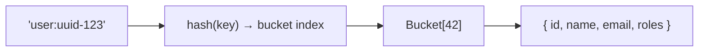
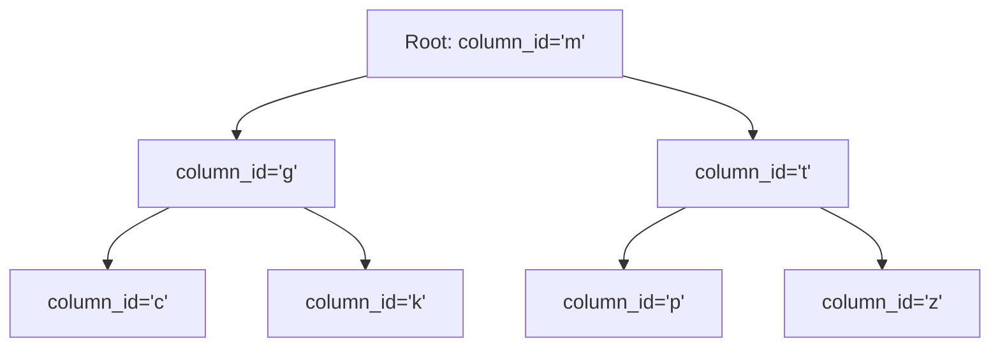

# Data Structures & Algorithms in DevOps Suite

> **Category:** General CS | **Difficulty Range:** 🟢 Basic → ⚫ Expert

---

## Introduction

DevOps Suite doesn't just use data structures from textbooks — it relies on specific algorithmic patterns to implement rate limiting, real-time active user tracking, task ordering, and caching. Understanding the DS&A underpinning of production systems is what separates engineers who can recite theory from those who can apply it.

---

## Section 1: Hash Maps & Hash Tables

### Where Used: Redis Key-Value Store, JWT Blacklist, Caching



**Core operations:**
- `GET user:uuid-123` → O(1) average
- `SET user:uuid-123 {json}` → O(1) average
- `DEL user:uuid-123` → O(1) average

### JWT Blacklist Implementation

```
Key:   "blacklist:eyJhbGciOiJIUzI1..."
Value: "1"  (just a marker)
TTL:   remaining token lifetime (e.g. 1800 seconds)
```

**Why a hash map (Redis) over a database table?**
- O(1) lookup vs O(log N) B-tree index scan in PostgreSQL
- TTL support — entries auto-expire without a cleanup job
- In-memory — sub-millisecond latency per check (critical — checked on every request)

### 🟡 Intermediate Q&A

**Q: What happens when two keys hash to the same bucket (hash collision)?**

**A:** Hash tables handle collisions using one of two strategies:
1. **Separate chaining:** Each bucket holds a linked list. Multiple keys with the same hash are stored in the list. Lookup degrades to O(k) where k = chain length.
2. **Open addressing:** On collision, probe for the next empty bucket (linear probing, quadratic probing).

Redis uses a **hash table with separate chaining** internally. Well-distributed hash functions (MurmurHash2 in Redis) keep chains short. When the load factor exceeds 0.5, Redis triggers a **rehash** (gradual resize to a 2× larger table) to maintain O(1) amortized performance.

---

## Section 2: Sorted Sets (Skip Lists) — Active User Tracking

### The Redis ZSET for `metrics:active_users`

DevOps Suite tracks users active in the last 5 minutes using a Redis sorted set:

```
ZADD metrics:active_users <epoch_ms_score> <user_id>
ZREMRANGEBYSCORE metrics:active_users 0 <5_minutes_ago_epoch>
ZCARD metrics:active_users   → count of active users
```

**Data structure internally:** Redis sorted sets are implemented as a **skip list** (for O(log N) operations) combined with a **hash table** (for O(1) membership checks):

```
Level 3:  [  uuid-1  ] ---------------------------> [  uuid-99 ]
Level 2:  [  uuid-1  ] ---------> [  uuid-45  ] --> [  uuid-99 ]
Level 1:  [  uuid-1  ] -> [uuid-12] -> [uuid-45] -> [  uuid-99 ]
           score:1.6T    score:1.7T   score:1.7T    score:1.8T
```

**Complexity of operations:**
| Operation | Time Complexity |
|---|---|
| `ZADD` (add/update member) | O(log N) |
| `ZREMRANGEBYSCORE` (remove expired) | O(log N + M) where M = removed |
| `ZCARD` (count members) | O(1) |
| `ZRANGEBYSCORE` (range query) | O(log N + M) |

**Why sorted set over a simple counter?**
A plain counter (`INCR active_users`) wouldn't support deduplication — a user making 100 requests in 5 minutes should count as **1** active user, not 100. The sorted set uses `userId` as the member (deduplication) and epoch ms as the score (enables TTL-like range deletion).

### 🔴 Advanced Q&A

**Q: Describe the skip list data structure. What makes it preferable to a balanced BST for Redis sorted sets?**

**A:** A **skip list** is a probabilistic data structure providing O(log N) search, insert, and delete — similar to a balanced BST, but with different trade-offs:

| Property | Skip List | Red-Black BST |
|---|---|---|
| Worst-case complexity | O(N) (probabilistic, rare) | O(log N) guaranteed |
| Implementation complexity | Simple | Very complex (rotations) |
| Memory overhead | ~33% more pointers | Lower |
| Range scans | ✅ Efficient (traverse level 1) | 🟡 In-order traversal needed |
| Lock granularity | ✅ Fine-grained (per-level) | 🟡 Coarser |

Redis chose skip lists for sorted sets because:
1. **Range scans** (`ZRANGEBYSCORE`) are very common — skip lists handle this naturally by traversing the base level
2. **Simpler implementation** — no complex rebalancing needed
3. Redis is single-threaded — worst-case O(N) is acceptable in practice with good hash distributions

---

## Section 3: Sliding Window Counter — Rate Limiting

### Redis Sliding Window for Rate Limiting

DevOps Suite's `RateLimitFilter` implements a **sliding window counter** using Redis:

```
Key:   "rate:execution:user-uuid-123:1728000060"  ← 60-second bucket
Value: 7  (number of requests in this window)
TTL:   65 seconds (window + 5s buffer)
```

**Algorithm:**

```java
// 1. Compute current time bucket (60-second windows)
long bucket = System.currentTimeMillis() / 60_000;
String key = "rate:" + tier + ":" + identity + ":" + bucket;

// 2. Increment atomically
Long count = redisTemplate.opsForValue().increment(key);

// 3. Set TTL on first request in window
if (count == 1) {
    redisTemplate.expire(key, 65, TimeUnit.SECONDS);
}

// 4. Check against limit
if (count > maxRequests) {
    // 429 Too Many Requests
}
```

### Complexity Analysis

| Operation | Time Complexity |
|---|---|
| INCR (hash lookup + increment) | O(1) |
| EXPIRE | O(1) |
| GET for limit check | O(1) |

**Total per request:** O(1) — constant time regardless of traffic volume.

### 🟡 Intermediate: Sliding Window vs Fixed Window vs Token Bucket

| Algorithm | Burst Handling | Memory | Precision |
|---|---|---|---|
| **Fixed Window Counter** | Allows 2× burst at window boundary | O(1) | Low |
| **Sliding Window Log** | Perfect precision | O(N) per user | High |
| **Sliding Window Counter** | Approximate (good) | O(1) | Medium-High |
| **Token Bucket** | Allows controlled bursts | O(1) | High |
| **Leaky Bucket** | Smooths bursts | O(1) | High |

**DevOps Suite uses Fixed Window Counter** (the simplest O(1) approach). The "2× burst at boundary" limitation is acceptable for a portfolio project. Token Bucket would be the upgrade for production fine-grained control.

**The boundary burst problem:**
```
Window 1 ends at :00 — user sends 10 requests (max allowed)
Window 2 starts at :00 — user immediately sends 10 more requests
Total in 1 second: 20 requests (2× the intended limit)
```

---

## Section 4: Binary Search Tree / B-Tree — Database Indexes

### PostgreSQL B-Tree Indexes

Every `CREATE INDEX` in DevOps Suite creates a B-tree index. This is the backbone of fast database queries.



**B-tree properties:**
- **Balanced:** Every leaf is at the same depth → O(log N) guaranteed for any value
- **Wide branching factor:** Each node holds hundreds of keys (not 2 like a BST) → very shallow trees for millions of rows
- **Ordered:** Supports range queries (`BETWEEN`, `ORDER BY`) unlike hash indexes

**In DevOps Suite:**
```sql
-- This index supports:
-- WHERE column_id = ?  (point lookup)
-- WHERE column_id = ? ORDER BY position  (range + sort)
-- ORDER BY column_id, position  (sort only)
CREATE INDEX idx_tasks_position ON tasks(column_id, position);
```

**Lookup complexity:**
- Point lookup: O(log N) tree traversal + O(1) heap fetch
- Range scan: O(log N + K) where K = matching rows

### 🟢 Basic Q&A

**Q: Why does `WHERE column_id = ?` use an index but `WHERE LOWER(title) LIKE '%search%'` doesn't?**

**A:**
- `WHERE column_id = ?` → exact match → B-tree traversal → O(log N) ✅
- `WHERE LOWER(title) LIKE '%search%'` → requires scanning every row because:
  1. `LOWER()` is a function — PostgreSQL can't use the index on `title` for the transformed value
  2. Leading `%` wildcard → no prefix match possible in B-tree

**Fix:** Elasticsearch for full-text search (as DevOps Suite does for log search) or a PostgreSQL `GIN` index with `pg_trgm` extension for substring matching.

---

## Section 5: Queue — Async Code Execution

### Java Blocking Queue in ExecutionQueueWorker

```java
// Conceptually (simplified from actual async implementation)
// The "queue" is the execution_requests table with status=QUEUED
// ExecutionQueueWorker polls for QUEUED requests

@Async("executionPool")
public void processExecution(ExecutionRequest request) {
    // FIFO: oldest QUEUED requests processed first
    // ORDER BY created_at ASC LIMIT 1
}
```

**Queue operations:**
| Operation | Complexity |
|---|---|
| Enqueue (INSERT into DB) | O(log N) for index update |
| Dequeue (SELECT + UPDATE status) | O(log N) index scan |
| Peek (oldest QUEUED) | O(log N) |

**FIFO property:** Executions are processed in creation order (fairness). `ORDER BY created_at ASC` in the worker query enforces FIFO semantics.

### 🔴 Advanced: Why Not Use an In-Memory Queue?

**Q: Why does DevOps Suite store the execution queue in PostgreSQL instead of a Java `LinkedBlockingQueue`?**

**A:** Durability. An in-memory queue is lost on application restart:

- **Server crash:** All pending executions in the Java queue are lost
- **Restart/redeploy:** Queue is empty — users don't know their code is gone

By persisting `ExecutionRequest` entities with status `QUEUED` in PostgreSQL:
1. Crash recovery: on startup, worker finds all `QUEUED` rows and resumes
2. User can see their execution status via `GET /api/code-execution/{id}` even after backend restart
3. History is preserved for audit trail and activity heatmap

The trade-off: database polling latency vs in-memory O(1) dequeue. For sub-10 executions/second throughput, database polling (every ~500ms) is entirely acceptable.

---

## Section 6: Trie / Prefix Tree — IDE File Paths

### Virtual Filesystem Path Matching

The IDE module stores files in PostgreSQL with `path` as a string (`/src/main/Main.java`). For folder deletion (recursive), the backend uses a **prefix match**:

```java
// Delete all files under /src/main/ (recursive)
ideFileRepository.deleteByProjectIdAndPathStartingWith(projectId, folderPath + "/");
```

**Generated SQL:**
```sql
DELETE FROM ide_files
WHERE project_id = ? AND path LIKE '/src/main/%';
```

This is conceptually equivalent to a **Trie traversal** — finding all paths that share a common prefix. The PostgreSQL B-tree index on `path` supports `LIKE 'prefix%'` (left-anchored) efficiently.

**Why not implement a full trie?** For a file system with hundreds of files per project, the PostgreSQL prefix index is sufficient. A trie would only be beneficial at millions of paths or when prefix compression matters for memory.

---

## Section 7: Interview Q&A

### 🟢 Basic

**Q: What is the time complexity of HashMap get/put operations? When does it degrade?**

**A:**
- **Average case:** O(1) — hash computation + array index access
- **Worst case:** O(N) — all keys hash to the same bucket (degenerate linked list)

In practice, with a good hash function and load factor ≤ 0.75, Java `HashMap` maintains O(1) amortized performance. Java 8+ converts long chains to red-black trees (O(log N) worst case) as a safety measure.

**In Redis:** Same principle. MurmurHash2 provides excellent distribution, making O(1) the practical reality for JWT blacklist lookups.

---

### 🟡 Intermediate

**Q: How does the sliding window rate limiter prevent two requests arriving exactly at the 60-second boundary from both being allowed?**

**A:** This is the **boundary burst problem** of fixed-window counters. With a 60-second window:

- At `t=59.9s`: User sends request #10 → window count = 10 (limit reached, allowed)
- At `t=60.0s`: New window starts, count resets to 0
- At `t=60.1s`: User sends request #1 of new window → allowed

**Result:** 10 requests in 0.2 seconds — 50x the intended rate.

**True sliding window log** solution: Track timestamps of each request, remove those outside `[now-60s, now]`, check count. O(N) memory per user — prohibitive at scale.

**DevOps Suite's pragmatic choice:** Fixed window (O(1), simple Redis INCR+EXPIRE). The boundary burst risk is accepted. For a code execution rate limiter specifically, this is fine because:
1. Container spin-up latency naturally throttles burst throughput
2. The burst is 2× for 1 second at most — not catastrophic
3. Adding true sliding window complexity adds Redis ZADD + ZREMRANGEBYSCORE calls (3× Redis ops vs 1×)

---

### 🔴 Advanced

**Q: Explain the amortized O(1) complexity of a dynamic array (ArrayList). How does this apply to Java ArrayList?**

**A:** A `dynamic array` starts small (e.g. capacity 10) and **doubles** when full:

- Size 10 → insert 11th element → resize to 20, copy 10 elements
- Size 20 → insert 21st element → resize to 40, copy 20 elements
- Size 40 → insert 41st element → resize to 80, copy 40 elements

**Amortized cost per insert:**
```
Total copies after N insertions = 1 + 2 + 4 + 8 + ... + N/2 ≈ N
Average copies per insert = N/N = O(1) amortized
```

Individual resizing operations are O(N) but happen rarely enough that the average is O(1).

**Java `ArrayList`:** Uses this exact strategy — `ensureCapacity()` doubles internal array when `size == capacity`. This is why adding N elements to an `ArrayList` is O(N) total, not O(N²).

**In DevOps Suite context:** When `TaskService` batch-reorders tasks, it may build an `ArrayList<Task>` to update positions. The amortized O(1) append ensures this buffer doesn't become a bottleneck.

---

### ⚫ Expert

**Q: The active user sorted set uses epoch milliseconds as scores. What happens when two users make requests at the exact same millisecond? Does the ZADD overwrite one?**

**A:** No — in Redis sorted sets, the **member** (userId UUID) is the unique key, not the score. Two different userIds with the same score are both stored as separate members:

```
ZADD metrics:active_users 1728000000123 "user-uuid-A"   → adds A with score 1728000000123
ZADD metrics:active_users 1728000000123 "user-uuid-B"   → adds B with score 1728000000123
ZCARD metrics:active_users → 2  (both stored)
```

**What ZADD does overwrite:** If the same userId makes two requests, ZADD with `NX` flag (update if exists) replaces the old score with the newer timestamp — which is correct behavior (extends their active window).

**The edge case to worry about:** Not collision between users, but **Redis ZADD atomicity**. If `ZADD` and `EXPIRE` are separate commands, a Redis crash between them could leave a key without a TTL. Solution: use `ZADD` + `PEXPIRE` in a Lua script (atomic execution):

```lua
-- Lua script executed atomically on Redis
local key = KEYS[1]
local score = ARGV[1]
local member = ARGV[2]
local expiry = ARGV[3]
local threshold = ARGV[4]

redis.call('ZADD', key, score, member)
redis.call('ZREMRANGEBYSCORE', key, '-inf', threshold)
redis.call('EXPIRE', key, expiry)
return redis.call('ZCARD', key)
```

---

## Quick Reference

| DS/Algorithm | Where Used | Complexity |
|---|---|---|
| Hash Map | Redis key-value (JWT blacklist, cache) | O(1) avg get/set |
| Skip List | Redis sorted set (active users) | O(log N) insert/remove |
| Fixed Window Counter | Rate limiting (Redis INCR + EXPIRE) | O(1) per request |
| B-Tree | PostgreSQL indexes (all tables) | O(log N) lookup, O(log N + K) range |
| Queue (DB-backed) | Code execution queue (QUEUED status) | O(log N) dequeue |
| Prefix Match | IDE file recursive deletion | O(log N + K) |
| Inverted Index | Elasticsearch full-text search | O(1) per token lookup |
| Dynamic Array | Java ArrayList (task reordering) | O(1) amortized append |


---

## Section 8: Trie Implementation for Hierarchical Path Resolution

### Virtual Path Navigation

For navigating IDE file structures, finding common ancestors, and autocomplete in file trees:

```java
public class FileTrie {
    static class TrieNode {
        Map<String, TrieNode> children = new HashMap<>();
        boolean isFile = false;
        UUID fileId;
    }

    private final TrieNode root = new TrieNode();

    public void insert(String path, UUID fileId) {
        String[] parts = path.split("/");
        TrieNode current = root;
        for (String part : parts) {
            if (part.isEmpty()) continue;
            current = current.children.computeIfAbsent(part, k -> new TrieNode());
        }
        current.isFile = true;
        current.fileId = fileId;
    }

    public List<String> listDirectChildren(String folderPath) {
        String[] parts = folderPath.split("/");
        TrieNode current = root;
        for (String part : parts) {
            if (part.isEmpty()) continue;
            current = current.children.get(part);
            if (current == null) return Collections.emptyList();
        }
        return new ArrayList<>(current.children.keySet());
    }
}
```

**Time Complexity:**
- Insert: $O(L)$ where $L$ is path depth.
- Prefix Search: $O(L)$.
- Space: $O(N \cdot L)$ with shared prefix node compression.
