# System Design Principles & Distributed Systems Fundamentals

> **DevOps Suite Architectural Knowledge Base**  
> Comprehensive System Design Deep Dive: ACID vs. BASE, CAP Theorem Trade-offs, Stateless Architectural Patterns, Idempotency Guarantees, Backpressure Dynamics, and Defense-in-Depth Security Models.

---

## 1. Executive Architecture & System Overview

**DevOps Suite** is an enterprise-grade developer productivity platform engineered with a Spring Boot 3 (Java 21) monolith backend, React 18 SPA frontend, PostgreSQL 16 relational core, Redis 7 caching and rate-limiting tier, Docker Java API execution sandbox, and an ELK observability pipeline.

While architected as a modular monolith deployed via Docker Compose, DevOps Suite integrates distributed storage, asynchronous messaging, and container virtualization patterns. Designing, operating, and reasoning about such systems requires adherence to classical distributed systems theory and system design principles.

```
                      +-------------------------------------------------------------+
                      |                      CLIENT LAYER                           |
                      |  React 18 SPA (Vite / Tailwind / Monaco Editor / StompJS)   |
                      +-------------------------------------------------------------+
                                                     | HTTPS / WSS
                                                     v
                      +-------------------------------------------------------------+
                      |                      INGRESS LAYER                          |
                      |  Nginx Reverse Proxy (:80 / :443) -> TLS Term, Static Assets|
                      +-------------------------------------------------------------+
                                                     | Reverse Proxy (:8081 / :8082)
                                                     v
                      +-------------------------------------------------------------+
                      |                   APPLICATION RUNTIME                       |
                      |   Spring Boot 3 (Java 21 Monolith) - Stateless Execution    |
                      |   - Filter Chain: RateLimitFilter -> JwtRequestFilter       |
                      |   - Spring Security Context (Stateless SessionCreation)     |
                      |   - In-JVM ApplicationEventPublisher                        |
                      +-------------------------------------------------------------+
                                /                    |                    \
        +----------------------+   +-----------------+   +-----------------+
        | Strict ACID Core     |   | In-Memory Cache |   | Ephemeral Run   |
        v                      |   v                 |   v                 |
+------------------+           | +-----------------+ | +-----------------+ |
|  PostgreSQL 16   |           | |    Redis 7      | | | Docker Engine   | |
|  - Projects      |           | |  - Blacklist JWT| | | - Sandbox Ctr  | |
|  - Tasks / Board |           | |  - Sliding Rate | | | - tmpfs exec    | |
|  - Auth & RBAC   |           | |  - Cache-Aside  | | | - --net=none    | |
+------------------+           | +-----------------+ | +-----------------+ |
                               \                     |                     /
                                +--------------------+--------------------+
                                                     |
                                                     v Asynchronous Eventual Consistency
                                      +-------------------------------+
                                      |     ELK OBSERVABILITY         |
                                      | Elasticsearch (Logs & Traces) |
                                      | Kibana (:8083) / Grafana (:8080)
                                      +-------------------------------+
```

---

## 2. Fundamental System Design Principles in DevOps Suite

### 2.1 ACID vs. BASE: Balancing Strong Consistency and Eventual Consistency

DevOps Suite maintains a hybrid consistency architecture: **Strict ACID** for financial/project integrity, workflow state transitions, and identity access control, coupled with **BASE (Basically Available, Soft state, Eventual consistency)** for high-throughput observability, log aggregation, and real-time frontend notifications.

```
+-------------------------------------------------------------------------------------------------------+
|                                    CONSISTENCY ARCHITECTURE                                           |
+---------------------------------------------------+---------------------------------------------------+
|               STRICT ACID (PostgreSQL 16)         |               BASE (Elasticsearch & STOMP)        |
+---------------------------------------------------+---------------------------------------------------+
| Atomicity:    Multi-row project/task updates roll | Basically     Cluster accepts write requests      |
|               back on unhandled runtime exception.| Available:    even during shard rebalancing or    |
| Consistency:  Foreign keys, CHECK constraints,    |               transient network blips.            |
|               Flyway V1-V16 schema invariants.    | Soft State:   Log indices undergo asynchronous    |
| Isolation:    READ COMMITTED (default) with row-  |               segment merges and in-flight drift. |
|               level pessimistic locks on runs.    | Eventual      Index refresh interval (1s) delays  |
| Durability:   WAL (Write-Ahead Logging) synced to | Consistency:  search visibility; WebSocket events |
|               persistent storage volume.          |               deliver out-of-order under lag.     |
+---------------------------------------------------+---------------------------------------------------+
```

#### Relational ACID Guarantees in DevOps Suite
1. **Atomicity**: When an administrator deletes a `Project`, cascading foreign keys purge all associated `Task`, `Snippet`, and `AuditLog` entities inside an atomic transaction:
   ```java
   @Transactional(isolation = Isolation.READ_COMMITTED, rollbackFor = Exception.class)
   public void deleteProject(Long projectId) {
       Project project = projectRepository.findById(projectId)
           .orElseThrow(() -> new ResourceNotFoundException("Project not found: " + projectId));
       taskRepository.deleteByProjectId(projectId);
       snippetRepository.deleteByProjectId(projectId);
       projectRepository.delete(project);
   }
   ```
   If a disk I/O error or constraint violation interrupts execution, the transaction rolls back cleanly via PostgreSQL's WAL engine.

2. **Consistency**: Enforced through schema validation across Flyway migrations `V1__init.sql` through `V16__...sql`. Invariants include unique email constraints (`users.email UNIQUE`), foreign key referential integrity (`fk_tasks_project_id REFERENCES projects(id)`), and enum status constraints.

3. **Isolation**: DevOps Suite operates at `READ COMMITTED` by default, preventing dirty reads while avoiding the overhead of serializable snapshot isolation. In high-concurrency workflows—such as reserving an execution runner slot—pessimistic row locking (`SELECT FOR UPDATE`) prevents lost updates:
   ```java
   @Lock(LockModeType.PESSIMISTIC_WRITE)
   @Query("SELECT t FROM Task t WHERE t.id = :taskId")
   Optional<Task> findByIdForUpdate(@Param("taskId") Long taskId);
   ```

4. **Durability**: PostgreSQL writes dirty pages to the Write-Ahead Log buffer and forces sync to host disk volumes prior to committing the transaction acknowledgement back to the Spring Boot JDBC driver.

#### BASE Guarantees in Observability & STOMP Messaging
1. **Basically Available**: Elasticsearch accepts ingest requests across active data nodes. If shard replica re-routing is underway, the index cluster accepts bulk writes without locking queries.
2. **Soft State**: Elasticsearch segments are immutable and periodically merged asynchronously by background threads. Memory buffers hold documents before committing them to Translog and Lucene segments.
3. **Eventual Consistency**: 
   - When a Docker sandbox execution terminates, logs are streamed via Logstash/Logback TCP appender to `devopssuite-logs-yyyy.MM.dd`. Elasticsearch's `refresh_interval` (default `1s`) means documents are searchable after index refresh.
   - STOMP WebSocket broadcasts (`/topic/logs/{projectId}`) provide fire-and-forget real-time streams to connected browser clients; if a WebSocket client disconnects and reconnects, it reconciles missing terminal state by fetching the authoritative PostgreSQL record.

---

### 2.2 The CAP Theorem Applied Across the Storage Matrix

The CAP theorem dictates that under a network partition ($P$), a distributed data store must choose between Consistency ($C$) and Availability ($A$). DevOps Suite segregates storage engines based on operational roles:

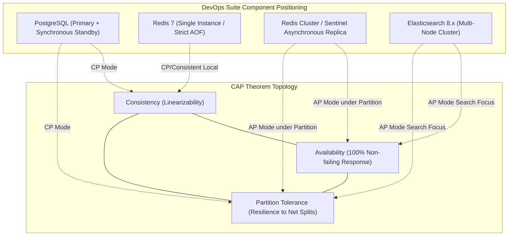

#### Detailed Component Trade-off Analysis

| Component | Classification | Partition Handling Strategy | Failure Mode / Recovery |
| :--- | :--- | :--- | :--- |
| **PostgreSQL 16** | **CP** | Under network partition in a HA replica set, the primary rejects writes if synchronous standby quorum cannot be established (`synchronous_commit = on`). Favors consistency over availability to prevent split-brain. | Write requests stall or fail with JDBC connection/timeout errors; reads can be routed to read-only replicas with staleness flags. |
| **Redis 7 (DevOps Suite Standalone)** | **CP (Local Engine)** | Single Docker container with AOF (`appendfsync everysec`). In Sentinel/Cluster mode with async replication, Redis defaults to **AP**: if a partition occurs, an isolated master continues accepting writes that may be lost upon split failover. | When memory saturates or network drops, Spring Boot's `RedisTemplate` catches `RedisConnectionFailureException` and fails open for rate limiting or bypasses cache. |
| **Elasticsearch 8** | **AP** | Master-eligible nodes elect a cluster manager via Raft-like consensus. If a network partition isolates a data shard, search queries return partial results with `timed_out: true` and `_shards.failed > 0`. | Favors search availability over absolute index consistency. Missed logs are backfilled once connectivity restores. |

---

### 2.3 Stateless vs. Stateful Service Architecture

The DevOps Suite Spring Boot monolith is intentionally designed as a **Shared-Nothing Stateless Compute Node**. This design allows horizontal replication behind Nginx or an AWS ALB without sticky sessions.

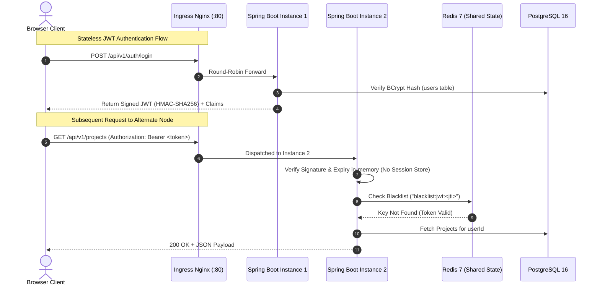

#### Key Implementation Pillars of Statelessness
1. **Self-Contained Security Claims**: The JWT token contains `sub` (username), `userId`, `roles`, and `iat`/`exp` claims. Neither instance stores an `HttpSession` in heap memory (`SessionCreationPolicy.STATELESS` configured in Spring Security).
2. **Externalized Token Invalidation**: When a user logs out, storing revocation state in local memory would break horizontal scaling. DevOps Suite writes the token identifier (`jti`) or raw JWT hash into Redis with an explicit TTL equal to the token's remaining lifespan:
   ```java
   public void blacklistToken(String token) {
       long remainingTime = jwtTokenProvider.getRemainingExpirationMs(token);
       if (remainingTime > 0) {
           redisTemplate.opsForValue().set(
               "blacklist:jwt:" + token,
               "revoked",
               Duration.ofMillis(remainingTime)
           );
       }
   }
   ```
3. **Externalized Rate Limiting**: Request counters are stored exclusively in Redis using a rolling sliding-window script. Any backend instance can execute the check atomically.
4. **Sandboxed Containers as Decoupled Compute Workers**: Ephemeral Docker sandbox containers are spawned with unique labels (`devopssuite-sandbox-{id}`). State is isolated via memory and transient `/tmp` directories, leaving no sticky host filesystem dependencies on the Spring Boot node.

---

### 2.4 Idempotency Patterns & Concrete Implementations

In distributed environments, network partitions and client retries cause duplicate requests. Designing idempotent endpoints prevents state corruption, double charges, or duplicate runner invocations.

```
+----------------------------------------------------------------------------------------------------+
|                                    HTTP METHOD IDEMPOTENCY MATRIX                                  |
+-----------+---------------+-----------------------------------+------------------------------------+
| HTTP Verb | Semantics     | DevOps Suite Implementation       | Concrete Example                   |
+-----------+---------------+-----------------------------------+------------------------------------+
| GET       | Idempotent    | Query operations; no side effects.| GET /api/v1/projects/42            |
| PUT       | Idempotent    | Complete entity replacement /     | PUT /api/v1/tasks/100/reorder      |
|           |               | deterministic state transitions.  | (Set column='IN_PROGRESS', pos=2)  |
| DELETE    | Idempotent    | Entity removal; repeated calls    | DELETE /api/v1/tasks/100           |
|           |               | yield same terminal DB state.     | (Returns 204 first, 404 or 204 sub)|
| POST      | Non-Idempotent| Resource creation / Code run.     | POST /api/v1/sandbox/execute       |
|           | (Inherently)  | Handled via Idempotency Keys.     | (Protected via Redis Deduplication)|
+-----------+---------------+-----------------------------------+------------------------------------+
```

#### Deterministic Reordering (`PUT /api/v1/tasks/{id}/reorder`)
A Kanban board card move operation must be idempotent. If network instability causes the browser to issue three identical `PUT` requests, the board state must remain stable.

```java
@PutMapping("/api/v1/tasks/{taskId}/reorder")
@Transactional
public ResponseEntity<TaskResponse> reorderTask(
        @PathVariable Long taskId,
        @RequestBody TaskReorderRequest request) {
    
    Task task = taskRepository.findById(taskId)
        .orElseThrow(() -> new ResourceNotFoundException("Task not found"));

    // Deterministic state mutation
    task.setColumn(request.getTargetColumn());
    task.setPosition(request.getTargetPosition());
    
    taskRepository.save(task);
    resequenceRemainingTasks(task.getProjectId(), request.getTargetColumn());
    
    return ResponseEntity.ok(TaskResponse.from(task));
}
```

#### Non-Idempotent Invocations Handled via Idempotency Keys (`POST /api/v1/sandbox/execute`)
Sandbox code execution consumes CPU, memory, and spawns Docker containers. Multiple submissions of the same code block (e.g. from user double-clicking "Run") must be intercepted:

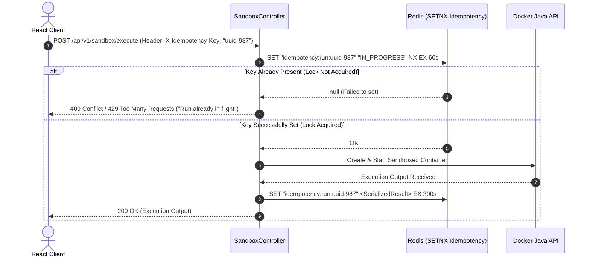

```java
@PostMapping("/api/v1/sandbox/execute")
public ResponseEntity<?> executeCode(
        @RequestHeader(value = "X-Idempotency-Key", required = false) String idempotencyKey,
        @Valid @RequestBody CodeExecutionRequest request) {

    if (idempotencyKey != null && !idempotencyKey.isBlank()) {
        String redisKey = "idempotency:run:" + idempotencyKey;
        
        // Atomically set lock with 60 second lease
        Boolean acquired = redisTemplate.opsForValue()
            .setIfAbsent(redisKey, "PROCESSING", Duration.ofSeconds(60));
            
        if (Boolean.FALSE.equals(acquired)) {
            Object cachedResult = redisTemplate.opsForValue().get(redisKey);
            if ("PROCESSING".equals(cachedResult)) {
                return ResponseEntity.status(HttpStatus.CONFLICT)
                    .body(Map.of("error", "Execution is already running for this key"));
            }
            return ResponseEntity.ok(cachedResult);
        }

        try {
            ExecutionResult result = codeExecutionService.execute(request);
            redisTemplate.opsForValue().set(redisKey, result, Duration.ofMinutes(5));
            return ResponseEntity.ok(result);
        } catch (Exception ex) {
            redisTemplate.delete(redisKey); // Release lock on failure
            throw ex;
        }
    }

    return ResponseEntity.ok(codeExecutionService.execute(request));
}
```

---

### 2.5 Backpressure & Graceful Degradation Strategies

Under unexpected spikes, distributed backpressure mechanisms prevent cascading failures across the thread pool, database connections, and Docker socket.

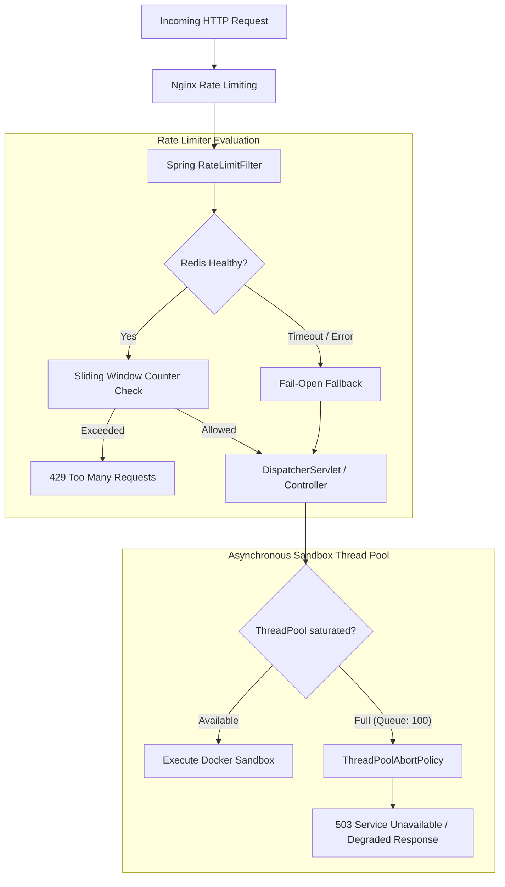

#### Rate Limiter Fail-Open vs. Fail-Closed Semantics
The `RateLimitFilter` interacts directly with Redis. If the Redis container crashes or suffers network partitions, a production policy decision must be enforced:

```java
@Component
public class RateLimitFilter extends OncePerRequestFilter {

    private final RedisTemplate<String, Object> redisTemplate;
    private static final Logger log = LoggerFactory.getLogger(RateLimitFilter.class);

    public RateLimitFilter(RedisTemplate<String, Object> redisTemplate) {
        this.redisTemplate = redisTemplate;
    }

    @Override
    protected void doFilterInternal(HttpServletRequest request,
                                    HttpServletResponse response,
                                    FilterChain filterChain) throws ServletException, IOException {
        String clientIp = request.getRemoteAddr();
        String key = "ratelimit:" + clientIp;

        try {
            Long currentRequests = redisTemplate.opsForValue().increment(key);
            if (currentRequests != null && currentRequests == 1) {
                redisTemplate.expire(key, Duration.ofMinutes(1));
            }

            if (currentRequests != null && currentRequests > 100) {
                response.setStatus(HttpStatus.TOO_MANY_REQUESTS.value());
                response.getWriter().write("{\"error\": \"Rate limit exceeded. Try again in 60s.\"}");
                return;
            }
        } catch (RedisConnectionFailureException | QueryTimeoutException ex) {
            // PRODUCTION DECISION: Fail-Open to preserve core operational availability
            log.error("Redis unreachable during rate-limit evaluation. Failing open: {}", ex.getMessage());
        }

        filterChain.doFilter(request, response);
    }
}
```

*Trade-off analysis*:
- **Fail-Open (Implemented)**: Prioritizes platform **Availability**. Legitimate users can continue saving code and managing tasks even during cache degradation. Risk: Vulnerable to DoS traffic while Redis is down.
- **Fail-Closed (Alternative)**: Prioritizes **Security & Resource Containment**. Returns HTTP 500/503 immediately. Protects downstream PostgreSQL and Docker daemon from stampeding herds at the expense of total downtime.

#### Thread Pool Saturation & Graceful Degradation
Sandbox container execution runs on a dedicated `ThreadPoolTaskExecutor`. To protect the operating system from process exhaustion:
```java
@Configuration
public class SandboxExecutorConfig {

    @Bean(name = "sandboxTaskExecutor")
    public ThreadPoolTaskExecutor sandboxTaskExecutor() {
        ThreadPoolTaskExecutor executor = new ThreadPoolTaskExecutor();
        executor.setCorePoolSize(4);
        executor.setMaxPoolSize(8);
        executor.setQueueCapacity(50);
        executor.setThreadNamePrefix("sandbox-exec-");
        // Rejection strategy: caller receives immediate fast-failure instead of blocking server threads
        executor.setRejectedExecutionHandler(new ThreadPoolExecutor.AbortPolicy());
        executor.initialize();
        return executor;
    }
}
```
When all 8 executor threads and 50 queue slots are saturated, new requests trigger an `AbortPolicy` throwing `RejectedExecutionException`. A `@ControllerAdvice` handler intercepts this and returns `HTTP 503 Service Unavailable` with a `Retry-After: 10` header, shielding the Docker daemon from crash loops.

---

### 2.6 Defense-in-Depth Architecture

DevOps Suite implements multi-layered security controls across the network, application runtime, kernel, and container execution layers:

```mermaid
flowchart TD
    Layer1["1. Network & Ingress"] -->|Nginx Reverse Proxy: SSL Termination, Static Asset Isolation, Port Blocking| Layer2
    Layer2["2. Perimeter Filters"] -->|RateLimitFilter: IP-based sliding rate limit via Redis| Layer3
    Layer3["3. Authentication"] -->|JwtRequestFilter: Cryptographic token validation & Redis Blacklist check| Layer4
    Layer4["4. Web Security Engine"] -->|Spring Security: CSRF Disabled for APIs, SessionCreationPolicy.STATELESS| Layer5
    Layer5["5. Method-Level RBAC"] -->|@PreAuthorize: 'hasRole(ADMIN)' or '@projectSecurity.isMember(#id)'| Layer6
    Layer6["6. Storage Isolation"] -->|PostgreSQL: Schema-level constraints, Parameterized PreparedStatements| Layer7
    Layer7["7. Sandbox Virtualization"] -->|Docker Engine: --network=none, --read-only, --pids-limit=50, tmpfs exec| SandboxedRun["Isolated Process Execution"]
```

#### Layer Breakdown and Threat Mitigation

1. **Layer 1: Network Ingress (Nginx Proxy)**
   - External traffic reaches only ports 80/443. Internal ports (`8081` Spring Boot, `5432` PostgreSQL, `6379` Redis, `9200` Elasticsearch) are unexposed on public interfaces.
   - Restricts body size (`client_max_body_size 5M`) to prevent heap allocation exhaustion.

2. **Layer 2: Perimeter Rate Limiting (`RateLimitFilter`)**
   - Blocks automated brute-force attacks on `/api/v1/auth/login` before database queries execute.

3. **Layer 3: Cryptographic Token Authentication (`JwtRequestFilter`)**
   - Validates HMAC-SHA256 digital signature, token issuer, and expiry timestamps. Rejects tampered payloads with HTTP 401. Checks Redis blacklist to prevent reuse of revoked tokens.

4. **Layer 4: Spring Security Filter Chain**
   - Eliminates Session Fixation by configuring `SessionCreationPolicy.STATELESS`.
   - Sets secure headers: `X-Content-Type-Options: nosniff`, `X-Frame-Options: DENY`, `Strict-Transport-Security`.

5. **Layer 5: Business Logic & RBAC (`@PreAuthorize`)**
   - Prevents Insecure Direct Object References (IDOR). Project queries verify organization/team membership directly in SQL predicates (`WHERE project.id = :id AND project.owner.id = :principalId`).

6. **Layer 6: Persistence Layer Sanitization**
   - Spring Data JPA uses parameterized queries across all repositories, eliminating SQL injection.

7. **Layer 7: Container Sandbox Isolation**
   - Executes untrusted user code under strict kernel boundaries:
     - `--network=none`: Prohibits network access (prevents port scanning, data exfiltration, botnet joins).
     - `--read-only`: Locks down the root container filesystem.
     - `--tmpfs /tmp:rw,noexec,nosuid,size=64m`: In-memory scratch space with restricted execution flags where applicable.
     - `--pids-limit=50`: Neutralizes fork-bomb attacks.
     - `--cpus=1.0 --memory=256m`: Prevents host CPU/RAM exhaustion.

---

## 3. Distributed Systems Deep Dive & Consensus Mechanisms

### 3.1 Consensus Algorithms: Raft and Split-Brain Prevention

In clustered topologies, consensus algorithms ensure distributed state machines agree on log entries despite node failures.

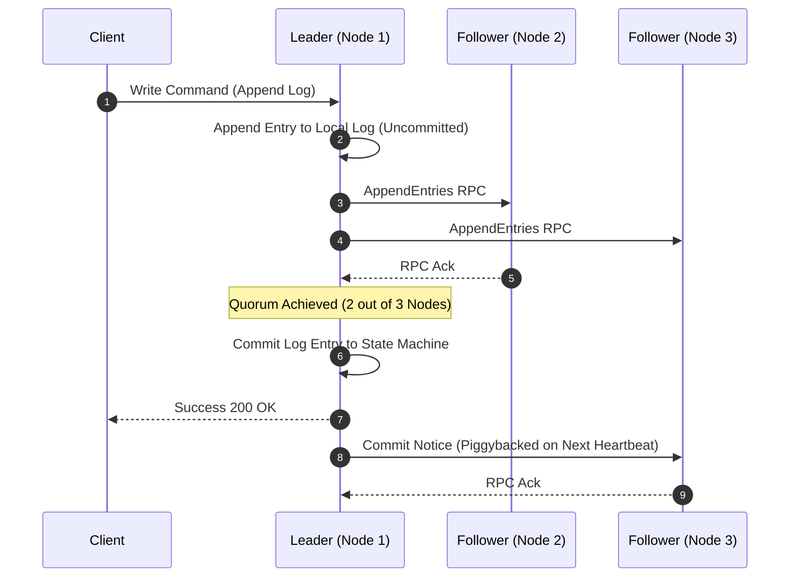

#### Raft Essentials in Modern Infrastructure
- **Quorum Formula**: Any majority decision requires $Q = \lfloor \frac{N}{2} \rfloor + 1$ affirmative votes, where $N$ is the total number of nodes.
- **Node Partition Handling**: If an elastic cluster of 5 nodes splits into two partitions $\{N_1, N_2\}$ and $\{N_3, N_4, N_5\}$:
  - The minority partition ($\{N_1, N_2\}$, size 2) cannot attain quorum ($\lfloor 5/2 \rfloor + 1 = 3$) and rejects writes.
  - The majority partition ($\{N_3, N_4, N_5\}$, size 3) maintains quorum, elects a leader, and serves mutations.
- **Split-Brain Mitigation**: Elasticsearch's Master Node Election and PostgreSQL HA orchestrators (e.g. Patroni using Raft via etcd or Consul) enforce quorum constraints. Without an odd-numbered quorum, two independent leaders might emerge, accepting divergent writes that cause permanent data loss.

---

### 3.2 Cache Invalidation Patterns: Cache-Aside vs. Write-Through

DevOps Suite implements the **Cache-Aside (Lazy Loading)** pattern for read-heavy entities such as project metadata and user profiles.

```
+----------------------------------------------------------------------------------------------------+
|                                    CACHE INVALIDATION TAXONOMY                                     |
+---------------------+-----------------------------------+------------------------------------------+
| Pattern             | Read Path                         | Write Path                               |
+---------------------+-----------------------------------+------------------------------------------+
| Cache-Aside         | Read Cache -> If Miss -> Read DB  | Write directly to DB -> Evict (delete)   |
| (DevOps Suite)      | -> Populate Cache -> Return.      | Cache entry. Next read repopulates.      |
+---------------------+-----------------------------------+------------------------------------------+
| Write-Through       | Read Cache -> If Miss -> Read DB. | Write to Cache -> Cache synchronously    |
|                     |                                   | writes to DB before acknowledging client.|
+---------------------+-----------------------------------+------------------------------------------+
| Write-Behind        | Read Cache -> If Miss -> Read DB. | Write to Cache -> Acknowledge -> Async   |
| (Write-Back)        |                                   | background worker batches writes to DB.  |
+---------------------+-----------------------------------+------------------------------------------+
```

#### Cache-Aside Flow & Race Condition Mitigation
When evicting cache keys during database updates, a classical race condition can occur:

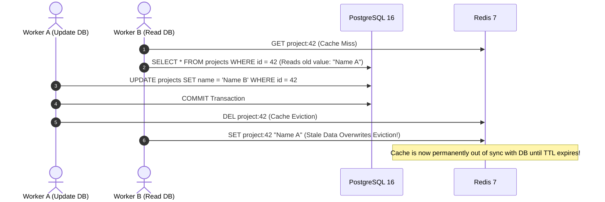

*Solution in DevOps Suite*:
1. **Short-lived TTLs**: All cached records are created with an explicit expiration (e.g., `Duration.ofMinutes(15)`).
2. **Transactional Cache Eviction via Spring Event Publisher**: Invalidation occurs strictly *after* transaction commit:
   ```java
   @Transactional
   public ProjectResponse updateProject(Long id, ProjectUpdateRequest req) {
       Project project = projectRepository.findById(id).orElseThrow();
       project.setName(req.getName());
       projectRepository.save(project);
       
       // Publish event to evict cache ONLY after the DB commit succeeds
       eventPublisher.publishEvent(new ProjectUpdatedEvent(id));
       return ProjectResponse.from(project);
   }

   @TransactionalEventListener(phase = TransactionPhase.AFTER_COMMIT)
   public void handleProjectUpdate(ProjectUpdatedEvent event) {
       redisTemplate.delete("project:" + event.projectId());
   }
   ```

---

## 4. Comprehensive Interview Q&A (Categorized by Difficulty)

---

### 🟢 Basic System Design Fundamentals

#### Q1: What makes an HTTP endpoint idempotent, and which REST methods in DevOps Suite are inherently idempotent?
**Answer:**  
An HTTP endpoint is **idempotent** if making multiple identical requests has the same intended effect on server state as making a single request ($f(f(x)) = f(x)$). 

In DevOps Suite:
- **`GET`**: Inherently idempotent and safe. Reading `/api/v1/projects` returns data without altering system state.
- **`PUT`**: Idempotent. Sending `/api/v1/tasks/10/reorder` repeatedly with `{ "column": "DONE", "position": 1 }` results in the task residing in the `DONE` column at position 1, regardless of how many times it executes.
- **`DELETE`**: Idempotent. Calling `DELETE /api/v1/projects/5` deletes the row. Subsequent calls find no record and return `404 Not Found` or `204 No Content`. The persistent state of the database remains unchanged after the first invocation.
- **`POST`**: Non-idempotent by default. Invoking `POST /api/v1/sandbox/execute` without an idempotency key spins up new Docker containers for each request, consuming CPU cycles and creating fresh execution logs.

---

#### Q2: What is the primary difference between horizontal and vertical scaling, and how does DevOps Suite support horizontal scaling?
**Answer:**  
- **Vertical Scaling (Scale-Up)**: Expanding capacity by adding compute resources (CPU, RAM, NVMe storage) to a single machine running the service. It encounters hardware limits, diminishing returns, and single points of failure.
- **Horizontal Scaling (Scale-Out)**: Expanding capacity by adding more compute nodes running parallel instances behind a load balancer.

DevOps Suite enables horizontal scaling across its application tier by maintaining **statelessness**:
1. User identity is verified using self-contained, cryptographically signed JWT tokens parsed on every request.
2. User sessions and authentication states are not stored in the Spring Boot JVM heap.
3. Transient state (token blacklists, sliding-window rate counters) is externalized to an independent Redis 7 instance.
4. An Nginx reverse proxy distributes traffic across $N$ Spring Boot instances using round-robin routing.

---

#### Q3: Why does DevOps Suite use an in-memory cache like Redis instead of querying PostgreSQL directly for every request?
**Answer:**  
DevOps Suite leverages Redis for three architectural reasons:
1. **Latency Reduction**: PostgreSQL reads require index lookups, page cache traversals, and disk I/O when buffer pools miss, typically taking 2–15 ms. Redis operates entirely in-memory with sub-millisecond retrieval ($\approx 300\text{--}800\,\mu\text{s}$).
2. **Database Offloading**: Repetitive queries—such as fetching current user profile permissions, active project metadata, or checking whether an authorization token is revoked—can quickly saturate PostgreSQL's connection pool (`HikariCP`, default maximum 10–20 connections). Caching shields the relational database from redundant query pressure.
3. **Atomic Primitives**: Redis provides built-in atomic operations (`INCR`, `EXPIRE`, `SETNX`, Lua script execution) that are ideal for sliding-window rate limiters and distributed locks, which would be costlier to coordinate via row-level locks in relational databases.

---

### 🟡 Intermediate Distributed Systems Concepts

#### Q4: How does DevOps Suite handle database migrations safely across application deployments using Flyway?
**Answer:**  
DevOps Suite manages relational schema evolution via **Flyway migrations** (`V1` through `V16`), maintaining database consistency across code updates:
- **Sequential Versioning**: SQL scripts are stored in version control (`src/main/resources/db/migration/V1__init.sql`, `V2__...sql`). Flyway uses an internal table (`flyway_schema_history`) with checksums to ensure migrations run strictly once and in sequence.
- **Deployment Locking**: On Spring Boot application startup, Flyway obtains an exclusive database-level lock on `flyway_schema_history`, preventing multiple instances from executing concurrent schema migrations.
- **Zero-Downtime Migration Pattern (Expand/Contract)**: To prevent deployment race conditions when horizontally scaling:
  - *Phase 1 (Expand)*: Add new columns as nullable or with defaults. Deploy new application instances that write to both old and new columns.
  - *Phase 2 (Migrate)*: Backfill historical records asynchronously via background scripts.
  - *Phase 3 (Contract)*: Remove legacy code paths and apply non-null constraints in a subsequent migration once all instances are upgraded.

---

#### Q5: Explain the Cache Stampede (Thundering Herd) problem and how to mitigate it in DevOps Suite.
**Answer:**  
A **Cache Stampede** occurs when a high-traffic cache key expires or is evicted. Multiple incoming requests encounter a cache miss simultaneously and all query the database in parallel to recompute the value, potentially exhausting connection pools and causing database collapse.

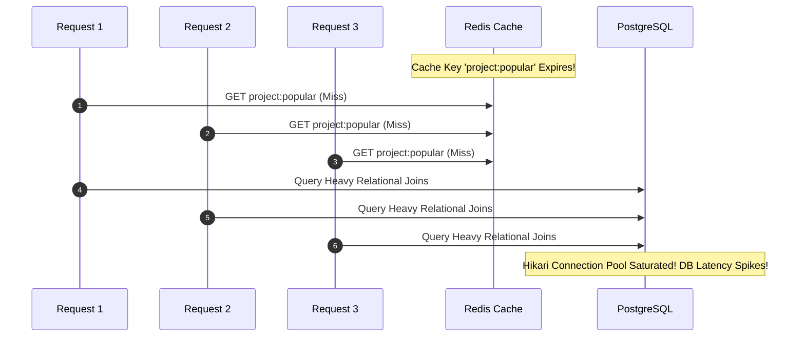

**Mitigation Strategies:**
1. **Mutual Exclusion (Mutex / Distributed Lock)**: When a cache miss occurs, the worker attempts to acquire an ephemeral lock in Redis (`SET lock:key value NX EX 5`). Only the lock owner queries the database and repopulates the cache; other workers wait or return a fallback value.
2. **Probabilistic Early Expiration (XFetch Algorithm)**: Calculate whether to refresh the cache entry before it expires using the model:
   $$-\beta \times \delta \times \ln(\text{random}()) > \text{TTL}$$
   where $\delta$ is the compute time and $\beta > 0$. As the TTL nears zero, the probability of an early background refresh scales smoothly.
3. **Soft TTL with Background Refresh**: Store both a data payload and a soft expiration timestamp. When a request reads a soft-expired key, it returns the stale data immediately and schedules an asynchronous thread to refresh the cache from the database.

---

#### Q6: How does the sliding-window rate limiting algorithm work in Redis, and why is it superior to fixed-window counters?
**Answer:**  
- **Fixed-Window Counter Flaw**: Divides time into discrete buckets (e.g., 01:00 to 01:01). If a client sends 100 requests at 01:00:59 and another 100 requests at 01:01:01, both batches are accepted. However, across that 2-second interval, the client consumed 200 requests—doubling the configured rate limit.
- **Sliding-Window Log / Counter (Redis)**: Uses a Redis Sorted Set (`ZSET`) where every element is indexed by timestamp:
  1. Remove entries older than the sliding threshold:
     ```redis
     ZREMRANGEBYSCORE ratelimit:user_123 0 (currentTime - windowSize)
     ```
  2. Count remaining records in the current window:
     ```redis
     ZCARD ratelimit:user_123
     ```
  3. If count < limit, append the current timestamp:
     ```redis
     ZADD ratelimit:user_123 currentTime currentTime
     ```
  4. Set key expiration to ensure cleanup:
     ```redis
     EXPIRE ratelimit:user_123 windowSize
     ```
This enforces smooth rate limiting across arbitrary time windows.

---

### 🔴 Advanced Architectural Design

#### Q7: Describe how DevOps Suite isolates untrusted user code execution in the Docker sandbox, including kernel-level mechanisms.
**Answer:**  
DevOps Suite uses the **Docker Java API client** to spin up isolated, ephemeral containers with strict kernel-level resource and access limits:

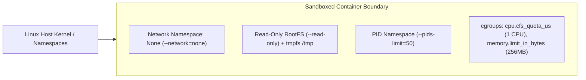

**Security Controls Implemented:**
1. **Network Namespace Isolation (`--network=none`)**: Disables network interfaces inside the container, preventing unauthorized network scanning, reverse shells, and external data exfiltration.
2. **Read-Only Root Filesystem (`--read-only`)**: Prevents modification of binary packages, system libraries, and startup hooks.
3. **In-Memory Scratch Space (`--tmpfs /tmp:rw,noexec,nosuid,size=64m`)**: Provides writable temporary storage entirely in RAM. Setting `noexec` prevents script execution within `/tmp` where applicable.
4. **Control Groups (`cgroups`)**:
   - `Memory`: Capped at 256MB (`withMemory(256 * 1024 * 1024L)`). Exceeding this limit triggers an out-of-memory kill (`OOMKilled`) by the Linux kernel without impacting the host.
   - `CPU Quota`: Restricted to 1 vCPU equivalent (`withNanoCPUs(1_000_000_000L)`), preventing multi-threaded scripts from saturating host cores.
5. **PID Limits (`--pids-limit=50`)**: Prevents fork bombs (`:(){ :|:& };:`) by bounding the total concurrent processes to 50.
6. **Execution Timeouts**: A Java-level `CompletableFuture.orTimeout(30, TimeUnit.SECONDS)` forces container termination via `dockerClient.stopContainerCmd()` if an infinite loop occurs.

---

#### Q8: Analyze Single Points of Failure (SPOF) in the current DevOps Suite architecture and outline steps to achieve High Availability (HA).
**Answer:**  

```
+----------------------------------------------------------------------------------------------------+
|                                    SPOF IDENTIFICATION & REMEDIATION                               |
+-------------------+-------------------------------+------------------------------------------------+
| Component         | Single Point of Failure (SPOF)| High Availability (HA) Target Architecture     |
+-------------------+-------------------------------+------------------------------------------------+
| Nginx Reverse     | Single container binding      | Active-Passive Nginx with Keepalived / VRRP,   |
| Proxy             | host ports 80/443.            | or cloud-native AWS ALB / GCP Cloud Load Bal.  |
+-------------------+-------------------------------+------------------------------------------------+
| Spring Boot       | Monolith container instance   | Deploy multiple instances behind Nginx with    |
| Monolith          | running on port 8081.         | health check probes (`/actuator/health`).      |
+-------------------+-------------------------------+------------------------------------------------+
| PostgreSQL 16     | Single PostgreSQL container   | HA cluster via Patroni + etcd / Raft, with     |
|                   | hosting persistent volume.    | synchronous streaming replication & auto fail. |
+-------------------+-------------------------------+------------------------------------------------+
| Redis 7           | Single standalone container   | Redis Sentinel (automatic failover) or multi-   |
|                   | for cache & rate limiting.    | master Redis Cluster with replication shards.  |
+-------------------+-------------------------------+------------------------------------------------+
| Docker Socket     | Direct `/var/run/docker.sock` | Distributed runner pool (e.g. Nomad, Kubernetes|
| Engine            | mounting on the host.         | Jobs, or remote Docker daemon cluster).        |
+-------------------+-------------------------------+------------------------------------------------+
```

**Step-by-step transition to High Availability:**
1. **Stateless Scale-Out**: Scale the Spring Boot container horizontally to multiple nodes behind the load balancer, since user authentication relies on stateless JWTs and Redis-backed invalidation.
2. **PostgreSQL Clustering**: Deploy Patroni with 3 nodes (1 Leader, 2 Replicas) using etcd for consensus. If the primary node fails, etcd promotes a replica to leader within seconds without data loss.
3. **Redis Sentinel Quorum**: Configure 3 Redis Sentinel instances alongside master-replica Redis containers to automate master failover without modifying Spring application configurations.

---

### ⚫ Expert Distributed Systems Scenarios

#### Q9: Design a Distributed Dual-Write Reconciliation Pipeline between PostgreSQL and Elasticsearch for DevOps Suite.
**Answer:**  
In DevOps Suite, task activities and audit logs are recorded in PostgreSQL for transactional safety and replicated to Elasticsearch for full-text search and analytical querying. A **Dual-Write Pattern** where the application writes to both stores sequentially introduces consistency issues:

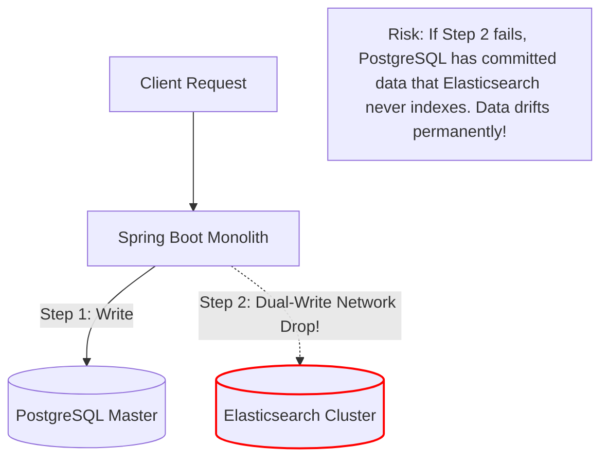

**Expert Architecture: The Transactional Outbox Pattern with CDC (Change Data Capture)**

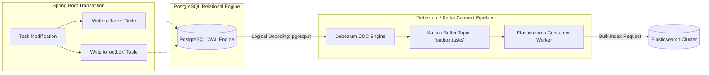

**Mechanics:**
1. **Transactional Outbox Table**: The application modifies entities and writes an event record to an `outbox` table within the **same local database transaction**:
   ```sql
   INSERT INTO outbox (id, aggregate_type, aggregate_id, payload, created_at)
   VALUES (gen_random_uuid(), 'TASK', '100', '{"title":"Refactor","status":"DONE"}', NOW());
   ```
2. **Change Data Capture (CDC)**: A Debezium connector reads PostgreSQL's write-ahead log (`WAL`) via logical decoding (`pgoutput`). This avoids table polling and introduces minimal database overhead.
3. **Idempotent Ingestion**: A consumer service reads events from the message buffer and updates Elasticsearch using deterministic document IDs (`PUT /tasks/_doc/100`), ensuring operations remain idempotent even if messages are redelivered.

---

#### Q10: How would you scale DevOps Suite's WebSocket subsystem to support tens of thousands of concurrent connections across multiple Spring Boot nodes?
**Answer:**  
In the current setup, browser clients connect over STOMP/SockJS directly to an in-memory message broker within the Spring Boot JVM (`/topic/notifications/{userId}`, `/topic/tasks/{projectId}`).

**The Scaling Bottleneck:**  
If Client A connects to Spring Boot Node 1 and Client B connects to Spring Boot Node 2, an update processed on Node 1 cannot be broadcast to Client B because the broker runs in Node 1's local memory.

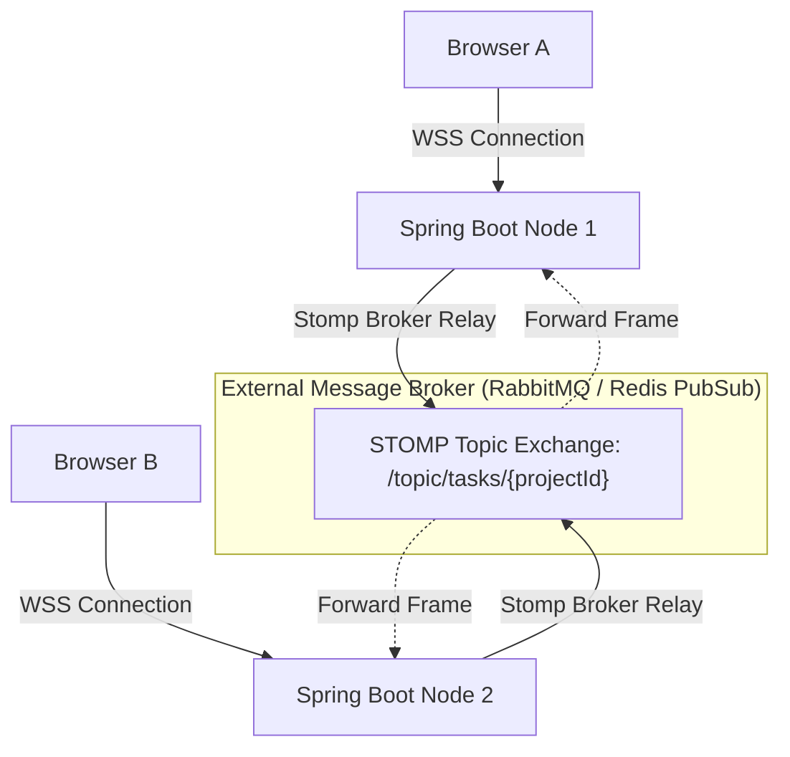

**Implementation Strategy:**
1. **Full Message Broker Relay**: Replace Spring's in-memory broker with a dedicated broker (e.g. RabbitMQ or activemq) using `StompBrokerRelayRegistration`:
   ```java
   @Configuration
   @EnableWebSocketMessageBroker
   public class WebSocketConfig implements WebSocketMessageBrokerConfigurer {

       @Override
       public void configureMessageBroker(MessageBrokerRegistry registry) {
           registry.enableStompBrokerRelay("/topic", "/queue")
               .setRelayHost("rabbitmq-broker")
               .setRelayPort(61613)
               .setClientLogin("guest")
               .setClientPasscode("guest")
               .setSystemLogin("guest")
               .setSystemPasscode("guest");
           registry.setApplicationDestinationPrefixes("/app");
       }
   }
   ```
2. **Connection Offloading**: Terminate WebSocket connections at the Nginx edge or an API gateway configured with keepalive timeouts, proper `Upgrade` headers, and generous file descriptor limits (`worker_rlimit_nofile 65535`).
3. **Session Heartbeats & Reconnection**: Implement exponential backoff in the StompJS client on the frontend. If a socket drops, the client reconnects and retrieves missed state using the REST API to reconcile any dropped frames.

---

## 5. Quick Reference Matrix

| Architectural Principle | Primary Implementation Component | Core Mechanism / Trade-Off | Failure Mode / Handling |
| :--- | :--- | :--- | :--- |
| **Strict ACID** | PostgreSQL 16 (`projects`, `tasks`, `users`) | Multi-version concurrency control (MVCC) + WAL durability. Isolation level: `READ COMMITTED`. | Rollback on exception; aborts transaction if constraints are violated. |
| **BASE / Eventual Consistency** | Elasticsearch 8 & STOMP SockJS | Asynchronous refresh intervals (`1s`); out-of-band log publishing. | Temporary search lag; clients reconcile state via authoritative REST endpoints. |
| **CAP: CP Classification** | PostgreSQL 16 (Relational DB) | Rejects partition writes to avoid split-brain states. Prioritizes Consistency. | Write availability drops until quorum or primary visibility is restored. |
| **CAP: AP Classification** | Elasticsearch Cluster | Shards handle search reads even when replica synchronization lags. | Returns partial results (`timed_out: true`); backfills data asynchronously. |
| **Stateless Services** | Spring Boot Monolith Runtime | HMAC-SHA256 JWTs verified in-memory; blacklist stored externally in Redis. | Nodes scale out horizontally behind load balancers with no sticky sessions. |
| **API Idempotency** | REST APIs (`PUT` & Redis Deduplication Keys) | Deterministic state replacement for `PUT`; `SETNX` distributed tokens for `POST`. | Returns `409 Conflict` or cached responses on duplicate in-flight submissions. |
| **Backpressure** | Worker Thread Pools & `RateLimitFilter` | Dedicated execution thread pool with `AbortPolicy`; sliding-window rate limits. | Returns `HTTP 429` for rate limits; `HTTP 503` with `Retry-After` on thread exhaustion. |
| **Fail-Open Strategy** | Redis Rate Limiting Filter | Application logs connection errors and bypasses rate checks if Redis is offline. | Favors platform availability over strict perimeter rate-limiting during outages. |
| **Defense in Depth** | Ingress -> Security Filter -> RBAC -> Docker | Layered security across Nginx, JWT validation, method RBAC, and container flags. | Untrusted code is isolated via `--network=none`, `--read-only`, and PID/memory cgroups. |
| **Consensus / Quorum** | Distributed Storage (Raft / Paxos) | Majority vote algorithm: $Q = \lfloor N/2 \rfloor + 1$. Protects against split-brain. | Minority partitions reject mutations; majority partitions maintain write quorum. |

---

## 6. Architectural Evolution Roadmap

As DevOps Suite transitions from a single-host modular monolith to a distributed platform:

```
[Current State: Modular Monolith]
 - Spring Boot 3 (Java 21) Monolith
 - In-JVM ApplicationEventPublisher
 - Standalone Redis 7 & PostgreSQL 16
 - Local Docker Engine Socket Execution
                     │
                     ▼ [Stage 1: Storage Decoupling & Read Scaling]
 - Read-Replica PostgreSQL pool with PgBouncer
 - Redis Sentinel HA Cluster (Automatic Master Failover)
 - Transactional Outbox Pattern with Debezium CDC for Elasticsearch
                     │
                     ▼ [Stage 2: Horizontal Monolith Cluster]
 - Multi-instance Spring Boot running behind Nginx / ALB
 - External RabbitMQ STOMP Broker Relay for WebSockets
 - Remote Docker Runner Pool / Nomad Isolation Workers
                     │
                     ▼ [Stage 3: Event-Driven Microservices]
 - Core Domain Decomposition: Auth Service, Project Service, Sandbox Runner Service
 - Apache Kafka Event Backbone for Eventual Consistency & Inter-Service Messaging
 - Distributed Tracing via OpenTelemetry, Prometheus, and Grafana Tempo
```

This evolution balances near-term operational simplicity with long-term horizontal scalability, while preserving the core system design guarantees across each deployment tier.
