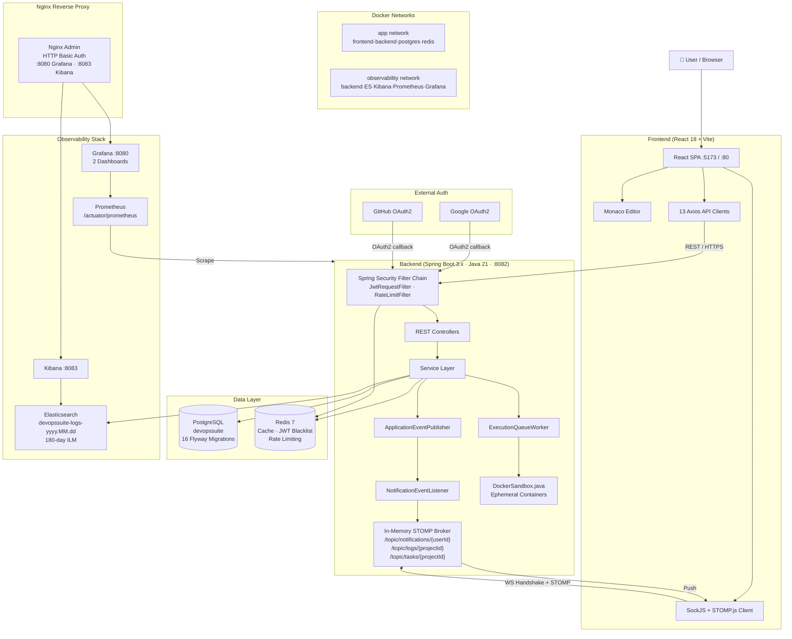

# 🧠 DevOps Suite — Interview Knowledge Base

> **Your complete preparation guide for technical interviews about the DevOps Suite project.**

DevOps Suite is a **production-grade, full-stack developer productivity platform** built as a Spring Boot 3.x monolith backend paired with a React 18 single-page application. It combines a real-time collaborative Kanban board, a browser-based IDE with Monaco Editor, a multi-language code execution sandbox running inside Docker containers, a comprehensive notification system, and a full observability stack — all containerized and orchestrated with Docker Compose. The project demonstrates deep expertise across backend engineering, frontend architecture, distributed systems design, security, DevOps, and observability.

---

## 📖 How to Use This Guide

This knowledge base is organized into **12 topic categories** with a total of **46 markdown files**. Each file contains realistic interview Q&A pairs, reference diagrams, code snippets from the actual codebase, and quick-reference summaries.

### Difficulty Markers

| Marker | Level | What to Expect |
|--------|-------|----------------|
| 🟢 | **Basic** | Definitions, high-level concepts, "what does X do?" |
| 🟡 | **Intermediate** | Implementation details, trade-off awareness, "how did you…?" |
| 🔴 | **Advanced** | Deep internals, edge cases, production concerns, "why not…?" |
| ⚫ | **Expert** | System design at scale, architectural alternatives, nuanced engineering judgment |

> **Tip:** Don't skip the 🟢 questions. Interviewers often use simple openers to gauge communication clarity before going deep.

---

## 📚 Table of Contents

### 01 · Project Overview
| File | Description |
|------|-------------|
| [project-walkthrough.md](./01-project-overview/project-walkthrough.md) | High-level system tour — what the app does, who uses it, key modules |
| [how-you-built-it.md](./01-project-overview/how-you-built-it.md) | Build process, tooling choices, timeline, iterative decisions |
| [challenges-and-solutions.md](./01-project-overview/challenges-and-solutions.md) | Real engineering problems encountered and how they were solved |

### 02 · Architecture
| File | Description |
|------|-------------|
| [system-design.md](./02-architecture/system-design.md) | End-to-end system architecture, component interactions, data flows |
| [design-decisions.md](./02-architecture/design-decisions.md) | Why monolith over microservices, why PostgreSQL over MongoDB, etc. |
| [trade-offs.md](./02-architecture/trade-offs.md) | Honest analysis of what was traded for what, and what you'd change |

### 03 · Backend
| File | Description |
|------|-------------|
| [spring-boot-core.md](./03-backend/spring-boot-core.md) | Spring Boot 3.x internals, auto-configuration, filter chain, beans |
| [auth-and-jwt.md](./03-backend/auth-and-jwt.md) | JWT lifecycle, `JwtRequestFilter`, Redis blacklist, refresh tokens |
| [oauth2.md](./03-backend/oauth2.md) | Google & GitHub OAuth2 PKCE flow, `OAuth2SuccessHandler`, token bridge |
| [rbac-and-security.md](./03-backend/rbac-and-security.md) | OWNER → ADMIN → MEMBER → VIEWER hierarchy, method-level security |
| [kanban-project-module.md](./03-backend/kanban-project-module.md) | Project/Task entities, state machine, event publishing, REST design |
| [code-execution-sandbox.md](./03-backend/code-execution-sandbox.md) | `DockerSandbox`, ephemeral containers, queue worker, timeout handling |
| [ide-module.md](./03-backend/ide-module.md) | `IdeFile` entity, file persistence, Monaco backend integration |
| [notification-system.md](./03-backend/notification-system.md) | `ApplicationEventPublisher`, `NotificationEventListener`, 7 event types |
| [rate-limiting.md](./03-backend/rate-limiting.md) | `RateLimitFilter`, Redis sliding-window, per-tier limits, 429 responses |

### 04 · Frontend
| File | Description |
|------|-------------|
| [react-architecture.md](./04-frontend/react-architecture.md) | React 18 app structure, Vite, component hierarchy, routing |
| [context-and-state.md](./04-frontend/context-and-state.md) | 6 React Contexts — Auth, Notification, WebSocket, Editor, Projects, Theme |
| [api-layer.md](./04-frontend/api-layer.md) | 13 Axios API client files, interceptor chain, error handling, token refresh |
| [websocket-client.md](./04-frontend/websocket-client.md) | SockJS + STOMP.js client, `WebSocketContext`, reconnection strategy |
| [monaco-editor.md](./04-frontend/monaco-editor.md) | Monaco Editor integration, language detection, `EditorContext`, keybindings |
| [ui-components.md](./04-frontend/ui-components.md) | Tailwind CSS design system, key pages — `IDEPage`, `TasksPage`, `LogsPage` |

### 05 · Database
| File | Description |
|------|-------------|
| [schema-and-flyway.md](./05-database/schema-and-flyway.md) | 16 Flyway migrations (V1–V16), schema evolution, entity relationships |
| [jpa-and-hibernate.md](./05-database/jpa-and-hibernate.md) | JPA mappings, lazy vs eager loading, N+1 problem, named queries |
| [redis-patterns.md](./05-database/redis-patterns.md) | Cache-aside, JWT blacklisting, rate limiting keys, TTL strategy |
| [query-optimization.md](./05-database/query-optimization.md) | EXPLAIN ANALYZE, indexes, pagination, slow query prevention |

### 06 · Security
| File | Description |
|------|-------------|
| [jwt-deep-dive.md](./06-security/jwt-deep-dive.md) | JWT structure, signing, validation, 1h/7d TTL, rotation strategy |
| [stomp-auth.md](./06-security/stomp-auth.md) | `StompAuthChannelInterceptor`, WebSocket handshake auth, topic guards |
| [sandbox-security.md](./06-security/sandbox-security.md) | Container isolation flags, `--network=none`, read-only FS, resource caps |
| [owasp-and-best-practices.md](./06-security/owasp-and-best-practices.md) | OWASP Top 10 coverage, CORS, CSRF, input validation, secrets management |

### 07 · Real-Time
| File | Description |
|------|-------------|
| [websocket-architecture.md](./07-realtime/websocket-architecture.md) | STOMP over SockJS, 3 topics, broker relay, message flow end-to-end |
| [event-pipeline.md](./07-realtime/event-pipeline.md) | Spring `ApplicationEvent` → listener → STOMP publish pipeline |
| [stomp-vs-alternatives.md](./07-realtime/stomp-vs-alternatives.md) | Why STOMP over SSE, raw WebSockets, or Kafka for this use case |

### 08 · DevOps & Infrastructure
| File | Description |
|------|-------------|
| [docker-compose.md](./08-devops-infrastructure/docker-compose.md) | Multi-service compose file, two bridge networks, volume strategy |
| [multi-stage-builds.md](./08-devops-infrastructure/multi-stage-builds.md) | Frontend & backend Dockerfiles, build optimization, layer caching |
| [ci-cd-github-actions.md](./08-devops-infrastructure/ci-cd-github-actions.md) | `.github/workflows/deploy.yml`, build → test → push → deploy pipeline |
| [nginx-proxy.md](./08-devops-infrastructure/nginx-proxy.md) | Nginx as reverse proxy, HTTP Basic Auth on Grafana (:8080) & Kibana (:8083) |

### 09 · Observability
| File | Description |
|------|-------------|
| [prometheus-grafana.md](./09-observability/prometheus-grafana.md) | Prometheus scrape config, `AppMetrics.java`, 2 auto-provisioned dashboards |
| [elasticsearch-kibana.md](./09-observability/elasticsearch-kibana.md) | Daily indices `devopssuite-logs-yyyy.MM.dd`, ILM 180-day retention, Kibana |
| [custom-metrics.md](./09-observability/custom-metrics.md) | 6 custom Prometheus counters/gauges, Micrometer, metric naming conventions |
| [log-pipeline.md](./09-observability/log-pipeline.md) | `ElasticsearchLogService`, structured logging, log levels, index strategy |

### 10 · Scalability
| File | Description |
|------|-------------|
| [current-bottlenecks.md](./10-scalability/current-bottlenecks.md) | Honest analysis — single DB, monolith limits, Docker sandbox throughput |
| [horizontal-scaling.md](./10-scalability/horizontal-scaling.md) | What it would take to run multiple backend replicas, sticky sessions |
| [database-scaling.md](./10-scalability/database-scaling.md) | Read replicas, connection pooling, partitioning, caching strategies |
| [microservices-migration.md](./10-scalability/microservices-migration.md) | How to decompose — which services to extract first, Strangler Fig pattern |
| [cloud-deployment.md](./10-scalability/cloud-deployment.md) | AWS/GCP deployment blueprint, ECS vs EKS, managed services swap-outs |

### 11 · Behavioral
| File | Description |
|------|-------------|
| [why-this-stack.md](./11-behavioral/why-this-stack.md) | Reasoned justification for every major technology choice |
| [what-i-learned.md](./11-behavioral/what-i-learned.md) | Growth areas, new concepts mastered, things done differently next time |
| [hardest-problem.md](./11-behavioral/hardest-problem.md) | The most complex technical problem solved — detailed STAR format |
| [situational-questions.md](./11-behavioral/situational-questions.md) | "Tell me about a time…" scenarios using project context |

### 12 · General CS
| File | Description |
|------|-------------|
| [data-structures-algorithms.md](./12-general-cs/data-structures-algorithms.md) | DSA concepts illustrated with project examples (queues, maps, trees) |
| [system-design-principles.md](./12-general-cs/system-design-principles.md) | CAP, consistency models, idempotency, exactly-once semantics |
| [api-design.md](./12-general-cs/api-design.md) | REST best practices, versioning, pagination, error contract, OpenAPI |

---

## ⚡ Quick Project Summary

### What Is DevOps Suite?

A **full-stack developer productivity platform** that combines:
- 🗂️ **Kanban project management** with real-time task collaboration
- 💻 **Browser-based IDE** powered by Monaco Editor with file persistence
- 🐳 **Multi-language code execution** in isolated Docker containers
- 🔔 **Real-time notification system** via WebSocket/STOMP
- 📊 **Full observability stack** — Prometheus, Grafana, Elasticsearch, Kibana
- 🔐 **Enterprise auth** — JWT, OAuth2 (Google + GitHub), RBAC

---

### Tech Stack at a Glance

| Layer | Technology | Version / Detail |
|-------|-----------|-----------------|
| **Backend Framework** | Spring Boot | 3.x, Java 21, Maven |
| **Frontend Framework** | React + Vite | 18, JavaScript (JSX) |
| **Styling** | Tailwind CSS | Utility-first, responsive |
| **Primary Database** | PostgreSQL | Single DB `devopssuite` |
| **Cache / Rate Limit** | Redis | 7, cache-aside + sliding window |
| **Search / Logs** | Elasticsearch | Daily index strategy |
| **Log Visualization** | Kibana | Behind Nginx Basic Auth :8083 |
| **Metrics** | Prometheus | Scrapes `/actuator/prometheus` |
| **Dashboards** | Grafana | Auto-provisioned, :8080 |
| **Real-Time** | STOMP over SockJS | 3 topic channels |
| **Code Execution** | Docker sandbox | Ephemeral, isolated containers |
| **Auth** | JWT + OAuth2 | Google, GitHub, BCrypt passwords |
| **Editor** | Monaco Editor | Language detection, keybindings |
| **Containerization** | Docker Compose | Multi-network, multi-stage builds |
| **CI/CD** | GitHub Actions | `.github/workflows/deploy.yml` |
| **Reverse Proxy** | Nginx | Admin proxy for Grafana & Kibana |

---

### Key Numbers — Memorize These

| Metric | Value |
|--------|-------|
| Flyway migrations | **16** (V1 – V16) |
| React Contexts | **6** (Auth, Notification, WebSocket, Editor, Projects, Theme) |
| API client files | **13** Axios client modules |
| Supported execution languages | **4** (Python, JavaScript, Java, C++) |
| WebSocket topics | **3** (`/topic/notifications/{userId}`, `/topic/logs/{projectId}`, `/topic/tasks/{projectId}`) |
| Custom Prometheus metrics | **6** counters/gauges in `AppMetrics.java` |
| Notification event types | **7** (TASK_ASSIGNED, TASK_REASSIGNED, TASK_COMPLETED, PROJECT_JOINED, ROLE_CHANGED, PROJECT_REMOVED, EXECUTION_FAILED) |
| RBAC roles | **4** (OWNER > ADMIN > MEMBER > VIEWER) |
| JWT access token TTL | **1 hour** |
| JWT refresh token TTL | **7 days** |
| Sandbox memory limit | **256 MB** |
| Sandbox CPU limit | **1 vCPU** |
| Sandbox execution timeout | **30 seconds** |
| Elasticsearch ILM retention | **180 days** |
| Docker bridge networks | **2** (`app` and `observability`) |
| Backend internal port | **8081** (host-mapped → **8082**) |
| Frontend dev port | **5173** (Docker nginx → **80**) |
| OAuth2 providers | **2** (Google, GitHub) |

---

### Redis Key Patterns

```
user:{userId}                     → Cached user object, TTL 30 min
jwt:blacklist:{token}             → Blacklisted JWT on logout
project:{projectId}               → Cached project, TTL 15 min
rate:{tier}:{identity}:{bucket}   → Sliding-window rate limit counter
```

### Custom Prometheus Metrics

```
devopssuite_code_executions_total
devopssuite_task_operations_total
devopssuite_active_users
devopssuite_cache_hits_total
devopssuite_cache_misses_total
devopssuite_rate_limit_blocked_total
```

---

## 🗺️ System Architecture



---

## 🎯 Interview Strategy

### Recommended Reading Order

#### For a **Backend-Focused Interview** (Java / Spring Boot role)
1. `01-project-overview/project-walkthrough.md` — establish context fast
2. `03-backend/spring-boot-core.md` — filter chain, beans, auto-config
3. `03-backend/auth-and-jwt.md` + `06-security/jwt-deep-dive.md` — auth is always asked
4. `03-backend/code-execution-sandbox.md` — your most impressive feature
5. `03-backend/notification-system.md` — event-driven design
6. `05-database/schema-and-flyway.md` + `05-database/jpa-and-hibernate.md`
7. `03-backend/rate-limiting.md` — Redis + production patterns
8. `02-architecture/design-decisions.md` — justify your choices

#### For a **Frontend-Focused Interview** (React / SPA role)
1. `01-project-overview/project-walkthrough.md`
2. `04-frontend/react-architecture.md` — component tree, routing
3. `04-frontend/context-and-state.md` — 6 contexts, prop drilling avoidance
4. `04-frontend/api-layer.md` — 13 clients, interceptors, error handling
5. `04-frontend/websocket-client.md` — real-time from the client side
6. `04-frontend/monaco-editor.md` — impressive integration detail
7. `04-frontend/ui-components.md` — Tailwind, design system

#### For a **System Design Interview**
1. `02-architecture/system-design.md` — broad canvas first
2. `02-architecture/design-decisions.md` + `02-architecture/trade-offs.md`
3. `07-realtime/websocket-architecture.md` + `07-realtime/stomp-vs-alternatives.md`
4. `10-scalability/current-bottlenecks.md` → `horizontal-scaling.md` → `microservices-migration.md`
5. `09-observability/prometheus-grafana.md` — observability is a system design pillar
6. `12-general-cs/system-design-principles.md`

#### For a **DevOps / Infrastructure Interview**
1. `08-devops-infrastructure/docker-compose.md`
2. `08-devops-infrastructure/multi-stage-builds.md`
3. `08-devops-infrastructure/ci-cd-github-actions.md`
4. `08-devops-infrastructure/nginx-proxy.md`
5. `09-observability/` — all four files
6. `06-security/sandbox-security.md` — container hardening

#### For a **Security-Focused Interview**
1. `06-security/jwt-deep-dive.md`
2. `06-security/stomp-auth.md`
3. `06-security/sandbox-security.md`
4. `06-security/owasp-and-best-practices.md`
5. `03-backend/auth-and-jwt.md` + `03-backend/oauth2.md`
6. `03-backend/rbac-and-security.md`

---

### How to Pace Yourself in an Interview

```
┌─────────────────────────────────────────────────────┐
│ MINUTE 0–5   │ Project intro — use the 60-second    │
│              │ elevator pitch from project-          │
│              │ walkthrough.md                        │
├─────────────────────────────────────────────────────┤
│ MINUTE 5–25  │ Dive deep on the topic the            │
│              │ interviewer gravitates toward.        │
│              │ Name real classes and files.          │
├─────────────────────────────────────────────────────┤
│ MINUTE 25–45 │ Answer follow-ups with trade-off      │
│              │ awareness — what you'd improve.       │
├─────────────────────────────────────────────────────┤
│ MINUTE 45–55 │ Scalability / what-next discussion.   │
│              │ Use microservices-migration.md and    │
│              │ cloud-deployment.md.                  │
├─────────────────────────────────────────────────────┤
│ MINUTE 55–60 │ Your questions to them — always ask   │
│              │ about their observability stack or    │
│              │ deployment strategy.                  │
└─────────────────────────────────────────────────────┘
```

---

## 🏆 Key Talking Points

Ten impressive facts to **naturally weave into answers** — these signal production awareness and engineering maturity:

1. **🐳 Docker-in-Docker sandbox isolation** — Code execution uses ephemeral containers with `--network=none --read-only --memory=256m --cpus=1` so untrusted user code can never escape the sandbox or impact the host.

2. **📡 Event-driven real-time without Kafka** — Instead of introducing a message broker, Spring's internal `ApplicationEventPublisher` drives the entire notification pipeline, keeping the architecture simple while still being fully asynchronous (`@Async`).

3. **🔒 JWT blacklisting in Redis** — On logout, the JWT is stored in Redis until its natural expiry. This gives stateless tokens a revocation mechanism without querying the database on every request.

4. **📊 Custom Prometheus metrics per feature** — Six hand-crafted Micrometer metrics (`AppMetrics.java`) give per-feature observability — code execution counts, cache hit rates, rate-limit blocks — not just generic JVM metrics.

5. **🌐 Two isolated Docker networks** — The `app` network and `observability` network are intentionally separated. The observability stack cannot directly reach the frontend, and the frontend cannot reach Elasticsearch or Grafana directly.

6. **📝 16 Flyway migrations as schema history** — Every schema change is versioned, repeatable, and auditable. V1 creates users, V16 adds the most recent feature. Database state is always reproducible from scratch.

7. **🔑 Redis sliding-window rate limiting** — `RateLimitFilter` uses Redis atomic operations to implement sliding-window rate limiting keyed by `rate:{tier}:{identity}:{bucket}`, with different limits per user tier — all before hitting the Spring Security filter chain.

8. **📋 6 React Contexts, zero external state manager** — The app manages complex real-time state across auth, WebSockets, projects, and the IDE editor using only React's built-in Context API — no Redux, no Zustand — keeping the bundle lean and the data flow explicit.

9. **🔍 Elasticsearch daily index + ILM** — Logs are written to `devopssuite-logs-yyyy.MM.dd` daily indices with an ILM policy that automatically expires data after 180 days — a real production log retention strategy.

10. **🔄 STOMP channel interceptor for WebSocket auth** — WebSocket connections are authenticated not just at the HTTP handshake, but at the STOMP protocol layer via `StompAuthChannelInterceptor`, which validates the JWT on every CONNECT frame.

---

## 💬 Common Opening Questions

> These are the first 5–7 questions most interviewers open with. Practice these answers until they feel natural.

---

### 1. 🟢 "Can you walk me through your DevOps Suite project at a high level?"

DevOps Suite is a full-stack developer productivity platform I built from scratch. It has a Spring Boot 3 backend and a React 18 frontend, and it combines three main features: a real-time Kanban board for project management, a browser-based IDE using Monaco Editor with server-side file persistence, and a code execution sandbox that runs user-submitted code inside isolated Docker containers. Everything is containerized with Docker Compose, and there's a full observability stack with Prometheus, Grafana, Elasticsearch, and Kibana. The project was designed to demonstrate production-ready patterns — auth, rate limiting, real-time communication, and sandboxed execution — all in one cohesive application.

---

### 2. 🟢 "What technologies did you use and why?"

**Backend:** Spring Boot 3 with Java 21 — mature ecosystem, excellent Spring Security integration, and virtual threads if needed. **Database:** PostgreSQL for relational integrity across users, projects, tasks, and files; Redis for caching and rate limiting where millisecond response matters. **Frontend:** React 18 with Vite — fast HMR during development, and a component model that works well with the real-time WebSocket data. **Real-time:** STOMP over SockJS because it gives pub/sub semantics with topic routing out of the box, which raw WebSockets don't. **Observability:** Prometheus + Grafana for metrics, Elasticsearch + Kibana for log search — the same combination used in most production environments.

---

### 3. 🟢 "How does authentication work in your application?"

Authentication works via JWT tokens. On login, the backend issues a short-lived access token (1 hour) and a longer-lived refresh token (7 days). The `JwtRequestFilter` validates the access token on every request before it reaches Spring Security's authorization layer. On logout, the token is written to Redis with its remaining TTL — effectively blacklisting it — so even valid tokens can be immediately revoked. The app also supports Google and GitHub OAuth2: after the OAuth2 callback, I issue my own JWT so the frontend always works with a single token type regardless of how the user authenticated.

---

### 4. 🟡 "How does your code execution sandbox work?"

When a user submits code through the IDE, the request goes to `ExecutionService`, which queues it in `ExecutionQueueWorker`. The worker calls `DockerSandbox.java`, which spawns an ephemeral Docker container using the appropriate language image — Python, Node.js, JDK, or GCC. The container runs with `--network=none` (no internet), `--read-only` filesystem, `--memory=256m`, and `--cpus=1`. There's a 30-second hard timeout enforced by the Java process. After execution, the container is destroyed and the output (stdout/stderr, exit code, duration) is returned to the user and also streamed via WebSocket to the `/topic/logs/{projectId}` topic so collaborators see it in real time.

---

### 5. 🟡 "How does real-time collaboration work?"

The app uses STOMP over SockJS for bidirectional real-time communication. There are three topic channels: `/topic/notifications/{userId}` for personal notifications, `/topic/logs/{projectId}` for live execution output, and `/topic/tasks/{projectId}` for Kanban board updates. On the backend, Spring's `ApplicationEventPublisher` fires domain events (like `TASK_ASSIGNED`) that are picked up by `NotificationEventListener`, which then publishes a STOMP message to the appropriate topic. On the frontend, `WebSocketContext` manages the single SockJS connection and subscription lifecycle, and `NotificationContext` processes incoming messages. WebSocket authentication is enforced at the STOMP layer by `StompAuthChannelInterceptor`, which validates the JWT on every CONNECT frame.

---

### 6. 🟡 "How is your application deployed?"

Everything runs via Docker Compose. There are two Docker bridge networks: `app` (connecting the frontend, backend, PostgreSQL, and Redis) and `observability` (connecting the backend to Elasticsearch, Kibana, Prometheus, and Grafana). The frontend is built with a multi-stage Dockerfile — the Vite build runs in a Node image, and the output is served by Nginx in the final image. The backend also uses a multi-stage build — Maven compiles and packages the JAR in a JDK image, then the JAR runs in a slim JRE image. An Nginx admin proxy sits in front of Grafana and Kibana, adding HTTP Basic Auth to protect those dashboards. CI/CD is handled by GitHub Actions in `.github/workflows/deploy.yml`.

---

### 7. 🔴 "What are the biggest limitations of your current design, and how would you scale it?"

The most honest limitations are: the single PostgreSQL instance is a write bottleneck, the in-memory STOMP broker means WebSocket subscriptions don't survive a second backend replica, and the Docker sandbox throughput is bounded by the host machine. To scale horizontally, I'd introduce a Redis-backed STOMP message broker (or RabbitMQ) so any backend replica can publish to any subscriber. For the database, I'd add a read replica for query-heavy endpoints and implement connection pooling via PgBouncer. For the sandbox, I'd extract code execution into a dedicated service with its own auto-scaling group. Long-term, the natural decomposition would extract auth, code execution, and notifications as separate services using the Strangler Fig pattern — but only once the monolith's pain points are proven at real load.

---

## 📌 Quick Reference Card

```
Project:         DevOps Suite — full-stack developer productivity platform
Backend:         Spring Boot 3.x · Java 21 · Maven · com.devopssuite
Frontend:        React 18 · Vite · JavaScript/JSX · Tailwind CSS
Database:        PostgreSQL (devopssuite) · 16 Flyway migrations
Cache:           Redis 7 — cache-aside · JWT blacklist · sliding-window rate limit
Real-Time:       STOMP over SockJS · 3 topics · In-memory broker
Code Exec:       Docker sandbox · Python/JS/Java/C++ · 30s timeout · 256MB/1CPU
Auth:            JWT (1h/7d) · Google OAuth2 · GitHub OAuth2 · BCrypt · RBAC 4 roles
Observability:   Prometheus + Grafana (2 dashboards) · Elasticsearch (180d ILM) · Kibana
Custom Metrics:  6 Micrometer metrics in AppMetrics.java
Networks:        2 bridge networks — app + observability
Ports:           Backend 8081→8082 · Frontend 5173/80 · Grafana 8080 · Kibana 8083
CI/CD:           GitHub Actions · .github/workflows/deploy.yml
Key Files:       JwtRequestFilter · RateLimitFilter · DockerSandbox · ExecutionQueueWorker
                 StompAuthChannelInterceptor · NotificationEventListener · AppMetrics
                 AuthContext · WebSocketContext · NotificationContext · EditorContext
```

---

*Last updated: 2026-09-29 | Knowledge base covers 46 files across 12 categories*
